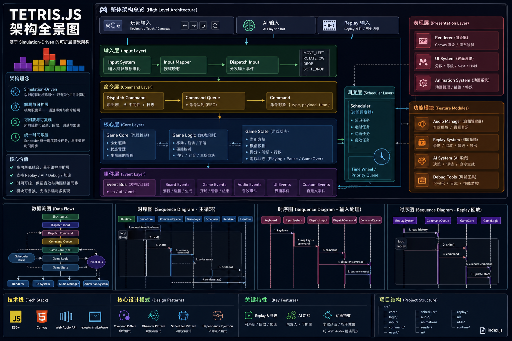

# tetris.js

tetris.js is a pure front-end Tetris game built with vanilla JavaScript and zero external dependencies. It runs directly in modern browsers. This implementation covers all classic Tetris core mechanics including piece spawning, movement, rotation, soft drop, hard drop, collision detection, line clearing, level progression and score calculation. It also features rich UI rendering, animations and interactive feedback. The project adopts a well-layered and modular architecture for easy maintenance and extension.

## Features

### Game Controls
- **Keyboard**: Arrow keys for movement & rotation, Space for hard drop, P to pause, M to toggle music, R to restart, Q to quit, S to switch AI mode
- **Gamepad**: Full support including left stick and D-Pad
- **Mobile Touch**: Dedicated GameBoy-style button layout for complete touch control

  

### Level & Difficulty
- **Level Selection**: Level 1 - 10 (Keyboard: 1-9 / T; Gamepad & Touch: Up / Down)
- **Difficulty Selection**: EASY / NORMAL / HARD / EXPERT (Keyboard: E/N/H/X; Gamepad & Touch: A/B/Y/X)
- **Max 256 Levels**: A tribute to classic FC design, levels loop after reaching 256

### Game Rules
- **Falling Speed**: Starts at 1000ms per cell on Level 1, accelerates smoothly to the limit of 100ms in the first 60% levels
- **Scoring System**: Base points multiplied by current level (1 line = 100 pts, 4 lines = 800 pts)
- **Level Progression**: Dynamic line requirements. Starts at 10 lines per level, increases gradually and caps at 60 lines per level

### Audio & Visual Experience
- **16 Background Music Tracks**: Automatically switches every 16 levels, covering classic, electronic, folk, synthwave and more styles
- **16 Sets of Line-Clear Sound Effects**: Chords and instrument parameters change dynamically with levels
- **8 Color Schemes for Blocks**: Switches every 32 levels, ranging from vivid classic colors to neon and gem themes
- **Animation Effects**: Countdown, line-clear flash, floating score text, landing highlight, level-up celebration, pause timer animation

### System Features
- **Playback Replay**: Review your entire gameplay after game over
- **AI Control**: Multi-step lookahead AI makes decisions based on board evaluation with adjustable difficulty.
  Demo: https://www.bilibili.com/video/BV1GPG86KEcy/?vd_source=8d9b68dd3ed316bb9b3a13e3f3f778eb
- **Local Storage**: Persistent storage for highest score
- **Responsive Layout**: Fully adaptive for desktop, tablet and mobile devices

### Technical Highlights
- Built with pure vanilla JavaScript, no third-party dependencies
- Centralized state management with pure function updates; complete separation of game logic and rendering
- Independent Scheduler drives all animations and sound effects, separated from requestAnimationFrame
- Comprehensive test coverage: Jest for unit tests and Cypress for E2E tests

## Architecture

tetris.js adopts a layered architecture with clear structure, high modularity and great maintainability. It can serve as a general reference architecture for small 2D canvas games. With minor modifications, it can be extended to other types of 2D browser games.

## Architecture Highlights

- **Clear Modular Design**: Each layer has distinct responsibilities with low coupling. Utility tools, game rules, service modules and runtime core work independently for easy maintenance and extension.
- **Centralized State Management**: All core game states are stored in `GameStore`. State updates are handled via pure functions `stateHandler` to avoid messy scattered states. This natively supports **Playback Replay** and reserves space for advanced features such as time-travel debugging.
- **Command Pattern Drives Main Loop**: Player inputs, AI decisions and auto falling are all abstracted into standard Command objects. It enables operation recording, playback and control, forming the foundation of replay system and AI gameplay.
- **Event Bus for Decoupled Communication**: Implements publish-subscribe pattern. Events like line clear, level up and game over are broadcast globally. Rendering, audio and animation modules respond independently without tight coupling.
- **Unified Task Scheduler**: The dedicated `Scheduler` manages all timed tasks, ensuring precise timing for piece falling, animations, sound effects and AI calculation. It is not affected by frame rate fluctuations and guarantees reproducible game logic.
- **Unified Abstraction for Multiple Inputs**: Keyboard, gamepad and touch inputs are mapped to standard game commands. Upper logic does not need to care about input sources, lowering the cost of supporting new devices.
- **Deterministic Game Logic**: State changes depend only on commands and time, with no random side effects or implicit dependencies. Identical inputs always produce identical results, ideal for replay, issue reproduction and AI simulation.
- **Plugin-Oriented Extensibility**: Audio, animation, AI and replay systems are implemented as pluggable independent modules without invading core logic, making feature expansion and iteration flexible.
- **Isolated AI & Core Logic**: AI calculates optimal moves solely through game state snapshots and never modifies runtime state directly. The architecture is robust and friendly for iterating different AI algorithms and difficulty modes.
- **Separation of Runtime and Presentation**: Core runtime manages game rules and states, while the renderer handles drawing. You can seamlessly migrate from Canvas to WebGL, or port core logic to server-side, mini-programs and other platforms.

## Browsers support

|  Edge |  Firefox |  Chrome |  Safari |  Opera |
| ---------------------------------------------------------------------------------------------------------------------- | ------------------------------------------------------------------------------------------------------------------------------- | ---------------------------------------------------------------------------------------------------------------------------- | ---------------------------------------------------------------------------------------------------------------------------- | ------------------------------------------------------------------------------------------------------------------------- |
| 128 – 131                                                                                                              | 130 – 132                                                                                                                       | 109 – 131                                                                                                                    | 17.5 – 18.1                                                                                                                  | 113 – 114                                                                                                                 |

## Game Controls

### Keyboard Controls
- Enter: Start game
- ↑: Rotate block
- ← / →: Move block left / right
- ↓: Soft drop
- Space: Hard drop
- M: Toggle background music
- P: Pause / Resume game
- R: Restart game
- Q: Force quit game
- B: Return from difficulty selection to level selection
- S: Switch between AI and Human control

#### Level Selection
- 1–9: Select level 1 to 9
- T: Select level 10

#### Difficulty Selection
- E: EASY (0 pre-filled lines at start)
- N: NORMAL (3 pre-filled lines at start)
- H: HARD (6 pre-filled lines at start)
- X: EXPERT (9 pre-filled lines at start)

### Gamepad Controls
- START: Start game
- BACK:
  - Force quit game during gameplay
  - Return from difficulty selection to level selection
- RB: Switch between AI and Human control
- Left Stick / D-Pad:
  - ↑: Rotate block
  - ← / →: Move block left / right
  - ↓: Soft drop
- X: Restart game
- Y: Pause / Resume game
- A: Toggle background music
- B: Hard drop

#### Level Selection
- D-Pad ↑: Level up
- D-Pad ↓: Level down

#### Difficulty Selection
- A: EASY
- B: NORMAL
- Y: HARD
- X: EXPERT

### Mobile Touch Controls (Game Boy Layout)
- ↑: Rotate block
- ↓: Soft drop
- ←: Move left
- →: Move right
- BACK: Force quit game
- A: Toggle background music
- B: Soft drop
- X: Pause game
- Y: Restart game

#### Level Selection
- ↑ / ↓: Adjust level (Min: 1, Max: 10)
- START: Enter difficulty selection screen

#### Difficulty Selection
- A: EASY
- B: NORMAL
- Y: HARD
- X: EXPERT
- BACK: Return to level selection screen

## Game Rules

### Falling Speed
The block falling interval is calculated by the `getSpeed()` function. The game starts at Level 1 with an interval of 1000ms per cell.
It adopts the formula:
`step = ceil(1000 / floor(MAX_LEVEL × 0.6))`

Within the first 60% of the maximum level `MAX_LEVEL` (256), the speed increases smoothly and linearly until reaching the limit.
The remaining 40% of levels maintain the maximum speed of 100ms per cell, focusing the gameplay on survival challenges.

### Scoring System
Final Score = Base Points for Line Clears × Current Level

| Lines Cleared | Base Points |
| :------------ | :---------- |
| 1 Line        | 100         |
| 2 Lines       | 300         |
| 3 Lines       | 500         |
| 4 Lines (Tetris) | 800      |
| 5 Lines       | 1200        |

**Example**: Clearing 4 lines at Level 1 earns 800 × 1 = 800 points; clearing 4 lines at Level 50 earns 800 × 50 = 40,000 points.

### Level Up Rules
The game uses dynamic level-up requirements defined by `levelUpSteps`.
You need to clear 10 lines for the first level up, and the required lines increase by 2 each time afterwards (10 → 12 → 14...), capped at 60 lines per level.

There are a total of 256 levels. After reaching the maximum level, the level value will cycle repeatedly, a tribute to classic FC game design.

### Block Color Rules
There are 8 sets of block color themes built in the game to enrich visual experience. A new color scheme will be applied every 32 levels.

| Level Range | Color Theme | Style |
| :---------- | :---------- | :---- |
| 1-32        | Classic     | Vivid default colors |
| 33-64       | Warm Tone   | Vibrant warm palette |
| 65-96       | Cool Tone   | Refreshing cool palette |
| 97-128      | Candy       | Sweet candy colors |
| 129-160     | Forest      | Natural forest tones |
| 161-192     | Sunset      | Warm sunset hues |
| 193-224     | Neon        | Bright neon colors |
| 225-256     | Gem         | Dazzling gem tones |

### Background Music Rules
16 background music tracks with diverse styles switch automatically as the level rises, with a new track applied every 16 levels.

| Level Range | Track Name       | Style |
| :---------- | :--------------- | :---- |
| 1-16        | TetrisTheme      | Classic Theme |
| 17-32       | SpringFestival   | Festive vibe |
| 33-48       | FirstDivision    | Classic Troika style |
| 49-64       | GongXiFaCai      | Festival celebration |
| 65-80       | Loginska         | Electronic rhythm |
| 81-96       | BeyondTheWall    | Mysterious & ethereal |
| 97-112      | Technotris       | Sci-fi electronic |
| 113-128     | GoldenSnakeDance | Oriental charm |
| 129-144     | Korobeiniki      | Classic folk tune |
| 145-160     | Ascension        | Ethereal & uplifting |
| 161-176     | NeonNights       | Synthwave neon |
| 177-192     | FrozenPeaks      | Cold & solitary |
| 193-208     | CyberRush        | Cyberpunk high tempo |
| 209-224     | Starlight        | Starry & dreamy |
| 225-240     | FinalPush        | Ultimate challenge |
| 241-256     | JourneyToWest    | Epic grand finale |

## License

- tetris.js - Licensed under [MIT License](http://opensource.org/licenses/mit-license.html).
- Press Start 2P fonts (Google) - Licensed under [OFL License](./font/OFL.txt)
