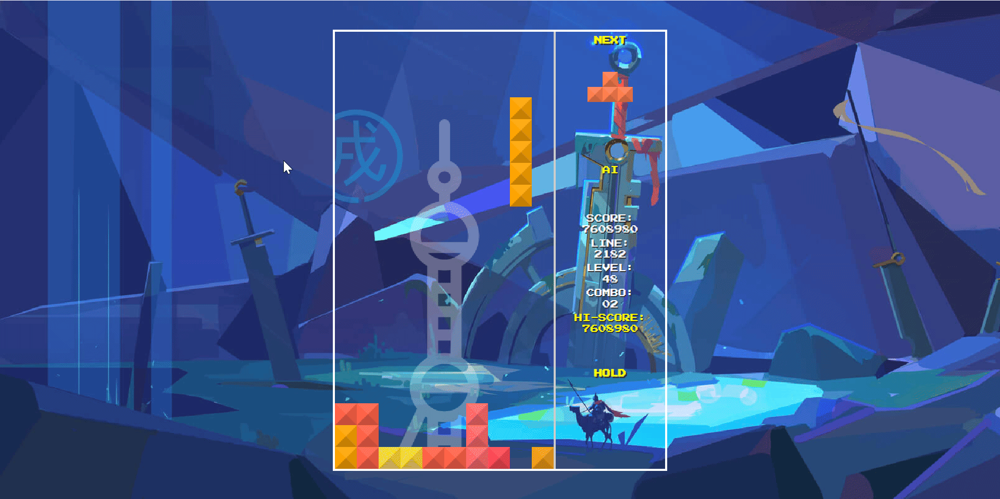
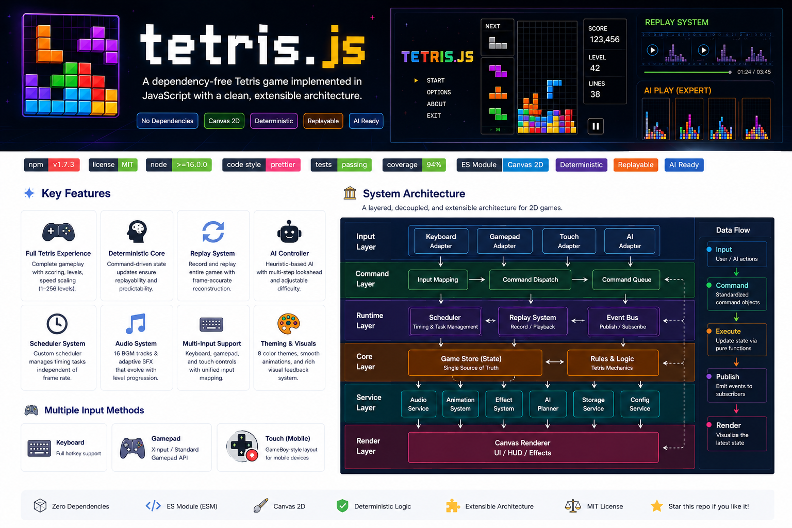
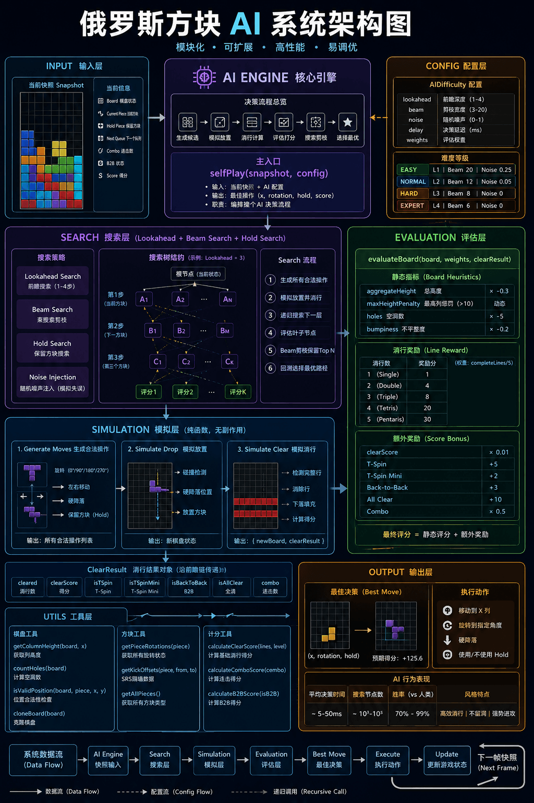

# tetris.js - A Modern JavaScript Tetris Engine

English | [简体中文](./README.md)

tetris.js is a zero-dependency, vanilla JavaScript Tetris game built on Canvas,
supporting multi-device input and AI control. The project features a fixed-frame
pipeline architecture, combining Scheduler, Command Queue, and Replay systems to
create a clean game update pipeline — a lightweight front-end game engine design
and architecture practice example.

## Features

The game fully implements the core features of classic Tetris, including piece
generation, movement, rotation, gravity, collision detection, line clearing,
leveling, and score tracking, complemented by rich interface rendering,
animation effects, and interactive feedback.

### Game Controls

- **Keyboard**: Arrow keys for movement and rotation, Space for hard drop, P to
  pause, M to toggle background music, R to restart, Q to quit, S to toggle AI
  mode;
- **Gamepad**: Full adaptation with left analog stick and D-pad support;
- **Mobile Touch**: GameBoy-style virtual buttons for complete touchscreen
  support;

  

### Level & Difficulty

- **Level Selection**: 1-10 levels (Keyboard: 1-9 / T keys; Gamepad/Touch:
  Up/Down to adjust);
- **Difficulty Selection**: Easy / Normal / Hard / Expert (Keyboard: E/N/H/X
  keys; Gamepad/Touch: A/B/Y/X buttons);
- **256 Total Stages**: A tribute to classic FC console design, stages loop
  after reaching 256;

### Game Rules

- **Drop Speed**: Initial drop interval of 1000ms at Level 1, smoothly
  accelerating within the first 60% of stages, ultimately reaching a limit of
  100ms;
- **Scoring**: Score = Base Points × Current Level (1 line = 100pts, Tetris =
  800pts);
- **Level Up**: Dynamic level-up conditions, starting at 10 lines for the first
  level-up, incrementally increasing to a maximum of 60 lines per level;

### Audio-Visual Experience

- **16 Background Music Tracks**: Auto-switching every 16 stages, covering
  classical, electronic, folk, synthwave, and other styles;
- **16 Line Clear Sound Effects**: Chord and instrumentation parameters change
  with levels for a progressive auditory experience;
- **8 Color Palettes**: Auto-switching every 32 stages, transitioning from
  classic bright colors to neon and gemstone themes;
- **Animation Effects**: Countdown, line clear flash, score float, landing
  highlight, level-up celebration, pause timer, and more;

### System Capabilities

- **Replay**: Watch the full gameplay replay after game over (Video:
  https://www.bilibili.com/video/BV1oRVA6uEXG/?vd_source=8d9b68dd3ed316bb9b3a13e3f3f778eb);
- **AI Control**: Multi-step look-ahead capability, selecting optimal placement
  through board evaluation algorithms with different difficulty levels (HARD AI
  Video:
  https://www.bilibili.com/video/BV16CVd6tEEY/?vd_source=8d9b68dd3ed316bb9b3a13e3f3f778eb);
- **Local Storage**: Auto-persists high scores;
- **Responsive Layout**: Perfectly adapts to desktop, tablet, and mobile
  screens;

### Technical Highlights

- **Vanilla JavaScript**: Pure native JavaScript with zero third-party
  dependencies;
- **Modular Design**: Based on ES Module (ESM) specification, highly decoupled
  modules (audio, rendering, logic) for easy maintenance and replacement;
- **Layered Architecture**: Adopts layered architecture and component-based
  design;
- **Centralized State Management**: GameStore-based centralized state management
  with pure function state updates, fully separating game logic from rendering.
  Combined with Command Pattern, natively supports replay and AI training;
- **Independent Scheduler**: Uses a dedicated scheduler to drive all animations
  and audio, independent of browser frame rate;
- **Comprehensive Testing**: Unit tests with Jest, end-to-end tests with
  Cypress;

## Architecture

This project adopts a layered architecture design with clear structure, high
modularity, and strong maintainability. It is suitable not only for Tetris-style
game development but also as a general architecture reference for small
front-end 2D canvas games, easily adaptable to other game types.

## Architecture Advantages

- **Clear Modular Division**: Clear responsibilities at each layer with low
  coupling between modules. Foundation utilities, game rules, service modules,
  and runtime core each perform their own roles, making maintenance and
  extension very convenient.
- **Centralized State Management**: All core game state is unified in
  `GameStore`, updated through pure functions `stateHandler`, avoiding scattered
  data. This design natively supports **Replay** and reserves extension space
  for advanced features like time-travel debugging.
- **Command Pattern Main Loop**: Player actions, AI decisions, and automatic
  piece drops are all encapsulated as standard command objects, enabling
  operation recording, replay, and control — the underlying foundation of the
  replay system and AI gameplay.
- **Event Bus Module Decoupling**: Communication via publish-subscribe pattern,
  with line clears, level-ups, game over, and other events broadcast uniformly,
  with rendering, audio, and animation modules responding independently without
  mutual dependencies.
- **Unified Task Scheduling System**: A dedicated `Scheduler` coordinates all
  timed tasks, ensuring precise timing for piece drops, animations, audio, and
  AI computation, unaffected by frame rate fluctuations, with stable and
  reproducible game logic.
- **Multi-Input Channel Abstraction**: Keyboard, gamepad, and touch operations
  are all mapped to standard game commands, with upper-level logic unaware of
  input device type, reducing the cost of adding new devices.
- **Deterministic Game Logic**: State changes are determined only by commands
  and time, with no random side effects or implicit dependencies. The same input
  always produces consistent results, suitable for replay, issue reproduction,
  and AI simulation scenarios.
- **Plugin-Based Extension Design**: Audio, animation, AI, replay, and other
  features are all pluggable independent modules that do not intrude into core
  logic, making new features and version iterations more flexible.
- **AI and Core Logic Isolation**: AI deduces optimal strategies only through
  game state snapshots, never directly modifying runtime data, with robust
  architecture that facilitates iterating different algorithms and difficulty
  modes.
- **Separation of Runtime and Presentation**: The core runtime layer handles
  rules and state management, while the rendering layer focuses on drawing.
  Currently using Canvas rendering, it can be extended to WebGL rendering, or
  the core logic can be ported to server-side, mini-programs, and other
  multi-platform environments.

## AI Control

tetris.js features a built-in AI system with multi-step look-ahead capability,
selecting optimal placement strategies through board evaluation algorithms with
different difficulty levels.

### AI Decision Architecture

### Core Capabilities

- **Multi-Step Look-Ahead**: AI can look ahead 2-4 moves (depending on
  difficulty), combined with deterministic 7-bag piece sequences for precise
  placement planning;
- **Beam Search Pruning**: Intelligent pruning in the search tree, completing
  decisions in milliseconds even at depth=4;
- **Sandbox Isolation**: AI simulates in an independent copy without
  contaminating the real game state;
- **Emergent Well Strategy**: AI was not explicitly programmed for well
  behavior, yet naturally learned the classic tactic of leaving a well for
  I-piece Tetris clears through the evaluation system;

### Evaluation System

AI evaluates each candidate placement using the following metrics:

- **Height Control**: Total height as background pressure + exponential penalty
  for columns exceeding the danger zone;
- **Hole Penalty**: Strong weight penalty for holes — one hole ruins everything;
- **Surface Flatness**: Penalty for height differences between adjacent columns,
  keeping the board flat;
- **Line Clear Reward**: Table-driven tiered rewards, with Tetris (4 lines)
  receiving high-score guidance;
- **Scoring Awareness**: T-Spin, Back-to-Back, All Clear, Combo, and other
  advanced scoring rules are all factored into evaluation;

### Difficulty Gradients

| Difficulty | Look-Ahead | Error Rate | Delay | Description                        |
| ---------- | ---------- | ---------- | ----- | ---------------------------------- |
| Easy       | 2 moves    | 25%        | 580ms | Occasionally errs, slower response |
| Normal     | 3 moves    | 15%        | 480ms | Occasionally errs, moderate speed  |
| Hard       | 4 moves    | 5%         | 280ms | Rarely errs, fast response         |
| Expert     | 4 moves    | 0%         | 150ms | Never errs, extreme response       |

All difficulties share the same value system (evaluation weights), differing
only in look-ahead depth, random error rate, and response speed.

## Development Guide

- Game Configuration: `lib/configuration.js`;
- Modify Block Style/Colors:
  - Color Configuration: `lib/game/contants/color-paletters.js`;
  - Block Styles: `lib/game/contants/shapes.js`;
- Add Background Music/Sound Effects: Add resources and stage mappings in the
  audio module:
  - Background Music:
    - Add BGM: `lib/services/audio/constants/bgm`;
    - Register BGM: `lib/services/audio/constants/musics.js`;
  - Sound Effects: `lib/services/audio/sounds.js`;
- Game Animation Configuration:
  - Animation System: `lib/runtime/animation-system.js`;
  - Add Animations: `lib/services/animations`, refer to existing animation code
    comments;
  - Register Animations:
    - Subscribe to animation messages: Listen for animation triggers in
      `lib/game/index.js`;
    - Execute animation:
      `this.Animations.register(new CountdownAnimation({ Scheduler, Game: this }))`;
    - Dependency Injection: `{ Scheduler, Game: this }` config is the
      dependencies to inject, add as needed;
- EventBus Management:
  - Message Registration: `lib/events/event-catalog.js`;
  - Event Routing: `lib/events/router` (add router module when module subscribes
    to 6+ messages);
- Custom Game Rules (Speed, Scoring, Leveling): Modify rule calculation
  functions:
  - Speed Configuration: `lib/game/rules/get-speed.js`;
  - Line Clear Scoring: `lib/game/constants/game.js`;
  - Scoring/Leveling: `lib/game/actions/apply-clear-lines.js`;
- Extend New Input Devices:
  - Add: Add adapter in `lib/services/input` layer (extend Base class, implement
    dependency injection and message subscription);
  - Register: Register in `lib/game/index.js` game core module (refer to
    existing Keyboard, Gamepad, and Touch);
- Input/Command Mapping:
  - Input Mapping: `lib/engine/dispatch-input.js`;
  - Command Mapping: `lib/engine/dispatch-command.js`;
  - Add Command Sets: `lib/game/actions/difficulty-actions.js`;
- AI Configuration:
  - Difficulty Configuration: `lib/ai/core/ai-difficulty.js`;
  - Decision Planning Configuration: `lib/ai/planner/self-play.js`;

## Browser Compatibility

|  Edge |  Firefox |  Chrome |  Safari |  Opera |
| ---------------------------------------------------------------------------------------------------------------------- | ------------------------------------------------------------------------------------------------------------------------------- | ---------------------------------------------------------------------------------------------------------------------------- | ---------------------------------------------------------------------------------------------------------------------------- | ------------------------------------------------------------------------------------------------------------------------- |
| 128 – 131                                                                                                              | 130 – 132                                                                                                                       | 109 – 131                                                                                                                    | 17.5 – 18.1                                                                                                                  | 113 – 114                                                                                                                 |

**Note**: This project uses standard ES6+, Canvas, and Gamepad API, and does not
support IE series browsers.

## Game Controls

tetris.js supports multiple control methods: keyboard, gamepad, and GAME BOY
style touch buttons for mobile devices.

### Keyboard Controls

- Enter: Start game
- ↑: Rotate piece
- ← / →: Move piece left/right
- ↓: Soft drop
- Space: Hard drop
- M: Toggle background music
- P: Pause/Resume game
- R: Restart game
- Q: Force quit game
- B: Return from difficulty selection to level selection
- S: Toggle AI / Human control
- C: Hold piece

#### Level Selection

- 1–9: Select levels 1 to 9
- T: Select level 10

#### Difficulty Selection

- E: Easy (starts with 0 pre-filled rows)
- N: Normal (starts with 3 pre-filled rows)
- H: Hard (starts with 6 pre-filled rows)
- X: Expert (starts with 9 pre-filled rows)

### Gamepad Controls

- START: Start game
- BACK: Force quit game / Return from difficulty selection to level selection
- RB: Toggle AI / Human control
- RT: Hold piece
- Left Stick / D-Pad:
  - ↑: Rotate piece
  - ← / →: Move piece left/right
  - ↓: Soft drop
- X: Restart game
- Y: Pause/Resume game
- A: Toggle background music
- B: Hard drop

#### Level Selection

- D-Pad ↑: Increase level
- D-Pad ↓: Decrease level

#### Difficulty Selection

- A: Easy
- B: Normal
- Y: Hard
- X: Expert

### Mobile Touch (GameBoy Layout)

- ↑: Rotate piece
- ↓: Soft drop
- ←: Move left
- →: Move right
- BACK: Force quit game
- HOLD: Hold piece
- A: Toggle background music
- B: Soft drop
- X: Pause game
- Y: Restart game

#### Level Selection

- ↑ / ↓: Adjust level (min 1, max 10)
- START: Enter difficulty selection

#### Difficulty Selection

- A: Easy
- B: Normal
- Y: Hard
- X: Expert
- BACK: Return to level selection

## Game Rules

### Drop Speed

The piece drop interval is calculated by the `getSpeed()` function. The game
starts at Level 1 (1000ms/cell), using the formula:

`step = ceil(1000 / floor(MAX_LEVEL × 0.6))`

Within the first 60% of the maximum level `MAX_LEVEL` (256 levels), the drop
speed increases smoothly and linearly to the limit. The remaining 40% of levels
maintain the extreme speed of 100ms/cell, letting players focus on survival
challenges.

### Scoring

Final Score = Base Points per Clear × Current Level

| Lines Cleared    | Base Points |
| :--------------- | :---------- |
| 1 line           | 100         |
| 2 lines          | 300         |
| 3 lines          | 500         |
| 4 lines (Tetris) | 800         |
| 5 lines          | 1200        |

**Example**: Clearing 4 lines at Level 1 gives 800 × 1 = 800pts; clearing 4
lines at Level 50 gives 800 × 50 = 40000pts.

### Level Up Rules

The game uses `levelUpSteps` for dynamic level-up conditions. The first level-up
requires only 10 lines, after which the required lines increase by 2 per level
(10 → 12 → 14...), with a maximum of 60 lines per level.

The game features 256 total stages, with levels cycling after reaching the
maximum, paying tribute to classic FC game design.

### Block Color Palettes

The game includes 8 distinctive color palette schemes, automatically switching
every 32 stages for a rich visual experience throughout high-level gameplay.

| Stage Range | Palette  | Style Description        |
| :---------- | :------- | :----------------------- |
| 1-32        | Classic  | Default vibrant colors   |
| 33-64       | Warm     | Energetic warm tones     |
| 65-96       | Cool     | Refreshing cool tones    |
| 97-128      | Candy    | Sweet candy colors       |
| 129-160     | Forest   | Natural forest tones     |
| 161-192     | Sunset   | Warm sunset tones        |
| 193-224     | Neon     | High-brightness neon     |
| 225-256     | Gemstone | Brilliant gemstone tones |

### Background Music Rules

The game includes 16 background music tracks in different styles, automatically
switching every 16 stages.

| Stage Range | Track Name       | Style               |
| :---------- | :--------------- | :------------------ |
| 1-16        | TetrisTheme      | Classic main theme  |
| 17-32       | SpringFestival   | Festive celebration |
| 33-48       | FirstDivision    | Classic folk        |
| 49-64       | GongXiFaCai      | Festive blessing    |
| 65-80       | Loginska         | Electronic groove   |
| 81-96       | BeyondTheWall    | Ethereal mystery    |
| 97-112      | Technotris       | Tech electronic     |
| 113-128     | GoldenSnakeDance | Oriental charm      |
| 129-144     | Korobeiniki      | Classic folk        |
| 145-160     | Ascension        | Ethereal ascent     |
| 161-176     | NeonNights       | Neon synthwave      |
| 177-192     | FrozenPeaks      | Cold solitude       |
| 193-208     | CyberRush        | Cyber high-speed    |
| 209-224     | Starlight        | Starry dreamscape   |
| 225-240     | FinalPush        | Ultimate challenge  |
| 241-256     | JourneyToWest    | Epic finale         |

## Battle Mode

Battle mode supports **HUMAN VS AI** and **HUMAN VS HUMAN** gameplay.

### Match Rules

- **Round**: A single game ends when a player's stack reaches the top; winner
  gets +1 point;
- **Match**: The first player to reach the target score (default 20,
  configurable via `Configuration.victoryScore`) wins the match;
- After the match ends, a result overlay is displayed; press Enter to rematch;

### Attack System

When a player clears lines, they can send **garbage lines** to their opponent.
Garbage lines are pushed from the bottom of the opponent's board, increasing
difficulty.

#### Attack Power Calculation

| Lines Cleared | Attack Power (Garbage Lines) | Description         |
| :------------ | :--------------------------- | :------------------ |
| 1 line        | 0                            | No attack power     |
| 2 lines       | 1                            | Double              |
| 3 lines       | 2                            | Triple              |
| 4 lines       | 3                            | Tetris (best value) |
| 5+ lines      | 4                            | Super clear         |

#### Garbage Line Offset Mechanism

- A player's attack power **first offsets** their own incoming garbage lines
  (defense);
- Any remaining attack power after offsetting is sent to the opponent (offense);
- Encourages players to actively clear lines for self-preservation when under
  attack;

#### Garbage Line Holes

Garbage lines contain random holes (empty cells). Higher difficulty means more
holes:

| Difficulty | Holes per Line | Description            |
| :--------- | :------------- | :--------------------- |
| Easy       | 1              | Easy to fill           |
| Normal     | 2              | Requires planning      |
| Hard       | 3              | Harder to handle       |
| Expert     | 4              | Extremely hard to fill |

### Two-Player Input Device Allocation

In HUMAN VS HUMAN mode, input devices are dynamically allocated based on the
number of connected gamepads:

| Gamepads | P1 (index=0)         | P2 (index=1)                  |
| :------- | :------------------- | :---------------------------- |
| 1        | Keyboard             | Gamepad-0 + Keyboard disabled |
| 2+       | Keyboard + Gamepad-0 | Gamepad-1 + Keyboard disabled |

- P1 controls level and difficulty selection in menus;
- P2's keyboard is automatically disabled during gameplay, only gamepad is
  available;

### Battle Interface

- **Real-Time Scoreboard**: Both players' win counts displayed in real-time;
- **Battle Result Overlay**: Shows the winner's name after the match ends, press
  Enter to rematch;

**PS**: Have fun playing! Don't forget to STAR if you like it!

## Contributors

- ChatGPT: Provided various suggestions for game architecture optimization and
  upgrades, and created beautiful architecture diagrams for the project;
- DeepSeek: Provided comprehensive test code and code comment writing support,
  and collaborated on optimizing technical details of important functional
  modules (Battle Module, Gamepad Controller Module, AI Decision Module);

## License

- tetris.js project: Open source under the
  [MIT License](http://opensource.org/licenses/mit-license.html);
- Press Start 2P font (Google Open Source Font): Open source under the
  [OFL License](assets/font/OFL.txt);
