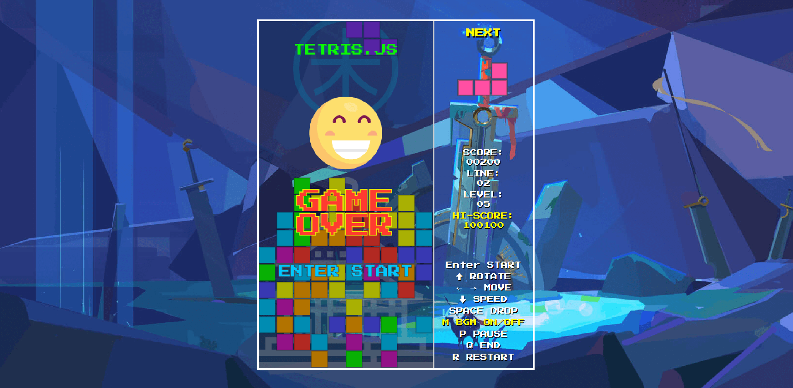
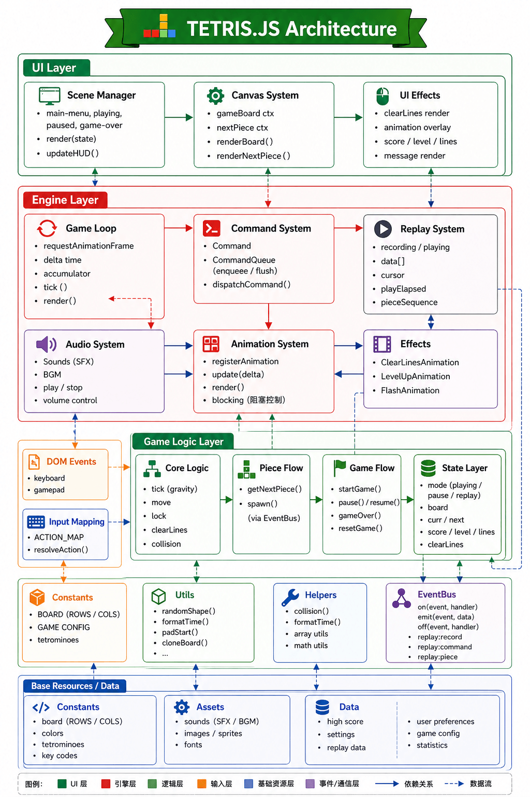

# tetris.js

tetris.js - 基于原生 JavaScript 开发的纯前端俄罗斯方块游戏，无任何外部依赖，可直接在浏览器中运行。游戏实现了经典俄罗斯方块的全部核心功能，包括方块生成、移动、旋转、下落、碰撞检测、消行、升级、分数统计等，同时添加了丰富的 UI 渲染、动画特效和交互反馈，整体架构分层清晰、模块化程度高，易于维护和扩展。

## Features

- 游戏控制：
  - 按键控制：
    - Enter：开始游戏；
    - ↑：转动方块；
    - ← →：移动方块；
    - ↓：加速下落；
    - SPACE：迅速落底；
    - M：暂停/继续播放背景音乐；
    - P：暂停/继续游戏；
    - R: 重新开始游戏；
    - Q: 强制结束游戏；
  - 等级控制：
    - 等级选择：
      - 普通等级选择：按 1-9 键选择等级；
      - 特殊等级选择：按 T 键，选择 10 级；
    - 最高等级：99 级;
- 游戏特效：
  - 开始特效：等级选择后，播放倒计时动画；
  - 消除特效：消除方块时，播放消除层闪动动画；
  - 分数更新特效：分数变化是，播放分数变化动画；
  - 升级特效：进入下一级时，播放庆祝动画；
  - 暂停特效：暂停游戏时时，播放暂停动画；
- 游戏音效：
  - 等级选择音效；
  - 等级开始音效；
  - 开始倒计时音效；
  - 方块移动音效；
  - 方块旋转音效；
  - 方块快速下落音效；
  - 方块落地音效；
  - 方块消除音效；
  - 升级庆祝音效；
  - 暂停游戏音效；
  - 暂停时钟音效；
  - 恢复游戏音效；
  - 游戏结束音效；
  - 背景音乐开/关音效；
  - 背景音乐；
- 游戏界面：自适应浏览器窗口大小
  - 预览方块（右侧上方）：，显示下一个出现的方块；
  - 数据显示（右侧中间）：
    - 当前分数；
    - 当前等级；
    - 消减行数；
    - 最好分数；
  - 游戏快捷键（右侧下方）：显示游戏常用的快捷键说明；
- 数据存储：本地缓存最高分数；

## Architecture

tetris.js 项目采用分层架构设计，整体结构清晰、模块化程度高、可维护性强。不仅适用于俄罗斯方块游戏，也可作为小型前端游戏的通用架构参考，通过轻微调整，可扩展到其他类型的 2D 画布游戏开发中。

## Highlights

- 原生 JavaScript 开发，无任何外部依赖；
- 模块化清晰：各层职责明确，模块间耦合度低，便于维护和修改；
- 状态集中管理：所有核心状态统一存储，避免状态分散导致的混乱，便于调试和扩展；
- 逻辑与渲染分离：核心游戏逻辑不依赖渲染实现，可后续扩展为 WebGL 渲染或其他渲染方式；
- 交互反馈丰富：添加了完整的音效、动画，提升用户体验；
- 轻量无依赖：纯原生 JS 实现，可直接运行，适配各种浏览器环境，部署简单；

## Browsers support

|  Edge |  Firefox |  Chrome |  Safari |  Opera |
| ---------------------------------------------------------------------------------------------------------------------- | ------------------------------------------------------------------------------------------------------------------------------- | ---------------------------------------------------------------------------------------------------------------------------- | ---------------------------------------------------------------------------------------------------------------------------- | ------------------------------------------------------------------------------------------------------------------------- |
| 128 – 131                                                                                                              | 130 – 132                                                                                                                       | 109 – 131                                                                                                                    | 17.5 – 18.1                                                                                                                  | 113 – 114                                                                                                                 |

祝：玩得愉快！

## License

- tetris.js - Licensed under
  [MIT License](http://opensource.org/licenses/mit-license.html).

- Press Start 2P fonts (GOOGLE) - Licensed under [OFL License](./font/OFL.txt)
