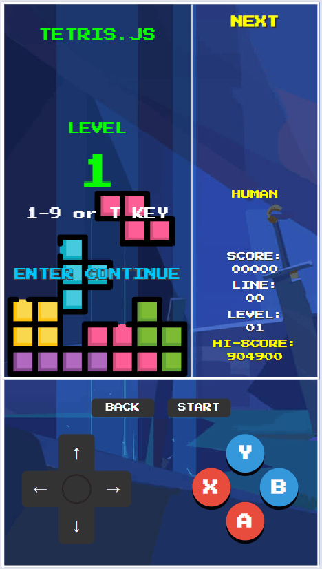

# tetris.js

tetris.js - 基于原生 JavaScript 开发的纯前端俄罗斯方块游戏，无任何外部依赖，可直接在浏览器中运行。游戏实现了经典俄罗斯方块的全部核心功能，包括方块生成、移动、旋转、下落、碰撞检测、消行、升级、分数统计等，同时添加了丰富的 UI 渲染、动画特效和交互反馈，整体架构分层清晰、模块化程度高，易于维护和扩展。

## Features

- 游戏控制：
  - 按键控制：
    - 电脑键盘
      - Enter：开始游戏；
      - ↑：转动方块；
      - ← →：移动方块；
      - ↓：加速下落；
      - SPACE：迅速落底；
      - M：暂停/继续播放背景音乐；
      - P：暂停/继续游戏；
      - R: 重新开始游戏；
      - Q: 强制结束游戏；
      - B: 从难度选择返回等级选择；
      - S: 游戏中切换 AI / HUMAN 控制游戏；
    - 游戏手柄
      - START: 开始游戏；
      - BACK:
        - 游戏中强制结束游戏；
        - 难度选择返回等级选择;
      - RB：游戏中切换 AI / HUMAN 控制游戏；
      - 左摇杆：
        - ↑：转动方块；
        - ← →：移动方块；
        - ↓：加速下落；
      - 十字方向键：
        - ↑：转动方块；
        - ← →：移动方块；
        - ↓：加速下落；
      - X: 重新开始游戏；
      - Y: 暂停/继续游戏；
      - A: 暂停/继续播放背景音乐；
      - B: 迅速落底；
  - 等级控制：
    - 最高等级：99 级;
    - 等级选择：
      - 电脑键盘：
        - 普通等级选择：按 1-9 键选择等级；
        - 特殊等级选择：按 T 键，选择 10 级；
      - 游戏手柄：
        - 方向按钮 上：游戏等级 +1；
        - 方向按钮 下：游戏等级 -1；
    - 难度选择：
      - 电脑键盘：
        - E: 'EASY' - 开始游戏时 0 行方块；
        - N: 'NORMAL' - 开始游戏时 3 行方块；
        - H: 'HARD' - 开始游戏时 6 行方块；
        - X: 'EXPERT' - 开始游戏时 9 行方块；
      - 游戏手柄：
        - A: 'EASY' - 开始游戏时 0 行方块；
        - B: 'NORMAL' - 开始游戏时 3 行方块；
        - Y: 'HARD' - 开始游戏时 6 行方块；
        - X: 'EXPERT' - 开始游戏时 9 行方块；
- 游戏特效：
  - 开始特效：等级选择后，播放倒计时动画；
  - 消除特效：消除方块时，播放消除层闪动动画；
  - 分数更新特效：分数变化是，播放分数变化动画；
  - 升级特效：进入下一级时，播放庆祝动画；
  - 暂停特效：暂停游戏时时，播放暂停动画；
- 游戏音效：
  - 等级选择音效；
  - 等级开始音效；
  - 开始倒计时音效；
  - 方块移动音效；
  - 方块旋转音效；
  - 方块快速下落音效；
  - 方块落地音效；
  - 方块消除音效；
  - 升级庆祝音效；
  - 暂停游戏音效；
  - 暂停时钟音效；
  - 恢复游戏音效；
  - 游戏结束音效；
  - 背景音乐开/关音效；
  - 背景音乐（基于最大99级）；
    - TetrisTheme：游戏等级 1-9 级时播放；
    - SpringFestival：游戏等级 10-18 级时播放；
    - FirstDivision：游戏等级 19-27 级时播放；
    - GongXiFaCai：游戏等级 28-36 级时播放；
    - Loginska：游戏等级 37-45 级时播放；
    - BeyondTheWall：游戏等级 46 - 54 级时播放；
    - Technotris：游戏等级 55 - 63 级时播放；
    - GoldenSnakeDance：游戏等级 64 - 72 级时播放；
    - Korobeiniki：游戏等级 73 - 81 级时播放；
    - JourneyToWest：游戏等级 81 级以上时播放（大圣！！！）；
- 游戏界面：自适应浏览器窗口大小
  - 预览方块（右侧上方）：，显示下一个出现的方块；
  - 数据显示（右侧中间）：
    - 当前分数：动画显示分数变化；
    - 当前等级；
    - 消减行数；
    - 最好分数；
  - 游戏快捷键（右侧下方）：显示游戏常用的快捷键说明；
- 数据存储：本地缓存最高分数；
- 操作回放：玩家在游戏结束后，可以看到之前操作游戏的回放；
- AI 控制：有简易的 AI 控制，AI 可以自行控制操作方块行为；
  - 从真实状态提取快照；
  - 支持多步前瞻（lookahead 1/2/3），模拟推进到下一步；
  - 按难度分级的前瞻深度、噪声、权重和延迟；
  - 按棋盘评分（高度、空洞、不平整度、消行奖励）抉择下一步行动;
- 根据分辨率识别手机移动设备，显示模拟 GAME BOY 按键；
  - 等级选择界面：
    - 上/下键：调整级别，最高 10 级，最低 1 级；
    - START：进入难度选择界面；
  - 难度选择界面：
    - A/B/Y/X 分别对 EASY/NORMAL/HARD/EXPERT；
    - BACK：返回等级选择界面；
  - 游戏中界面：
      - 上：旋转；
      - 下：加速下落；
      - 左：向左移动；
      - 右：向右移动；
      - BACK：强制结束；
      - A：开关背景音乐；
      - B：加速下落；
      - X：暂停游戏；
      - Y：重新开始游戏；

  

## Expert AI Play

视频演示地址：https://www.bilibili.com/video/BV1GPG86KEcy/?vd_source=8d9b68dd3ed316bb9b3a13e3f3f778eb

## Architecture

tetris.js 项目采用分层架构设计，整体结构清晰、模块化程度高、可维护性强。不仅适用于俄罗斯方块游戏，也可作为小型前端游戏的通用架构参考，通过轻微调整，可扩展到其他类型的 2D 画布游戏开发中。

## Highlights

- **原生 JavaScript 开发**：无任何外部依赖，从 DOM 操作、Canvas 渲染到音频引擎、AI 算法均独立实现，展示了扎实的工程能力。
- **模块化清晰**：各层职责明确，模块间耦合度低。基础工具、游戏规则、服务模块、运行时核心各司其职，便于维护和修改。
- **状态集中管理**：所有核心状态统一存储于 `GameStore`，改变状态通过纯函数 `stateHandler` 完成，避免了状态分散导致的混乱。这使得 **操作回放（Replay）** 成为可能，也为未来实现时间旅行调试等高级功能打下了基础。
- **逻辑与渲染分离**：核心游戏逻辑（碰撞检测、消行、计分）与 Canvas 渲染完全分离。未来可轻松将 Canvas 渲染替换为 WebGL，或直接移植核心逻辑到服务端用于 AI 训练。
- **完整的音频引擎**：基于 Web Audio API 构建了支持 AD 包络的 `playTone` 引擎。实现了 16 首不同风格的背景音乐、16 套随等级变化的消行变奏和弦、以及十余种游戏交互反馈音效。
- **丰富的交互反馈**：实现了完整的视觉特效系统（倒计时、消行闪烁、得分飘字、落地高亮、升级烟花）和细腻的听觉反馈，交互体验丰富。
- **高效的动画系统**：所有动画（含UI特效）均由独立于 `requestAnimationFrame` 的 `Scheduler` 驱动，保证了复杂场景下动画的时间精度和流畅度，不受游戏主帧率影响。
- **完整测试覆盖**：单元测试覆盖所有核心模块（使用 Jest），E2E 测试覆盖游戏全流程（使用 Cypress），包括键盘/触摸双输入通道、AI 切换、Replay 回放等复杂场景。
- **自适应与多平台**：支持键盘/手柄/触摸三种输入，自动适配桌面端、平板及主流手机分辨率，并内置移动端 GameBoy 风格触控 UI。

## Browsers support

|  Edge |  Firefox |  Chrome |  Safari |  Opera |
| ---------------------------------------------------------------------------------------------------------------------- | ------------------------------------------------------------------------------------------------------------------------------- | ---------------------------------------------------------------------------------------------------------------------------- | ---------------------------------------------------------------------------------------------------------------------------- | ------------------------------------------------------------------------------------------------------------------------- |
| 128 – 131                                                                                                              | 130 – 132                                                                                                                       | 109 – 131                                                                                                                    | 17.5 – 18.1                                                                                                                  | 113 – 114                                                                                                                 |

## 游戏规则

### 下落速度

方块下落间隔由 `getSpeed()` 函数计算。游戏从第 1 级（1000ms/格）起步。算法采用
`step = ceil(1000 / floor(MAX_LEVEL × 0.6))` 的动态步长公式，确保在达到最大等级
`MAX_LEVEL`
(256) 的前 60% 阶段，速度平滑线性递增，直至极限。后 40% 的等级将保持在 100ms/格的极限速度，让玩家在后期专注于生存挑战。

### 得分机制

最终得分 = 单次消除固定分 × 消除时的最终等级。

| 消除行数          | 固定分 |
| :---------------- | :----- |
| 1 行              | 100    |
| 2 行              | 300    |
| 3 行              | 500    |
| 4 行 (俄罗斯方块) | 800    |
| 5 行              | 1200   |

**举例**：在第 1 级消除 4 行可得 800 × 1 = 800 分；在第 50 级消除 4 行则可得 800
× 50 = 40,000 分。

### 升级规则

游戏采用动态升级步长（`levelUpSteps`）。初始升级仅需消除 10 行，此后每次升级所需消除的行数将增加 2 行（即 10
→ 12 →
14...），步长封顶为 60 行/级。游戏共设 256 关，达到后再升级将触发关卡数值循环，致敬 FC 经典设计。

### 方块换色规则

为保持视觉新鲜感，游戏内置 8 套鲜艳的方块配色方案。每 32 关会自动切换至下一套配色，让你在高等级时也能拥有色彩鲜明的游戏体验。

| 关卡段     | 配色方案 | 主题         |
| :--------- | :------- | :----------- |
| 1-32 关    | 经典     | 默认鲜艳配色 |
| 33-64 关   | 暖色     | 活力暖色系   |
| 65-96 关   | 冷色     | 清爽冷色系   |
| 97-128 关  | 糖果     | 甜美糖果色   |
| 129-160 关 | 森林     | 自然森林色   |
| 161-192 关 | 日落     | 温暖日落色   |
| 193-224 关 | 霓虹     | 高亮霓虹色   |
| 225-256 关 | 宝石     | 璀璨宝石色   |

### 背景音乐切换规则

游戏内置 16 首风格各异的背景音乐，随等级提升自动切换，每 16 关为一个切换区间。

| 关卡段     | 音乐曲目         | 风格           |
| :--------- | :--------------- | :------------- |
| 1-16 关    | TetrisTheme      | 经典 Theme     |
| 17-32 关   | SpringFestival   | 喜庆佳节       |
| 33-48 关   | FirstDivision    | 经典 Troika 风 |
| 49-64 关   | GongXiFaCai      | 节日祝福       |
| 65-80 关   | Loginska         | 电子律动       |
| 81-96 关   | BeyondTheWall    | 神秘悠远       |
| 97-112 关  | Technotris       | 科技电子       |
| 113-128 关 | GoldenSnakeDance | 东方韵味       |
| 129-144 关 | Korobeiniki      | 经典民谣       |
| 145-160 关 | Ascension        | 飞升空灵       |
| 161-176 关 | NeonNights       | 霓虹合成波     |
| 177-192 关 | FrozenPeaks      | 冰峰孤高       |
| 193-208 关 | CyberRush        | 赛博高速       |
| 209-224 关 | Starlight        | 星河漫游       |
| 225-240 关 | FinalPush        | 最终冲刺       |
| 241-256 关 | JourneyToWest    | 史诗压轴       |

祝：玩得愉快！

## License

- tetris.js - Licensed under
  [MIT License](http://opensource.org/licenses/mit-license.html).

- Press Start 2P fonts (GOOGLE) - Licensed under [OFL License](./font/OFL.txt)
