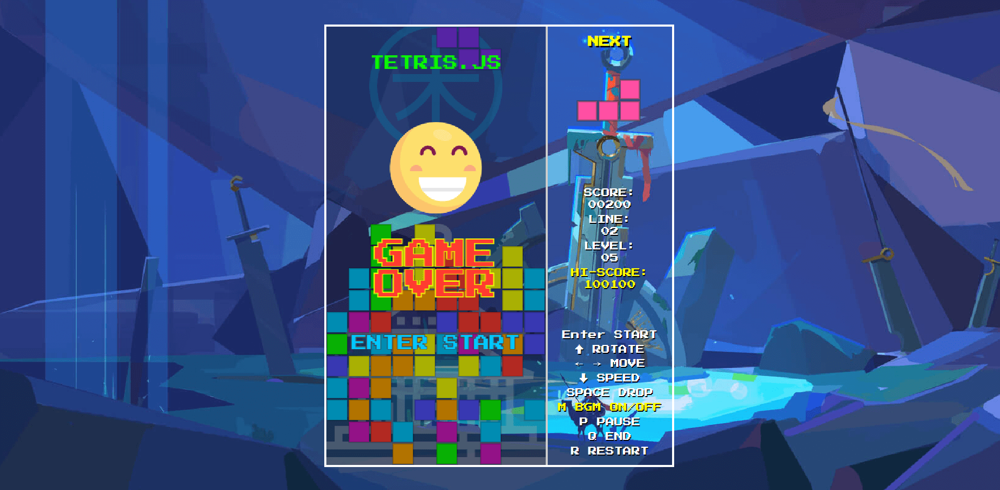

# tetris.js

简体中文 | [English](./README.EN.md)

tetris.js 是一款零依赖、可二次开发的原生 JavaScript 俄罗斯方块游戏，纯前端实现，兼容多端与多种输入设备。并且项目采用工业级分层架构，不仅可直接商用 / 自用，也可作为 2D
Canvas 前端游戏架构学习范本。

## 功能特性

游戏完整实现了经典俄罗斯方块的核心功能，包含方块生成、移动、旋转、下落、碰撞检测、消行、升级、分数统计等能力，同时搭配丰富的界面渲染、动画特效与交互反馈。

### 游戏操控

- **电脑键盘**：方向键控制移动与旋转，空格键一键落底，P 键暂停，M 键切换背景音乐，R 键重新开始，Q 键退出游戏，S 键切换 AI 模式；
- **游戏手柄**：全面适配，支持左摇杆与十字方向键操作；
- **移动端触控**：复刻 GameBoy 风格虚拟按键，完整支持触屏操作；

  

### 等级与难度

- **等级选择**：支持 1-10 级（键盘按 1-9 键 / T 键，手柄、触屏使用上下键调节）；
- **难度选择**：简单 / 普通 / 困难 / 专家（键盘按 E/N/H/X 键，手柄、触屏按 A/B/Y/X 键）；
- **总计 256 个关卡**：致敬经典 FC 游戏机设计，达到 256 关后关卡自动循环；

### 游戏规则

- **下落速度**：1 级初始下落间隔为 1000 毫秒，在前 60% 关卡区间内平滑加速，最终达到 100 毫秒的极限速度
- **计分规则**：消除得分 = 基础分值 × 当前关卡等级（消除1行得100分，消除4行得800分）
- **升级规则**：采用动态升级条件，初始需消除10行即可升级，升级所需行数逐步递增，最高单级需消除60行

### 视听体验

- **16 首背景音乐**：每16个关卡自动切换曲目，涵盖经典、电子、民谣、合成波等多种风格；
- **16 套消行音效**：和弦与配器参数会随关卡变化，听觉体验层层递进；
- **8 套方块配色**：每32个关卡切换一套配色，从经典亮色逐步过渡到霓虹、宝石等特色主题；
- **动画特效**：包含倒计时、消行闪烁、分数浮动、落地高亮、升级庆祝、暂停计时等多种动态效果；

### 系统能力

- **操作回放**：游戏结束后，可完整回看整局游戏的操作过程（视频：https://www.bilibili.com/video/BV1oRVA6uEXG/?vd_source=8d9b68dd3ed316bb9b3a13e3f3f778eb）
- **AI 操控**：具备多步预判能力，通过棋盘评估算法选择最优落子方案，并区分不同难度；（视频：https://www.bilibili.com/video/BV1GPG86KEcy/?vd_source=8d9b68dd3ed316bb9b3a13e3f3f778eb）
- **本地存储**：自动持久化保存游戏最高分；
- **自适应布局**：完美适配桌面端、平板、手机等各类设备屏幕；

### 技术亮点

- **原生 JavaScript**：基于纯原生 JavaScript 开发，零第三方依赖；
- **模块化设计**：基于 ES Module
  (ESM) 规范，各模块（音频、渲染、逻辑）高度解耦，易于维护和替换；
- **分层架构**：采用了分层架构（Layered Architecture）与组件化设计；
- **状态集中管理**：基于 GameStore 的集中式状态管理，通过纯函数更新数据，实现游戏逻辑与画面渲染完全分离。配合 Command
  Pattern，原生支持录像回放与 AI 训练；
- **独立调度器**：使用调度器驱动所有动画与音效，不受浏览器帧率影响；
- **完善的测试体系**：使用 Jest 编写单元测试，Cypress 实现端到端测试；

## 架构说明

本项目采用分层架构设计，结构清晰、模块化程度高、可维护性强。不仅适用于俄罗斯方块这类游戏开发，也可作为小型前端2D画布游戏的通用架构参考，稍加改造即可拓展至其他类型游戏。

## 架构优势

- **模块化划分清晰**：各层级职责明确，模块间低耦合。基础工具、游戏规则、服务模块、运行核心各司其职，维护与扩展十分便捷。
- **集中式状态管理**：所有核心游戏状态统一存放于 `GameStore`，通过纯函数
  `stateHandler`
  完成状态更新，避免数据散乱。该设计原生支持**操作回放**，也为时间旅行调试等高级功能预留扩展空间。
- **命令模式驱动主循环**：玩家操作、AI 决策、方块自动下落均封装为标准命令对象，实现操作的记录、回放与管控，是回放系统和 AI 玩法的底层支撑。
- **事件总线实现模块解耦**：基于发布订阅模式通信，消行、升级、游戏结束等事件统一广播，渲染、音频、动画模块独立响应，互不依赖。
- **统一任务调度系统**：专属调度器 `Scheduler`
  统筹所有定时任务，保障方块下落、动画、音效、AI 运算的时序精准，不受帧率波动干扰，游戏逻辑可稳定复现。
- **多输入通道统一抽象**：键盘、游戏手柄、触屏操作均映射为标准游戏指令，上层逻辑无需感知输入设备类型，降低新设备的接入成本。
- **确定性游戏逻辑**：状态变更仅由命令与时间决定，无随机副作用和隐式依赖，相同输入必然产生一致结果，适配回放、问题复现与 AI 模拟场景。
- **插件化扩展设计**：音频、动画、AI、回放等功能均为可插拔独立模块，不会侵入核心逻辑，新增功能与版本迭代更加灵活。
- **AI 与核心逻辑隔离**：AI 仅通过游戏状态快照推演最优策略，不会直接修改运行数据，架构健壮，便于迭代不同算法与难度模式。
- **运行层与表现层分离**：核心运行层负责规则与状态管理，渲染层专注画面绘制。可无缝将 Canvas 渲染替换为 WebGL，也能把核心逻辑移植到服务端、小程序等多端环境。

## 二次开发指引

- 游戏基础配置：`lib/configuration.js`；
- 修改方块样式/配色：
  - 配色配置：`lib/game/contants/color-paletters.js`；
  - 方块样式：`lib/game/contants/shapes.js`；
- 新增背景音乐/音效：在音频模块追加资源与关卡映射:
  - 背景音乐：
    - 添加背景音乐；`lib/services/audio/constants/bgm`；
    - 注册背景音乐：`lib/services/audio/constants/musics.js`；
  - 游戏音效：`lib/services/audio/sounds.js`；
- 游戏动画配置：
  - 动画管理系统：`lib/runtime/animation-system.js`；
  - 新增动画：`lib/services/animations`，动画实现参考现有动画设代码注释；
  - 注册动画：
    - 订阅动画消息：`lib/game/index.js` 中监听动画触发消息；
    - 执行动画：`this.Animations.register(new CountdownAnimation({ Scheduler, Game: this }))`;
    - 依赖注入：`{ Scheduler, Game: this }`
      配置信息既是需要注入的依赖，根据需要注入依赖；
- EventBus 事件管理：
  - 消息注册：`lib/events/event-catalog.js`；
  - 事件路由：`lib/events/router` （模块订阅消息超过6条即可）添加路由模块；
- 自定义游戏规则（速度、计分、升级）：修改规则计算函数：
  - 速度配置：`lib/game/rules/get-speed.js`；
  - 消除行数得分：`lib/game/constants/game.js`；
  - 记分/升级：`lib/game/actions/apply-clear-lines.js`；
- 扩展新输入设备：
  - 新增：`lib/services/input`
    层新增适配器即可（继承 Base 基类，实现依赖注入和消息订阅发布；
  - 注册：`lib/game/index.js` 在游戏核心模块注册（参考现有的 Keyboard,
    Gamepad 和 Touch）；
- 输入/命令映射：
  - 输入映射：`lib/engine/dispatch-input.js`;
  - 命令映射：`lib/engine/dispatch-command.js`;
  - 添加指令集：`lib/game/actions/difficulty-actions.js`；
- AI 配置：
  - 难易度配置：`lib/ai/core/ai-difficulty.js`；
  - 决策规划配置：`lib/ai/planner/self-play.js`;

## 浏览器兼容

|  Edge |  Firefox |  Chrome |  Safari |  Opera |
| ---------------------------------------------------------------------------------------------------------------------- | ------------------------------------------------------------------------------------------------------------------------------- | ---------------------------------------------------------------------------------------------------------------------------- | ---------------------------------------------------------------------------------------------------------------------------- | ------------------------------------------------------------------------------------------------------------------------- |
| 128 – 131                                                                                                              | 130 – 132                                                                                                                       | 109 – 131                                                                                                                    | 17.5 – 18.1                                                                                                                  | 113 – 114                                                                                                                 |

**备注**：项目使用标准 ES6+、Canvas、Gamepad API，不兼容 IE 系列浏览器。

## 游戏按键说明

tetris.js 有多种按键控制方式：键盘按键、Gamepad 游戏手柄按键和针对移动设备的模拟 GAME
BOY 按键；

### 键盘操作

- Enter：开始游戏
- ↑：转动方块
- ← / →：左右移动方块
- ↓：加速下落
- Space：直接落底
- M：开启/关闭背景音乐
- P：暂停/继续游戏
- R：重新开始游戏
- Q：强制结束游戏
- B：从难度选择页面返回等级选择页面
- S：切换 AI / 人工控制

#### 等级选择

- 1–9：选择 1 至 9 级
- T：选择 10 级

#### 难度选择

- E：简单（开局预设 0 行方块）
- N：普通（开局预设 3 行方块）
- H：困难（开局预设 6 行方块）
- X：专家（开局预设 9 行方块）

### 游戏手柄操作

- START：开始游戏
- BACK：
  - 游戏中强制结束游戏
  - 从难度选择页面返回等级选择页面
- RB：切换 AI / 人工控制
- 左摇杆 / 十字方向键：
  - ↑：转动方块
  - ← / →：左右移动方块
  - ↓：加速下落
- X：重新开始游戏
- Y：暂停/继续游戏
- A：开启/关闭背景音乐
- B：直接落底

#### 等级选择

- 十字方向键 ↑：提升等级
- 十字方向键 ↓：降低等级

#### 难度选择

- A：简单
- B：普通
- Y：困难
- X：专家

### 移动端触控（GameBoy 布局）

- ↑：转动方块
- ↓：加速下落
- ←：向左移动
- →：向右移动
- BACK：强制结束游戏
- A：开启/关闭背景音乐
- B：加速下落
- X：暂停游戏
- Y：重新开始游戏

#### 等级选择

- ↑ / ↓：调整等级（最低 1 级，最高 10 级）
- START：进入难度选择界面

#### 难度选择

- A：简单
- B：普通
- Y：困难
- X：专家
- BACK：返回等级选择界面

## 游戏规则

### 下落速度

方块的下落间隔由 `getSpeed()`
函数计算。游戏从第 1 级（1000 毫秒/格）开始运行，采用公式：

`step = ceil(1000 / floor(MAX_LEVEL × 0.6))`

在最大等级
`MAX_LEVEL`（256 级）的前 60% 区间内，下落速度平滑线性递增直至极限。剩余 40% 的关卡将保持 100 毫秒/格的极限速度，让玩家专注于生存挑战。

### 计分规则

最终得分 = 单次消除基础分值 × 当前关卡等级

| 消除行数           | 基础分值 |
| :----------------- | :------- |
| 1 行               | 100      |
| 2 行               | 300      |
| 3 行               | 500      |
| 4 行（俄罗斯方块） | 800      |
| 5 行               | 1200     |

**举例**：在第 1 级消除 4 行，可得 800 × 1 =
800 分；在第 50 级消除 4 行，可得 800 × 50 = 40000 分。

### 升级规则

游戏通过 `levelUpSteps`
实现动态升级条件。首次升级仅需消除 10 行，之后每升一级所需消除行数增加 2 行（10
→ 12 → 14……），单级最高要求消除 60 行。

游戏总共设置 256 个关卡，达到最大关卡后等级数值将循环重置，致敬经典 FC 游戏设计。

### 方块配色规则

游戏内置 8 套风格各异的方块配色方案，每 32 个关卡自动切换一套，让高等级游戏过程也能保持丰富的视觉体验。

| 关卡区间   | 配色方案 | 风格说明     |
| :--------- | :------- | :----------- |
| 1-32 关    | 经典     | 默认鲜艳配色 |
| 33-64 关   | 暖色     | 活力暖色系   |
| 65-96 关   | 冷色     | 清爽冷色系   |
| 97-128 关  | 糖果     | 甜美糖果色   |
| 129-160 关 | 森林     | 自然森林色调 |
| 161-192 关 | 日落     | 温暖落日色调 |
| 193-224 关 | 霓虹     | 高亮霓虹色彩 |
| 225-256 关 | 宝石     | 璀璨宝石色调 |

### 背景音乐规则

游戏内置 16 首不同风格的背景音乐，随着关卡提升自动切换，每 16 个关卡更换一首曲目。

| 关卡区间   | 曲目名称         | 风格         |
| :--------- | :--------------- | :----------- |
| 1-16 关    | TetrisTheme      | 经典主旋律   |
| 17-32 关   | SpringFestival   | 喜庆节日风   |
| 33-48 关   | FirstDivision    | 经典民谣曲风 |
| 49-64 关   | GongXiFaCai      | 节日祝福曲风 |
| 65-80 关   | Loginska         | 电子律动曲风 |
| 81-96 关   | BeyondTheWall    | 悠远神秘曲风 |
| 97-112 关  | Technotris       | 科技电子曲风 |
| 113-128 关 | GoldenSnakeDance | 东方韵味曲风 |
| 129-144 关 | Korobeiniki      | 经典民谣     |
| 145-160 关 | Ascension        | 空灵飞升曲风 |
| 161-176 关 | NeonNights       | 霓虹合成波   |
| 177-192 关 | FrozenPeaks      | 清冷孤高曲风 |
| 193-208 关 | CyberRush        | 赛博高速曲风 |
| 209-224 关 | Starlight        | 星河梦幻曲风 |
| 225-240 关 | FinalPush        | 终极挑战曲风 |
| 241-256 关 | JourneyToWest    | 史诗压轴曲风 |

## 开源许可

- tetris.js 项目：基于
  [MIT 许可证](http://opensource.org/licenses/mit-license.html) 开源
- Press Start 2P 字体（谷歌开源字体）：基于 [OFL 许可证](assets/font/OFL.txt)
  开源
