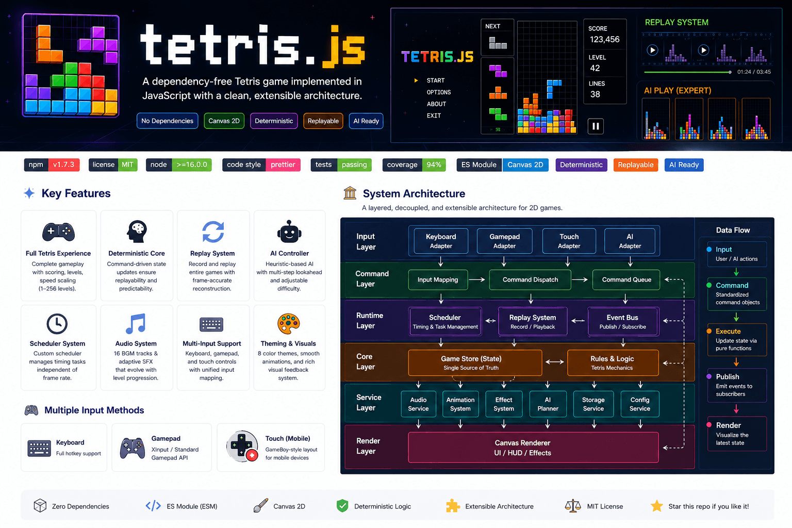

# Features

English | [简体中文](./01-features.md)

> From a Tetris game to a modern JavaScript game runtime.

## An Ever-Evolving Project

tetris.js started as a Tetris game written in JavaScript and HTML5 Canvas. As
the project continued to iterate, it gradually gained more and more
capabilities. Replay, AI, Battle, Scheduler, Command, Game Runtime... These
capabilities were not planned goals from the beginning. They evolved step by
step while solving real problems.

Today, Tetris is still the first game carried by this Runtime. But tetris.js is
no longer just a Tetris project. It is more like a continuously evolving
practice built around browser game development.

## Core Capabilities

The entire project can be roughly divided into several independent yet closely
collaborative systems. Each system has clear responsibilities, collectively
forming a complete game runtime.

### 🎮 Gameplay

Fully implements most of the core gameplay mechanics of classic Tetris.

Including:

- 7-Bag Randomizer
- Hold
- Ghost Piece
- Hard Drop / Soft Drop
- Super Rotation System (SRS)
- Combo
- Back-to-Back
- T-Spin
- Perfect Clear
- Multiple Speed Levels
- Multiple Themes
- Responsive Layout

Gameplay itself is only responsible for game rules. It doesn't know whether AI,
Replay, or Battle exists. This is also the foundation for maintaining the
architecture's maintainability.

> Deep Dive: [03-runtime.md](./03-runtime.md)

### ⚙️ Runtime

The Runtime is the most important component of the entire project. All systems
work together around the Runtime.

Including:

- Input System
- Game Loop
- Command Dispatch
- State Update
- Scheduler
- Renderer
- Audio
- AI
- Replay

For the Runtime, AI and players are no different. Replay and keyboard are no
different. Battle and Gamepad are no different. It is only responsible for
executing Commands according to unified rules.

This is also an important reason why Replay, AI, and multiplayer battles can
share the same execution flow.

> Deep Dive: [03-runtime.md](./03-runtime.md)

### 🧠 AI

AI uses exactly the same game rules as human players. It does not directly
modify the real board. Instead, it completes the following in an independent
simulation environment:

- Move Generation
- Snapshot
- Board Simulation
- Evaluation
- Beam Search
- Decision Making

Ultimately, AI converts operations into Commands just like a player, then hands
them to the Runtime for execution.

Therefore, the entire project always has only one set of game logic.

> Deep Dive: [04-ai.md](./04-ai.md)

### 🎬 Replay

Replay does not record screen output. Nor does it save every frame of the board.
Replay saves:

> The Commands generated by the player during the game.

Since the Runtime ensures deterministic state updates, the same set of Commands
can always reproduce the same game. This approach not only results in extremely
small data sizes but also provides a foundation for AI debugging, issue
reproduction, and future network synchronization.

> Deep Dive: [05-replay.md](./05-replay.md)

### ⚔️ Battle

Battle is built on top of the single-player mode. It does not re-implement a new
game. Both sides share the same Runtime. Real-time battles are achieved through
Garbage, Attack, and win/loss rules.

Currently supports:

- Player vs Player
- Player vs AI
- Garbage
- Combo Attack
- Back-to-Back Attack

The implementation of Battle fully reuses the existing Runtime and Gameplay. New
features have barely broken existing systems.

> Deep Dive: [06-battle.md](./06-battle.md)

### 🎮 Input

The project supports multiple input methods. Including:

- Keyboard
- Gamepad
- Touch

All input devices go through unified abstraction. Ultimately converted into
Commands that the Runtime can recognize.

  

Therefore, the game logic has no need to care about the input source. When
adding new input devices in the future, it usually only requires adding a new
Input Adapter.

### 🎨 Renderer

The Renderer focuses on screen drawing. It does not participate in any game
logic calculations. All rendering comes from the current game state. This design
ensures that:

- Replay
- AI
- Battle

Can all share the same Renderer without writing different rendering logic for
different modes.

### 🎵 Audio

The audio system is also part of the Runtime. Audio playback is not directly
written into game logic. Instead, it is uniformly scheduled through the
Scheduler and event system. This ensures that:

- Animation
- Audio
- Game State

Always maintain consistent timing.

### 🧩 Modular Design

The entire project follows modular design principles. Each system has clear
responsibilities. For example:

- Gameplay is responsible for rules
- Runtime is responsible for scheduling
- Renderer is responsible for drawing
- AI is responsible for decision-making
- Replay is responsible for recording
- Audio is responsible for sound

Modules collaborate through unified interfaces. As the project continues to
expand, more features can be built on the existing Runtime rather than being
rewritten from scratch.

## Current Capabilities

The project has currently implemented:

- ✅ Classic Tetris Gameplay
- ✅ Game Runtime
- ✅ Command Dispatch
- ✅ Scheduler
- ✅ Renderer
- ✅ Audio
- ✅ Replay
- ✅ AI Decision
- ✅ Human vs Human
- ✅ Human vs AI
- ✅ Gamepad
- ✅ Touch Support
- ✅ Responsive Layout
- ✅ Multiple Themes
- ✅ Multiple Sound Effects

The entire project is still continuously evolving. We will continue to explore
more capabilities around the Runtime in the future.

## Next Reading

If you already understand the overall capabilities of tetris.js, the next
chapter will introduce the most core topic of the entire project:
**Architecture**. It will explain:

- Why can these systems share the same Runtime?
- How did the entire architecture evolve step by step to what it is today?

**Next Chapter: [02-architecture.en.md](./02-architecture.en.md)**
