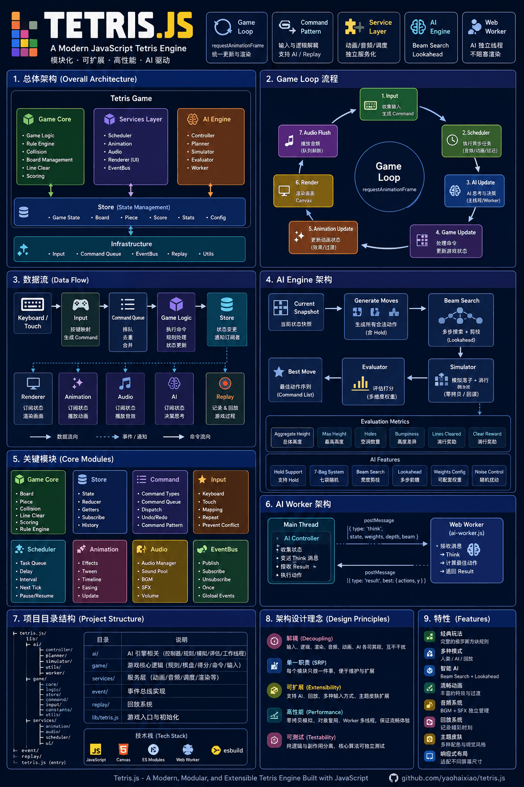
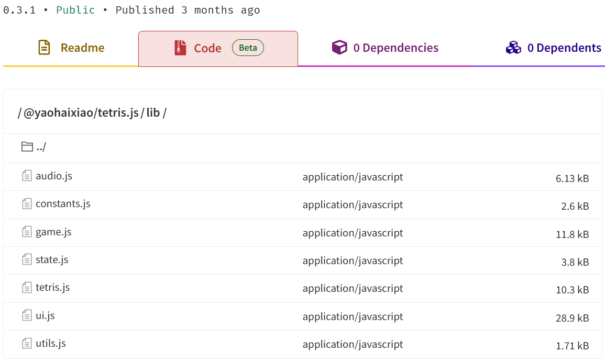
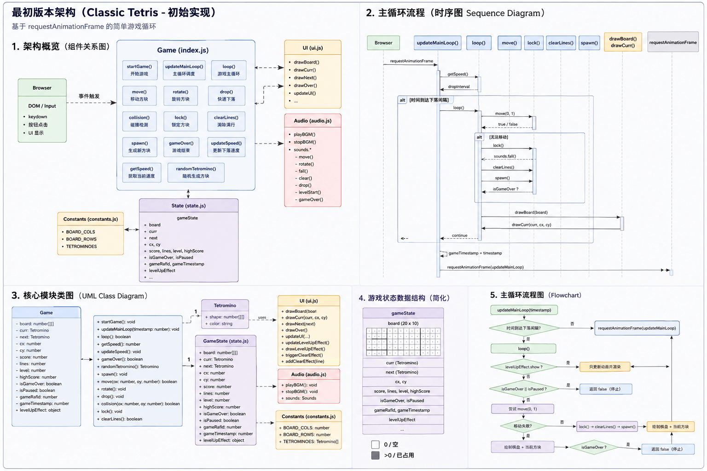
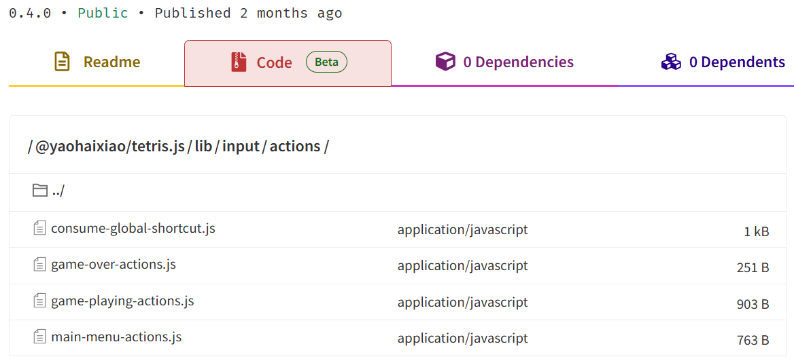
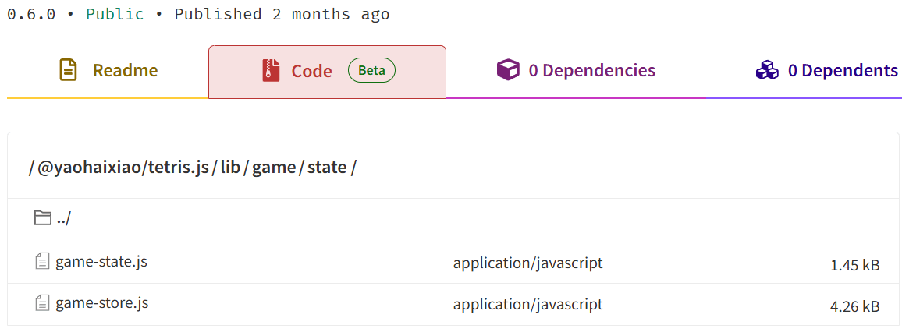
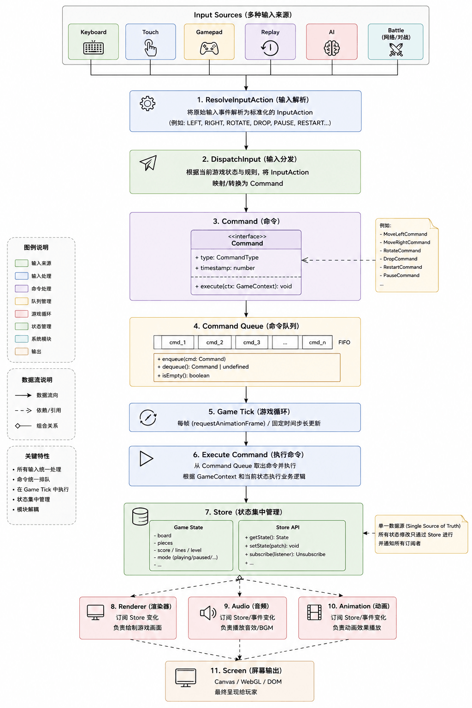
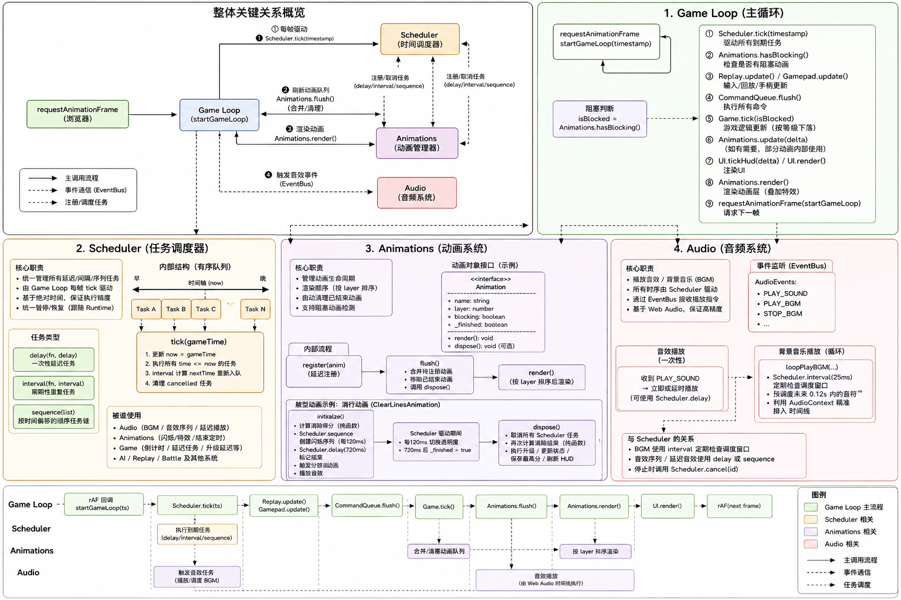
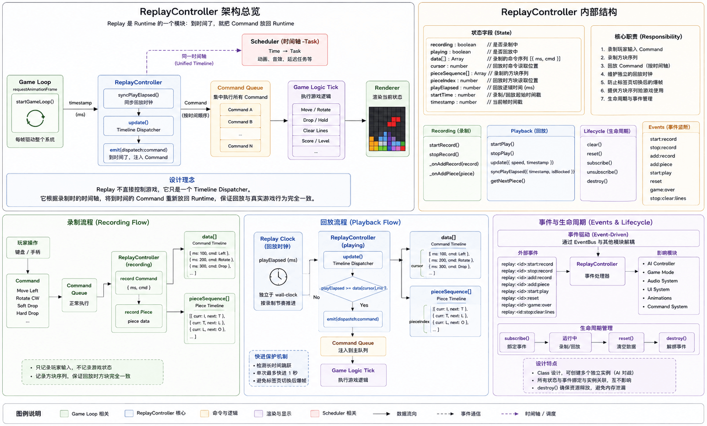

# Architecture

English | [简体中文](./02-architecture.md)

> Architecture is not designed, but evolved through the continuous process of
> solving problems.

## Why Write This Chapter?

Many projects introduce their architecture by presenting a module diagram. For
example:

```
Engine
│
├── Renderer
├── Audio
├── AI
├── Replay
└── ...
```

Such architecture diagrams are certainly fine. But they can only tell us:

> **What it looks like now.**



Yet they fail to answer a more important question:

> **Why did it become this way?**

In fact, the vast majority of software architectures are not designed all at
once. They gradually evolve through the continuous process of solving real
problems. tetris.js is no exception.

## It All Started with a Simple Tetris Game

The initial version of the project had no Runtime, no Scheduler, no Replay, and
no AI.

It was just an ordinary browser mini-game. The entire program probably consisted
of just a few core parts:



Original code:
[v0.3.1](https://www.npmjs.com/package/@yaohaixiao/tetris.js/v/0.3.1?activeTab=code)

The game loop was also very simple.

```js
/**
 * # Game Main Loop
 *
 * Controls core game logic: dropping, collision detection, locking pieces,
 * clearing lines, spawning new pieces. Interrupts execution when game is over
 * or paused. Executes every frame to ensure smooth gameplay.
 *
 * @function loop
 * @returns {boolean} Returns whether to continue the main loop
 */
export function loop() {
  // During level-up animation: only update animation, no game logic
  if (gameState.levelUpEffect.show) {
    updateLevelUpEffect();
    drawBoard(gameState.board);
    drawCurr(gameState.curr, gameState.cx, gameState.cy);
    drawLevelUpEffect();
    return true;
  }

  // Game over / paused → stop main loop
  if (gameState.isGameOver || gameState.isPaused) {
    return false;
  }

  // Try to move down one cell; if unable, execute lock logic
  if (!move(0, 1)) {
    // Lock current piece to board
    lock();
    // Play landing sound effect
    sounds.fall();
    // Execute line clear logic (including 3-blink effect)
    clearLines();
    // Spawn new falling piece
    spawn();

    // Game over after spawning new piece → terminate loop
    if (gameState.isGameOver) {
      return false;
    }
  }

  // Draw game board + current falling piece
  drawBoard(gameState.board);
  drawCurr(gameState.curr, gameState.cx, gameState.cy);

  // Continue loop normally
  return true;
}

/**
 * # Game Main Loop with Speed Control
 *
 * Only executes drop logic when the specified time interval is reached.
 *
 * @function updateMainLoop
 * @param {number} timestamp - Timestamp value
 * @returns {void}
 */
export const updateMainLoop = (timestamp) => {
  // Get drop interval for current level (milliseconds)
  const dropInterval = getSpeed();

  // Drop only when time interval is reached
  if (
    !gameState.gameTimestamp ||
    timestamp - gameState.gameTimestamp > dropInterval
  ) {
    // Execute actual game logic (drop/collision/render)
    loop();
    gameState.gameTimestamp = timestamp;
  }

  // Continue to next frame
  gameState.gameRafId = requestAnimationFrame(updateMainLoop);
};
```

For the simplest Tetris game, this implementation is perfectly fine. It could
even be said that this is the approach most tutorials adopt. The architecture at
that time looked like this:



However, as features continued to increase, new problems began to emerge.

## First Problem: Code Started to Become Increasingly Scattered

When keyboard control was added, the code needed to listen for: `keydown`.
Adding new features required `keyup`. Adding touch control introduced many DOM
button event bindings and handler functions.

Later, when Gamepad support was added, another new set of inputs appeared.
Gradually, different input devices started directly modifying the game state.

### Move Piece

The general flow was as follows:

```
Keyboard
↓
move()
↓
Board
```

Implementation of the move() method:

```js
/**
 * # Move current piece
 *
 * Attempts to move the current piece by the specified offset (left/right/down).
 * Checks collision first, executes move and plays sound effect if no
 * collision.
 *
 * @function move
 * @param {number} ox - X-axis offset (-1=left, 1=right, 0=no move)
 * @param {number} oy - Y-axis offset (1=down, 0=no move)
 * @returns {boolean} Returns true if move successful, false if collision
 *   prevents move
 */
export function move(ox, oy) {
  // No collision → can move
  if (!collision(ox, oy)) {
    gameState.cx += ox;
    gameState.cy += oy;
    // Play move sound effect
    sounds.move();
    return true;
  }

  // Collision occurred, cannot move
  return false;
}
```

### Rotate Piece

Flow:

```
Touch
↓
rotate()
↓
Board
```

Implementation of the rotate() method:

```js
/**
 * # Rotate current piece
 *
 * Performs clockwise rotation on the current piece (matrix transpose +
 * reverse). If collision occurs after rotation, automatically reverts to ensure
 * proper gameplay.
 *
 * @function rotate
 * @returns {void}
 */
export const rotate = () => {
  // Save shape before rotation for collision recovery
  const prev = gameState.curr.shape;

  // Clockwise rotation: transpose + reverse rows
  gameState.curr.shape = prev[0].map((_, i) =>
    prev.map((r) => r[i]).toReversed(),
  );

  // If collision after rotation → restore original
  if (collision(0, 0)) {
    gameState.curr.shape = prev;
  } else {
    // Rotation successful → play sound effect
    sounds.rotate();
  }
};
```

### Hard Drop

Flow:

```
Gamepad
↓
drop()
↓
Board
```

Implementation of the drop() method:

```js
/**
 * # Hard Drop
 *
 * Piece instantly drops to the bottom, automatically locks, clears lines, and
 * spawns new piece. Compared to normal dropping, it directly reaches the
 * bottom; a commonly used player operation.
 *
 * @function drop
 * @returns {void}
 */
export function drop() {
  // Loop downward movement until unable to move (bottom/collision)
  while (true) {
    if (!move(0, 1)) {
      break;
    }
  }

  // Lock piece to board
  lock();
  // Play landing sound effect
  sounds.fall();
  // Clear lines (including 3-blink effect)
  clearLines();
  // Spawn new piece
  spawn();
  // Play hard drop complete sound effect
  sounds.drop();
}
```

They could all directly modify the `gameState`. The code still worked, but
severe coupling dependency issues had already begun to appear.

## Second Problem: More and More Systems Started Depending on Game Logic

Later, animation was added, audio was added, Replay was added, AI was added, and
Battle was added. If every module could directly modify the game state, then the
entire project would eventually become:

```
Keyboard ─────┐
Touch ────────┤
Gamepad ──────┤
Replay ───────┤
AI ───────────┤
Battle ───────┤
               ▼
           Game State
```

Every module knows how to operate the game. Every module also depends on the
game implementation. Adding a new feature meant modifying multiple places. This
is exactly why many small games become increasingly difficult to maintain over
time.

## Architectural Evolution: dispatchInput (Input Mapping)

As more input control logic was added, the project underwent its first major
adjustment, introducing input mapping: **`dispatchInput`, decoupling key presses
from game control logic**.


### Previous Approach

In v0.3.1, all game state inputs were written directly in event handler
functions, which is the most common approach:

```js
/**
 * # Main keyboard event handler (unified distribution of all key operations)
 *
 * Distributes to corresponding logic based on current game state: level
 * selection, game over, global shortcuts, game controls.
 *
 * @function onControlButtonsPress
 * @param {KeyboardEvent} e - Keyboard event object
 * @returns {boolean} Whether to prevent subsequent operations
 */
const onControlButtonsPress = (e) => {
  // Get pressed key name and lowercase key name
  const { key } = e;
  const lowerKey = key.toLowerCase();

  // Countdown and level-up effect screens block operations
  if (gameState.countdown.show || gameState.levelUpEffect.show) {
    return false;
  }

  // 1. Level selection interface operations
  if (gameState.isSelectLevel) {
    executeLevelSelectionCommand(key, lowerKey);
    return false;
  }

  // 2. Game over state: Press Enter to return to main menu
  if (gameState.isGameOver) {
    if (key === 'Enter') {
      executeDrawLevelSelectCommand();
    }
    return false;
  }

  // 3. Global shortcuts (M/R/Q/P) are processed first
  if (executeShortcutsCommand(lowerKey)) {
    return false;
  }

  // 4. Paused state: do not respond to game operations
  if (gameState.isPaused) {
    return false;
  }

  // 5. Normal gameplay: handle direction keys/space controls
  executeDirectionControlCommand(key);

  // Redraw game interface
  drawBoard(gameState.board);
  drawCurr(gameState.curr, gameState.cx, gameState.cy);
};

/**
 * # Bind game global events
 *
 * Window resize, keyboard press, keyboard release events
 *
 * @function bindEvents
 * @returns {void}
 */
const bindEvents = () => {
  // Adapt canvas to window size changes
  globalThis.addEventListener('resize', onResize);

  // Listen for keyboard press events, handling all game operations
  document.addEventListener('keydown', onControlButtonsPress);

  // Listen for keyboard release events, used to cancel P key long-press timer
  document.addEventListener('keyup', onPauseStop);
};
```

As you can see, as game features grew more complex and game states increased,
this event handler became bloated and difficult to test and maintain.

### dispatchInput (Input Mapping)

To solve the problems caused by increasing keys and states, **input mapping
(dispatchInput)** was adopted.

Let's see the changes brought by `dispatchInput`:

```js
import resolveInputAction from '@/lib/input/resolve-input-action.js';
import dispatchInput from '@/lib/input/dispatch-input.js';

/**
 * # Main keyboard event handler (unified distribution of all key operations)
 *
 * Distributes to corresponding logic based on current game state: level
 * selection, game over, global shortcuts, game controls.
 *
 * @function onKeydown
 * @param {KeyboardEvent} e - Keyboard event object
 * @returns {void}
 */
const onKeydown = (e) => {
  const key = e.key.toLowerCase();
  const action = resolveInputAction(key);

  if (!action) {
    return;
  }

  dispatchInput({
    type: 'keydown',
    key,
    action,
  });
};

export default onKeydown;
```

First, `resolveInputAction` is used to resolve the key's action:

```js
const ACTION_MAP = {
  arrowleft: 'MOVE_LEFT',
  arrowright: 'MOVE_RIGHT',
  arrowdown: 'MOVE_DOWN',
  arrowup: 'ROTATE',
  ' ': 'DROP',

  m: 'TOGGLE_MUSIC',
  p: 'TOGGLE_PAUSE',
  r: 'RESTART',
  q: 'QUIT',

  1: 'LEVEL_ONE',
  2: 'LEVEL_TWO',
  3: 'LEVEL_THREE',
  4: 'LEVEL_FOUR',
  5: 'LEVEL_FIVE',
  6: 'LEVEL_SIX',
  7: 'LEVEL_SEVEN',
  8: 'LEVEL_EIGHT',
  9: 'LEVEL_NINE',
  t: 'LEVEL_TEN',

  enter: 'CONFIRM',
};

const resolveInputAction = (key) => {
  const action = ACTION_MAP[key];

  if (!action) {
    return null;
  }

  return action || null;
};

export default resolveInputAction;
```

Then comes the key part: using `dispatchInput` to map inputs and execute key
operations:

```js
import InputRoutes from '@/lib/input/input-actions-map.js';
import { hasBlockingAnimation } from '@/lib/animations/system.js';
import consumeGlobalShortcut from '@/lib/input/actions/consume-global-shortcut.js';
import getGameStateMode from '@/lib/game/state/get-game-state-mode.js';

const dispatchInput = (event) => {
  const { action } = event;
  const mode = getGameStateMode();

  // Countdown, level-up, or no matching key action
  if (
    hasBlockingAnimation(['countdown', 'level-up']) ||
    !action ||
    consumeGlobalShortcut(action)
  ) {
    return;
  }

  const handler = InputRoutes[mode];

  handler?.(action);
};

export default dispatchInput;
```

The key here is using `InputRoutes` to execute state-specific actions based on
game state `mode`:

```js
import mainMenuActions from '@/lib/input/actions/main-menu-actions.js';
import gamePlayingActions from '@/lib/input/actions/game-playing-actions.js';
import gameOverActions from '@/lib/input/actions/game-over-actions.js';

const InputActionsMap = {
  'main-menu': mainMenuActions,
  playing: gamePlayingActions,
  paused: () => {},
  'game-over': gameOverActions,
};

export default InputActionsMap;
```

This allows us to easily manage a series of actions for each game state, and
pressing keys that don't match the current state has no side effects:



Let's look at the action set for the `main-menu` state: `mainMenuActions`

```js
import startGame from '@/lib/game/core/start-game.js';
import changeLevel from '@/lib/game/actions/change-level.js';

const ACTION_MAP = {
  LEVEL_ONE: () => {
    changeLevel(1);
  },
  LEVEL_TWO: () => {
    changeLevel(2);
  },
  LEVEL_THREE: () => {
    changeLevel(3);
  },
  LEVEL_FOUR: () => {
    changeLevel(4);
  },
  LEVEL_FIVE: () => {
    changeLevel(5);
  },
  LEVEL_SIX: () => {
    changeLevel(6);
  },
  LEVEL_SEVEN: () => {
    changeLevel(7);
  },
  LEVEL_EIGHT: () => {
    changeLevel(8);
  },
  LEVEL_NINE: () => {
    changeLevel(9);
  },
  LEVEL_TEN: () => {
    changeLevel(10);
  },
  CONFIRM: startGame,
};

const mainMenuActions = (action) => {
  const handler = ACTION_MAP[action];

  handler?.();
};

export default mainMenuActions;
```

From this point on, Replay, AI, Gamepad, and Touch all have completely
consistent input execution flows. This was the most important step for the
entire Runtime.

## Architectural Evolution: Store (Centralized State Management)

As more modules continued to be added, new problems emerged. The Renderer needed
to read state, AI needed to read state, Replay needed to read state, and
animation also needed to read state.

### Previous Approach

```text
Keyboard ─────┐
Touch ────────┤
Gamepad ──────┤
Replay ───────┤
AI ───────────┤
Battle ───────┤
               ▼
        move()/rotate()/drop()
               ▼
            Game State
```

If all modules could modify data, then the state would inevitably become
increasingly chaotic.

### Store (Centralized State Management)

So, game state began to be centrally managed. All state updates were unified
through the Runtime. Other modules were only responsible for reading state or
responding to state changes.

From this moment on, the game truly had a stable data flow.



Previously, we directly manipulated the finite state. Let's look at the previous
`rotate` method:

```js
/**
 * # Rotate current piece
 *
 * Performs clockwise rotation on the current piece (matrix transpose +
 * reverse). If collision occurs after rotation, automatically reverts to ensure
 * proper gameplay.
 *
 * @function rotate
 * @returns {void}
 */
export const rotate = () => {
  // Save shape before rotation for collision recovery
  const prev = gameState.curr.shape;

  // Clockwise rotation: transpose + reverse rows
  gameState.curr.shape = prev[0].map((_, i) =>
    prev.map((r) => r[i]).toReversed(),
  );

  // If collision after rotation → restore original
  if (collision(0, 0)) {
    gameState.curr.shape = prev;
  } else {
    // Rotation successful → play sound effect
    sounds.rotate();
  }
};
```

After restructuring, everything is handled through `GameStore`:

```js
import BOARD from '@/lib/services/ui/constants/board.js';
import GameState from '@/lib/game/state/game-state.js';
import isFunction from '@/lib/utils/is-function.js';

/**
 * # Create Game Store Factory
 *
 * A lightweight closure-based state manager for managing game runtime state.
 *
 * Features:
 *
 * - Uses closure to encapsulate state (avoiding global pollution)
 * - Provides basic get / set API
 * - Supports patch update mode
 * - Supports partial domain methods (board / hud / level, etc.)
 *
 * Design Positioning:
 *
 * - Not Redux / Not Zustand
 * - Lightweight game state container
 * - Designed specifically for Tetris Engine
 *
 * @param {object} [initialState=GameState] - Optional initial state (for reset
 *   or testing). Default is `GameState`
 * @returns {object} Store API
 */
const createGameStore = (initialState) => {
  /**
   * # Internal state object
   *
   * Uses structuredClone to ensure initial state isolation
   */
  let state = {
    ...structuredClone(initialState || GameState),
    nextSequence: [],
  };

  return {
    /**
     * ## Get full state
     *
     * @returns {object} Current game state
     */
    getState: () => state,

    /**
     * ## Update state (supports patch or function)
     *
     * Supports two modes:
     *
     * 1. Object patch
     * 2. Function (prevState) => patch
     *
     * @param {object | Function} patch - State update content or function
     */
    setState: (patch) => {
      state = {
        ...state,
        ...(isFunction(patch) ? patch(state) : patch),
      };
    },

    /**
     * ## Reset board
     *
     * Regenerates empty board based on BOARD constants
     */
    resetBoard: () => {
      const { COLS, ROWS } = BOARD;

      // Create ROWS x COLS 2D array (initial value 0, representing empty cells)
      state.board = Array.from({ length: ROWS }, () =>
        Array.from({ length: COLS }).fill(0),
      );
    },

    /**
     * ## Get base lines cleared
     *
     * @returns {number} - Returns base lines count
     */
    getBaseLines: () => state.baseLines,

    /**
     * ## Set base lines
     *
     * @param {number} lines - Base lines count
     */
    setBaseLines: (lines) => {
      state.baseLines = lines;
    },

    /**
     * ## Get current cleared lines
     *
     * @returns {object[]} - Returns cleared lines data
     */
    getClearLines: () => state.clearLines,

    /**
     * ## Set current cleared lines
     *
     * @param {number[]} lines - Cleared lines array
     */
    setClearLines: (lines) => {
      state.clearLines = lines;
    },

    /**
     * ## Get HUD data
     *
     * Returns core data needed for UI rendering
     *
     * @returns {object} HUD data
     */
    getHub: () => {
      const { source, lines, level } = state;

      return {
        source,
        lines,
        level,
      };
    },

    /**
     * ## Set HUD data
     *
     * @param {object} hud - HUD data object
     */
    setHud: (hud) => {
      const { score, lines, level } = hud;

      state.score = score;
      state.lines = lines;
      state.level = level;
    },

    /**
     * ## Set high score
     *
     * @param {number} highScore - Historical high score
     */
    setHighScore: (highScore) => {
      state.highScore = highScore;
    },

    /**
     * ## Get high score
     *
     * @returns {number} - Returns high score
     */
    getHighScore: () => state.highScore,

    /**
     * ## Get current level
     *
     * @returns {number} - Returns current level
     */
    getLevel: () => state.level,

    /**
     * ## Set current level
     *
     * @param {number} level - Current level
     */
    setLevel: (level) => {
      state.level = level;
    },

    /**
     * ## Get game mode
     *
     * @returns {string} Current mode (main-menu / playing / paused / game-over)
     */
    getMode: () => state.mode,

    /**
     * ## Set game mode
     *
     * @param {string} mode - Game mode
     */
    setMode: (mode) => {
      state.mode = mode;
    },
  };
};

export default createGameStore;
```

At this point, we just need to create the `store` in the `Game` module:

```js
const Game = {
  // Game state
  store: createGameStore(),
  // omitted...
};
```

Then whenever game state information needs to be manipulated, it's all managed
uniformly through the `store`. Here's the change to the `rotate` method:

```js
import Audio from '@/lib/services/audio';
import Game from '@/lib/game';
import collision from '@/lib/game/logic/collision.js';

/**
 * # Rotate current piece
 *
 * Performs clockwise rotation on the current piece (matrix transpose +
 * reverse). If collision occurs after rotation, automatically reverts to ensure
 * proper gameplay.
 *
 * @function rotate
 * @returns {void}
 */
const rotate = () => {
  const { store } = Game;
  const state = store.getState();
  const { curr } = state;

  if (!curr) {
    return;
  }

  const currentShape = structuredClone(curr);
  // Save shape before rotation for collision recovery
  const prev = curr.shape;

  // Clockwise rotation: transpose + reverse rows
  currentShape.shape = prev[0].map((_, i) =>
    prev.map((r) => r[i]).toReversed(),
  );

  store.setState({
    curr: currentShape,
  });

  // If collision after rotation → restore original
  if (collision(0, 0)) {
    currentShape.shape = prev;
    store.setState({
      curr: currentShape,
    });
  } else {
    // Rotation successful → play sound effect
    Audio.Sounds.rotate();
  }
};

export default rotate;
```

## Architectural Evolution: Command Runtime (Command-Driven Runtime)

Although `Store` unified game state management, there was still a major problem:
all modules depended on game logic, and all modules needed to know when to play
sound effects, when to update animations, and when to refresh the interface.

### Previous Approach

Looking at the pre-upgrade `dispatchInput`:

```js
const dispatchInput = (event) => {
  const { action } = event;
  const mode = getGameStateMode();

  // Countdown, level-up, or no matching key action
  if (
    hasBlockingAnimation(['countdown', 'level-up']) ||
    !action ||
    consumeGlobalShortcut(action)
  ) {
    return;
  }

  const handler = InputRoutes[mode];

  handler?.(action);
};
```

After matching the handler function, it was executed immediately, with no order
control and no knowledge of how to execute things sequentially.

### Why Command?

The biggest purpose of Command is not wrapping `move()` into an object. What
truly matters is: **completely separating "what the player wants to do" from
"how the game executes it."**

All inputs no longer directly called game logic. They were first converted into
**Commands**. For example:

```text
MOVE_LEFT
MOVE_RIGHT
ROTATE
DROP
RESTART
QUIT
```

Subsequently, these Commands were not executed immediately but entered the
**Command Queue** uniformly. The entire execution flow became:

```text
Keyboard
Touch
Gamepad
Replay
AI
Battle
        │
        ▼
 DispatchInput
        │
        ▼
     Command
        │
        ▼
  Command Queue
        │
        ▼
   Game Runtime
        │
        ▼
 Execute Command
```

From this moment on, no module directly modified the game. For example,
previously Keyboard would directly call: `move(-1, 0);`. After the change, the
only thing Keyboard could do was submit Commands. The only one that actually
executed Commands was Runtime.

Let's see the change:

```js
import Engine from '@/lib/engine';
import Command from '@/lib/core/command/command.js';
import CommandQueue from '@/lib/core/command/command-queue.js';
import Replay from '@/lib/runtime/replay-runtime.js';
import EventBus from '@/lib/core/event-bus';

/**
 * # Input Dispatcher
 *
 * Responsibilities:
 *
 * - Receive input action
 * - Convert to Command
 * - Enqueue for execution
 * - Record replay (if enabled)
 *
 * @function dispatchInput
 * @param {object} input - Input information
 * @param {string} input.action - Input action type
 * @returns {void}
 */
const dispatchInput = (input) => {
  const { action, payload } = input;

  /**
   * ======== Input Interception Layer ======== Block input during key
   * animations:
   *
   * - Countdown
   * - Level-up
   */
  const hasBlocking = Engine.Animations.hasBlocking(['countdown', 'level-up']);

  if (hasBlocking || !action) {
    return;
  }

  /** ======== Command Building ======== */
  const cmd = new Command(action, payload);

  /** ======== Enqueue for Execution ======== */
  CommandQueue.enqueue(cmd);

  /**
   * ======== Replay Recording Layer ========
   *
   * This is a side-effect, but temporarily kept in dispatcher
   */
  if (Replay.recording) {
    EventBus.emit('replay:record', {
      // Subtract pause time to get pure "play duration" - Replay.totalPausedDuration
      ms: Engine.timestamp - Replay.startTime,
      cmd,
    });
  }
};

export default dispatchInput;
```

As for:

- Is movement allowed?
- Is it currently paused?
- Is it currently Game Over?
- Is there any animation blocking?
- Does sound effect need to be played?
- Does Replay need to be recorded?

These are all decided uniformly by Runtime. The input module has no idea how the
game works internally.

### Why Command Queue?

Many people wonder when first encountering Commands: since we already have
Commands, why do we need a Queue? Why not just: `command.execute();`?

The answer is: **all commands should be executed uniformly within the Game
Loop**. For example, in this frame:

```text
Keyboard
    │
    ├── MOVE_LEFT
    ├── ROTATE
    └── DROP
```

If events are executed immediately upon occurrence, then:

- Keyboard
- Replay
- AI
- Gamepad
- Battle

Would all modify game state at different times. This is not only difficult to
maintain but also cannot guarantee data consistency for each frame. After adding
Command Queue, the entire flow becomes:

```text
DOM Event
        │
        ▼
 Command Queue
        │
        ▼
 Game Tick
        │
        ▼
 Execute Commands
```

All inputs wait for the next Tick, then execute sequentially in FIFO
(first-in-first-out) order. Here's the Command Queue implementation:

```js
/**
 * # Command Queue
 *
 * Used to cache all Commands waiting to be executed, and execute them uniformly
 * at the appropriate time (usually game tick / frame).
 *
 * Typical uses:
 *
 * - Input buffering
 * - Replay playback
 * - AI decision batching
 *
 * Design Features:
 *
 * - FIFO queue
 * - Flush() executes all commands at once
 */
const CommandQueue = {
  /**
   * ## Command Queue (FIFO)
   *
   * @type {object[]}
   */
  queue: [],

  /**
   * ## Enqueue a Command
   *
   * @param {object} command - Command to execute
   */
  enqueue(command) {
    this.queue.push(command);
  },

  /**
   * ## Execute and clear all Commands in the queue
   *
   * Current behavior:
   *
   * - Executes all commands at once
   * - No time-slicing control
   *
   * @param {object} context - Execution context
   */
  flush(context) {
    const { queue } = this;

    while (queue.length > 0) {
      const cmd = queue.shift();
      cmd.execute(context);
    }
  },

  /** ## Clear queue (discard all unexecuted commands) */
  clear() {
    this.queue.length = 0;
  },
};

export default CommandQueue;
```

Through `CommandQueue`'s `flush` method, commands are executed sequentially
(FIFO). This brings three very important benefits:

- Ensures all inputs have consistent execution order;
- Ensures all state updates occur within the Game Loop;
- Ensures all input sources (Keyboard, Replay, AI, Gamepad) have completely
  consistent execution flows;

Also worth noting: `command.execute()`.

```js
import Engine from '@/lib/engine';

/**
 * # Generic Command wrapper class
 *
 * Used to represent an "executable game operation", for example:
 *
 * - MOVE
 * - ROTATE
 * - DROP
 * - START_GAME
 *
 * Design Philosophy:
 *
 * - Input → Command → Execute
 * - Supports Replay / AI / Macro
 *
 * Key Principle: Command itself contains no business logic, only describes
 * "what happened"
 */
class Command {
  /**
   * ## Create a command instance
   *
   * @param {string} action - Command type (e.g., MOVE / ROTATE)
   * @param {object} [payload={}] - Command parameters (e.g., direction, level,
   *   etc.). Default is `{}`
   */
  constructor(action, payload = {}) {
    this.action = action;
    this.payload = payload;
  }

  /**
   * ## Execute command
   *
   * Hands the command to the unified dispatch system for processing, rather
   * than writing logic inside the Command itself.
   *
   * @param {object} context - Execution context
   */
  execute(context) {
    const { action, payload } = this;

    Engine.dispatchCommand(
      {
        action,
        payload,
      },
      context,
    );
  }
}

export default Command;
```

Here we have introduced `dispatchCommand`:

```js
import MAIN_MENU_ACTIONS from '@/lib/game/actions/main-menu-actions.js';
import GAME_PLAYING_ACTIONS from '@/lib/game/actions/game-playing-actions.js';
import PAUSED_ACTIONS from '@/lib/game/actions/paused-actions.js';
import GAME_OVER_ACTIONS from '@/lib/game/actions/game-over-actions.js';
import REPLAY_ACTIONS from '@/lib/game/actions/replay-actions.js';

/**
 * # State -> Action Mapping Table
 *
 * Selects different action handler sets based on engine's current mode.
 *
 * Design Patterns:
 *
 * - State Machine Router
 * - Command Dispatcher
 *
 * Core Responsibility:
 *
 * - Does not execute logic
 * - Only responsible for "routing + dispatching"
 */
const ACTIONS_MAP = {
  'main-menu': MAIN_MENU_ACTIONS,
  playing: GAME_PLAYING_ACTIONS,
  paused: PAUSED_ACTIONS,
  'game-over': GAME_OVER_ACTIONS,
  replay: REPLAY_ACTIONS,
};

/**
 * # Command Dispatcher
 *
 * Routes Commands to the corresponding action handler based on current game
 * state (mode)
 *
 * @param {object} cmd - Command to execute
 * @param {object} context - Game engine instance
 */
const dispatchCommand = (cmd, context) => {
  const { action, payload } = cmd;
  const { Game, Audio } = context;

  // Current game state (FSM state)
  const mode = Game.store.getMode();

  // Get action set corresponding to current mode
  const actions = ACTIONS_MAP[mode];

  // If current state has no defined actions, ignore
  if (!actions) {
    return;
  }

  // Find corresponding handler based on command action
  const handler = actions[action];

  // Execute handler (if exists)
  handler?.(payload, { Game, Audio });
};

export default dispatchCommand;
```

The `actions` originally executed in `dispatchInput` are now transferred to
`dispatchCommand` for execution. At this point, Runtime finally has a stable,
predictable command execution flow.

### Current Architecture

Let's look at the architecture diagram after the Store + Command Runtime upgrade
(Data Flow):



## Architectural Evolution: Scheduler

As the project continued to expand, more and more features began to depend on
"time." For example:

- Animation playback
- Line Clear Animation
- Audio playback
- Countdown
- Delayed tasks
- AI thinking delay
- Battle garbage delay

In the early stages of the project, these requirements could be met directly
through browser-provided:

```js
setTimeout();
setInterval();
```

### Previous Implementation

Let's look at a classic case of the Audio module before the architectural
evolution:

```js
import GameState from '@/lib/game/state/game-state.js';
import playTone from '@/lib/audio/play-tone.js';

/**
 * # Background Music (BGM) Auto-loop Playback
 *
 * Recursively traverses the note array to loop play background music melody
 *
 * @function loopPlayBGM
 * @param {number} i - Current note index
 * @param {number[]} m - Note frequency array
 * @returns {void}
 */
const loopPlayBGM = (i, m) => {
  // If index exceeds note length, reset to 0 for loop playback
  if (i >= m.length) {
    i = 0;
  }

  // Play current note (low volume, BGM background)
  playTone(m[i], 110, 0.05);

  // Delay before playing next note, forming continuous BGM melody
  GameState.bgmTimer = setTimeout(() => {
    loopPlayBGM(i + 1, m);
  }, 130);
};

export default loopPlayBGM;
```

```js
const audioCtx = new AudioContext();

/**
 * # Audio oscillator waveform type (same as native OscillatorType)
 *
 * @typedef {'sine' | 'square' | 'triangle' | 'sawtooth'} OscillatorType
 */

/**
 * # Play electronic tone (for game sound effects)
 *
 * Creates an oscillator to generate audio at specified frequency, duration,
 * volume, and waveform
 *
 * @function playTone
 * @param {number} freq - Tone frequency (Hz)
 * @param {number} dur - Duration (milliseconds)
 * @param {number} [vol=0.1] - Volume, default 0.1. Default is `0.1`
 * @param {OscillatorType} [wave='square'] - Waveform type, default square
 *   (suitable for retro games). Default is `'square'`
 * @returns {void}
 */
const playTone = (freq, dur, vol = 0.1, wave = 'square') => {
  const osc = audioCtx.createOscillator();
  const gain = audioCtx.createGain();

  osc.type = wave;
  osc.frequency.value = freq;
  gain.gain.value = vol;

  osc.connect(gain);
  gain.connect(audioCtx.destination);

  osc.start();

  // Stop sound after specified duration
  setTimeout(() => {
    osc.stop();
  }, dur);
};

export default playTone;
```

For a simple game, this is perfectly fine. But as more features were added, a
new problem began to emerge: **time started to become inconsistent**.

### Time Started to Become Inconsistent

Each module maintained its own Timer. For example, the Audio module used
`setTimeout()`. Let's look at the game's main loop **Game Loop** at that time:

```js
import EngineState from '@/lib/engine/state/engine-state.js';
import { updateAnimations, renderAnimations } from '@/lib/animations/system.js';
import getSpeed from '@/lib/game/logic/get-speed.js';
import stepGame from '@/lib/game/core/step-game.js';
import renderScene from '@/lib/ui/render-scene.js';

/**
 * # Game Main Loop with Speed Control
 *
 * Only executes drop logic when the specified time interval is reached.
 *
 * @function startGameLoop
 * @param {number} timestamp - Timestamp value
 * @returns {void}
 */
const startGameLoop = (timestamp) => {
  if (!EngineState.timestamp) {
    EngineState.timestamp = timestamp;
  }

  const delta = (timestamp - EngineState.timestamp) / 1000;
  EngineState.timestamp = timestamp;

  // 1. Update animations (every frame)
  updateAnimations(delta);

  // Get drop interval for current level (milliseconds)
  const dropInterval = getSpeed();

  if (
    !EngineState.accumulator ||
    timestamp - EngineState.accumulator > dropInterval
  ) {
    // Execute actual game logic (drop/collision/render)
    stepGame();
    EngineState.accumulator = timestamp;
  }

  // 3. Render
  renderScene();
  // Overlay animations
  renderAnimations();

  // Continue to next frame
  EngineState.rafId = requestAnimationFrame(startGameLoop);
};

export default startGameLoop;
```

The Game Loop used (standard) requestAnimationFrame. The game's animations and
piece drawing were driven by the Game Loop. But in reality, the previous
animations were also driven by `setTimeout()`, like the initial Countdown
animation (of course, this was also a purely functional approach).

Although game animations and game interface drawing were unified through the
Game Loop, Audio and the Game Loop remained independent of each other. Even
within the Audio module, using `setTimeout()` couldn't guarantee audio playback
quality, especially in the Audio module's Sounds submodule:

```js
import playTone from '@/lib/audio/play-tone.js';

/**
 * # Game Sound Effects Collection
 *
 * Unified management of all Tetris game sound effects, based on Web Audio
 * playback
 *
 * @typedef {object} GameSounds
 * @property {Function} levelSelect - Level selection sound effect
 * @property {Function} levelStart - Level start sound effect
 * @property {Function} countdown - Countdown sound effect
 * @property {Function} move - Move sound effect
 * @property {Function} rotate - Rotate sound effect
 * @property {Function} drop - Hard drop sound effect
 * @property {Function} fall - Landing sound effect
 * @property {Function} clear - Line clear sound effect
 * @property {Function} levelUp - Level up celebration sound effect
 * @property {Function} pause - Pause sound effect
 * @property {Function} secondTick - Second tick sound effect
 * @property {Function} resume - Resume sound effect
 * @property {Function} gameOver - Game over sound effect (descending tone)
 * @property {Function} bgmToggle - BGM toggle sound effect
 */

/**
 * # Global game sound effects object
 *
 * @type {GameSounds}
 */
const Sounds = {
  // Level selection sound effect (sine wave, soft tone)
  levelSelect: () => playTone(523, 80, 0.1, 'sine'),
  // Level start sound effect
  levelStart: () => playTone(1319, 160, 0.22, 'sine'),
  // Countdown sound effect
  countdown: () => playTone(784, 180, 0.3, 'sine'),
  // Move sound effect
  move: () => playTone(330, 60),
  // Rotate sound effect
  rotate: () => playTone(440, 60),
  // Hard drop sound effect
  drop: () => playTone(220, 100),
  // Landing sound effect
  fall: () => playTone(180, 200),
  // Line clear sound effect (three-note melody)
  clear: () => {
    playTone(587, 220, 0.35, 'square');
    setTimeout(() => playTone(698, 260, 0.32, 'square'), 160);
    setTimeout(() => playTone(880, 300, 0.3, 'square'), 320);
    setTimeout(() => playTone(1174, 380, 0.25, 'square'), 480);
  },
  // Level up celebration sound effect
  levelUp: () => {
    playTone(523, 220);
    setTimeout(() => playTone(587, 220), 260);
    setTimeout(() => playTone(659, 240), 520);
    setTimeout(() => playTone(784, 260), 780);
    setTimeout(() => playTone(880, 280), 1060);
    setTimeout(() => playTone(1047, 320), 1360);
    setTimeout(() => playTone(1175, 360), 1700);
    setTimeout(() => playTone(1319, 480), 2080);
  },
  // Pause sound effect
  pause: () => playTone(300, 150),
  // Second tick sound effect
  secondTick: () => playTone(880, 50, 0.085, 'sine'),
  // Resume sound effect
  resume: () => playTone(400, 150),
  // Game over sound effect (melancholy melody)
  gameOver: () => {
    playTone(330, 200);
    setTimeout(() => playTone(294, 300), 210);
    setTimeout(() => playTone(262, 500), 520);
  },
  // BGM toggle sound effect
  bgmToggle: () => playTone(440, 100),
};

export default Sounds;
```

Especially for multi-audio sound effects like `levelUp`, they didn't know when
each other would start, didn't know if the game was currently paused, and
couldn't guarantee consistency with Runtime. The problem wasn't with
`setTimeout()` itself, but that the entire project no longer had unified time
management.

### Why Scheduler?

What the project truly needed wasn't more Timers, but a unified mechanism for
managing task timing. So Scheduler was introduced. Scheduler doesn't care what
specific tasks are executed. It is only responsible for:

- When to execute;
- Whether to delay;
- Whether it can be canceled;
- Whether it should pause;
- Whether it continues running with Runtime.

All behaviors that require "waiting" are uniformly handed over to Scheduler for
scheduling.

### Changes Brought by Scheduler

After introducing Scheduler, the entire project began sharing the same timeline.
Whether it was animation, audio, or later Replay, AI, or Battle, none of them
managed their own Timers or requestAnimationFrame anymore. Instead, they were
all uniformly scheduled through Scheduler.

#### Modules After Scheduler Refactoring

Let's first look at the change to Audio's `loopPlayBGM`:

```js
import playTone from '@/lib/services/audio/play-tone.js';

/**
 * ## Scheduler lookahead time (seconds)
 *
 * The scheduler pre-schedules all notes within this time window into the Web
 * Audio timeline. Uses AudioContext's high-precision clock to ensure stable
 * rhythm, while using a short lookahead to reduce latency.
 *
 * @constant {number}
 */
const SCHEDULE_AHEAD_TIME = 0.12;

/**
 * ## Scheduler check interval (milliseconds)
 *
 * Scheduler.interval recurrence interval. Smaller values mean more precise
 * scheduling, but also more CPU wake-ups. 25ms is a common compromise between
 * precision and overhead.
 *
 * @constant {number}
 */
const LOOKAHEAD = 25;

/**
 * # Loop Play Background Music (BGM)
 *
 * Based on **pre-scheduling + Scheduler.interval polling**, continuously plays
 * notes according to the melody array, forming an infinite loop.
 *
 * ## How It Works
 *
 * 1. Maintains a virtual pointer `currentNoteIndex` pointing to the current note,
 *    and a "next note start time" `nextNoteTime` (based on
 *    `AudioContext.currentTime`).
 * 2. `scheduler()` checks if `nextNoteTime` falls within the window of
 *    `currentTime + SCHEDULE_AHEAD_TIME`.
 * 3. If so, calls `playTone()` to precisely schedule the note on the Web Audio
 *    timeline, and advances `nextNoteTime` by the note's duration.
 * 4. Through `Scheduler.interval` periodically (every `LOOKAHEAD` ms) triggering
 *    `scheduler()`, continuously rolling forward until externally stopped by
 *    `stopBGM()`.
 *
 * ## Design Features
 *
 * - **Time Precision**: Note start times are controlled by `AudioContext` clock,
 *   unaffected by interval jitter
 * - **Simplicity**: No Web Worker needed, runs on a single thread
 * - **Easy Start/Stop**: Stores interval ID in `audio.bgmSchedulerId`, can be
 *   canceled externally
 * - **Seamless Loop**: Automatically wraps around to the beginning at the end of
 *   the melody (`% melody.length`)
 *
 * @example
 *   // Play a simple looping melody
 *   loopPlayBGM(
 *     audio,
 *     [
 *       { freq: 440, dur: 1.0 },
 *       { freq: 880, dur: 2.0 },
 *       { freq: 0, dur: 0.5 }, // rest note
 *     ],
 *     {
 *       duration: 200,
 *       volume: 0.08,
 *       wave: 'square',
 *       gate: 0.6,
 *     },
 *   );
 *
 * @function loopPlayBGM
 * @param {object} audio - Audio object instance (contains Scheduler and
 *   Context)
 * @param {{ freq: number; dur: number }[]} melody - Note array
 * @param {number} melody[].freq - Frequency (Hz), `0` indicates a rest
 * @param {number} melody[].dur - Duration factor, actual duration = dur ×
 *   duration (milliseconds)
 * @param {object} [options] - Playback options
 * @param {number} [options.duration=110] - Base duration (ms), milliseconds
 *   corresponding to one dur unit. Default is `110`
 * @param {number} [options.volume=0.05] - Volume (0-1). Default is `0.05`
 * @param {string} [options.wave='square'] - Waveform type ('sine' | 'square' |
 *   'triangle' | 'sawtooth'). Default is `'square'`
 * @param {number} [options.gate=1] - Note duration ratio (0-1), 1 for legato,
 *   less than 1 creates staccato gaps. Default is `1`
 * @param {object} [options.articulation={}] - Articulation envelope parameters.
 *   Default is `{}`
 * @param {number} [options.articulation.attackTime=0.003] - Attack time
 *   (seconds). Default is `0.003`
 * @param {number} [options.articulation.releaseTime=0.02] - Release time
 *   (seconds). Default is `0.02`
 * @param {number} [options.articulation.sustainRatio=0.9] - Sustain ratio
 *   (0-1). Default is `0.9`
 * @returns {void}
 */
const loopPlayBGM = (audio, melody, options = {}) => {
  // Destructure playback options
  const {
    duration = 110,
    volume = 0.05,
    wave = 'square',
    gate = 1,
    articulation = {},
  } = options;

  // Invalid parameter protection
  if (duration <= 0 || !melody?.length) {
    return;
  }

  const { Scheduler, Context } = audio;

  // Ensure AudioContext is running
  if (Context.state === 'suspended') {
    Context.resume();
  }

  /** ## Current note index */
  let currentNoteIndex = 0;

  /** ## Next note start time (based on AudioContext clock) */
  let nextNoteTime = Context.currentTime;

  /**
   * ## Schedule a single note
   *
   * Schedules the specified note on the Web Audio timeline for precise playback
   * at the given time.
   *
   * @param {object} note - Note object
   * @param {number} note.freq - Frequency (Hz)
   * @param {number} note.dur - Duration factor
   * @param {number} time - Playback start time (based on
   *   AudioContext.currentTime)
   */
  const scheduleNote = (note, time) => {
    // Calculate actual duration (milliseconds)
    const stepDur = note.dur * duration;

    // Only play if frequency > 0 (0 indicates a rest)
    if (note.freq > 0) {
      playTone(audio, note.freq, stepDur, {
        volume,
        wave,
        gate,
        articulation,
        startTime: time,
      });
    }
  };

  /**
   * ## Scheduler
   *
   * Called periodically by Scheduler.interval, continuously schedules future
   * notes on the timeline. This is the core driving logic for BGM loop
   * playback.
   */
  const scheduler = () => {
    const audioNow = Context.currentTime;

    // Scheduling window upper limit: current time + lookahead
    const limit = audioNow + SCHEDULE_AHEAD_TIME;

    // Schedule all notes falling within the window onto the timeline
    while (nextNoteTime < limit) {
      const note = melody[currentNoteIndex];

      // Schedule current note
      scheduleNote(note, nextNoteTime);

      // Calculate actual duration of this note (seconds)
      const stepDur = note.dur * duration;

      // Advance next note playback time
      nextNoteTime += stepDur / 1000;

      // Advance index, wrap around to beginning at end (loop playback)
      currentNoteIndex = (currentNoteIndex + 1) % melody.length;
    }
  };

  // Use Scheduler.interval to start the scheduler, checking every LOOKAHEAD ms
  audio.bgmSchedulerId = Scheduler.interval(scheduler, LOOKAHEAD);
};

export default loopPlayBGM;
```

The `Sounds` module also changed. Here's just the `CLEAR` and `LEVEL_UP`:

```js
CLEAR = (lines = 1, level = 1, isPerfectClear = false) => {
  // Choose scheme based on level (one set per 16 levels)
  const setIndex = Math.min(Math.floor((level - 1) / 16), 15);
  const frequencies = CHORD_SETS[setIndex];
  const params = PARAM_SETS[setIndex];

  // Base playback parameters for each track
  const speeds = [260, 300, 380];
  const volumes = [0.32, 0.3, 0.25];
  const timeouts = [160, 320, 480];

  // Get current musical motif
  const motif = getMotif(lines, isPerfectClear);
  const cfg = MOTIFS[motif];

  // Safety index (prevent out-of-bounds)
  const index = Math.min(lines, frequencies.length - 1);
  const baseChord = frequencies[index].filter((f) => f > 0);

  // Generate final chord: shift controls overall pitch offset (semitones × 12)
  const chord = baseChord.map((freq) => freq + cfg.shift * 12);
  const queue = [];
  const { Context, Scheduler } = this;

  // Build playback sequence track by track
  for (const [i, freq] of chord.entries()) {
    queue.push({
      fn: () => {
        const now = Context.currentTime;
        playTone(this, freq, speeds[i] * cfg.speed * params.spdMul, {
          volume: volumes[i] * cfg.volume * params.volMul,
          wave: params.wave,
          startTime: now + timeouts[i] / 1000,
        });
      },
    });
  }

  // Play chord sequentially with time offsets
  Scheduler.sequence(queue);
};

/**
 * ## Level Up Sound Effect
 *
 * Plays an ascending scale (C5 → E6), creating a sense of achievement and
 * joy. Uses Scheduler.sequence to trigger at precise time offsets.
 *
 * @returns {void}
 */
LEVEL_UP = () => {
  const { Context, Scheduler } = this;
  const now = Context.currentTime;

  Scheduler.sequence([
    { fn: () => playTone(this, 523, 220) },
    { fn: () => playTone(this, 587, 220, { startTime: now + 0.26 }) },
    { fn: () => playTone(this, 659, 240, { startTime: now + 0.52 }) },
    {
      delay: 260,
      fn: () => playTone(this, 784, 260, { startTime: now + 0.78 }),
    },
    { fn: () => playTone(this, 880, 280, { startTime: now + 1.06 }) },
    { fn: () => playTone(this, 1047, 320, { startTime: now + 1.36 }) },
    { fn: () => playTone(this, 1175, 360, { startTime: now + 1.7 }) },
    { fn: () => playTone(this, 1319, 480, { startTime: now + 2.08 }) },
  ]);
};
```

More importantly, `playTone` started using precise time control:

```js
import isNumber from '@/lib/utils/types/is-number.js';

/**
 * # Play a tone at a specified frequency
 *
 * Uses Web Audio API to create an Oscillator to generate sound, and controls
 * volume through GainNode to play audio for a fixed duration.
 *
 * ## Envelope Design
 *
 * Uses Attack-Decay (AD) envelope to simulate articulation effects:
 *
 * - **Attack phase**: Volume linearly rises from near 0 (MIN_GAIN) to volume peak
 * - **Hold phase**: Maintains at volume × sustainRatio, sustaining the note body
 * - **Decay phase**: Exponentially decays to near 0 (MIN_GAIN)
 * - **Release buffer**: osc.stop() delayed by 50ms to ensure waveform is cut
 *   after absolute silence
 *
 * ## Note Duration Control
 *
 * Actual sounding duration = (dur / 1000) × gate seconds. gate < 1 creates
 * artificial silence at the note tail, producing staccato effects.
 *
 * ## Common Use Cases
 *
 * - Game sound effects (piece placement, line clear, rotation)
 * - UI feedback (click sounds)
 * - Single note rendering for background music (used with scheduler)
 *
 * ## Notes
 *
 * - AudioCtx must be an initialized AudioContext
 * - In some browsers, user interaction is required to start audioCtx
 * - After the function ends, oscillator and gain nodes are automatically released
 *   through the 'ended' event
 *
 * @example
 *   // Play a 440Hz, 200ms short note using sine wave, legato
 *   playTone(440, 200, {
 *     volume: 0.1,
 *     wave: 'sine',
 *     gate: 1,
 *   });
 *
 * @example
 *   // Play a short staccato square wave sound effect
 *   playTone(880, 50, {
 *     volume: 0.12,
 *     wave: 'square',
 *     gate: 0.4,
 *     articulation: {
 *       attackTime: 0.001,
 *       releaseTime: 0.01,
 *       sustainRatio: 0.3,
 *     },
 *   });
 *
 * @function playTone
 * @param {object} audio - Audio object instance, must contain Context property
 *   (AudioContext instance)
 * @param {number} freq - Audio frequency (Hz), e.g., 440 = A4 standard pitch,
 *   common game range 100~2000
 * @param {number} dur - Playback duration (milliseconds), e.g., 100 = 0.1
 *   seconds
 * @param {object} [options] - Playback parameter configuration object
 * @param {number} [options.volume=0.15] - Peak volume (0~1), recommended
 *   0.1~0.3 to avoid clipping. Default is `0.15`
 * @param {string} [options.wave='square'] - Waveform type: 'sine' | 'square' |
 *   'sawtooth' | 'triangle' | 'custom'. Default is `'square'`
 * @param {number} [options.gate=1] - Note duration ratio (0~1), < 1 creates
 *   staccato effect. Default is `1`
 * @param {object} [options.articulation] - Articulation envelope parameters
 * @param {number} [options.articulation.attackTime=0.003] - Attack time
 *   (seconds), 3ms fast attack. Default is `0.003`
 * @param {number} [options.articulation.releaseTime=0.02] - Release time
 *   (seconds), 20ms smooth tail. Default is `0.02`
 * @param {number} [options.articulation.sustainRatio=0.9] - Sustain ratio,
 *   maintains 90% peak volume entering decay phase. Default is `0.9`
 * @param {number} [options.startTime] - Start time (seconds), defaults to
 *   Context.currentTime
 * @returns {void}
 */
const playTone = (audio, freq, dur, options = {}) => {
  /* ========== Step 1: Basic Parameter Validation ========== */

  /**
   * Frequency must exist and be positive, duration must be greater than 0. If
   * parameters are invalid, exit silently to avoid creating invalid audio
   * nodes.
   */
  if (!freq || dur <= 0) {
    return;
  }

  // Destructure AudioContext instance from audio object
  const { Context } = audio;

  /* ========== Step 2: Destructure Playback Parameters and Set Defaults ========== */

  const {
    volume = 0.15, // Peak volume, default 15%
    wave = 'square', // Waveform type, default square (harder timbre, suitable for game sound effects)
    gate = 1, // Duration ratio, 1 = legato (note held full duration)
    articulation = {}, // Articulation envelope parameters, see destructuring below
    startTime = Context.currentTime, // Start time, default immediate playback
  } = options;

  /* ========== Step 3: Create Audio Nodes ========== */

  /**
   * OscillatorNode: Responsible for generating the raw waveform signal, the
   * "sound source"
   */
  const osc = Context.createOscillator();

  /** GainNode: Controls volume, equivalent to a "volume knob" */
  const gain = Context.createGain();

  /* ========== Step 4: Configure Oscillator Parameters ========== */

  // Set waveform type (determines timbre)
  osc.type = wave;

  /**
   * Set frequency value at the specified time. setValueAtTime is a precise time
   * scheduling method ensuring frequency takes effect at the correct time.
   */
  osc.frequency.setValueAtTime(freq, startTime);

  /* ========== Step 5: Calculate Actual Sounding Duration ========== */

  /**
   * Step: Convert milliseconds to seconds. noteLen: Actual sounding duration =
   * nominal duration × gate ratio.
   *
   * For example: dur=200ms, gate=0.5 → actual sounding 100ms, trailing 100ms
   * silence gap. This staccato effect increases clarity in fast-paced music.
   */
  const step = dur / 1000; // Nominal duration (seconds)
  const noteLen = step * gate; // Actual sounding duration (seconds)

  /* ========== Step 6: Destructure Articulation Envelope Parameters ========== */

  const {
    attackTime = 0.003, // Attack time: time from trigger to reaching peak (seconds)
    releaseTime = 0.02, // Release time: time from beginning decay to zero (seconds)
    sustainRatio = 0.9, // Sustain ratio: peak volume maintenance ratio during hold phase
  } = articulation;

  /* ========== Step 7: Calculate Envelope Key Time Points ========== */

  /**
   * Envelope timeline:
   *
   * T0 t1 t2 t3 |─────────|───────────────|───────────────| Start Attack end
   * Hold end Note end (0) (peak) (sustain) (zero)
   *
   * T0 → t1: Attack phase (linear rise) t1 → t2: Hold phase (maintain sustain)
   * t2 → t3: Decay phase (exponential decay)
   */

  const t0 = startTime; // Note start time
  const t1 = t0 + attackTime; // Attack end time
  const t2 = t0 + Math.max(noteLen - releaseTime, attackTime); // Decay start time
  const t3 = t0 + noteLen; // Note end time (zero)

  /* ========== Step 8: Define Gain Constant and Validate Parameters ========== */

  /**
   * MIN_GAIN: Minimum gain value (close to 0 but not 0)
   *
   * Why not use 0 directly?
   *
   * 1. ExponentialRampToValueAtTime requires target value > 0
   * 2. Exponential decay from 0 results in NaN (mathematically log(0) is
   *    undefined)
   * 3. Human ear can barely hear sounds below -80dB (MIN_GAIN ≈ -100dB)
   *
   * Using numeric separators (_) improves readability: easily see 5 zeros plus
   * 1
   */
  const MIN_GAIN = 0.0001;

  /**
   * Safe volume value: ensure volume is a valid positive number. Uses isNumber
   * utility + Number.isFinite double validation
   */
  const safeVolume = isNumber(volume) && volume > 0 ? volume : 0.15;

  /** Safe sustain ratio: ensure sustainRatio is a valid positive number. */
  const safeSustainRatio =
    isNumber(sustainRatio) && sustainRatio > 0 ? sustainRatio : 0.9;

  /**
   * Re-validate frequency validity (although already validated at the
   * beginning, double confirmation is safer). Prevents Infinity or NaN from
   * causing Web Audio API errors.
   */
  if (!Number.isFinite(freq) || freq <= 0) {
    return;
  }

  /* ========== Step 9: Set Gain Envelope (Volume Automation) ========== */

  /**
   * Set gain to MIN_GAIN at start time. This value is small enough to be
   * inaudible but avoids mathematical issues starting from 0.
   */
  gain.gain.setValueAtTime(MIN_GAIN, t0);

  /**
   * Attack phase: linearly rise from MIN_GAIN to peak volume.
   * linearRampToValueAtTime smoothly transitions to target value within
   * specified time. Linear interpolation is suitable for the attack phase,
   * producing a natural transient impact.
   */
  gain.gain.linearRampToValueAtTime(safeVolume, t1);

  /**
   * Calculate sustain level. For example: volume=0.15, sustainRatio=0.9 →
   * sustainLevel=0.135. Means volume slightly decreases during hold phase,
   * simulating natural decay of real instruments.
   */
  const sustainLevel = safeVolume * safeSustainRatio;

  /**
   * Reach sustain level at t2. Check if sustainLevel is valid, fall back to
   * MIN_GAIN if invalid.
   */
  if (!Number.isFinite(sustainLevel) || sustainLevel <= 0) {
    gain.gain.linearRampToValueAtTime(MIN_GAIN, t2);
  } else {
    gain.gain.linearRampToValueAtTime(sustainLevel, t2);
  }

  /* ========== Step 10: Execute Exponential Decay (Decay Phase) ========== */

  /**
   * Why exponential decay? Real instruments' natural decay follows an
   * exponential curve, which sounds more natural than linear decay.
   *
   * Why might it fail?
   *
   * 1. Start or target value is 0 or negative
   * 2. Start and target values have different signs
   * 3. Time parameters are invalid (e.g., t3 <= t2)
   *
   * Solutions:
   *
   * 1. CancelScheduledValues clears previous scheduling to avoid conflicts
   * 2. Explicitly setValueAtTime ensures start value is correct
   * 3. Try-catch captures exceptions, falls back to linear decay
   */
  try {
    /**
     * Cancel all scheduled events after t2 to prevent previous ramp events from
     * interfering with the new exponential decay
     */
    gain.gain.cancelScheduledValues(t2);

    /**
     * Explicitly set gain value at t2 to ensure the starting value for
     * exponential decay is clear
     */
    const startGain = sustainLevel > 0 ? sustainLevel : MIN_GAIN;
    gain.gain.setValueAtTime(startGain, t2);

    /**
     * Execute exponential decay to MIN_GAIN. This is the most natural volume
     * decay method.
     */
    gain.gain.exponentialRampToValueAtTime(MIN_GAIN, t3);
  } catch {
    /**
     * Fallback: if exponential decay fails, use linear decay. While less
     * natural, it guarantees no errors.
     *
     * Possible failure cases:
     *
     * - Browser doesn't support it (extremely rare)
     * - Start/target values are invalid (though we've already validated them)
     */
    gain.gain.linearRampToValueAtTime(MIN_GAIN, t3);
  }

  /* ========== Step 11: Connect Audio Node Chain ========== */

  /**
   * Audio signal flow: Oscillator (source) → Gain (volume control) →
   * Destination (speaker)
   *
   * Must be connected in this order, otherwise no sound will be heard.
   */
  osc.connect(gain);
  gain.connect(Context.destination);

  /* ========== Step 12: Start and Stop Oscillator ========== */

  /**
   * Start sounding at t0. start() can be precisely scheduled; without
   * arguments, it starts immediately.
   */
  osc.start(t0);

  /**
   * Stop oscillator 50ms after the envelope reaches zero.
   *
   * Why delay?
   *
   * 1. Avoids waveform being cut at non-zero position, producing "pop" sounds
   * 2. Gives exponential decay enough time to reach MIN_GAIN
   * 3. 50ms buffer is enough for gain to drop to inaudible levels
   *
   * At this point, the oscillator is still running, but gain is near 0, so no
   * sound is audible.
   */
  osc.stop(t3 + 0.05);

  /* ========== Step 13: Automatic Resource Cleanup (Prevent Memory Leaks) ========== */

  /**
   * When the oscillator stops, the 'ended' event is triggered. Disconnect all
   * audio nodes and release resources in this event.
   *
   * Without cleanup, unused nodes accumulate as playback count increases,
   * leading to memory leaks and performance degradation.
   */
  osc.addEventListener('ended', () => {
    /**
     * Disconnect() removes the node from the audio chain. After removal, the
     * node no longer processes audio signals and can be garbage collected.
     */
    osc.disconnect();
    gain.disconnect();
  });
};

export default playTone;
```

The animation module also adopted Scheduler, as shown in the ClearLinesAnimation
implementation:

```js
class ClearLinesAnimation {
  /**
   * ## Initialize animation
   *
   * Sets animation properties, creates independent alpha states for each row,
   * calls `applyClearLines` to get the clear score for the score animation,
   * starts blink sequence, score animation, and end timer, and plays clear
   * sound effect.
   *
   * @param {object} options - Configuration object
   * @param {number[]} options.lines - Row indices to clear
   * @returns {void}
   */
  initialize(options) {
    const { lines } = options;

    /**
     * ## Render layer
     *
     * Set to 200 (UI layer), ensuring blink effect is displayed above the game
     * interface.
     *
     * @type {number}
     */
    this.layer = 200;

    /**
     * ## Whether to block user input
     *
     * Blocks player operations during clear animation.
     *
     * @type {boolean}
     */
    this.blocking = true;

    /**
     * ## Animation name identifier
     *
     * Used for precise matching in `hasBlocking()`.
     *
     * @type {string}
     */
    this.name = 'clear-lines';

    /**
     * ## Whether finished
     *
     * When set to `true`, AnimationSystem will automatically remove it during
     * `flush()`.
     *
     * @type {boolean}
     */
    this._finished = false;

    /**
     * ## Scheduler task ID list
     *
     * Records all registered Scheduler tasks for batch cancellation in
     * `dispose()`.
     *
     * @type {number[]}
     */
    this._schedulerIds = [];

    const { Scheduler, Game, Store } = this;
    const GE = GameEvents(Game.id);
    const AE = AudioEvents();

    /**
     * ## Animation row data
     *
     * Each item contains row index and current alpha.
     *
     * | Property | Type   | Description                         |
     * | -------- | ------ | ----------------------------------- |
     * | y        | number | Row index                           |
     * | alpha    | number | Current alpha (1=visible, 0=hidden) |
     *
     * @type {{ y: number; alpha: number }[]}
     */
    this.lines = lines.map((y) => ({
      y,
      alpha: 1,
      color: Store.getState().next?.color || COLORS.WHITE,
    }));

    /**
     * ## Pre-calculate clear score
     *
     * `applyClearLines` is a pure function. Calling it here only retrieves
     * `clearScore` for the score animation to display immediately when blinking
     * starts. Has no side effects.
     *
     * @type {number}
     */
    const { clearScore, combo, comboScore } = applyClearLines(Game);

    /**
     * ## Blink toggle function
     *
     * Toggles alpha between 1 and 0 for all rows.
     */
    const toggle = () => {
      for (const line of this.lines) {
        line.alpha = line.alpha === 1 ? 0 : 1;
      }
    };

    /**
     * ## Blink sequence (including score animation trigger)
     *
     * 6 tasks:
     *
     * - 1st (delay 50ms): Trigger clear score animation
     * - 2nd-6th (each delay 120ms): Toggle alpha, total 5 toggles
     */
    const ids = Scheduler.sequence([
      {
        fn: () => {
          this.emit(GE.START_CLEAR_SCORE, {
            score: clearScore,
            lines: this.lines.map((l) => l.y),
            combo,
            comboScore,
          });
        },
        delay: 50,
      },
      {
        fn: toggle,
        delay: 120,
      },
      {
        fn: toggle,
        delay: 120,
      },
      {
        fn: toggle,
        delay: 120,
      },
      {
        fn: toggle,
        delay: 120,
      },
      {
        fn: toggle,
        delay: 120,
      },
    ]);

    this._schedulerIds.push(...ids);

    /**
     * ## Animation end timer
     *
     * Marks animation complete after 720ms, AnimationSystem will call
     * dispose().
     */
    const endId = Scheduler.delay(() => {
      this._finished = true;
    }, 720);

    this._schedulerIds.push(endId);

    /**
     * ## Play clear sound effect
     *
     * Passes lines - 1 for note selection and chord variation.
     */
    this.emit(AE.PLAY_SOUND, {
      sound: 'CLEAR',
      lines: lines.length - 1,
      level: Store.getLevel(),
    });
  }
}
```

This not only reduced coupling between modules but also ensured all asynchronous
behaviors could stay consistent with Runtime.

### Why Is This an Architectural Evolution?

Scheduler was not meant to replace `setTimeout()`. What it truly solved was
making "time" a resource that Runtime could manage uniformly.

```js
const startGameLoop = (timestamp) => {
  // Initialize time base on first run
  if (!Engine.lastTickTime) {
    Engine.lastTickTime = timestamp;
    Engine.fixedAccumulator = timestamp;
  }

  const { Game, Scheduler } = Engine;
  const { UI, Replay, Gamepad, Animations, CommandQueue } = Game;

  // Check for blocking animations (e.g., clear lines, countdown, level-up)
  const isBlocked = Animations.hasBlocking();

  // Calculate time difference since last logic update
  const stepDelta = timestamp - Engine.fixedAccumulator;

  // Calculate frame interval (seconds)
  const prev = Engine.lastTickTime ?? timestamp;
  let delta = (timestamp - prev) / 1000;

  /**
   * ======== Step 1: Prevent "Death Spiral" ========
   *
   * When the user switches tabs and comes back, requestAnimationFrame pauses,
   * causing delta to accumulate to a very large value. Limit delta to 1000ms to
   * prevent the game from executing a massive amount of logic instantly when
   * switching back.
   */
  if (delta > 1000) {
    delta = 1000;
  }

  // Update last frame timestamp
  Engine.lastTickTime = timestamp;

  /**
   * ======== Step 2: Drive Scheduler ========
   *
   * Execute all due tasks (delay, interval). This includes AI decision loops,
   * audio sequences, etc.
   */
  Scheduler.tick(timestamp);

  /**
   * ======== Step 3: Synchronize Replay Logic Clock ========
   *
   * Adds delta cap to playElapsed to ensure smooth catch-up after tab
   * switching, without skipping too many frames instantly.
   */
  Replay.syncPlayElapsed({
    timestamp: Engine.lastTickTime,
    isBlocked,
  });

  /**
   * ======== Step 4: Replay Update ========
   *
   * If replaying, Replay.update() injects due commands into the command queue
   * based on the replay clock. This is the core driving logic of replay.
   */
  Replay.update({
    speed: Game.getSpeed(),
    timestamp: Engine.lastTickTime,
  });

  /**
   * ======== Step 5: Gamepad State Update ========
   *
   * Reads gamepad input state every frame, converting new inputs into commands
   * for enqueueing.
   */
  Gamepad.update(timestamp);

  /**
   * ======== Step 6: Execute Command Queue ========
   *
   * Executes all commands accumulated this frame (from keyboard, gamepad, AI,
   * replay) at once, ensuring all inputs take effect within the same frame.
   */
  CommandQueue.flush();

  /**
   * ======== Step 7: Game Logic Update ========
   *
   * Only executes when all following conditions are met:
   *
   * - Not in replay (replay is driven by Replay.update)
   * - Time since last logic update >= current level's drop interval
   *
   * This implements level-based drop speed control.
   */
  if (
    (!Engine.fixedAccumulator || stepDelta > Game.getSpeed()) &&
    !Replay.playing
  ) {
    // Execute game logic: auto drop, collision detection, line clear, etc.
    Game.tick(isBlocked);

    // Update logic time base
    Engine.fixedAccumulator = timestamp;
  }

  /**
   * ======== Step 8: Update Animation State ========
   *
   * Updates all registered animations (clear effects, level-up effects, etc.).
   */
  Animations.update(delta);

  /**
   * ======== Step 9: Update HUD Animation ========
   *
   * Updates number animations for HUD display like score, level, etc.
   */
  UI.tickHud(delta);

  /**
   * ======== Step 10: Render Game Interface ========
   *
   * Draws board, current piece, preview piece, and other core game visuals.
   */
  UI.render();

  /**
   * ======== Step 11: Overlay Render Animation Effects ========
   *
   * Renders animation layers on top of the game interface, such as clear flash,
   * level-up effects, etc.
   */
  Animations.render();

  /**
   * ======== Step 12: Request Next Frame ========
   *
   * Recursively calls itself, forming a continuous frame loop.
   */
  Engine.rafId = requestAnimationFrame(startGameLoop);
};

export default startGameLoop;
```

From this moment on, animation, audio, AI, Battle, and other modules no longer
relied on their own separate Timers, but shared the same operational rhythm.
This not only made the entire system easier to maintain, but also provided a
unified foundation for Replay, pause/resume, and many future advanced
capabilities.

### Scheduler Implementation

Now it's time to reveal the true form of Scheduler:

```js
/**
 * # Scheduler (Task Scheduler)
 *
 * The game's core task scheduling engine, replacing `setTimeout`/`setInterval`,
 * driven externally by the Game Loop each frame through `tick()`.
 *
 * ## Core Features
 *
 * - **Absolute Time Model**: Tasks bound to absolute timestamps, not dependent on
 *   `tick` initialization
 * - **Sorted Task Queue**: Sorted by `time + order`, ensuring stable execution
 *   order
 * - **Interval Drift Fix**: Interval calculated precisely from `nextTime`,
 *   avoiding cumulative errors
 * - **Catch-up Protection**: Limits maximum catch-up per `tick` to prevent
 *   freezing after switching tabs
 *
 * ## Task Types
 *
 * | Type     | Method       | Description                             |
 * | -------- | ------------ | --------------------------------------- |
 * | delay    | `delay()`    | One-time delayed task                   |
 * | interval | `interval()` | Periodic repeating task                 |
 * | sequence | `sequence()` | Sequential task chain with time offsets |
 *
 * ## Design Philosophy
 *
 * - **Not Dependent on RAF**: Driven externally by `startGameLoop`, decoupled
 *   from render loop
 * - **Stable Sorting**: Tasks at the same time execute by `order`, ensuring
 *   consistent timing in scenarios like audio sequences
 * - **Lazy Cleanup**: Canceled tasks only marked as `cancelled`, cleaned up at
 *   the end of `tick`
 *
 * @class Scheduler
 */
class Scheduler {
  /**
   * ## Constructor
   *
   * Initializes empty task queue, ID counter, and order counter.
   */
  constructor() {
    /**
     * ## Task queue
     *
     * Sorted array in ascending order by `time + order`. Replaces Map
     * implementation to avoid full traversal, ensuring time order and execution
     * stability.
     *
     * @type {object[]}
     */
    this.tasks = [];

    /**
     * ## Next task ID
     *
     * Auto-increment counter, assigns unique ID to each task.
     *
     * @type {number}
     */
    this.nextId = 1;

    /**
     * ## Order counter
     *
     * Tasks at the same time execute in ascending `order`, ensuring stable
     * sorting.
     *
     * @type {number}
     */
    this.order = 0;

    /**
     * ## Current logical time
     *
     * Updated every frame by `tick(gameTime)`.
     *
     * @type {number}
     */
    this.now = performance.now();

    /**
     * ## Lazy cleanup flag
     *
     * Set to `true` when a task is cancelled, cleaned up at the next `tick`
     * end.
     *
     * @type {boolean}
     */
    this.dirty = false;

    /**
     * ## Maximum catch-up count
     *
     * Maximum number of times Interval tasks can catch up in a single `tick`,
     * preventing frame bursts after long pauses.
     *
     * @type {number}
     */
    this.maxCatchUp = 5;
  }

  /* ================== Public API ================== */

  /**
   * ## Create a delay task
   *
   * Replaces `setTimeout`, executes callback once after specified delay from
   * current logical time.
   *
   * @example
   *   const id = scheduler.delay(() => console.log('done'), 100);
   *
   * @param {Function} fn - Callback function
   * @param {number} [delay=0] - Delay time (milliseconds). Default is `0`
   * @returns {number} Task ID, can be used with `cancel()`
   */
  delay(fn, delay = 0) {
    const id = this.nextId++;

    this._insertTask({
      id,
      type: 'delay',
      fn,
      time: this.now + delay,
      cancelled: false,
      order: this.order++,
    });

    return id;
  }

  /**
   * ## Create a periodic task
   *
   * Replaces `setInterval`, executes callback periodically at specified
   * interval.
   *
   * @example
   *   const id = scheduler.interval(() => console.log('tick'), 200);
   *
   * @param {Function} fn - Callback function
   * @param {number} [interval=1000] - Execution interval (milliseconds).
   *   Default is `1000`
   * @returns {number} Task ID, can be used with `cancel()`
   */
  interval(fn, interval = 1000) {
    const id = this.nextId++;

    this._insertTask({
      id,
      type: 'interval',
      fn,
      interval,
      time: this.now + interval,
      nextTime: this.now + interval,
      cancelled: false,
      order: this.order++,
    });

    return id;
  }

  /**
   * ## Create a task sequence
   *
   * Executes multiple tasks sequentially with time offsets. Each task can
   * specify delay relative to the sequence start time. Internally uses
   * `delay()`, binding to absolute time without depending on `tick`
   * initialization.
   *
   * @example
   *   scheduler.sequence([
   *     { fn: () => playNote('C4') },
   *     { fn: () => playNote('E4'), delay: 260 },
   *     { fn: () => playNote('G4'), delay: 260 },
   *   ]);
   *
   * @param {{ fn: Function; delay?: number }[]} list - Task list
   * @param {Function} list[].fn - Callback function
   * @param {number} [list[].delay=0] - Delay of this task relative to the
   *   previous task (milliseconds). Default is `0`
   * @returns {number[]} Array of all task IDs
   */
  sequence(list) {
    const ids = [];
    let t = 0;

    for (const item of list) {
      const { fn, delay = 0 } = item;
      t += delay;
      ids.push(this.delay(fn, t));
    }

    return ids;
  }

  /**
   * ## Cancel a task
   *
   * Marks a task as cancelled by its ID. Cancelled tasks are not immediately
   * removed, but batch cleaned up in the next `tick()`.
   *
   * @param {number} id - Task ID to cancel
   * @returns {void}
   */
  cancel(id) {
    const task = this.tasks.find((t) => t.id === id);

    if (!task) {
      return;
    }

    task.cancelled = true;
    this.dirty = true;
  }

  /**
   * ## Clear all tasks
   *
   * Immediately deletes all tasks and clears the dirty flag. Usually called
   * when restarting the game or switching modes.
   *
   * @returns {void}
   */
  clear() {
    this.tasks.length = 0;
    this.dirty = false;
  }

  /**
   * ## Drive the scheduler
   *
   * Called every frame by the external Game Loop, passing the current game
   * time. Iterates through due tasks and executes them, then cleans up
   * cancelled tasks.
   *
   * @param {number} [gameTime=performance.now()] - Current game timestamp
   *   (milliseconds). Default is `performance.now()`
   * @returns {void}
   */
  tick(gameTime = performance.now()) {
    this.now = gameTime;

    if (this.tasks.length === 0) return;

    this._executeDueTasks(gameTime);
    this._cleanup();
  }

  /**
   * ## Get task count
   *
   * Debug helper method for testing and debugging.
   *
   * @returns {number} Number of tasks currently in the queue
   */
  size() {
    return this.tasks.length;
  }

  /* ================== Core Engine (Private) ================== */

  /**
   * ## Insert task and maintain queue order
   *
   * Uses insertion sort to arrange tasks in ascending order by `time + order`.
   * Tasks with the same time are guaranteed stable execution order by `order`.
   *
   * @private
   * @param {object} task - Task object
   * @returns {void}
   */
  _insertTask(task) {
    const { tasks } = this;
    let i = tasks.length;

    /**
     * Insertion sort: find correct position from tail to head
     *
     * Sorting rules:
     *
     * 1. Smaller `time` first
     * 2. If `time` is equal, smaller `order` first
     */
    while (i > 0) {
      const prev = tasks[i - 1];

      if (
        prev.time < task.time ||
        (prev.time === task.time && prev.order <= task.order)
      ) {
        break;
      }

      tasks[i] = tasks[i - 1];
      i--;
    }

    tasks[i] = task;
  }

  /**
   * ## Execute all due tasks
   *
   * Takes tasks from the head of the queue where `time <= gameTime` and
   * dispatches them by type.
   *
   * @private
   * @param {number} gameTime - Current game timestamp
   * @returns {void}
   */
  _executeDueTasks(gameTime) {
    while (this.tasks.length > 0 && this.tasks[0].time <= gameTime) {
      const task = this.tasks.shift();

      if (task.cancelled) continue;

      if (task.type === 'delay') {
        this._runDelayTask(task);
      } else if (task.type === 'interval') {
        this._runIntervalTask(task, gameTime);
      }
    }
  }

  /**
   * ## Execute Delay task
   *
   * One-time task, ends after execution.
   *
   * @private
   * @param {object} task - Delay task object
   * @returns {void}
   */
  _runDelayTask(task) {
    task.fn(task);
  }

  /**
   * ## Execute Interval task
   *
   * Periodic task, updates `nextTime` and reinserts into queue after execution.
   * Includes catch-up protection: catches up at most `maxCatchUp` times after
   * long pauses, resets `nextTime` to current time beyond that to prevent frame
   * bursts.
   *
   * @private
   * @param {object} task - Periodic task object
   * @param {number} gameTime - Current game timestamp
   * @returns {void}
   */
  _runIntervalTask(task, gameTime) {
    let catchUp = 0;

    /**
     * Catch-up loop: if `nextTime` lags behind current time, continuously catch
     * up, at most `maxCatchUp` times to prevent explosion after long pauses.
     */
    while (
      task.nextTime <= gameTime &&
      !task.cancelled &&
      catchUp < this.maxCatchUp
    ) {
      catchUp++;
      task.fn(task);
      task.nextTime += task.interval;
    }

    /**
     * Reached catch-up limit: reset nextTime to current time, abandon catching
     * up to avoid executing too many callbacks instantly.
     */
    if (catchUp >= this.maxCatchUp) {
      task.nextTime = gameTime + task.interval;
    }

    // Reinsert into queue if not cancelled
    if (!task.cancelled) {
      // Sync time
      task.time = task.nextTime;
      this._insertTask(task);
    }
  }

  /**
   * ## Batch clean up cancelled tasks
   *
   * Lazy cleanup: only executes when dirty flag is set. Filters out all tasks
   * with `cancelled === true`.
   *
   * @private
   * @returns {void}
   */
  _cleanup() {
    if (!this.dirty) return;

    this.tasks = this.tasks.filter((t) => !t.cancelled);
    this.dirty = false;
  }
}

export default Scheduler;
```

Finally, let's look at how Scheduler connects Audio, Animation System,
Animation, and Game Loop:



## Architectural Evolution: Replay

Once Runtime ensured deterministic state updates and Scheduler shared the same
operational rhythm, Replay became simple as well. Replay no longer saved the
board. It didn't record video either. It only saved: `**Command**`

```js
import EventBus from '@/lib/core/event-bus';
import Command from '@/lib/core/command/command.js';

/**
 * # Input Dispatcher
 *
 * Converts raw input (keyboard, gamepad, AI) into Command and pushes it into
 * the execution pipeline. This is the entry point and core hub of the entire
 * input system.
 *
 * ## Core Responsibilities
 *
 * 1. **Input Interception**: Blocks input during animation blocking (countdown,
 *    level-up, etc.)
 * 2. **Command Building**: Wraps raw input information into a standard Command
 *    object
 * 3. **Enqueue Execution**: Pushes Command into the command queue, waiting for
 *    later flush execution
 * 4. **Replay Recording**: If recording is enabled, writes Command and timestamp
 *    to replay data
 *
 * ## Data Flow
 *
 *     Keyboard/Gamepad/AI Input
 *       → Engine._subscribe → dispatch:input event
 *       → dispatchInput()
 *         → Interception check (animation blocking?)
 *         → new Command(action, payload)
 *         → command:queue:<id>:enqueue (enqueue execution)
 *         → replay:<id>:add:record (replay recording)
 *
 * ## Input Sources
 *
 * | device   | Description       |
 * | -------- | ----------------- |
 * | keyboard | Keyboard input    |
 * | gamepad  | Gamepad input     |
 * | ai       | AI auto-operation |
 *
 * @example
 *   // Keyboard left arrow input
 *   dispatchInput(
 *     { device: 'keyboard', action: 'MOVE_LEFT', payload: { Game } },
 *     { isBlocked: false, ms: 1200 },
 *   );
 *
 *   // AI hard drop input
 *   dispatchInput(
 *     { device: 'ai', action: 'DROP', payload: { Game } },
 *     { isBlocked: false, ms: 3500 },
 *   );
 *
 * @function dispatchInput
 * @param {object} input - Input information
 * @param {string} input.device - Input device type (keyboard / gamepad / ai)
 * @param {string} input.action - Input action type (MOVE_LEFT, ROTATE, DROP,
 *   etc.)
 * @param {object} input.payload - Additional parameters carried by the input
 *   (usually contains Game instance reference)
 * @param {object} context - Execution context object
 * @param {boolean} context.isBlocked - Whether in animation blocking state
 * @param {number} context.ms - Current replay timestamp (for recording)
 * @returns {void}
 */
const dispatchInput = (input, context) => {
  const { action, payload } = input;
  const { isBlocked, ms } = context;

  /**
   * ======== Input Interception Layer ========
   *
   * Blocks all inputs during the following key animations:
   *
   * - Countdown: Prevents player operations before countdown ends
   * - Level-up: Prevents misoperations during level-up effects
   *
   * Also filters out empty actions (unmapped keys, etc.)
   */
  if (isBlocked || !action) {
    return;
  }

  /** ======== Command Building ======== */
  // Wraps raw input into a standard Command object
  const cmd = new Command(action, payload);
  const { Game } = payload;
  const { id } = Game;

  /** ======== Enqueue Execution ======== */
  // Pushes Command into the command queue, waiting for later flush execution
  EventBus.emit(`command:queue:${id}:enqueue`, { cmd });

  /**
   * ======== Replay Recording Layer ========
   *
   * If replay recording is enabled, writes Command and timestamp to replay
   * data. ms is the pure play duration after subtracting pause time.
   *
   * Note: This is a side-effect, but temporarily kept in dispatcher, may be
   * extracted as a separate replay middleware in the future.
   */
  EventBus.emit(`replay:${id}:add:record`, {
    ms,
    cmd,
  });
};

export default dispatchInput;
```

Because Runtime guarantees:

```
Same Input
↓
Same State Change
↓
Same Result
```

Replay therefore has an extremely small data footprint while being able to
completely reproduce the entire game. It's important to note that Replay records
not only user input commands but also Game.tick() data from the Game Loop:

```js
import move from '@/lib/game/logic/move.js';
import lock from '@/lib/game/logic/lock.js';
import clearLines from '@/lib/game/logic/clear-lines.js';
import spawn from '@/lib/game/logic/spawn.js';

/**
 * # Game Logic Tick
 *
 * The core logic executed in each logic frame of the game main loop: auto drop,
 * collision detection, piece locking, line clearing, spawning new piece.
 *
 * ## Execution Flow
 *
 * | Step | Condition                          | Operation                                     |
 * | ---- | ---------------------------------- | --------------------------------------------- |
 * | 1    | mode not playing/replay or blocked | Exit, don't drop                              |
 * | 2    | mode is playing                    | Send AUTO_TICK command (for replay recording) |
 * | 3    | Try to move down one cell          | Call `move(game, 0, 1)`                       |
 * | 4    | Move successful                    | This tick ends, wait for next call            |
 * | 5    | Move failed (collision)            | Lock → Clear Lines → Spawn                    |
 *
 * ## Why send AUTO_TICK in playing mode?
 *
 * In playing mode, sending `AUTO_TICK` command through `dispatch:input` allows
 * the auto drop to also be recorded by the replay system. This means during
 * replay, there's no need to calculate drops in real-time; just replay the
 * recorded commands to reproduce the game process.
 *
 * ## Call Timing
 *
 * Called by the fixed time step logic in `startGameLoop`:
 *
 *     if (stepDelta > Game.getSpeed() && !Replay.playing) {
 *       Game.tick(isBlocked);
 *     }
 *
 * ## Differences from Other Drop Methods
 *
 * | Method             | Behavior                                          | Trigger Method      |
 * | ------------------ | ------------------------------------------------- | ------------------- |
 * | `tick()`           | Drops one cell at a time, locks on bottom         | Auto (timer-driven) |
 * | `move(game, 0, 1)` | Drops one cell at a time, returns false on bottom | Manual press ↓ key  |
 * | `drop()`           | Drops directly to bottom                          | Manual press space  |
 *
 * @function tick
 * @param {object} game - Game execution context
 * @param {boolean} isBlocked - Whether blocked by animation (true during clear
 *   effects, countdown, etc.)
 * @returns {void}
 */
const tick = (game, isBlocked) => {
  const mode = game.Store.getMode();

  // Game not in playing or replay mode, or animation blocked → don't drop
  if ((mode !== 'playing' && mode !== 'replay') || isBlocked) {
    return;
  }

  // In playing mode, send AUTO_TICK command for replay recording
  if (mode === 'playing') {
    game.emit('dispatch:input', {
      device: 'replay',
      action: 'AUTO_TICK',
      payload: {
        Game: game,
      },
    });
  }

  // Try to move down one cell
  if (!move(game, 0, 1)) {
    // Cannot move down (bottom or collision) → lock piece
    lock(game);

    // Play piece landing sound effect
    game.emit('audio:resume:sound', { sound: 'FALL' });

    // Detect and clear full lines (with animation effects)
    clearLines(game);

    // Spawn the next active piece
    spawn(game);
  }
};

export default tick;
```

When replaying, in addition to user key actions, the auto-drop behavior of
pieces also needs to be recorded.

### Replay Implementation

The Replay module's implementation is actually not complicated:

```js
import Base from '@/lib/core';

/**
 * # ReplayController
 *
 * Replay / Recording Controller.
 *
 * Supports:
 *
 * - Recording player operations (command)
 * - Playing back recorded operations
 * - Fast-forward catch-up (prevents frame burst after tab switching)
 * - Recording and playback of piece sequences
 *
 * Designed as a Class, allowing multiple independent instances for AI battles
 * in the future, each maintaining its own recording/replay state and event
 * bindings.
 *
 * ## Core Fields
 *
 * | Field         | Type    | Description                      |
 * | ------------- | ------- | -------------------------------- |
 * | recording     | boolean | Whether currently recording      |
 * | playing       | boolean | Whether currently playing back   |
 * | data          | Array   | Recorded data [{ ms, cmd }]      |
 * | cursor        | number  | Replay read position             |
 * | pieceSequence | Array   | Piece sequence                   |
 * | pieceIndex    | number  | Piece sequence read position     |
 * | playElapsed   | number  | Replay logical time              |
 * | startTime     | number  | Recording/replay start timestamp |
 * | timestamp     | number  | Current frame timestamp          |
 */
class ReplayController extends Base {
  /**
   * ## Whether there is recorded replay data.
   *
   * @returns {boolean} - True if replay data exists, false otherwise
   */
  get hasData() {
    return this.data.length > 0;
  }

  /**
   * ## Constructor
   *
   * @class
   * @param {object} options - Configuration (dependency execution context)
   *   object
   */
  constructor(options) {
    super(options);

    /** ## Whether currently recording */
    this.recording = false;

    /** ## Whether currently playing back */
    this.playing = false;

    /**
     * ## Recorded data
     *
     * Structure [{ ms: number, cmd: Command }]
     */
    this.data = [];

    /** ## Replay read position index */
    this.cursor = 0;

    /**
     * ## Recorded piece sequence
     *
     * Used to ensure consistent piece order during replay
     */
    this.pieceSequence = [];

    /** ## Replay piece sequence read position index */
    this.pieceIndex = 0;

    /**
     * ## Replay logical time (ms)
     *
     * Independent "replay clock" separate from wall-clock, used to advance
     * commands at the recorded rhythm.
     */
    this.playElapsed = 0;

    /** ## Recording or replay start timestamp */
    this.startTime = 0;

    /**
     * ## Current frame timestamp
     *
     * Updated every frame by update()
     */
    this.timestamp = 0;
  }

  getNextPiece() {
    if (!this.playing) {
      return { curr: null, next: null };
    }

    const piece = this.pieceSequence[this.pieceIndex++];

    // Prevent Replay.pieceIndex++ from going out of bounds
    if (!piece) {
      return { curr: null, next: null };
    }

    const next = this.pieceSequence[this.pieceIndex] || null;

    return { curr: piece, next };
  }

  /**
   * ## Synchronize replay logical clock.
   *
   * Calculates the difference between current wall-clock time and startTime as
   * replay progress. If time jump is too large (tab switched to background),
   * limits the single jump cap.
   *
   * @param {object} ctx - Execution context object
   * @param {number} ctx.timestamp - Current requestAnimationFrame timestamp
   * @param {boolean} ctx.isBlocked - Whether in paused/blocked state
   */
  syncPlayElapsed({ timestamp, isBlocked }) {
    // Skip if not playing or blocked
    if (!this.playing || isBlocked) return;

    const prev = this.playElapsed;
    const now = timestamp - this.startTime;
    const delta = now - prev;

    // Time jump exceeds 1 second (tab switched to background), limit to max 1 second fast-forward
    if (delta > 1000) {
      this.startTime += delta - 1000;
      this.playElapsed = prev + 1000;
    } else {
      this.playElapsed = now;
    }
  }

  /**
   * ## Called every frame, drives replay logic
   *
   * Execution flow:
   *
   * 1. Update current timestamp
   * 2. Check if replay is finished
   * 3. If needed, fast-forward to skip long waits (after tab switch back)
   * 4. Inject all commands whose logical time has arrived into EventBus one by one
   *
   * @param {object} ctx - Execution context object
   * @param {Function} ctx.speed - Gets current drop interval (ms), used for
   *   fast-forward threshold calculation
   * @param {number} ctx.timestamp - Current requestAnimationFrame timestamp
   */
  update({ speed, timestamp }) {
    const mode = this.Store.getMode();

    this.timestamp = timestamp;

    // Not in replay state, exit directly
    if (!this.playing || mode !== 'replay') {
      return;
    }

    const { data } = this;

    // Replay complete: all commands executed
    if (data.length > 0 && this.cursor >= data.length) {
      this.stopPlay();
      return;
    }

    /*
     * ---- Fast-forward logic ----
     * If the next command needs to wait more than 2x drop interval,
     * it means there's a pause/gap in between. Fast-forward to near that command
     * to avoid long "waiting" after switching back from a background tab.
     */
    const next = data[this.cursor];

    if (next) {
      const interval = speed ?? 1000;
      const gap = next.ms - this.playElapsed;

      if (gap > interval * 2) {
        // Max fast-forward 1 second at a time to prevent frame burst
        const skip = Math.min(gap - interval, 1000);
        this.playElapsed += skip;
        this.startTime = timestamp - this.playElapsed;
      }
    }

    /* ---- Core replay loop ---- */
    // Inject all commands with logical time <= playElapsed at once
    while (
      this.playing &&
      this.cursor < data.length &&
      data[this.cursor].ms <= this.playElapsed
    ) {
      const { cmd } = data[this.cursor];
      this.emit(`dispatch:command`, cmd);
      this.cursor++;
    }
  }

  /**
   * ## Start recording
   *
   * Behavior:
   *
   * - Set recording flag to true
   * - Clear old data and piece sequence
   * - Set startTime to current timestamp
   */
  startRecord() {
    this.recording = true;
    this.data = [];
    this.pieceSequence = [];
    this.pieceIndex = 0;
    this.playElapsed = 0;
    this.startTime = this.timestamp;
  }

  /** ## Stop recording */
  stopRecord() {
    this.recording = false;
  }

  /**
   * ## Start playback
   *
   * Behavior:
   *
   * - Set playing flag to true
   * - Reset cursor and pieceIndex
   * - Set startTime to current timestamp
   */
  startPlay() {
    this.playing = true;
    this.cursor = 0;
    this.pieceIndex = 0;
    this.startTime = this.timestamp;
  }

  /** ## Stop playback */
  stopPlay() {
    this.playing = false;
    this.emit(`game:${this.Game.id}:update:mode`, { mode: 'game-over' });
  }

  /**
   * ## Clear all data, reset flags.
   *
   * Note: Does not clear event bindings, only resets recording/replay related
   * states.
   */
  clear() {
    this.recording = false;
    this.playing = false;
    this.cursor = 0;
    this.data = [];
    this.pieceSequence = [];
    this.pieceIndex = 0;
    this.startTime = 0;
  }

  /**
   * ## Stop recording/replay and clear all data.
   *
   * Equivalent to stopRecord() + stopPlay() + clear().
   */
  reset() {
    this.stopRecord();
    this.stopPlay();
    this.clear();
  }

  /**
   * ## Bind all event listeners
   *
   * Called once during game initialization.
   */
  subscribe() {
    const uuid = this.Game.id;

    this.on(`replay:${uuid}:start:record`, this._onStartRecord);
    this.on(`replay:${uuid}:stop:record`, this._onStopRecord);
    this.on(`replay:${uuid}:add:record`, this._onAddRecord);
    this.on(`replay:${uuid}:add:piece`, this._onAddPiece);
    this.on(`replay:${uuid}:start:play`, this._onStartPlay);
    this.on(`replay:${uuid}:reset`, this._onReset);
    this.on(`replay:${uuid}:game:over`, this._onGameOver);
    this.on(`replay:${uuid}:stop:clear:lines`, this._onClearLines);
  }

  unsubscribe() {
    const uuid = this.Game.id;

    this.off(`replay:${uuid}:start:record`, this._onStartRecord);
    this.off(`replay:${uuid}:stop:record`, this._onStopRecord);
    this.off(`replay:${uuid}:add:record`, this._onAddRecord);
    this.off(`replay:${uuid}:add:piece`, this._onAddPiece);
    this.off(`replay:${uuid}:start:play`, this._onStartPlay);
    this.off(`replay:${uuid}:reset`, this._onReset);
    this.off(`replay:${uuid}:game:over`, this._onGameOver);
    this.off(`replay:${uuid}:stop:clear:lines`, this._onClearLines);
  }

  /**
   * ## Destroy instance
   *
   * Stops all recording/replay, clears data, unbinds all events. Primarily used
   * for switching opponents in AI battles or completely unloading the replay
   * module.
   */
  destroy() {
    // Stop and clear state first
    this.reset();

    // Unbind events one by one
    this.unsubscribe();
  }

  /** @private */
  _onStartRecord = () => {
    this.startRecord();
  };

  /** @private */
  _onStopRecord = () => {
    this.stopRecord();
  };

  /**
   * ## Record a command
   *
   * Only writes when in recording state.
   *
   * @private
   * @param {object} record - { ms, cmd }
   */
  _onAddRecord = (record) => {
    if (!this.recording) {
      return;
    }
    this.data.push(record);
  };

  /**
   * ## Record a piece.
   *
   * Only writes when in recording state, uses deep copy to avoid reference
   * pollution.
   *
   * @private
   * @param {object} piece - Piece data
   */
  _onAddPiece = (piece) => {
    if (!this.recording) {
      return;
    }
    this.pieceSequence.push(structuredClone(piece));
  };

  /** @private */
  _onStartPlay = () => {
    this.startPlay();
  };

  /** @private */
  _onReset = () => {
    this.reset();
  };

  /**
   * ## Game over handling.
   *
   * - Has replay data: prepare board for replay
   * - No replay data: directly enter game-over state
   *
   * @private
   */
  _onGameOver = () => {
    const { Game } = this;
    const uuid = Game.id;

    if (this.hasData) {
      this.emit(`ai:${uuid}:stop`);
      this.emit(`game:${uuid}:replay:prepare:board`, {
        nextPiece: this.getNextPiece(),
      });
    } else {
      this.emit(`ui:${uuid}:update:mode`, { mode: 'game-over' });
      this.emit(`game:${uuid}:update:mode`, { mode: 'game-over' });
    }
  };

  /**
   * ## Line clear handling
   *
   * Does not trigger level-up sound/animation during replay; triggers when
   * leveling up during recording or normal gameplay.
   *
   * @private
   * @param {object} param - Parameter object
   * @param {boolean} param.isLevelUp - Whether leveling up
   * @param {number} param.level - Current level
   */
  _onClearLines = ({ isLevelUp, level }) => {
    if (!isLevelUp || this.playing) {
      return;
    }

    // Pause current BGM
    this.emit('audio:stop:bgm');
    // Play level-up sound effect
    this.emit('audio:resume:sound', { sound: 'LEVEL_UP' });
    // Trigger level-up effect
    this.emit(`game:${this.Game.id}:start:level:up`, { level });
  };
}

/**
 * Singleton export for compatibility with existing code.
 *
 * For AI battles, you can directly `new ReplayController()` to create
 * independent instances.
 */
export default ReplayController;
```

The key logic is in `syncPlayElapsed` and `update`.

### syncPlayElapsed

`syncPlayElapsed` primarily handles replay continuity when the user pauses the
game or switches to another tab, dealing with large time jumps during replay
playback.

```js
/**
   * ## Synchronize replay logical clock.
   *
   * Calculates the difference between current wall-clock time and startTime as replay progress.
   * If time jump is too large (tab switched to background), limits the single jump cap.
   *
   * @param {object} ctx - Execution context object
   * @param {number} ctx.timestamp - Current requestAnimationFrame timestamp
   * @param {boolean} ctx.isBlocked - Whether in paused/blocked state
   */
  syncPlayElapsed({ timestamp, isBlocked }) {
    // Skip if not playing or blocked
    if (!this.playing || isBlocked) return;

    const prev = this.playElapsed;
    const now = timestamp - this.startTime;
    const delta = now - prev;

    // Time jump exceeds 1 second (tab switched to background), limit to max 1 second fast-forward
    if (delta > 1000) {
      this.startTime += delta - 1000;
      this.playElapsed = prev + 1000;
    } else {
      this.playElapsed = now;
    }
  }
```

### update

`update` synchronizes the Game Loop timeline to execute recorded Commands, i.e.,
sending `this.emit(`dispatch:command`, cmd);` to dispatch the Command and
execute the actual operations.

```js
  /**
   * ## Called every frame, drives replay logic
   *
   * Execution flow:
   *
   * 1. Update current timestamp
   * 2. Check if replay is finished
   * 3. If needed, fast-forward to skip long waits (after tab switch back)
   * 4. Inject all commands whose logical time has arrived into EventBus one by one
   *
   * @param {object} ctx - Execution context object
   * @param {Function} ctx.speed - Gets current drop interval (ms), used for fast-forward threshold calculation
   * @param {number} ctx.timestamp - Current requestAnimationFrame timestamp
   */
  update({ speed, timestamp }) {
    const mode = this.Store.getMode();

    this.timestamp = timestamp;

    // Not in replay state, exit directly
    if (!this.playing || mode !== 'replay') {
      return;
    }

    const { data } = this;

    // Replay complete: all commands executed
    if (data.length > 0 && this.cursor >= data.length) {
      this.stopPlay();
      return;
    }

    /*
     * ---- Fast-forward logic ----
     * If the next command needs to wait more than 2x drop interval,
     * it means there's a pause/gap in between. Fast-forward to near that command
     * to avoid long "waiting" after switching back from a background tab.
     */
    const next = data[this.cursor];

    if (next) {
      const interval = speed ?? 1000;
      const gap = next.ms - this.playElapsed;

      if (gap > interval * 2) {
        // Max fast-forward 1 second at a time to prevent frame burst
        const skip = Math.min(gap - interval, 1000);
        this.playElapsed += skip;
        this.startTime = timestamp - this.playElapsed;
      }
    }

    /* ---- Core replay loop ---- */
    // Inject all commands with logical time <= playElapsed at once
    while (
      this.playing &&
      this.cursor < data.length &&
      data[this.cursor].ms <= this.playElapsed
    ) {
      const { cmd } = data[this.cursor];
      this.emit(`dispatch:command`, cmd);
      this.cursor++;
    }
  }
```

### Replay Architecture Diagram

Finally, let's look at what the architecture looks like after integrating
Replay:



## Architectural Evolution: EventBus

Attentive readers may have noticed that in the Replay module's `update` method,
`**this.emit(`dispatch:command`, cmd);**` is used. This is **EventBus**.

### Why Introduce EventBus

As the project continued to expand, more and more modules were added, and
interactions between modules began to increase. Modules called each other,
forming tight coupling.

**EventBus** provides a publish-subscribe message communication mechanism
between multiple modules, allowing each module to communicate in a decoupled
manner.

#### Previous Implementation

Taking the example of updating score, playing clear animation, playing clear
sound effect, and finally updating score after clearing lines in tetris.js:

```js
import BOARD from '@/lib/ui/constants/board.js';
import Game from '@/lib/game';
import startClearLines from '@/lib/controllers/clear-lines-controller.js';

/**
 * # Clear full lines core logic
 *
 * 1. Detect all full lines
 * 2. Add blink effect (don't delete lines immediately)
 * 3. Play clear sound effect
 * 4. Update score and level
 * 5. Wait for drawClearFlash to complete blinking before actually deleting lines
 *
 * @function clearLines
 * @returns {boolean} - Returns true if execution successful, false otherwise
 */
const clearLines = () => {
  const { store } = Game;
  const state = store.getState();
  const { ROWS } = BOARD;

  // Record number of lines cleared
  let clear = 0;
  // Store row indices that need blinking
  const linesToClear = [];

  // Traverse all rows from bottom to top, detecting full lines
  for (let y = ROWS - 1; y >= 0; y--) {
    // Optimized check: cell has value (non-empty/non-0) means there's a piece
    const isLineFull = state.board[y].every((cell) => !!cell);

    // If full line, add to clear queue
    if (isLineFull) {
      linesToClear.push(y);
      clear++;
    }
  }

  // If no full lines, update interface and exit
  if (clear === 0) {
    return false;
  }

  store.setClearLines(linesToClear);

  // Wait for 3 blink animations to complete → then delete lines
  startClearLines(linesToClear);

  return true;
};

export default clearLines;
```

When there were lines to clear and animation needed to start, it directly called
the (at that time) Controllers module's `startClearLines` method to trigger the
animation: `ClearLinesAnimation`.

Now let's look at the logic of `ClearLinesAnimation`:

```js
import Engine from '@/lib/engine';
import BOARD from '@/lib/ui/constants/board.js';
import GAME from '@/lib/game/constants/game.js';
import Sounds from '@/lib/audio/sounds.js';
import renderClear from '@/lib/ui/board/render-clear.js';
import renderHud from '@/lib/ui/hud/render-hud.js';
import startLevelUp from '@/lib/controllers/level-up-controller.js';

/**
 * # ClearLinesAnimation
 *
 * Represents a "line clear" animation instance.
 *
 * Responsibilities include:
 *
 * - Controlling blink animation of cleared lines (toggle alpha based on time)
 * - After animation completes, executing actual game state updates (delete rows,
 *   add score, level up, etc.)
 * - Drawing current animation effects during render phase
 *
 * ## Lifecycle
 *
 * 1. Instance created (constructor)
 * 2. Update(delta) called every frame
 * 3. If update returns false, animation ends and is removed from system
 * 4. Stop() called at end to converge state
 *
 * ## Animation Behavior
 *
 * - Each row maintains independent timer
 * - Toggles alpha every 0.12 seconds (blink effect)
 * - Total duration 0.72 seconds
 *
 * ## Dependencies
 *
 * - Engine.Game.store: For reading and updating game state
 * - Sounds: Plays clear sound effects
 * - RenderClear: Renders blink effects
 * - RenderHud: Refreshes HUD
 * - StartLevelUp: Triggers level-up flow
 */
class ClearLinesAnimation {
  /**
   * ## Render layer (UI layer, displayed on top)
   *
   * @type {number}
   */
  layer = 200;

  /**
   * ## Whether to block user input
   *
   * @type {boolean}
   */
  blocking = true;

  /**
   * ## Animation name identifier
   *
   * @type {string}
   */
  name = 'clear-lines';

  /**
   * ## Constructor
   *
   * @param {number[]} lines - Row indices to clear (0-based)
   */
  constructor(lines) {
    /**
     * Animation row data
     *
     * Each item contains:
     *
     * - Y: Row index
     * - Alpha: Current alpha (for blink effect)
     * - Timer: Current animation time (seconds)
     *
     * @type {{ y: number; alpha: number; timer: number }[]}
     */
    this.lines = lines.map((y) => ({
      y,
      alpha: 1,
      timer: 0,
    }));

    // Play clear sound effect based on number of lines (1 line/2 lines/3 lines/4 lines)
    Sounds.clear(lines.length - 1);
  }

  /**
   * ## Update animation state
   *
   * Called every frame to:
   *
   * - Advance animation time for each row
   * - Calculate current blink state (alpha) based on timer
   * - Determine if animation has ended
   *
   * @param {number} delta - Time difference from previous frame (seconds)
   * @returns {boolean} - Whether to continue living (true = continue, false =
   *   end)
   */
  update(delta) {
    // Mark whether all rows have completed animation
    let done = true;

    // Iterate through each row's animation data
    for (const line of this.lines) {
      /**
       * Current phase
       *
       * Every 0.12 seconds is one phase: phase = 0,1,2,3...
       */
      const phase = Math.floor(line.timer / 0.12);

      /**
       * Control blinking:
       *
       * - Even phase: visible (alpha = 1)
       * - Odd phase: hidden (alpha = 0)
       */
      line.alpha = phase % 2 === 0 ? 1 : 0;

      // Accumulate time
      line.timer += delta;

      /**
       * Determine if still within animation period
       *
       * Total duration is 0.72 seconds (6 phases)
       */
      if (line.timer < 0.72) {
        done = false;
      }
    }

    // All rows have completed animation
    if (done) {
      // Execute post-animation logic
      this.stop();

      // Return false → animation system removes this instance
      return false;
    }

    return true;
  }

  /**
   * ## Cleanup logic after animation ends
   *
   * Includes:
   *
   * 1. Actually delete full rows
   * 2. Update score and line count
   * 3. Check and handle level-up
   * 4. Update HUD
   */
  stop() {
    const { CLEAR_LINE_SCORES, MAX_LEVEL } = GAME;
    const { ROWS, COLS } = BOARD;

    const { store } = Engine.Game;
    const state = store.getState();

    const lines = state.clearLines || [];
    const cleared = lines.length;

    /**
     * 1. Actual line clear logic (directly operate on board structure)
     *
     * This is "structural data modification," temporarily not included in
     * setState
     */
    const board = structuredClone(state.board);

    for (let y = ROWS - 1; y >= 0; y--) {
      const isFullLine = board[y].every(Boolean);

      if (isFullLine) {
        board.splice(y, 1);
        board.unshift(Array.from({ length: COLS }).fill(0));
        y++;
      }
    }

    // 2. State convergence
    const nextLines = state.lines + cleared;
    const totalLines = state.baseLines + nextLines;
    const newLevel = Math.floor(totalLines / 10) + 1;

    // Trigger level-up logic
    if (newLevel > state.level) {
      startLevelUp(newLevel);
    }

    store.setState((prev) => ({
      ...prev,
      clearLines: [],
      lines: nextLines,
      score: prev.score + CLEAR_LINE_SCORES[cleared] * prev.level,
      level: Math.min(Math.max(prev.level, newLevel), MAX_LEVEL),
      board,
    }));

    // 3. HUD update
    renderHud(store.getState());
  }

  /**
   * ## Render animation
   *
   * Called during render phase:
   *
   * - Draw blink effect based on current lines data (including alpha)
   *
   * Doesn't modify state, only handles visual presentation
   */
  render() {
    renderClear({ lines: this.lines });
  }
}

export default ClearLinesAnimation;
```

Looking at the code, we can clearly see the program's call flow:

1. `Sounds.clear(lines.length - 1)`; Directly calls Audio module's
   `Sounds.clear` method to play clear sound effect;
2. `renderClear()`; Directly calls UI module's clear line rendering method;
3. `update()`: Updates animation frame by frame through Game Loop's
   requestAnimationFrame;
4. `stop()`: When animation ends, directly updates game state properties through
   Game.store;
5. `renderHud(store.getState())`; Finally directly updates HUD through UI's
   `renderHud` method;

While this approach is simple, as features grew, problems gradually emerged:

- Game needed to depend on more and more modules;
- Bidirectional references formed between modules;
- Modifying one module often required synchronously adjusting multiple places;
- Adding new features required constantly modifying existing code;
- Modules became increasingly difficult to test independently.

As Runtime continued to evolve, Game should no longer know:

- How UI updates;
- How Audio plays;
- How Animation executes;
- How Replay handles things;
- How AI responds.

What it truly cares about is only one thing: **something happened**. So the
project introduced EventBus. Modules no longer called each other directly, but
communicated through events.

### Implementation After EventBus Decoupling

Still using clearLines as an example, let's see how the implementation looks
after EventBus decoupling:

```js
import Game from '@/lib/game';
import findFullLines from '@/lib/game/utils/find-full-lines.js';
import EventBus from '@/lib/core/event-bus/index.js';

/**
 * # Execute line clear logic (including 3-blink effect)
 *
 * Collects rows filled with pieces on the board, then executes clear animation
 *
 * @function clearLines
 * @returns {void}
 */
const clearLines = () => {
  // Get full rows
  const linesToClear = findFullLines();

  if (linesToClear.length === 0) {
    return;
  }

  Game.store.setClearLines(linesToClear);
  // Wait for 3 blink animations to complete → then delete lines
  EventBus.emit('effects:start:clear:lines', { linesToClear });
};

export default clearLines;
```

At this point, Game no longer directly calls the Controllers module's
`startClearLines` method — it only publishes a message:
`effects:start:clear:lines`. Now the Game module's clearLines is no longer
tightly coupled with Controllers.

Now let's look at how the adjusted ClearLinesAnimation handles things with
EventBus:

```js
import EventBus from '@/lib/core/event-bus';
import applyClearLines from '@/lib/game/utils/apply-clear-lines.js';

/**
 * # ClearLinesAnimation
 *
 * Represents a "line clear" animation instance.
 *
 * Responsibilities include:
 *
 * - Controlling blink animation of cleared lines (toggle alpha based on time)
 * - After animation completes, executing actual game state updates (delete rows,
 *   add score, level up, etc.)
 * - Drawing current animation effects during render phase
 *
 * ## Lifecycle
 *
 * 1. Instance created (constructor)
 * 2. Update(delta) called every frame
 * 3. If update returns false, animation ends and is removed from system
 * 4. Stop() called at end to converge state
 *
 * ## Animation Behavior
 *
 * - Each row maintains independent timer
 * - Toggles alpha every 0.12 seconds (blink effect)
 * - Total duration 0.72 seconds
 *
 * ## Dependencies
 *
 * - Engine.Game.store: For reading and updating game state
 * - Sounds: Plays clear sound effects
 * - RenderClear: Renders blink effects
 * - RenderHud: Refreshes HUD
 * - StartLevelUp: Triggers level-up flow
 */
class ClearLinesAnimation {
  /**
   * ## Render layer (UI layer, displayed on top)
   *
   * @type {number}
   */
  layer = 200;

  /**
   * ## Whether to block user input
   *
   * @type {boolean}
   */
  blocking = true;

  /**
   * ## Animation name identifier
   *
   * @type {string}
   */
  name = 'clear-lines';

  /**
   * ## Constructor
   *
   * @param {number[]} lines - Row indices to clear (0-based)
   */
  constructor(lines) {
    /**
     * Animation row data
     *
     * Each item contains:
     *
     * - Y: Row index
     * - Alpha: Current alpha (for blink effect)
     * - Timer: Current animation time (seconds)
     *
     * @type {{ y: number; alpha: number; timer: number }[]}
     */
    this.lines = lines.map((y) => ({
      y,
      alpha: 1,
      timer: 0,
    }));

    // Play clear sound effect based on number of lines (1 line/2 lines/3 lines/4 lines)
    EventBus.emit('audio:sounds:clear', { lines: lines.length - 1 });
  }

  /**
   * ## Update animation state
   *
   * Called every frame to:
   *
   * - Advance animation time for each row
   * - Calculate current blink state (alpha) based on timer
   * - Determine if animation has ended
   *
   * @param {number} delta - Time difference from previous frame (seconds)
   * @returns {boolean} - Whether to continue living (true = continue, false =
   *   end)
   */
  update(delta) {
    // Mark whether all rows have completed animation
    let done = true;

    // Iterate through each row's animation data
    for (const line of this.lines) {
      /**
       * Current phase
       *
       * Every 0.12 seconds is one phase: phase = 0,1,2,3...
       */
      const phase = Math.floor(line.timer / 0.12);

      /**
       * Control blinking:
       *
       * - Even phase: visible (alpha = 1)
       * - Odd phase: hidden (alpha = 0)
       */
      line.alpha = phase % 2 === 0 ? 1 : 0;

      // Accumulate time
      line.timer += delta;

      /**
       * Determine if still within animation period
       *
       * Total duration is 0.72 seconds (6 phases)
       */
      if (line.timer < 0.72) {
        done = false;
      }
    }

    // All rows have completed animation
    if (done) {
      // Execute post-animation logic
      this.stop();

      // Return false → animation system removes this instance
      return false;
    }

    return true;
  }

  /**
   * ## Cleanup logic after animation ends
   *
   * Includes:
   *
   * 1. Actually delete full rows
   * 2. Update score and line count
   * 3. Check and handle level-up
   * 4. Update HUD
   */
  stop() {
    const result = applyClearLines();
    const { level, levelUp } = result;
    const isLevelUp = levelUp;

    // 1. Trigger level-up logic, not triggered during replay
    EventBus.emit('replay:stop:clear:lines', { isLevelUp, level });

    // 2. Update game state info
    EventBus.emit('game:update:state', { stateHandler: result.stateHandler });

    // 3. HUD update
    EventBus.emit('game:save:high:score');
    EventBus.emit('game:update:hud');
  }

  /**
   * ## Render animation
   *
   * Called during render phase:
   *
   * - Draw blink effect based on current lines data (including alpha)
   *
   * Doesn't modify state, only handles visual presentation
   */
  render() {
    const { lines } = this;

    EventBus.emit('ui:render:clear', { state: { lines } });
  }
}

export default ClearLinesAnimation;
```

### Improvements Brought by EventBus

In this version, the previous series of operations — playing clear sound
effects, rendering clear animations, updating Game module state, updating score
— are all achieved by sending messages. The modules that actually handle events
are the various independent modules, which internally listen to relevant
messages and respond accordingly:

```text
game:clear-lines
        │
   EventBus.emit()
        ├────────▶ Animation
                     │
                  EventBus.emit()
                     │
                     ├────────▶ Audio
                     │
                     ├────────▶ Game
                     │
                     ├────────▶ UI
```

Game doesn't need to know who will respond to this event. Looking at the latest
implementation, level-up animations have also been added. This publish/subscribe
pattern transformed the entire Runtime from "function calls" to "event-driven,"
completely decoupling modules.

EventBus brings several clear advantages:

- **Reduces module coupling**: Modules no longer depend on each other.
- **Clearer responsibilities**: Events only describe "what happened," not "what
  should be done."
- **Easy to extend**: New modules only need to listen for events, no need to
  modify existing logic.
- **Unified lifecycle**: All modules have a unified subscribe / unsubscribe
  lifecycle.
- **Supports multiple instances**: In Battle mode, each Game instance has its
  own independent event space without interference.

In the entire project, the vast majority of systems are built on top of
EventBus, such as:

- UI
- Audio
- Animation
- Replay
- AI
- Battle

They don't know about each other's existence, only communicating through events.
Therefore, in the entire Runtime, Command is used for passing Input, EventBus is
used for passing Events, and Scheduler is used for scheduling Time. Together,
they form the infrastructure of Runtime, allowing all business modules to
operate on a unified mechanism.

### Runtime Architecture Diagram


## Architectural Evolution: AI

As the project continued to evolve, the architecture had become sufficient to
support everything needed for AI implementation. Naturally, tetris.js
implemented AI. However, the initial approach was the most direct one — letting
AI directly modify the board state:

```javascript
board.moveLeft();
board.rotate();
board.drop();
```

While this approach was simple, it brought many problems:

- AI and players had two different sets of operation logic;
- Replay couldn't reuse player inputs;
- Debugging made it difficult to locate issues between AI and game logic;
- Adding new input methods (gamepad, online battles, etc.) required duplicate
  implementations;

In other words, **AI directly operating the board made the entire system
increasingly coupled**. Therefore, the project redesigned AI's responsibilities.
AI was no longer responsible for "operating the game," but only for "thinking
about what to do next." The one that truly performed operations was always
Runtime.

The specific approach was to create a snapshot of the real board:
**`createSnapshot`**.

```js
const createSnapshot = (state) =>
  structuredClone({
    // Controller identity
    controller: state.controller,

    // Board state
    board: state.board,

    // Game progress
    level: state.level,
    score: state.score,
    lines: state.lines,

    // Original piece objects (preserves complete info for future extensibility)
    cur: state.curr,
    next: state.next,

    // AI decision-specific piece info: extracted and structured from state.curr and state.cx/cy
    piece: state.curr
      ? {
          shape: state.curr.shape,
          position: {
            x: state.cx,
            y: state.cy,
          },
        }
      : null,

    // Game mode
    mode: state.mode,
  });

export default createSnapshot;
```

After AI completes its search, its final output is still just: `Command`.

```js
const selfPlay = (snapshot, weights, depth = 1, beam = 5) => {
  // Generate all possible moves for the current piece (4 rotation states × legal horizontal positions)
  const moves = generateMoves(snapshot);

  // No available moves (e.g., game over, board full)
  if (moves.length === 0) return null;

  /**
   * ======== Beam Search Pruning ========
   *
   * Only executes when "still need to continue recursing" and "candidates
   * exceed beam limit."
   *
   * Pruning logic:
   *
   * 1. Quickly score all first-layer candidates using evaluateBoard
   * 2. Sort by score descending
   * 3. Keep only the top beam candidates, discard the rest
   *
   * Note: Pruning is not triggered when depth=1 because recursion is not
   * needed.
   */
  if (depth > 1 && moves.length > beam) {
    // Quickly score the resulting board of each candidate
    const scored = moves.map((move) => ({
      move,
      score: evaluateBoard(move.board, weights),
    }));

    // Sort by score descending (higher score is better, closer to 0)
    scored.sort((a, b) => b.score - a.score);

    // Clear original array, only keep top `beam` candidates
    moves.length = 0;
    moves.push(...scored.slice(0, beam).map((s) => s.move));
  }

  // Best move and its score
  let best = null;
  let bestScore = -Infinity;

  // Iterate through all candidate moves (already pruned)
  for (const move of moves) {
    let score;

    if (depth <= 1) {
      /* ======== Deepest layer: direct evaluation ======== */
      // No more lookahead, directly evaluate the board after placement
      score = evaluateBoard(move.board, weights);
    } else {
      /* ======== Still need to look ahead: recursive lookahead ======== */

      // 1. Advance snapshot: simulate placing current piece → clear full lines → advance to next piece
      const nextSnapshot = advanceSnapshot(snapshot, move);

      // 2. Recursively call selfPlay to make decision for the new piece (depth - 1)
      const nextBest = selfPlay(nextSnapshot, weights, depth - 1, beam);

      /*
       * 3. Use the next step's best result as the current step's score
       *
       * If the next step also has no available moves (nextBest is null),
       * fall back to directly evaluating the current board
       */
      score = nextBest
        ? evaluateBoard(nextBest.board, weights)
        : evaluateBoard(move.board, weights);
    }

    // Update best choice (higher score is better, closer to 0)
    if (score > bestScore) {
      bestScore = score;
      best = move;
    }
  }

  /*
   * Return the best move for the current piece:
   *
   * Note: The returned actions are always the operation sequence for the current piece.
   * Subsequent steps are only used to assist scoring and do not return their best moves.
   */
  return best;
};

export default selfPlay;
```

`selfPlay` is for making decisions, and `generateMoves` is used to create
Commands:

```js
import rotateMatrix from '@/lib/ai/simulator/rotate-matrix.js';
import simulateDrop from '@/lib/ai/simulator/simulate-drop.js';

/**
 * ## Get all legal horizontal positions
 *
 * Calculates all X-coordinate ranges where the shape can be placed on the
 * board.
 *
 * @param {number[][]} board - Game board
 * @param {number[][]} shape - Piece shape matrix
 * @returns {number[]} Array of all legal X coordinates
 */
const getValidXPositions = (board, shape) => {
  const boardWidth = board[0].length;
  const shapeWidth = shape[0].length;
  const maxX = boardWidth - shapeWidth;
  const positions = [];

  for (let x = 0; x <= maxX; x++) {
    positions.push(x);
  }

  return positions;
};

/**
 * ## Add rotation actions
 *
 * @param {string[]} actions - Action array (will be modified)
 * @param {number} count - Number of rotations
 */
const addRotateActions = (actions, count) => {
  for (let i = 0; i < count; i++) {
    actions.push('ROTATE');
  }
};

/**
 * ## Add horizontal movement actions
 *
 * Determines left or right movement based on the sign of the displacement.
 *
 * @param {string[]} actions - Action array (will be modified)
 * @param {number} delta - Displacement (positive = right, negative = left)
 */
const addMoveActions = (actions, delta) => {
  if (delta === 0) return;

  const moveDirection = delta > 0 ? 'MOVE_RIGHT' : 'MOVE_LEFT';
  const moveCount = Math.abs(delta);

  for (let i = 0; i < moveCount; i++) {
    actions.push(moveDirection);
  }
};

/**
 * ## Build action sequence
 *
 * Generates action array in execution order: rotate first, then move, finally
 * hard drop.
 *
 * @param {object} params - Parameter object
 * @param {number} params.rotationCount - Number of rotations needed (0-3)
 * @param {number} params.targetX - Target X coordinate
 * @param {number} params.originalX - Original X coordinate
 * @returns {string[]} Action sequence array
 */
const buildActionSequence = ({ rotationCount, targetX, originalX }) => {
  const actions = [];

  // 1. Add rotation actions
  addRotateActions(actions, rotationCount);

  // 2. Add horizontal movement actions
  addMoveActions(actions, targetX - originalX);

  // 3. Add hard drop action
  actions.push('DROP');

  return actions;
};

/**
 * ## Create a single candidate move
 *
 * For a given rotation state and horizontal position, simulate hard drop and
 * generate action sequence.
 *
 * @param {object} params - Parameter object
 * @param {number[][]} params.board - Game board
 * @param {number[][]} params.currentShape - Current rotated shape
 * @param {number} params.targetX - Target horizontal position
 * @param {object} params.originalPiece - Original piece object
 * @param {number} params.rotationCount - Number of rotations (0-3)
 * @returns {{ board: number[][]; actions: string[] }} Candidate move object
 */
const createCandidate = ({
  board,
  currentShape,
  targetX,
  originalPiece,
  rotationCount,
}) => {
  // Simulate hard drop, get resulting board
  const result = simulateDrop(board, currentShape, targetX);

  // Generate action sequence
  const actions = buildActionSequence({
    rotationCount,
    targetX,
    originalX: originalPiece.position.x,
  });

  return {
    board: result.board,
    actions,
  };
};

/**
 * # Generate all possible moves
 *
 * For the current piece, iterate through all rotation states and horizontal
 * positions, simulate hard drop to generate candidate boards, and generate
 * corresponding action sequences for each candidate.
 *
 * @function generateMoves
 * @param {object} snapshot - Snapshot of current game state
 * @returns {{ board: number[][]; actions: string[] }[]} Candidate move array
 */
const generateMoves = (snapshot) => {
  const { board, piece } = snapshot;
  const moves = [];

  // Start from initial shape
  let currentShape = piece.shape;

  // Iterate through 4 rotation states (0°, 90°, 180°, 270°)
  for (let rotation = 0; rotation < 4; rotation++) {
    const validXPositions = getValidXPositions(board, currentShape);

    for (const targetX of validXPositions) {
      const candidate = createCandidate({
        board,
        currentShape,
        targetX,
        originalPiece: piece,
        rotationCount: rotation,
      });
      moves.push(candidate);
    }

    currentShape = rotateMatrix(currentShape);
  }

  return moves;
};

export default generateMoves;
```

For example:

```text
MOVE_LEFT
MOVE_RIGHT
ROTATE
SOFT_DROP
HARD_DROP
HOLD
```

Subsequently, these Commands enter the unified Command Queue just like player
inputs, executed by Runtime in the Game Loop.

```js
import Base from '@/lib/core';
import AIDifficulty from '@/lib/ai/core/ai-difficulty.js';
import createSnapshot from '@/lib/ai/snapshot/create-snapshot.js';
import selfPlay from '@/lib/ai/planner/self-play.js';
import { AIEvents } from '@/lib/events/event-catalog.js';

/**
 * # AI Controller
 *
 * Responsible for the AI logic that automatically plays Tetris. Supports two
 * decision algorithms:
 *
 * - **Self-Play** (EASY / NORMAL / HARD): Based on heuristic evaluation +
 *   lookahead search
 * - **MCTS** (EXPERT): Based on Monte Carlo Tree Search, making decisions through
 *   extensive random simulations
 *
 * ## Core Flow
 *
 * 1. Continuously monitors game state through `loop()`
 * 2. When a decision is needed, calls `think()` to analyze the current board
 * 3. `think()` selects a decision algorithm based on difficulty:
 *
 *    - EASY / NORMAL / HARD → `selfPlay` (lookahead search + beam search pruning)
 *    - EXPERT → `mcts` (Monte Carlo Tree Search)
 * 4. Selects the optimal action sequence, sends to Game one by one through
 *    `dispatch:input`
 *
 * ## Lifecycle
 *
 * - `ai:start` event → `start()` → begin loop
 * - `ai:stop` event → `stop()` → stop loop and clear pending actions
 *
 * ## Dependency Injection
 *
 * | Dependency | Type   | Description                                              |
 * | ---------- | ------ | -------------------------------------------------------- |
 * | Game       | object | Main game instance, provides Store, emit, getSpeed, etc. |
 * | Store      | object | Game state storage, provides getState(), getDifficulty() |
 * | Scheduler  | object | Scheduler, manages timed tasks                           |
 * | Animations | object | Animation system, used to check animation blocking state |
 *
 * @augments Base
 * @class AIController
 */
class AIController extends Base {
  /**
   * ## Constructor
   *
   * Initializes default state of the AI controller.
   *
   * @param {object} options - Configuration (dependency execution context)
   *   object
   * @param {object} options.Game - Main game instance
   * @param {object} options.Store - Game state storage
   * @param {object} options.Scheduler - Scheduler
   * @param {object} options.Animations - Animation system
   */
  constructor(options) {
    super(options);

    /**
     * ## Whether AI is enabled
     *
     * @default false
     * @type {boolean}
     */
    this.enabled = false;

    /**
     * ## Pending action queue
     *
     * The optimal action sequence generated by each `think()` is stored here,
     * then taken out one by one by `loop()` for execution.
     *
     * @type {string[]}
     */
    this.actions = [];

    /**
     * ## Current scheduled task ID
     *
     * Used to cancel the previous unexecuted schedule.
     *
     * @default 0
     * @type {number}
     */
    this.aiSchedulerId = 0;
  }

  /**
   * ## Start AI
   *
   * Sets enabled flag and immediately starts the first loop.
   *
   * @returns {void}
   */
  start() {
    this.enabled = true;

    this.loop();
  }

  /**
   * ## Stop AI
   *
   * Clears enabled flag, clears pending actions, cancels scheduled tasks.
   *
   * @returns {void}
   */
  stop() {
    const { Scheduler } = this;

    this.enabled = false;
    this.actions = [];

    Scheduler.cancel(this.aiSchedulerId);
    this.aiSchedulerId = 0;
  }

  /**
   * ## AI Main Loop
   *
   * Executes the following logic every frame (triggered by scheduler):
   *
   * 1. Check if enabled
   * 2. Check game state (must be playing and no animation blocking)
   * 3. If no pending actions, call `think()` to generate a new action plan
   * 4. Take one action from the queue, send to Game through `dispatch:input`
   * 5. Schedule the next loop based on the current difficulty's delay
   *
   * @returns {void}
   */
  loop = () => {
    // Exit if not enabled
    if (!this.enabled) {
      return;
    }

    const { Game, Animations, Scheduler } = this;

    const state = Game.Store.getState();

    // Game interrupted or animation paused, try again after 100ms
    if (state.mode !== 'playing' || Animations.hasBlocking()) {
      this.aiSchedulerId = Scheduler.delay(this.loop, 100);
      return;
    }

    // Get current difficulty configuration (for delay)
    const difficulty = this.getDifficultyConfig();

    /** No current action plan, need to make a new decision */
    if (this.actions.length === 0) {
      const best = this.think(state);

      if (best) {
        // Deep copy action sequence to avoid polluting original data with future operations
        this.actions = [...best.actions];
      }
    }

    /**
     * Execute only one action at a time, ensuring action rhythm stays
     * synchronized with the game
     */
    const action = this.actions.shift();

    if (action) {
      this.emit('dispatch:input', {
        device: 'ai',
        action,
        payload: {
          Game,
        },
      });
    }

    /**
     * Schedule the next loop with delay from difficulty configuration.
     *
     * Different difficulties have different delays:
     *
     * - EASY: 580ms (slow, gives players ample reaction time)
     * - NORMAL: 480ms (medium)
     * - HARD: 280ms (fast, creates pressure)
     * - EXPERT: 150ms (very fast, but retains breathing room)
     */
    this.aiSchedulerId = Scheduler.delay(this.loop, difficulty.delay);
  };

  /**
   * ## AI Decision Making
   *
   * Analyzes current game state and calculates the optimal action sequence.
   *
   * ### Decision Algorithm Selection
   *
   * | Difficulty | Algorithm                     | Description                                                   |
   * | ---------- | ----------------------------- | ------------------------------------------------------------- |
   * | EASY       | selfPlay (lookahead=1)        | Only looks at current piece, lightweight heuristic evaluation |
   * | NORMAL     | selfPlay (lookahead=1)        | Same as above, but with stricter weights                      |
   * | HARD       | selfPlay (lookahead=2 + beam) | Lookahead search + beam search pruning                        |
   * | EXPERT     | MCTS (iterations=300)         | Monte Carlo Tree Search, 300 random simulations               |
   *
   * ### Flow
   *
   * 1. Reads configuration based on current difficulty level (lookahead, weights,
   *    beam, etc.)
   * 2. Creates a snapshot from real game state (deep copy, isolating AI
   *    simulation)
   * 3. Calls the corresponding decision algorithm
   * 4. Returns the best move object ({ board, actions, y })
   *
   * @param {object} state - Game state object (return value from
   *   Store.getState())
   * @param {string[][]} state.board - Board 2D array (color string format)
   * @param {object} state.curr - Current active piece object (contains shape,
   *   color)
   * @param {number} state.cx - Current piece's X coordinate (column index)
   * @param {number} state.cy - Current piece's Y coordinate (row index)
   * @returns {object | null} Best move object `{ board, actions, y }`, returns
   *   null if unable to decide
   */
  think(state) {
    // Read configuration based on current difficulty level
    const difficulty = this.getDifficultyConfig();
    const { lookahead, weights, beam } = difficulty;

    // Create a snapshot from real game state (deep copy, isolating AI simulation)
    const snapshot = createSnapshot(state);

    // EASY / NORMAL / HARD use selfPlay (lookahead search + beam search pruning)
    return selfPlay(snapshot, weights, lookahead, beam);
  }

  /**
   * ## Get complete configuration for current difficulty
   *
   * Reads the currently selected difficulty level (easy/normal/hard/expert)
   * from Store, maps to the corresponding `AIDifficulty` configuration object.
   *
   * @returns {object} Difficulty configuration object, containing lookahead,
   *   noise, weights, delay, beam, etc.
   */
  getDifficultyConfig() {
    const { Game } = this;
    const difficulty = Game.Store.getDifficulty();

    // Difficulty level → configuration object mapping
    const map = {
      easy: AIDifficulty.EASY,
      normal: AIDifficulty.NORMAL,
      hard: AIDifficulty.HARD,
      expert: AIDifficulty.EXPERT,
    };

    // Unknown difficulty falls back to NORMAL
    return map[difficulty] || AIDifficulty.NORMAL;
  }

  /**
   * ## Subscribe to AI events
   *
   * Listens to `ai:<uuid>:start` and `ai:<uuid>:stop` events.
   *
   * @returns {void}
   */
  subscribe() {
    const { Game } = this;
    const uuid = Game.id;
    const events = AIEvents(uuid);

    this.on(events.START, this._onStart);
    this.on(events.STOP, this._onStop);
  }

  /**
   * ## Unsubscribe from AI events
   *
   * @returns {void}
   */
  unsubscribe() {
    const { Game } = this;
    const uuid = Game.id;
    const events = AIEvents(uuid);

    this.off(events.START, this._onStart);
    this.off(events.STOP, this._onStop);
  }

  /**
   * ## Handle AI start event
   *
   * @private
   * @returns {void}
   */
  _onStart = () => {
    this.start();
  };

  /**
   * ## Handle AI stop event
   *
   * @private
   * @returns {void}
   */
  _onStop = () => {
    this.stop();
  };
}

export default AIController;
```

The entire AI flow is as follows:

```text
AI
 │
 │ Search
 ▼
Best Move
 │
 ▼
Generate Commands
 │
 ▼
Command Queue
 │
 ▼
Game Runtime
 │
 ▼
Game Logic
```

This way, whether Commands come from Keyboard, Gamepad, Replay, or AI, Runtime
never needs to care about the source. All inputs share the same execution flow.
This design brings several clear advantages:

- **Unified input model**: Players, AI, and Replay use completely consistent
  Commands;
- **Replay natively supports AI**: AI games can be directly recorded and played
  back without extra logic;
- **Battle is easier to extend**: Multiple AIs, local two-player, or even online
  battles are just about generating more Commands;
- **Debugging is simpler**: AI behavior can be fully recorded, and any decision
  can be replayed;
- **Clearer responsibilities**: AI is responsible for Decision, Runtime for
  Simulation, Renderer for Presentation;

The entire AI module follows the project's unified design principle: **AI is
responsible for Decision, Runtime is responsible for Simulation**. AI never
directly modifies game state, but participates in the entire Simulation through
Commands.

Therefore, from Runtime's perspective, there is no difference between players
and AI — they are just different Command Producers.

### Web Worker Optimizes AI Decision Performance

Although Beam Search algorithm was adopted, AI computation on a single 10 x 20
game board still requires approximately 300-400 calculations, making performance
a concern. Therefore, Web Worker was chosen to offload computation to a separate
thread:

```js
/**
   * ## AI Decision Entry Point
   *
   * Selects decision method based on runtime mode:
   *
   * - **Worker Mode**: Asynchronously sends messages to Worker thread
   * - **Main Thread Mode** (currently used): Synchronously calls selfPlay, returns best move object directly
   *
   * ### mode parameter
   *
   * Passes different modes to selfPlay based on current game mode:
   *
   * - Single mode: 'survival' (survival mode, only cares about own board's survival)
   * - Battle mode: 'versus' (versus mode, additionally considers attack power rewards)
   *
   * Mode parameter flows through the entire decision chain: selfPlay → evaluateBoard,
   * where evaluateBoard uses different weights and reward strategies based on mode.
   *
   * ### bag parameter
   *
   * Gets the 7-bag snapshot specific to the current Game instance from Game.getBagSnapshot().
   * Each Game instance maintains its own this.bag, so they don't interfere with each other in Battle mode.
   *
   * @param {object} state - Game state object (return value from Game.Store.getState())
   * @param {object} difficulty - Difficulty configuration object containing lookahead, weights, beam, delay
   * @returns {object | void} Main thread mode returns { x, y, placeOn, actions }, Worker mode returns undefined
   */
  think(state, difficulty) {
    const { Store, Game } = this;
    const { lookahead, weights, beam } = difficulty;
    const difficultyLevel = Store.getDifficulty();
    // Expert difficulty reserves mcts algorithm switch (currently unified use of selfPlay)
    const algorithm = difficultyLevel === 'expert' ? 'mcts' : 'selfPlay';
    // Select AI strategy mode based on game mode
    const mode = Game.isVersus() ? 'versus' : 'survival';
    // Get 7-bag snapshot specific to current Game instance
    const bag = Game.getBagSnapshot();

    if (this.worker) {
      // Worker mode (currently unused, reserved for future use)
      this.workerBusy = true;
      this.worker.postMessage({
        type: 'think',
        state,
        bag,
        weights,
        depth: lookahead,
        beam,
        algorithm,
        mode,
      });
    } else {
      /*
       * ==================== Fallback (when Worker is unavailable) ====================
       *
       * If the Worker branch is taken but no return occurs (Worker mode think() returns undefined),
       * the code below serves as a fallback to ensure AI can still make decisions.
       */
      const snapshot = createSnapshot(state, bag);
      return selfPlay(snapshot, weights, lookahead, beam, mode);
    }
  }
```

### AI Architecture Diagram


## Architecture Has Never Been the Ultimate Goal

To this day, Replay, Battle, AI, Gamepad, Scheduler, Renderer, Audio—all these
modules are built on the same Runtime.

They are not independently developed features. They are capabilities that
naturally evolved under a unified architecture. This is the design philosophy
that tetris.js most wants to express.

> Good architecture is not about showcasing design skills. It is about allowing
> new capabilities to continuously grow as the project evolves, without having
> to start over from scratch again and again.

## Next Reading

This chapter introduced the entire project's architectural evolution process.
The next chapter will truly dive into the Runtime. You will learn:

- How does the Runtime work?
- How does the Game Loop organize the entire system?
- How do Commands drive all modules?
- How does the Scheduler integrate into the entire runtime?

**Next Chapter: [03-runtime.en.md](./03-runtime.en.md)**
