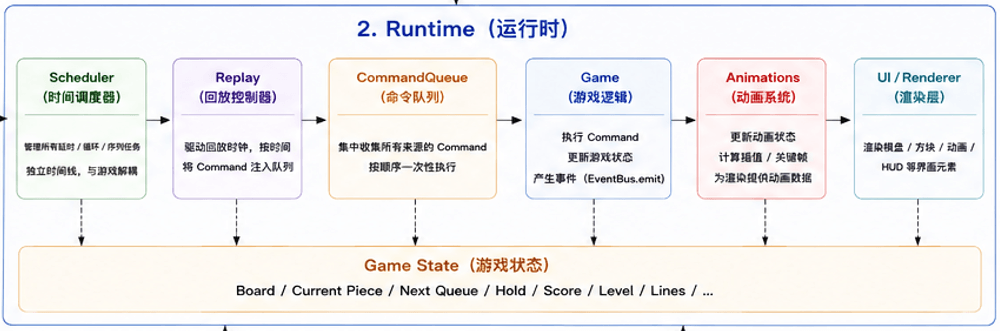
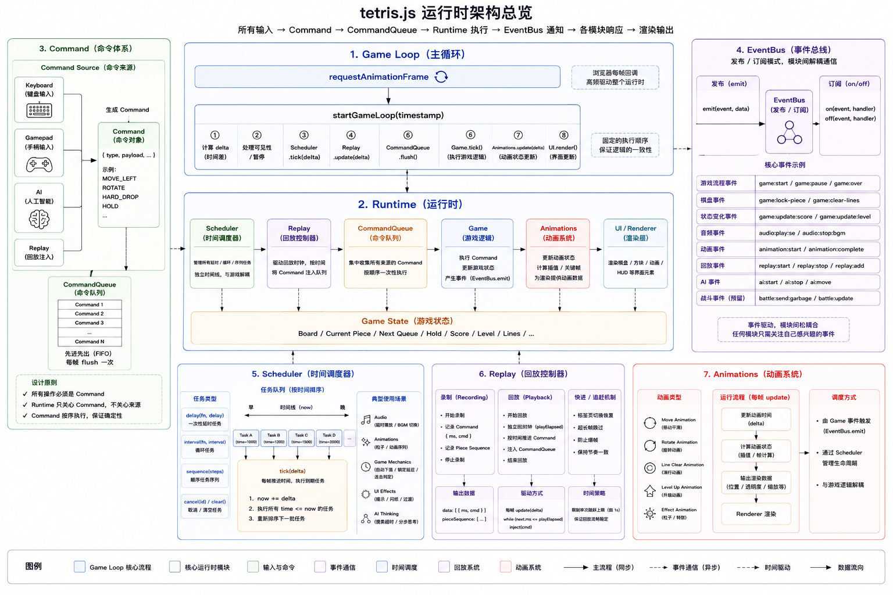
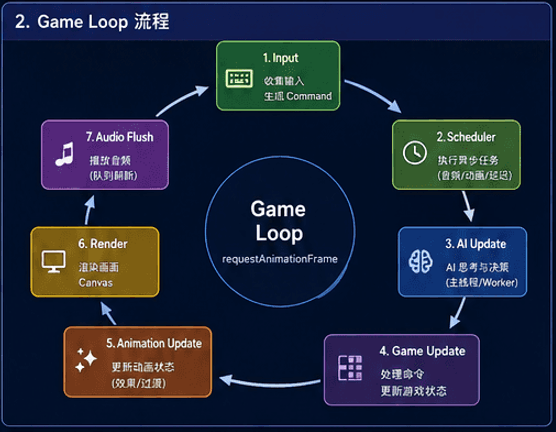

# Runtime

English | [简体中文](./03-runtime.md)

> Runtime is not a module, but the core that coordinates all systems throughout
> the entire game runtime.

## What is Runtime?

Many developers, when first getting into game development (myself included),
start writing game logic directly. For example:

- Listening to keyboard
- Updating the board
- Drawing on Canvas
- Playing audio

As features continue to increase, the code grows. Eventually, a game typically
includes:

- Input
- Game Logic
- Rendering
- Audio
- Animation
- Replay
- AI
- Battle

If these modules call each other directly, the entire project quickly becomes
difficult to maintain. Therefore, a unified organizer is needed. This organizer
is the Runtime.

<p align="center">
    
</p>

It is not responsible for any specific function. Instead, it ensures all systems
work together according to unified rules.

## Runtime Responsibilities

Runtime does not determine how Tetris is played, nor does it handle screen
rendering, nor does it participate in AI search. What it is truly responsible
for is:

- Managing the game lifecycle
- Driving the Game Loop
- Dispatching Commands
- Updating game state
- Scheduling various systems
- Ensuring all modules share the same timeline



In other words, Runtime is more like the brain of the entire game. Other systems
only need to fulfill their own responsibilities, without worrying about how the
entire game is organized and run.

## Why Does a Game Need Runtime?

Consider the simplest Tetris game. The entire flow might be:

```text
setInterval()
↓
Update Board
↓
Canvas Redraw
```

When the project is small, this implementation is sufficient. However, as more
functional modules join:

- AI
- Replay
- Battle
- Scheduler
- Audio
- Animation

The game is no longer just about updating the board. It starts to have more and
more systems that need to work together. Without Runtime, these modules would
eventually become interdependent. The emergence of Runtime is precisely to
decouple them from each other.

## How Does Runtime Organize the Entire Game?

Runtime can be understood as the scheduling center of the entire game. Once the
game starts, all modules work around the Runtime. The entire execution flow can
be simplified as:

```text
Input
↓
Command
↓
Runtime
↓
Gameplay
↓
Store
↓
Renderer
↓
Audio
↓
Animation
```

For Runtime, where a Command comes from doesn't matter. It could come from:

- Keyboard
- Gamepad
- Touch
- Replay
- AI
- Battle

Runtime only cares about one thing: **executing Commands**. Therefore, the
entire game always has only one set of execution flow.

## Game Loop

The core of Runtime is the **Game Loop**. The Game Loop is the heartbeat that
keeps the entire game running continuously. Each cycle, Runtime completes:

1. Process input
2. Execute Commands
3. Update game state
4. Advance game time
5. Schedule Scheduler
6. Update animation
7. Update audio
8. Render the screen

<p align="center">
    
</p>

The entire game continuously runs around this loop. The Game Loop doesn't care
how specific modules are implemented; it is only responsible for organizing the
execution order.

### tetris.js Game Loop Implementation

```js
const Engine = {
  /**
   * # Game Main Loop with Speed Control
   *
   * The core rendering loop driven by `requestAnimationFrame`, controlling the
   * game's drop rhythm, input processing, rendering, and animation updates.
   *
   * ## Frame Loop Flow (per Game instance)
   *
   * | Step | Operation                  | Description                                                         |
   * | ---- | -------------------------- | ------------------------------------------------------------------- |
   * | 1    | `Scheduler.tick()`         | Drives the scheduler, executing due timed tasks (including AI loop) |
   * | 2    | `Replay.syncPlayElapsed()` | Synchronizes replay logical clock                                   |
   * | 3    | `Replay.update()`          | Updates replay system, injecting commands to replay                 |
   * | 4    | `Gamepad.update()`         | Updates gamepad input state                                         |
   * | 5    | `Keyboard.update()`        | Updates keyboard input state                                        |
   * | 6    | `CommandQueue.flush()`     | Executes all pending commands in the command queue                  |
   * | 7    | `Game.tick()`              | Executes game logic (drop/collision/clear), at speed interval       |
   * | 8    | `Animations.flush()`       | Merges/cleans animation queue, removes completed animations         |
   * | 9    | `UI.tickHud()`             | Updates HUD animation (score bounce, combo display)                 |
   * | 10   | `UI.render()`              | Renders game screen (board, pieces, ghost, grid)                    |
   * | 11   | `Animations.render()`      | Overlays animation effects (clear, level-up, garbage warning, etc.) |
   * | 12   | `requestAnimationFrame()`  | Requests next frame, forming the loop                               |
   *
   * ## Fixed Time Step
   *
   * Game logic (drop) is not executed every frame, but controlled by the
   * current level's speed (`Game.getSpeed()`):
   *
   * - Lower levels: slower speed, larger drop interval (~1000ms)
   * - Higher levels: faster speed, smaller drop interval (minimum 120ms)
   *
   * ## Two-Player Battle
   *
   * Each Game uses an independent time accumulator (gameAccumulators Map),
   * allowing each Game to independently calculate drop timing without
   * interference. P1 may be at level 5 (fast), P2 at level 2 (slow), each
   * dropping at their own pace.
   *
   * @param {number} timestamp - Current timestamp from requestAnimationFrame
   *   (milliseconds)
   * @returns {void}
   */
  tick: (timestamp) => {
    const { Games, Scheduler } = Engine;

    // Initialize time base on first run, setting initial accumulator timestamp for each Game instance
    if (!Engine.lastTickTime) {
      Engine.lastTickTime = timestamp;

      for (const Game of Games) {
        Engine.gameAccumulators.set(Game, timestamp);
      }
    }

    // Update last frame timestamp for subsequent delta time calculation
    Engine.lastTickTime = timestamp;

    /*
     * ==================== Step 1: Drive Scheduler ====================
     *
     * Executes all due timed tasks (delay, interval, sequence).
     * This includes:
     * - AI decision loop (AIController.loop)
     * - Audio sequences
     * - Animation timing (e.g., garbage warning blink timer)
     *
     * AI's loop is triggered here by Scheduler, not in Game.tick.
     */
    Scheduler.tick(timestamp);

    /* ==================== Steps 2-11: Frame Update for Each Game Instance ==================== */
    for (const Game of Games) {
      Game.flush(timestamp, Engine.lastTickTime, Engine.gameAccumulators);
    }

    // Update global logical time base
    Engine.fixedAccumulator = timestamp;

    // Step 12: Request next frame, forming the game loop
    Engine.rafId = requestAnimationFrame(Engine.tick);
  },
};
```

As you can see, tetris.js's Game Loop is very clean — it's a core rendering loop
driven by `requestAnimationFrame`. It truly does not care about how specific
modules are implemented; it is only responsible for organizing the execution
order:

- Scheduler: Responsible for executing timed tasks
- Game.flush: Frame update for each Game instance

### flush: The Core of Runtime

```js
import tick from '@/lib/game/logic/tick.js';

const flush = (runtime, timestamp, lastTickTime, gameAccumulators) => {
  // Destructure all submodules of the current Game instance for subsequent steps
  const { UI, Replay, Gamepad, Keyboard, Animations, CommandQueue } = runtime;

  /*
   * ==================== Step 1: Check Blocking Animations ====================
   *
   * Checks if there are any blocking animations playing. Blocking animations include:
   * - clear-lines: Line clear animation playing
   * - countdown: Countdown animation playing
   * - level-up: Level-up effect playing
   *
   * During blocking:
   * - Replay clock pauses (syncPlayElapsed receives isBlocked)
   * - Game logic may skip (tick receives isBlocked)
   * - Input is ignored (checked in dispatchInput)
   */
  const isBlocked = Animations.hasBlocking();

  /*
   * ==================== Step 2: Synchronize Replay Logical Clock ====================
   *
   * Synchronizes the replay system's logical clock based on current timestamp and blocking state.
   *
   * Replay clock的作用:
   * - Records actual game runtime (excluding blocking and pause)
   * - Replays re-execute recorded inputs based on this clock
   *
   * Replay clock pauses during blocking to ensure the replay timeline matches actual game experience.
   */
  Replay.syncPlayElapsed({
    timestamp: lastTickTime,
    isBlocked,
  });

  /*
   * ==================== Step 3: Replay Update ====================
   *
   * Updates the replay system. If currently in replay mode (Replay.playing === true),
   * the replay system injects input commands at the corresponding timestamps into CommandQueue
   * based on the recorded timeline.
   *
   * The speed parameter controls playback speed (speed multiplier).
   */
  Replay.update({
    speed: runtime.getSpeed(),
    timestamp: lastTickTime,
  });

  /*
   * ==================== Step 4: Gamepad State Update ====================
   *
   * Reads the latest gamepad input state (buttons, joystick, D-pad).
   * Uses optional chaining (?.) for safe calls, skips if device doesn't exist.
   *
   * Gamepad input is converted to game commands and enters CommandQueue,
   * executed uniformly in step 6.
   */
  Gamepad?.update?.(timestamp);

  /*
   * ==================== Step 5: Keyboard State Update ====================
   *
   * Reads the latest keyboard input state.
   * Uses optional chaining (?.) for safe calls, skips if device doesn't exist.
   *
   * Keyboard input is converted to game commands and enters CommandQueue,
   * executed uniformly in step 6.
   */
  Keyboard?.update?.();

  /*
   * ==================== Step 6: Execute Command Queue ====================
   *
   * Executes all commands accumulated this frame (from keyboard, gamepad, AI, replay)
   * at once, ensuring all inputs take effect within the same frame.
   *
   * ### Command Sources
   *
   * - Keyboard input: Arrow keys for movement, space for hard drop, ESC for pause, etc.
   * - Gamepad input: ABXY buttons, D-pad direction keys, joystick
   * - AI input: Commands sent after AIController.loop() decision
   * - Replay input: Recorded commands injected by Replay.update()
   *
   * ### Battle Mode Event Isolation
   *
   * Each Game's CommandQueue uses an independent UUID event scope:
   * `command:queue:<uuid>:enqueue`
   *
   * This ensures:
   * - AI commands only enter AI Game's CommandQueue
   * - Human commands only enter Human Game's CommandQueue
   * - No cross-contamination of commands in two-player battles
   */
  CommandQueue.flush();

  /*
   * ==================== Step 7: Game Logic Update ====================
   *
   * Gets the current Game's time accumulator. The accumulator records the timestamp
   * when game logic was last executed. By comparing the difference between current time
   * and last execution time, determines whether to execute this logic update.
   *
   * ### Fixed Time Step Mechanism
   *
   * Game logic (gravity drop, collision detection, locking, line clearing) is not executed
   * every frame, but controlled by the current level's speed (this.getSpeed()).
   *
   * Executes only when all the following conditions are met:
   * 1. Not in replay (replay is driven by Replay.update, doesn't use gravity drop logic)
   * 2. Time since last logic update >= current level's drop interval
   *
   * This implements level-based drop speed control:
   * - Level 1: ~1000ms per tick (about every 16 frames)
   * - Level 10: ~200ms per tick (every 3-4 frames)
   * - Level 20+: ~120ms per tick (every 2 frames)
   */
  // Get current Game's time accumulator, use current timestamp on first run
  const accumulator = gameAccumulators.get(runtime) || timestamp;
  // Calculate time difference since last logic update
  const stepDelta = timestamp - accumulator;

  if ((!accumulator || stepDelta > runtime.getSpeed()) && !Replay.playing) {
    /*
     * Execute game logic:
     * - Gravity drop: Piece moves down one cell
     * - Collision detection: Checks overlap with existing pieces or boundaries
     * - Lock: Piece locks to board when reaching bottom
     * - Line clear: Detects and clears full rows
     * - Spawn new piece: Takes next piece from 7-bag
     *
     * isBlocked parameter passed to tick; may skip certain logic during blocking animations.
     */
    tick(runtime, isBlocked);

    // Update accumulator timestamp, recording the time of this logic update
    gameAccumulators.set(runtime, timestamp);
  }

  /*
   * ==================== Step 8: Merge/Clean Animation Queue ====================
   *
   * AnimationSystem.flush() performs:
   * - Removes completed (disposed === true) animation instances
   * - Merges animations on the same layer
   * - Cleans expired references
   *
   * This operation runs every frame, ensuring the animation queue doesn't grow indefinitely.
   */
  Animations.flush();

  /*
   * ==================== Step 9: Update HUD Animation ====================
   *
   * UI.tickHud() updates HUD element animation states:
   * - Score bounce animation (numbers zoom in then back when scoring)
   * - Combo display animation (Combo text fades in/out)
   * - Timer update (game runtime)
   *
   * HUD animation is independent of game logic, updated every frame.
   */
  UI.tickHud();

  /*
   * ==================== Step 10: Render Game Screen ====================
   *
   * UI.render() draws the game screen:
   * - Board background grid
   * - Locked pieces
   * - Current active piece
   * - Ghost piece (preview landing position)
   * - Board border
   *
   * Rendering order from bottom to top ensures correct layering.
   */
  UI.render();

  /*
   * ==================== Step 11: Overlay Render Animation Effects ====================
   *
   * Animations.render() overlays all active animations on the game screen:
   * - Clear flash (ClearLinesAnimation)
   * - Level-up fireworks (LevelUpAnimation)
   * - Garbage warning (GarbageWarningAnimation)
   * - Garbage push flash (GarbagePushAnimation)
   * - Landing highlight (LandingFlashAnimation)
   * - Pause breathing light (PausedAnimation)
   *
   * Animations are rendered sorted by layer, higher layer animations cover lower ones.
   */
  Animations.render();
};

export default flush;
```

As you can see, flush is the core logic of the Game Loop, executing a complete
frame update for the current Game instance through all processes.

## Command Dispatch

All operations in Runtime are ultimately converted into Commands. For example:

- Move Left
- Move Right
- Rotate
- Hard Drop
- Hold
- Pause

Taking user key operations as an example, when the user presses a button, the
Keyboard Controller listens to the `keydown` event:

```js
_onKeydown = (e) => {
  const { Game, Store, Player } = this;
  // Get key identifier and convert to lowercase
  const key = e.key?.toLowerCase();

  // Skip if keyboard is disabled or no key
  if (!key || this.disabled) {
    return this;
  }

  // Resolve the action corresponding to the key
  const action = resolveKeyboardAction(key);

  // Skip if key is blocked or no action
  if (this._isBlocked(key) || !action) {
    return this;
  }

  /**
   * Battle mode: AI players skip in playing state. Note: This rechecks AI
   * player condition, forming double protection with _isBlocked check.
   */
  if (Store.getMode() === 'playing' && Player.name === 'ai') {
    return this;
  }

  /**
   * Left/right arrow keys: Start DAS/ARR auto-repeat movement.
   *
   * When left/right key is pressed:
   *
   * - Set movement direction
   * - Reset DAS/ARR timers
   * - Mark as keyboard triggered
   *
   * The first frame of movement is executed immediately below.
   */
  if (key === 'arrowleft') {
    this.dasState.direction = -1; // Move left
    this.dasState.dasTimer = 0; // Start DAS timer
    this.dasState.arrTimer = 0; // Reset ARR timer
    this.dasState.active = true; // Mark as keyboard triggered
  } else if (key === 'arrowright') {
    this.dasState.direction = 1; // Move right
    this.dasState.dasTimer = 0; // Start DAS timer
    this.dasState.arrTimer = 0; // Reset ARR timer
    this.dasState.active = true; // Mark as keyboard triggered
  }

  const events = GameEvents(Game.id);

  /**
   * Execute first movement immediately. Whether it's a direction key or not,
   * first key press responds immediately without waiting for DAS delay.
   */
  this.emit(events.DISPATCH_INPUT, {
    device: 'keyboard',
    action,
    payload: { Game },
  });

  return this;
};
```

Through `resolveKeyboardAction`, user key presses are matched to game commands:

```js
const resolveKeyboardAction = (key, mode) => {
  // Empty key value returns directly to avoid invalid processing
  if (!key) {
    return;
  }

  // Unify conversion to lowercase for case-insensitive matching
  const normalizedKey = key.toLowerCase();

  /**
   * Dynamically adjust behavior of the up arrow key based on game mode:
   *
   * - Selection interface (game-mode / battle-mode / exit-game): ↑ used to move
   *   cursor
   * - In-game (playing): ↑ used to rotate piece
   *
   * Other modes maintain default mapping (ROTATE).
   */
  if (mode === 'game-mode' || mode === 'battle-mode' || mode === 'exit-game') {
    KEYBOARDS_ACTION_MAP.arrowup = 'MOVE_UP';
  } else if (mode === 'playing') {
    KEYBOARDS_ACTION_MAP.arrowup = 'ROTATE';
  }

  // Look up the corresponding action command from the mapping table
  return KEYBOARDS_ACTION_MAP[normalizedKey];
};
```

The key here is mapping key commands through `KEYBOARDS_ACTION_MAP`:

```js
const KEYBOARDS_ACTION_MAP = {
  // Force quit/back
  escape: 'EXIT',

  // ========== Piece Operations ==========
  arrowleft: 'MOVE_LEFT', // Move piece left
  arrowright: 'MOVE_RIGHT', // Move piece right
  arrowdown: 'MOVE_DOWN', // Speed up downward movement (soft drop)
  arrowup: 'ROTATE', // Rotate piece (or move cursor up in menus)
  ' ': 'DROP', // Space key: piece drops directly to bottom (hard drop)

  // ========== Game Control ==========
  s: 'SWITCH_CONTROLLER', // Switch controller (player ↔ AI)
  m: 'TOGGLE_MUSIC', // Toggle music
  p: 'TOGGLE_PAUSED', // Pause/resume game
  r: 'RESTART', // Restart game
  q: 'QUIT', // Quit game

  // ========== Hold Piece ==========
  c: 'HOLD', // Store current piece in Hold area

  // ========== Level Selection ==========
  1: 'LEVEL_ONE', // Level 1
  2: 'LEVEL_TWO', // Level 2
  3: 'LEVEL_THREE', // Level 3
  4: 'LEVEL_FOUR', // Level 4
  5: 'LEVEL_FIVE', // Level 5
  6: 'LEVEL_SIX', // Level 6
  7: 'LEVEL_SEVEN', // Level 7
  8: 'LEVEL_EIGHT', // Level 8
  9: 'LEVEL_NINE', // Level 9
  t: 'LEVEL_TEN', // T key: Level 10

  // ========== Difficulty Selection ==========
  e: 'EASY', // Easy difficulty
  n: 'NORMAL', // Normal difficulty
  h: 'HARD', // Hard difficulty
  x: 'EXPERT', // Expert difficulty

  // ========== Interface Navigation ==========
  b: 'BACK', // Go back
  enter: 'CONFIRM', // Confirm action
};
```

The generation of Command is handled by the handler listening to the
`events.DISPATCH_INPUT` event:

```js
const Engine = {
  // Other logic omitted...
  _onDispatchInput: (input) => {
    const { payload } = input;
    const { Game } = payload;
    const { Animations, Replay } = Game;

    // Check if there are blocking animations (clear lines, countdown, level-up) — input ignored
    const isBlocked = Animations.hasBlocking([
      'clear-lines',
      'countdown',
      'level-up',
    ]);

    // Calculate replay time offset: current time - replay start time
    const ms = Engine.lastTickTime - Replay.startTime;

    // Dispatch input event to corresponding input handler
    dispatchInput(input, {
      isBlocked,
      ms,
    });
  },
};
```

Finally, `dispatchInput` converts the command into a Command:

```js
const dispatchInput = (input, context) => {
  const { action, payload } = input;
  const { isBlocked, ms } = context;

  /**
   * ======== Input Interception Layer ========
   *
   * Blocks all inputs during the following key animations:
   *
   * - Countdown: Prevents player operations before countdown ends
   * - Level-up: Prevents misoperations during level-up effects
   *
   * Also filters out empty actions (unmapped keys, etc.)
   */
  if (isBlocked || !action) {
    return;
  }

  /** ======== Command Building ======== */
  const { Game } = payload;
  // Wraps raw input into a standard Command object
  const cmd = new Command(action, payload);
  const uuid = Game.id;
  const CE = CommandEvents(uuid);
  const RE = ReplayEvents(uuid);

  /** ======== Enqueue Execution ======== */
  // Pushes Command into the command queue, waiting for later flush execution
  Game.emit(CE.ENQUEUE, { cmd });

  /**
   * ======== Replay Recording Layer ========
   *
   * If replay recording is enabled, writes Command and timestamp to replay
   * data. ms is the pure play duration after subtracting pause time.
   *
   * Note: This is a side-effect, but temporarily kept in dispatcher, may be
   * extracted as a separate replay middleware in the future.
   */
  Game.emit(RE.ADD_RECORD, {
    ms,
    cmd,
  });
};
```

These Commands have no concept of source. They may come from:

- Players
- Replay
- AI

### Commands Generated by Replay

Replay generates `AUTO_TICK` commands during automatic piece drops:

```js
const tick = (runtime, isBlocked) => {
  const mode = runtime.Store.getMode();

  /**
   * ======== Step 1: Mode Check ========
   *
   * Don't execute drops in non-playing/replay modes, or during animation
   * blocking.
   */
  if ((mode !== 'playing' && mode !== 'replay') || isBlocked) {
    return;
  }

  const AE = AudioEvents();
  const GE = GameEvents(runtime.id);

  /**
   * ======== Step 2: Replay Recording ========
   *
   * Records auto drops to the replay system in playing mode.
   */
  if (mode === 'playing') {
    runtime.emit(GE.DISPATCH_INPUT, {
      device: 'replay',
      action: 'AUTO_TICK',
      payload: { Game: runtime },
    });
  }
  // Other logic omitted...
};
```

### Commands Generated by AI

After AI completes board decision calculations, it also generates game commands:

```js
loop = () => {
  if (!this.enabled) {
    return;
  }

  const { Game, Animations, Scheduler } = this;
  const state = Game.Store.getState();

  /*
   * ==================== State Check ====================
   *
   * Game interrupted (non-playing mode) or animation blocked, retry after 100ms.
   * Blocking animations include: clear lines, countdown, level-up, etc.
   * During these animations, pieces cannot be operated, AI should wait.
   */
  if (state.mode !== 'playing' || Animations.hasBlocking()) {
    this.aiSchedulerId = Scheduler.delay(this.loop, 100);
    return;
  }

  const difficulty = this.getDifficultyConfig();

  /*
   * ==================== Decision Phase ====================
   *
   * When action queue is empty (previous actions all completed) and Worker is idle,
   * initiate a new AI decision.
   *
   * think() returns the best move object { x, y, placeOn, actions },
   * shallow copies the actions array to this.actions queue.
   *
   * Currently using main thread synchronous mode: think() returns result directly.
   * In Worker mode (!this.worker is false),
   * think() returns undefined, result filled asynchronously by _onWorkerMessage.
   */
  if (this.actions.length === 0 && !this.workerBusy) {
    const best = this.think(state, difficulty);

    if (!this.worker) {
      this.actions = best ? [...best.actions] : [];
    }
  }

  /*
   * ==================== Action Execution Phase ====================
   *
   * Takes one action from the queue head to execute.
   * Only executes one action per frame, ensuring sequential execution.
   *
   * If queue is empty but Worker is still calculating, continue waiting (Worker mode).
   * If queue is empty and not calculating, this round's decision produced no actions, return directly.
   */
  const action = this.actions.shift();

  // No action but Worker is still calculating, continue waiting
  if (!action && this.workerBusy) {
    this.aiSchedulerId = Scheduler.delay(this.loop, difficulty.delay);
    return;
  }

  if (!action) {
    return;
  }

  /*
   * ==================== Send Action ====================
   *
   * Sends action through Game ID-isolated dispatch:input event.
   *
   * Event name format: game:<uuid>:dispatch:input
   * Engine._subscribe() subscribes separately to this event for each Game instance,
   * ensuring human Game doesn't receive AI input in Battle mode.
   *
   * Event flow:
   *   emit(DISPATCH_INPUT)
   *   → Engine._onDispatchInput
   *   → dispatchInput()
   *   → CommandQueue.enqueue()
   *   → CommandQueue.flush()
   *   → cmd.execute()
   *   → dispatchCommand()
   *   → action handler (e.g., GAME_PLAYING_ACTIONS.DROP)
   */
  const events = GameEvents(Game.id);

  this.emit(events.DISPATCH_INPUT, {
    device: 'ai',
    action,
    payload: { Game },
  });

  /*
   * ==================== Schedule Next Loop ====================
   *
   * Delay time uses difficulty configuration delay:
   * - Easy: 480ms
   * - Normal: 380ms
   * - Hard: 200ms
   * - Expert: 130ms
   *
   * Note: loop() triggers every 200ms (Hard), but executes only one action per frame.
   * This means AI can execute about 12 frames ≈ 12 actions within 200ms (if action sequence is long enough).
   * In reality, action sequences are usually 4-8 actions, completed before the next loop trigger.
   */
  this.aiSchedulerId = Scheduler.delay(this.loop, difficulty.delay);
};
```

Runtime executes them sequentially through Command Queue according to unified
rules:

```js
class CommandQueue extends Base {
  // Other logic omitted...
  /**
   * ## Execute and clear all Commands in the queue
   *
   * Executes commands one by one in enqueue order (FIFO), queue empty after
   * execution. Current implementation executes all commands at once without
   * time-slicing control.
   *
   * @returns {void}
   */
  flush() {
    const { queue } = this;

    // Loop to take command from queue head and execute
    while (queue.length > 0) {
      const cmd = queue.shift();
      cmd.execute();
    }
  }
}
```

Now let's look at the Command execution logic:

```js
class Command extends Base {
  // Other logic omitted...
  /**
   * ## Execute command
   *
   * Hands the command to the unified dispatch system through the
   * `dispatch:command` event. Command itself does not execute business logic;
   * it only notifies the scheduling system that "an operation needs to be
   * performed."
   *
   * ### Execution Flow
   *
   * 1. Command sends `dispatch:command` event through EventBus
   * 2. Engine layer listens to this event, calls `dispatchCommand` function
   * 3. `dispatchCommand` routes to corresponding action handler based on current
   *    game mode
   * 4. Action handler executes business logic (e.g., moving piece, pausing game,
   *    etc.)
   *
   * @example
   *   const cmd = new Command('ROTATE', { Game: game });
   *   cmd.execute(); // Triggers a rotate operation
   *
   * @returns {void}
   */
  execute() {
    const { action, payload } = this;
    const { Game } = payload;
    const events = GameEvents(Game.id);

    /*
     * Send dispatch:command event through EventBus:
     *
     * Engine._subscribe() listens to this event and calls dispatchCommand to handle it
     */
    this.emit(events.DISPATCH_COMMAND, {
      action,
      payload,
    });
  }
}
```

Finally, `dispatchCommand` maps commands and triggers actual handling logic:

```js
import GAME_MODE_ACTIONS from '@/lib/game/actions/game-mode-actions.js';
import BATTLE_MODE_ACTIONS from '@/lib/game/actions/battle-mode-actions.js';
import MAIN_MENU_ACTIONS from '@/lib/game/actions/main-menu-actions.js';
import DIFFICULT_ACTIONS from '@/lib/game/actions/difficulty-actions.js';
import GAME_PLAYING_ACTIONS from '@/lib/game/actions/game-playing-actions.js';
import PAUSED_ACTIONS from '@/lib/game/actions/paused-actions.js';
import GAME_OVER_ACTIONS from '@/lib/game/actions/game-over-actions.js';
import REPLAY_ACTIONS from '@/lib/game/actions/replay-actions.js';
import BATTLE_OVER_ACTIONS from '@/lib/game/actions/battle-over-actions.js';
import EXIT_GAME_ACTIONS from '@/lib/game/actions/exit-game-actions.js';

/**
 * # State → Action Mapping Table
 *
 * Maps each game mode to its corresponding action handler set. This is the core
 * of **State Machine Router**: determining which operations are legal based on
 * current game state.
 *
 * ## Design Patterns
 *
 * - **State Machine Router**: mode determines legal operation set
 * - **Command Dispatcher**: action name determines which handler to execute
 *
 * ## Mode and Action Set Correspondence
 *
 * | mode          | Action Set           | Description                                   |
 * | ------------- | -------------------- | --------------------------------------------- |
 * | `game-mode`   | GAME_MODE_ACTIONS    | Game mode selection: Single/Battle            |
 * | `battle-mode` | BATTLE_MODE_ACTIONS  | Battle type selection: VS AI / VS HUMAN       |
 * | `main-menu`   | MAIN_MENU_ACTIONS    | Main menu: Level selection                    |
 * | `difficulty`  | DIFFICULT_ACTIONS    | Difficulty selection: easy/normal/hard/expert |
 * | `playing`     | GAME_PLAYING_ACTIONS | In-game: move, rotate, hard drop, etc.        |
 * | `paused`      | PAUSED_ACTIONS       | Paused: resume, restart, exit                 |
 * | `exit-game`   | EXIT_GAME_ACTIONS    | Exit menu: resume game, exit game             |
 * | `game-over`   | GAME_OVER_ACTIONS    | Game over: restart, exit                      |
 * | `replay`      | REPLAY_ACTIONS       | Replaying: watch, confirm exit                |
 * | `battle-over` | BATTLE_OVER_ACTIONS  | Battle over: rematch                          |
 *
 * ### exit-game mode
 *
 * In Single mode, press ESC to trigger, displaying exit menu overlay:
 *
 * - RESUME GAME: Close menu, restore playing mode
 * - EXIT GAME: Exit to game mode selection interface (game-mode)
 *
 * In Battle mode, ESC triggers surrender, not this mode.
 *
 * @constant {object} ACTIONS_MAP
 */
const ACTIONS_MAP = {
  'game-mode': GAME_MODE_ACTIONS,
  'battle-mode': BATTLE_MODE_ACTIONS,
  'main-menu': MAIN_MENU_ACTIONS,
  difficulty: DIFFICULT_ACTIONS,
  playing: GAME_PLAYING_ACTIONS,
  paused: PAUSED_ACTIONS,
  replay: REPLAY_ACTIONS,
  'game-over': GAME_OVER_ACTIONS,
  'battle-over': BATTLE_OVER_ACTIONS,
  'exit-game': EXIT_GAME_ACTIONS,
};

/**
 * # Command Dispatcher
 *
 * Routes Commands to the corresponding action handler based on current game
 * state (mode).
 *
 * ## Core Responsibilities
 *
 * - **Does not execute business logic**: dispatchCommand itself contains no game
 *   operation logic
 * - **Only responsible for routing + dispatching**: finds action set based on
 *   mode, then finds handler based on action name
 * - **State isolation**: Same action name can have different behaviors in
 *   different modes (e.g., arrow keys in main-menu vs playing)
 *
 * ## Execution Flow
 *
 * 1. Extract `action` and `payload` from Command
 * 2. Look up corresponding action handler set based on `mode`
 * 3. If current mode has no defined actions, ignore the command
 * 4. Find handler based on `action` name
 * 5. If handler exists, call with `payload`
 *
 * ### Example: Routing in exit-game mode
 *
 *     dispatchCommand(cmd, { mode: 'exit-game' })
 *       → ACTIONS_MAP['exit-game'] → EXIT_GAME_ACTIONS
 *         → EXIT_GAME_ACTIONS['MOVE_UP'] → Move cursor to RESUME GAME
 *         → EXIT_GAME_ACTIONS['MOVE_DOWN'] → Move cursor to EXIT GAME
 *         → EXIT_GAME_ACTIONS['CONFIRM'] → Execute current option (resume or exit)
 *
 * @example
 *   // Execute left move command in playing mode
 *   const cmd = new Command('MOVE_LEFT', { Game: gameInstance });
 *   dispatchCommand(cmd, { mode: 'playing' });
 *   // Routes to GAME_PLAYING_ACTIONS['MOVE_LEFT'](payload)
 *
 * @function dispatchCommand
 * @param {object} cmd - Command to execute
 * @param {object} options - Extended parameter object
 * @param {string} options.mode - Current game mode for routing
 * @returns {void}
 */
const dispatchCommand = (cmd, options) => {
  const { mode } = options;
  const { action, payload } = cmd;

  // Get action set corresponding to current mode
  const actions = ACTIONS_MAP[mode];

  // If current state has no defined actions, ignore
  if (!actions) {
    return;
  }

  // Find handler based on command action
  const handler = actions[action];

  // Execute handler (if exists): using optional chaining, safely skip if handler is undefined
  handler?.(payload);
};

export default dispatchCommand;
```

As you can see, whether from Replay or AI, they all fully share the same
execution flow, without needing to implement their own logic separately.

## Store

Runtime does not directly store all data. The actual game state is managed by
Store. For example:

- Board
- Current Piece
- Hold
- Next Queue
- Score
- Level
- Combo
- Back-to-Back

### GameState

tetris.js uses GameState to save game state information:

```js
const GameState = {
  /**
   * ## Game mode selection index
   *
   * Cursor position in the game mode selection interface (game-mode). Used for
   * moving up and down to select different game modes.
   *
   * - `0`: Single mode (SINGLE)
   * - `1`: Versus mode (VERSUS)
   *
   * @default 0
   * @type {number}
   */
  modeIndex: 0,

  /**
   * ## Battle mode selection index
   *
   * Cursor position in the battle mode selection interface (battle-mode). Used
   * for moving up and down to select different battle types.
   *
   * - `0`: Human vs AI
   * - `1`: Human vs Human
   *
   * @default 0
   * @type {number}
   */
  battleIndex: 0,

  /**
   * ## Exit game selection index
   *
   * Cursor position in the exit game menu interface (exit-game). Used for
   * moving up and down to select different exit options.
   *
   * - `0`: RESUME GAME
   * - `1`: EXIT GAME
   *
   * @default 0
   * @type {number}
   */
  exitIndex: 0,

  /*
   * ==================== Controller ====================
   */

  /**
   * ## Current controller identity
   *
   * Identifies who is currently controlling game operations.
   *
   * - `'human'`: Human player (keyboard, gamepad, touch)
   * - `'ai'`: AI auto-operation
   *
   * Can be toggled by pressing S key (keyboard) or RB button (gamepad).
   *
   * @default 'human'
   * @type {string}
   */
  controller: 'human',

  /*
   * ==================== Board Data ====================
   */

  /**
   * ## Initial board data at game start
   *
   * Used to restore initial state in replay mode. Set to initial board in
   * `setBeginningState()`, then not modified.
   *
   * @default [ ]
   * @type {string[][]}
   */
  beginningBoard: [],

  /**
   * ## Game board
   *
   * 20 rows × 10 columns 2D array. Each cell value is a color string (e.g.,
   * `"#00c8ff"`), empty string `""` represents empty cell. Board bottom is row
   * 19, top is row 0.
   *
   * @default [ ]
   * @type {string[][]}
   */
  board: [],

  /*
   * ==================== Piece Data ====================
   */

  /**
   * ## Current active piece object
   *
   * Contains piece shape, position (cx, cy), color, etc. `null` means no active
   * piece (game not started or piece locked).
   *
   * @default null
   * @type {object | null}
   */
  curr: null,

  /**
   * ## Current piece X coordinate (column index)
   *
   * Column position of the piece's top-left corner on the board. Usually 0-9.
   *
   * @default 0
   * @type {number}
   */
  cx: 0,

  /**
   * ## Current piece Y coordinate (row index)
   *
   * Row position of the piece's top-left corner on the board. 0 is the top of
   * the board.
   *
   * @default 0
   * @type {number}
   */
  cy: 0,

  /**
   * ## Next preview piece object
   *
   * When current piece locks, `next` piece becomes the new `curr` piece. `null`
   * means not yet generated.
   *
   * @default null
   * @type {object | null}
   */
  next: null,

  /**
   * ## Hold piece object
   *
   * Players can store the current piece in the hold area via Hold operation.
   * Retrieved on next Hold operation. `null` means hold area is empty.
   *
   * @default null
   * @type {object | null}
   */
  hold: null,

  /*
   * ==================== Special Clears ====================
   */

  /**
   * ## T-Spin detection result
   *
   * Records whether the last operation triggered T-Spin.
   *
   * - `{ isTSpin: true, isTSpinMini: false }`: Standard T-Spin
   * - `{ isTSpin: false, isTSpinMini: true }`: T-Spin Mini
   * - `null`: T-Spin not triggered
   *
   * @default null
   * @type {object | null}
   */
  tSpin: null,

  /**
   * ## Back-to-Back consecutive special clear flag
   *
   * Triggered when two consecutive clears are special clears (T-Spin or
   * Tetris). Grants additional score bonus.
   *
   * @default false
   * @type {boolean}
   */
  backToBack: false,

  /*
   * ==================== Score Data ====================
   */

  /**
   * ## Current score
   *
   * Accumulated after each clear based on number of cleared lines and current
   * level.
   *
   * @default 0
   * @type {number}
   */
  score: 0,

  /**
   * ## Total lines cleared
   *
   * Sum of all cleared lines, used to calculate level progression.
   *
   * @default 0
   * @type {number}
   */
  lines: 0,

  /**
   * ## Current level
   *
   * Starts from 1, max 256. Higher levels mean faster drop speed and higher
   * score multiplier.
   *
   * @default 1
   * @type {number}
   */
  level: 1,

  /**
   * ## Combo count
   *
   * Number of consecutive clears. Each clear increments combo by 1, reset to 0
   * when no clear. Higher combo gives more bonus points.
   *
   * @default 0
   * @type {number}
   */
  combo: 0,

  /**
   * ## Combo cumulative score
   *
   * Bonus points accumulated in the current combo sequence.
   *
   * @default 0
   * @type {number}
   */
  comboScore: 0,

  /**
   * ## All-time high score
   *
   * Loaded from localStorage, updated when current score exceeds it at game
   * over.
   *
   * @default 0
   * @type {number}
   */
  highScore: 0,

  /*
   * ==================== Level System ====================
   */

  /**
   * ## Base lines for leveling
   *
   * Used to calculate level progression progress. Lines needed for level up =
   * baseLines + levelUpSteps. After each level up, baseLines updates to current
   * lines value.
   *
   * @default 0
   * @type {number}
   */
  baseLines: 0,

  /**
   * ## Lines needed per level up
   *
   * Initially 10 lines, gradually increases with level, max 60 lines per level.
   *
   * @default 10
   * @type {number}
   */
  levelUpSteps: 10,

  /*
   * ==================== Clear Data ====================
   */

  /**
   * ## Current full row indices to clear
   *
   * Stores all filled row indices that need to be cleared. Cleared after clear
   * animation completes.
   *
   * @default [ ]
   * @type {number[]}
   */
  clearLines: [],

  /*
   * ==================== Game Settings ====================
   */

  /**
   * ## Game difficulty
   *
   * Affects initial garbage rows and AI behavior.
   *
   * - `'easy'`: Easy (0 initial garbage rows)
   * - `'normal'`: Normal (3 initial garbage rows)
   * - `'hard'`: Hard (6 initial garbage rows)
   * - `'expert'`: Expert (9 initial garbage rows)
   *
   * @default 'easy'
   * @type {string}
   */
  difficulty: 'easy',

  /**
   * ## Game mode
   *
   * Identifies the current phase/interface of the game.
   *
   * - `'game-mode'`: Game mode selection (Single/Battle)
   * - `'battle-mode'`: Battle mode selection (VS AI / VS HUMAN)
   * - `'main-menu'`: Main menu/Level selection
   * - `'difficulty'`: Difficulty selection
   * - `'playing'`: In-game
   * - `'paused'`: Game paused
   * - `'game-over'`: Game over
   * - `'replay'`: Replay
   *
   * @default 'game-mode'
   * @type {string}
   */
  mode: 'game-mode',

  /*
   * ==================== Peripheral State ====================
   */

  /**
   * ## Gamepad connected status
   *
   * Used for UI display of gamepad connection status and notifications.
   *
   * @default false
   * @type {boolean}
   */
  gamepadConnected: false,
};

export default GameState;
```

### GameStore Operations on GameState Data

However, tetris.js does not directly manipulate GameState. Instead, it uses the
dedicated GameStore module to manage GameState data operations:

```js
import placeGarbageOnBoard from '@/lib/state/utils/place-garbage-on-board.js';
import isFunction from '@/lib/utils/types/is-function.js';

class GameStore {
  constructor(options) {
    this.initialize(options);
  }

  initialize(options) {
    const { GameState, cols, rows } = options;

    this.defaults = structuredClone(GameState);
    this.options = { cols, rows };
    this.state = structuredClone(GameState);
  }

  getState() {
    return this.state;
  }

  setState(patch) {
    this.state = {
      ...this.state,
      ...(isFunction(patch) ? patch(this.state) : patch),
    };
  }

  resetState() {
    this.state = structuredClone(this.defaults);
  }

  getModeIndex() {
    return this.state.modeIndex;
  }

  setModeIndex(index) {
    this.state.modeIndex = index;
  }

  getBattleIndex() {
    return this.state.battleIndex;
  }

  setBattleIndex(index) {
    this.state.battleIndex = index;
  }

  getExitIndex() {
    return this.state.exitIndex;
  }

  setExitIndex(index) {
    this.state.exitIndex = index;
  }

  getBoard() {
    return this.state.board;
  }

  resetBoard() {
    const { cols, rows } = this.options;

    this.state.board = Array.from({ length: rows }, () =>
      Array.from({ length: cols }).fill(0),
    );
  }

  generateBoard() {
    const DIFFICULTY_GARBAGE_ROWS = {
      easy: 0,
      normal: 3,
      hard: 6,
      expert: 9,
    };

    const { options, state } = this;
    const { board, difficulty } = state;

    const garbageRows = DIFFICULTY_GARBAGE_ROWS[difficulty] || 0;

    placeGarbageOnBoard(board, garbageRows, options.cols);

    return board;
  }

  setBeginningBoard(board) {
    this.state.beginningBoard = structuredClone(board);
  }

  getBeginningBoard() {
    return structuredClone(this.state.beginningBoard);
  }

  getController() {
    return this.state.controller;
  }

  setController(controller) {
    this.state.controller = controller;
  }

  setGamepadConnected(connected) {
    this.state.gamepadConnected = connected;
  }

  isGamepadConnected() {
    return this.state.gamepadConnected;
  }

  getDifficulty() {
    return this.state.difficulty;
  }

  setDifficulty(difficulty = 'easy') {
    this.state.difficulty = difficulty;
  }

  getBaseLines() {
    return this.state.baseLines;
  }

  setBaseLines(lines) {
    this.state.baseLines = lines;
  }

  getClearLines() {
    return this.state.clearLines;
  }

  setClearLines(lines) {
    this.state.clearLines = lines;
  }

  getHub() {
    const { source, lines, level, combo, comboScore } = this.state;
    return { source, lines, level, combo, comboScore };
  }

  setHud(hud) {
    const { score, lines, level, combo, comboScore } = hud;
    this.state.score = score;
    this.state.lines = lines;
    this.state.level = level;
    this.state.combo = combo;
    this.state.comboScore = comboScore;
  }

  getScore() {
    return this.state.score;
  }

  setHighScore(highScore) {
    this.state.highScore = highScore;
  }

  getHighScore() {
    return this.state.highScore;
  }

  getLevel() {
    return this.state.level;
  }

  setLevel(level) {
    this.state.level = level;
  }

  getMode() {
    return this.state.mode;
  }

  setMode(mode) {
    this.state.mode = mode;
  }
}

export default GameStore;
```

You just need to create GameStore when Runtime initializes, then Runtime can
operate GameState through it:

```js
class Game extends Base {
  initialize() {
    const { Elements, Block, Scheduler, Player } = this;
    const { Controls } = Elements;

    this.id =
      crypto?.randomUUID?.() ||
      `${Date.now()}-${Math.random().toString(36).slice(2, 10)}`;

    const Store = new GameStore({
      ...Elements.Canvas,
      Player,
      GameState,
    });

    this.effect = null;

    this.bag = [];

    this.Store = Store;

    this.Animations = new AnimationSystem({
      Game: this,
      Player,
    });

    this.CommandQueue = new CommandQueue({
      Game: this,
      Player,
    });

    this.UI = new UI({
      Game: this,
      Store,
      Elements,
      Block,
      Player,
    });

    const isVersus = this.isVersus();

    if ((isVersus && Player.name === 'ai') || !isVersus) {
      this.AI = new AIController({
        Game: this,
        Store,
        Scheduler,
        Animations: this.Animations,
        Player,
      });
    }

    this.Keyboard = new KeyboardController({
      Game: this,
      Store,
      Player,
    });

    this._initializeGamepadController();

    if (!isVersus) {
      this.Touch = new TouchController({
        Game: this,
        Store,
        Controls,
        Player,
      });
    }

    this.Replay = new ReplayController({
      Game: this,
      Store,
      Scheduler,
      Player,
    });

    this.Router = new GameRouter({
      Animations: this.Animations,
      AI: this.AI,
      CommandQueue: this.CommandQueue,
      Game: this,
      Replay: this.Replay,
      Store,
      UI: this.UI,
      Player,
    });

    this.launch();
  }
}
```

### Actual GameStore Call Pattern

Here, using the `clearLines` function that implements line clearing in the game
as an example, let's see how Runtime calls Store to operate game state data:

```js
import findFullLines from '@/lib/game/logic/find-full-lines.js';
import { GameEvents, UIEvents } from '@/lib/events/event-catalog.js';

const clearLines = (runtime) => {
  const { id, Store } = runtime;

  /**
   * ======== Step 1: Find Full Lines ========
   *
   * Scans the board from bottom to top to find all filled rows.
   */
  const linesToClear = findFullLines(runtime);

  /**
   * ======== Step 2: No Full Lines, Return ========
   *
   * No lines to clear, no further processing needed.
   */
  if (linesToClear.length === 0) {
    const UE = UIEvents(id);
    const hudState = { combo: 0 };

    // No clear, reset combo
    Store.setState(hudState);
    runtime.emit(UE.UPDATE_HUD, hudState);

    return;
  }

  /**
   * ======== Step 3: Store in Store ========
   *
   * Write full row indices to `state.clearLines`, for use by
   * `ClearLinesAnimation` and `applyClearLines`.
   */
  Store.setClearLines(linesToClear);

  /**
   * ======== Step 4: Trigger Clear Animation ========
   *
   * Starts `ClearLinesAnimation` blink effect. After 720ms animation completes,
   * automatically calls `applyClearLines` to finish line clearing.
   */
  const GE = GameEvents(id);
  runtime.emit(GE.START_CLEAR_LINES, { linesToClear });
};

export default clearLines;
```

Runtime is responsible for updating state, while AI, Renderer (UI), Router,
Input (Keyboard/Gamepad/Touch), Replay, and other systems perform their work
based on state. This division of responsibilities keeps the coupling between
systems low.

## Scheduler

In addition to game logic, many behaviors have temporal attributes. For example:
audio playback, delayed garbage generation, countdown effects. If all these
tasks use `setTimeout()`, it's difficult to maintain consistent timing.

What the project truly needs isn't more Timers, but a unified mechanism for
managing task timing. Scheduler doesn't care what specific tasks are executed.
It is only responsible for:

- When to execute;
- Whether to delay;
- Whether it can be canceled;
- Whether it should pause;
- Whether it continues running with Runtime.

All behaviors that require "waiting" are uniformly handed over to Scheduler for
scheduling.

### Scheduler Implementation

Let's look at the Scheduler module implementation to understand how Scheduler
uniformly schedules all behaviors that require "waiting":

```js
/**
 * # Scheduler (Task Scheduler)
 *
 * The game's core task scheduling engine, replacing `setTimeout`/`setInterval`,
 * driven externally by the Game Loop each frame through `tick()`.
 *
 * ## Core Features
 *
 * - **Absolute Time Model**: Tasks bound to absolute timestamps, not dependent on
 *   `tick` initialization
 * - **Sorted Task Queue**: Sorted by `time + order`, guaranteeing stable
 *   execution order
 * - **Interval Drift Fix**: Interval calculated precisely from `nextTime`,
 *   avoiding cumulative errors
 * - **Catch-up Protection**: Limits maximum catch-up per `tick` to prevent
 *   freezing after switching tabs
 *
 * ## Task Types
 *
 * | Type     | Method       | Description                             |
 * | -------- | ------------ | --------------------------------------- |
 * | delay    | `delay()`    | One-time delayed task                   |
 * | interval | `interval()` | Periodic repeating task                 |
 * | sequence | `sequence()` | Sequential task chain with time offsets |
 *
 * ## Design Philosophy
 *
 * - **Not Dependent on RAF**: Driven externally by `startGameLoop`, decoupled
 *   from render loop
 * - **Stable Sorting**: Tasks at the same time execute by `order`, ensuring
 *   consistent timing in scenarios like audio sequences
 * - **Lazy Cleanup**: Canceled tasks only marked as `cancelled`, cleaned up at
 *   the end of `tick`
 *
 * @class Scheduler
 */
class Scheduler {
  /**
   * ## Constructor
   *
   * Initializes empty task queue, ID counter, and order counter.
   */
  constructor() {
    /**
     * ## Task queue
     *
     * Sorted array in ascending order by `time + order`. Replaces Map
     * implementation to avoid full traversal, ensuring time order and execution
     * stability.
     *
     * @type {object[]}
     */
    this.tasks = [];

    /**
     * ## Next task ID
     *
     * Auto-increment counter, assigns unique ID to each task.
     *
     * @type {number}
     */
    this.nextId = 1;

    /**
     * ## Order counter
     *
     * Tasks at the same time execute in ascending `order`, guaranteeing stable
     * sorting.
     *
     * @type {number}
     */
    this.order = 0;

    /**
     * ## Current logical time
     *
     * Updated every frame by `tick(gameTime)`.
     *
     * @type {number}
     */
    this.now = performance.now();

    /**
     * ## Lazy cleanup flag
     *
     * Set to `true` when a task is cancelled, cleaned up at the next `tick`
     * end.
     *
     * @type {boolean}
     */
    this.dirty = false;

    /**
     * ## Maximum catch-up count
     *
     * Maximum number of times Interval tasks can catch up in a single `tick`,
     * preventing frame bursts after long pauses.
     *
     * @type {number}
     */
    this.maxCatchUp = 5;
  }

  /* ================== Public API ================== */

  /**
   * ## Create a delay task
   *
   * Replaces `setTimeout`, executes callback once after specified delay from
   * current logical time.
   *
   * @example
   *   const id = scheduler.delay(() => console.log('done'), 100);
   *
   * @param {Function} fn - Callback function
   * @param {number} [delay=0] - Delay time (milliseconds). Default is `0`
   * @returns {number} Task ID, can be used with `cancel()`
   */
  delay(fn, delay = 0) {
    const id = this.nextId++;

    this._insertTask({
      id,
      type: 'delay',
      fn,
      time: this.now + delay,
      cancelled: false,
      order: this.order++,
    });

    return id;
  }

  /**
   * ## Create a periodic task
   *
   * Replaces `setInterval`, executes callback periodically at specified
   * interval.
   *
   * @example
   *   const id = scheduler.interval(() => console.log('tick'), 200);
   *
   * @param {Function} fn - Callback function
   * @param {number} [interval=1000] - Execution interval (milliseconds).
   *   Default is `1000`
   * @returns {number} Task ID, can be used with `cancel()`
   */
  interval(fn, interval = 1000) {
    const id = this.nextId++;

    this._insertTask({
      id,
      type: 'interval',
      fn,
      interval,
      time: this.now + interval,
      nextTime: this.now + interval,
      cancelled: false,
      order: this.order++,
    });

    return id;
  }

  /**
   * ## Create a task sequence
   *
   * Executes multiple tasks sequentially with time offsets. Each task can
   * specify delay relative to the sequence start time. Internally uses
   * `delay()`, binding to absolute time without depending on `tick`
   * initialization.
   *
   * @example
   *   scheduler.sequence([
   *     { fn: () => playNote('C4') },
   *     { fn: () => playNote('E4'), delay: 260 },
   *     { fn: () => playNote('G4'), delay: 260 },
   *   ]);
   *
   * @param {{ fn: Function; delay?: number }[]} list - Task list
   * @param {Function} list[].fn - Callback function
   * @param {number} [list[].delay=0] - Delay of this task relative to the
   *   previous task (milliseconds). Default is `0`
   * @returns {number[]} Array of all task IDs
   */
  sequence(list) {
    const ids = [];
    let t = 0;

    for (const item of list) {
      const { fn, delay = 0 } = item;
      t += delay;
      ids.push(this.delay(fn, t));
    }

    return ids;
  }

  /**
   * ## Cancel a task
   *
   * Marks a task as cancelled by its ID. Cancelled tasks are not immediately
   * removed, but batch cleaned up in the next `tick()`.
   *
   * @param {number} id - Task ID to cancel
   * @returns {void}
   */
  cancel(id) {
    const task = this.tasks.find((t) => t.id === id);

    if (!task) {
      return;
    }

    task.cancelled = true;
    this.dirty = true;
  }

  /**
   * ## Clear all tasks
   *
   * Immediately deletes all tasks and clears the dirty flag. Usually called
   * when restarting the game or switching modes.
   *
   * @returns {void}
   */
  clear() {
    this.tasks.length = 0;
    this.dirty = false;
  }

  /**
   * ## Drive the scheduler
   *
   * Called every frame by the external Game Loop, passing the current game
   * time. Iterates through due tasks and executes them, then cleans up
   * cancelled tasks.
   *
   * @param {number} [gameTime=performance.now()] - Current game timestamp
   *   (milliseconds). Default is `performance.now()`
   * @returns {void}
   */
  tick(gameTime = performance.now()) {
    this.now = gameTime;

    if (this.tasks.length === 0) return;

    this._executeDueTasks(gameTime);
    this._cleanup();
  }

  /**
   * ## Get task count
   *
   * Debug helper method for testing and debugging.
   *
   * @returns {number} Number of tasks currently in the queue
   */
  size() {
    return this.tasks.length;
  }

  /* ================== Core Engine (Private) ================== */

  /**
   * ## Insert task and maintain queue order
   *
   * Uses insertion sort to arrange tasks in ascending order by `time + order`.
   * Tasks with the same time are guaranteed stable execution order by `order`.
   *
   * @private
   * @param {object} task - Task object
   * @returns {void}
   */
  _insertTask(task) {
    const { tasks } = this;
    let i = tasks.length;

    /**
     * Insertion sort: find correct position from tail to head
     *
     * Sorting rules:
     *
     * 1. Smaller `time` first
     * 2. If `time` is equal, smaller `order` first
     */
    while (i > 0) {
      const prev = tasks[i - 1];

      if (
        prev.time < task.time ||
        (prev.time === task.time && prev.order <= task.order)
      ) {
        break;
      }

      tasks[i] = tasks[i - 1];
      i--;
    }

    tasks[i] = task;
  }

  /**
   * ## Execute all due tasks
   *
   * Takes tasks from the head of the queue where `time <= gameTime` and
   * dispatches them by type.
   *
   * @private
   * @param {number} gameTime - Current game timestamp
   * @returns {void}
   */
  _executeDueTasks(gameTime) {
    while (this.tasks.length > 0 && this.tasks[0].time <= gameTime) {
      const task = this.tasks.shift();

      if (task.cancelled) continue;

      if (task.type === 'delay') {
        this._runDelayTask(task);
      } else if (task.type === 'interval') {
        this._runIntervalTask(task, gameTime);
      }
    }
  }

  /**
   * ## Execute Delay task
   *
   * One-time task, ends after execution.
   *
   * @private
   * @param {object} task - Delay task object
   * @returns {void}
   */
  _runDelayTask(task) {
    task.fn(task);
  }

  /**
   * ## Execute Interval task
   *
   * Periodic task, updates `nextTime` and reinserts into queue after execution.
   * Includes catch-up protection: catches up at most `maxCatchUp` times after
   * long pauses, resets `nextTime` to current time beyond that to prevent frame
   * bursts.
   *
   * @private
   * @param {object} task - Periodic task object
   * @param {number} gameTime - Current game timestamp
   * @returns {void}
   */
  _runIntervalTask(task, gameTime) {
    let catchUp = 0;

    /**
     * Catch-up loop: if `nextTime` lags behind current time, continuously catch
     * up, at most `maxCatchUp` times to prevent explosion after long pauses.
     */
    while (
      task.nextTime <= gameTime &&
      !task.cancelled &&
      catchUp < this.maxCatchUp
    ) {
      catchUp++;
      task.fn(task);
      task.nextTime += task.interval;
    }

    /**
     * Reached catch-up limit: reset nextTime to current time, abandon catching
     * up to avoid executing too many callbacks instantly.
     */
    if (catchUp >= this.maxCatchUp) {
      task.nextTime = gameTime + task.interval;
    }

    // Reinsert into queue if not cancelled
    if (!task.cancelled) {
      // Sync time
      task.time = task.nextTime;
      this._insertTask(task);
    }
  }

  /**
   * ## Batch clean up cancelled tasks
   *
   * Lazy cleanup: only executes when dirty flag is set. Filters out all tasks
   * with `cancelled === true`.
   *
   * @private
   * @returns {void}
   */
  _cleanup() {
    if (!this.dirty) return;

    this.tasks = this.tasks.filter((t) => !t.cancelled);
    this.dirty = false;
  }
}

export default Scheduler;
```

Scheduler's logic is actually quite simple. It stores tasks in
`this.tasks = []`, and adds tasks to the queue through `sequence`, `delay`, and
`interval`.

```js
class Scheduler {
  /**
   * ## Execute all due tasks
   *
   * Takes tasks from the head of the queue where `time <= gameTime` and
   * dispatches them by type.
   *
   * @private
   * @param {number} gameTime - Current game timestamp
   * @returns {void}
   */
  _executeDueTasks(gameTime) {
    while (this.tasks.length > 0 && this.tasks[0].time <= gameTime) {
      const task = this.tasks.shift();

      if (task.cancelled) continue;

      if (task.type === 'delay') {
        this._runDelayTask(task);
      } else if (task.type === 'interval') {
        this._runIntervalTask(task, gameTime);
      }
    }
  }
}
```

`const task = this.tasks.shift();` ensures FIFO execution order — tasks that
enter the queue first execute first. Task timing synchronization with the main
Game Loop is achieved through the `tick` method:

```js
class Scheduler {
  /**
   * ## Drive the scheduler
   *
   * Called every frame by the external Game Loop, passing the current game
   * time. Iterates through due tasks and executes them, then cleans up
   * cancelled tasks.
   *
   * @param {number} [gameTime=performance.now()] - Current game timestamp
   *   (milliseconds). Default is `performance.now()`
   * @returns {void}
   */
  tick(gameTime = performance.now()) {
    this.now = gameTime;

    if (this.tasks.length === 0) return;

    this._executeDueTasks(gameTime);
    this._cleanup();
  }
}
```

Scheduler implements a unified mechanism for managing task timing. Scheduler
thus becomes part of Runtime, and all tasks that need to wait for execution are
uniformly entered into Scheduler.

### Scheduler Initialization

Scheduler is initialized at system startup as a global task scheduling system:

```js
const Engine = {
  // Other logic omitted...
  initialize: (options = {}) => {
    const { isRelaunch = false } = options;

    /*
     * ==================== Step 1: Create Engine Global State Manager ====================
     *
     * EngineStore merges default EngineState with incoming options,
     * using structuredClone for deep copy to ensure state independence.
     * All subsequent modules access global configuration through Engine.Store.
     */
    const Store = new EngineStore(options);

    // Mount Store to Engine static property
    Engine.Store = Store;

    /*
     * ==================== Step 2: Create Interface Renderer and Render DOM ====================
     *
     * EngineRenderer generates HTML templates of corresponding count and structure
     * based on Store's Mode and Players configuration, injecting into root container at once.
     *
     * Single mode: Renders 1 set of board + HUD + control buttons
     * Versus mode: Renders 2 sets of boards + HUD + Battle overlay
     */
    Engine.Renderer = new EngineRenderer({
      Store,
    });

    // Draw all game DOM interfaces (boards, HUD, buttons, etc.)
    Engine.Renderer.render();

    // Get complete state from Store
    const state = Store.getState();

    // Destructure core configuration for subsequent Game and BattleController creation
    const { Players, Mode, Elements } = state;

    /*
     * ==================== Step 3: Create Global Scheduler ====================
     *
     * Scheduler is the core of all time-driven logic, including:
     * - AI decision loop (AIController.loop)
     * - Audio sequences
     * - Animation timing (delay / sequence)
     *
     * Mounted on Engine, shared reference for all submodules.
     */
    Engine.Scheduler = new Scheduler();

    /*
     * ==================== Step 4: Normalize Configuration ====================
     *
     * Inject Scheduler into configuration, and mark default AI mode as enabled.
     * Spread operator ensures original state is not modified.
     *
     * isAIPlayer = true means AI controller is created by default in Single mode,
     * players can toggle human ↔ ai with S key.
     */
    const normalizedOptions = {
      ...state,
      isRelaunch,
      Scheduler: Engine.Scheduler,
      isAIPlayer: true,
    };

    /*
     * ==================== Step 5: Create Audio System ====================
     *
     * Audio manages background music and sound effects.
     * Injected with complete normalized configuration (including Scheduler reference).
     */
    Engine.Audio = new Audio(normalizedOptions);

    /*
     * ==================== Step 6: Process Player List ====================
     *
     * Creates a copy of the Players array (avoid modifying original state).
     * Single mode removes the last player, keeping only the first.
     * Versus mode keeps all two players.
     */
    const finalPlayers = [...Players];

    if (Mode === 'single') {
      // Single mode keeps only the first player (e.g., ['human', 'ai'] → ['human'])
      finalPlayers.pop();
    }

    /*
     * ==================== Step 7: Create Game Instances ====================
     *
     * Iterates through finalPlayers, creating independent Game instances for each player.
     *
     * Each Game instance automatically completes in constructor:
     * 1. Base.inject() — Injects all configuration into this
     * 2. Game.initialize() — Creates Store, UI, Keyboard, AI, and other subsystems
     * 3. Game.launch() — Initializes board, HUD, event bindings
     *
     * Each Game instance contains:
     * - Player information (name + index)
     * - Complete subsystems (Store, UI, Keyboard, AI, etc.)
     * - References to Scheduler and Audio
     * - Independent 7-bag (this.bag = [])
     */
    for (const [index, player] of finalPlayers.entries()) {
      Engine.Games.push(
        new Game({
          Player: {
            index,
            name: player,
          },
          ...normalizedOptions,
        }),
      );
    }

    /*
     * ==================== Step 8: Create Battle Controller ====================
     *
     * Creates BattleController only in versus mode.
     * Injects both Game instances, Battle UI element configuration, and player list.
     *
     * BattleController automatically completes in constructor:
     * 1. Creates BattleStore (battle state management)
     * 2. Creates BattleHUD (scoreboard)
     * 3. Creates BattleRouter (event routing)
     * 4. Creates BattleUI (result panel + fly canvas)
     * 5. Calls start() to begin battle
     */
    if (Engine.Store.isVersus()) {
      Engine.Battle = new BattleController({
        games: Engine.Games,
        elements: Elements.Battle,
        players: finalPlayers,
      });
    }
  },
};
```

As you can see, Audio, Runtime (Game module and all its submodules), and Battle
all rely on Scheduler for unified delayed task management.

### Scheduler Updates

Earlier we introduced how Scheduler task timing synchronizes with the main Game
Loop. Let's see exactly how this is achieved:

```js
const Engine = {
  // Other logic omitted...
  tick: (timestamp) => {
    const { Games, Scheduler } = Engine;

    // Initialize time base on first run, setting initial accumulator timestamp for each Game instance
    if (!Engine.lastTickTime) {
      Engine.lastTickTime = timestamp;

      for (const Game of Games) {
        Engine.gameAccumulators.set(Game, timestamp);
      }
    }

    // Update last frame timestamp for subsequent delta time calculation
    Engine.lastTickTime = timestamp;

    /*
     * ==================== Step 1: Drive Scheduler ====================
     *
     * Executes all due timed tasks (delay, interval, sequence).
     * This includes:
     * - AI decision loop (AIController.loop)
     * - Audio sequences
     * - Animation timing (e.g., garbage warning blink timer)
     *
     * AI's loop is triggered here by Scheduler, not in Game.tick.
     */
    Scheduler.tick(timestamp);

    /* ==================== Steps 2-11: Frame Update for Each Game Instance ==================== */
    for (const Game of Games) {
      Game.flush(timestamp, Engine.lastTickTime, Engine.gameAccumulators);
    }

    // Update global logical time base
    Engine.fixedAccumulator = timestamp;

    // Step 12: Request next frame, forming the game loop
    Engine.rafId = requestAnimationFrame(Engine.tick);
  },
};
```

You can see that the Game Loop advances Scheduler through
`**Scheduler.tick(timestamp)**` every frame, ensuring the entire game always
runs on the same timeline.

### Scheduler Application Examples

The Audio module playing background music and sound effects is a classic example
of applying unified delayed task management:

#### loopPlayBGM

```js
import playTone from '@/lib/services/audio/play-tone.js';

const SCHEDULE_AHEAD_TIME = 0.12;
const LOOKAHEAD = 25;

const loopPlayBGM = (audio, melody, options = {}) => {
  const {
    duration = 110,
    volume = 0.05,
    wave = 'square',
    gate = 1,
    articulation = {},
  } = options;

  if (duration <= 0 || !melody?.length) {
    return;
  }

  const { Scheduler, Context } = audio;

  if (Context.state === 'suspended') {
    Context.resume();
  }

  let currentNoteIndex = 0;
  let nextNoteTime = Context.currentTime;

  const scheduleNote = (note, time) => {
    const stepDur = note.dur * duration;

    if (note.freq > 0) {
      playTone(audio, note.freq, stepDur, {
        volume,
        wave,
        gate,
        articulation,
        startTime: time,
      });
    }
  };

  const scheduler = () => {
    const audioNow = Context.currentTime;
    const limit = audioNow + SCHEDULE_AHEAD_TIME;

    while (nextNoteTime < limit) {
      const note = melody[currentNoteIndex];

      scheduleNote(note, nextNoteTime);

      const stepDur = note.dur * duration;
      nextNoteTime += stepDur / 1000;

      currentNoteIndex = (currentNoteIndex + 1) % melody.length;
    }
  };

  audio.bgmSchedulerId = Scheduler.interval(scheduler, LOOKAHEAD);
};

export default loopPlayBGM;
```

#### Sounds

```js
class Sounds extends Base {
  CLEAR = (lines = 1, level = 1, isPerfectClear = false) => {
    const setIndex = Math.min(Math.floor((level - 1) / 16), 15);
    const frequencies = CHORD_SETS[setIndex];
    const params = PARAM_SETS[setIndex];

    const speeds = [260, 300, 380];
    const volumes = [0.32, 0.3, 0.25];
    const timeouts = [160, 320, 480];

    const motif = getMotif(lines, isPerfectClear);
    const cfg = MOTIFS[motif];

    const index = Math.min(lines, frequencies.length - 1);
    const baseChord = frequencies[index].filter((f) => f > 0);

    const chord = baseChord.map((freq) => freq + cfg.shift * 12);
    const queue = [];
    const { Context, Scheduler } = this;

    for (const [i, freq] of chord.entries()) {
      queue.push({
        fn: () => {
          const now = Context.currentTime;
          playTone(this, freq, speeds[i] * cfg.speed * params.spdMul, {
            volume: volumes[i] * cfg.volume * params.volMul,
            wave: params.wave,
            startTime: now + timeouts[i] / 1000,
          });
        },
      });
    }

    Scheduler.sequence(queue);
  };

  LEVEL_UP = () => {
    const { Context, Scheduler } = this;
    const now = Context.currentTime;

    Scheduler.sequence([
      { fn: () => playTone(this, 523, 220) },
      { fn: () => playTone(this, 587, 220, { startTime: now + 0.26 }) },
      { fn: () => playTone(this, 659, 240, { startTime: now + 0.52 }) },
      {
        delay: 260,
        fn: () => playTone(this, 784, 260, { startTime: now + 0.78 }),
      },
      { fn: () => playTone(this, 880, 280, { startTime: now + 1.06 }) },
      { fn: () => playTone(this, 1047, 320, { startTime: now + 1.36 }) },
      { fn: () => playTone(this, 1175, 360, { startTime: now + 1.7 }) },
      { fn: () => playTone(this, 1319, 480, { startTime: now + 2.08 }) },
    ]);
  };
}
```

## Renderer

Renderer does not participate in game logic. It is only responsible for
rendering Canvas graphics based on the current state.

### Renderer Implementation

```js
import Base from '@/lib/core';

import CanvasManager from '@/lib/services/ui/core/canvas-manager.js';
import HudManager from '@/lib/services/ui/hud/hud-manager.js';

import lazyRenderScene from '@/lib/services/ui/scene-manager/lazy-render-scene.js';
import renderScene from '@/lib/services/ui/scene-manager/render-scene.js';

import renderNextPiece from '@/lib/services/ui/next/render-next-piece.js';
import renderHoldPiece from '@/lib/services/ui/hold/render-hold-piece.js';
import clearNextPiece from '@/lib/services/ui/next/clear-next-piece.js';
import clearHoldPiece from '@/lib/services/ui/hold/clear-hold-piece.js';
import renderGhostPiece from '@/lib/services/ui/board/render-ghost-piece.js';
import resize from '@/lib/services/ui/core/resize.js';

import renderClearLines from '../effects/render-clear-lines.js';
import renderClearScore from '@/lib/services/ui/effects/render-clear-score.js';
import renderCountdown from '@/lib/services/ui/effects/render-countdown.js';
import renderLevelUp from '@/lib/services/ui/effects/render-level-up.js';
import renderLandingFlash from '@/lib/services/ui/effects/render-landing-flash.js';
import renderGarbageWarning from '@/lib/services/ui/effects/render-garbage-warning.js';
import renderGarbagePush from '@/lib/services/ui/effects/render-garbage-push.js';
import renderGamepadNotification from '@/lib/services/ui/effects/render-gamepad-notification.js';

class CanvasRenderer extends Base {
  constructor(options) {
    super(options);
    this.initialize();
  }

  initialize() {
    const { Game, Elements, Block, Player } = this;
    const { Hud, Canvas } = Elements;

    this.Hud = new HudManager({ Hud, Player });

    this.Canvas = new CanvasManager({
      uuid: Game.id,
      ...Canvas,
      ...Block,
      ...Player,
    });
  }

  getCanvas(isNext = false) {
    return this.Canvas.getCanvas(isNext);
  }

  updateMode(mode) {
    this.Canvas.gameBoard.dataset.mode = mode;
  }

  updateController(controller) {
    this.Hud.updateController(controller);
  }

  updateHud() {
    const { Store } = this;
    const state = Store.getState();
    const {
      mode,
      score,
      lines,
      level,
      highScore,
      combo = 0,
      needReset = false,
    } = state;

    if (mode === 'main-menu' || needReset) {
      this.Hud.reset();
    }

    this.Hud.update({ score, lines, level, highScore, combo });
  }

  tickHud() {
    this.Hud.tick();
  }

  lazyRender() {
    const { Store } = this;
    lazyRenderScene(this.Canvas, Store.getState());
  }

  render() {
    const { Store } = this;
    renderScene(this.Canvas, Store.getState());
  }

  resize() {
    resize(this.Canvas);
  }

  renderNextPiece() {
    const { Canvas, Store } = this;
    renderNextPiece(Canvas, Store.getState());
  }

  renderHoldPiece() {
    const { Canvas, Store } = this;
    renderHoldPiece(Canvas, Store.getState());
  }

  clearNextPiece() {
    const { Canvas } = this;
    clearNextPiece(Canvas);
  }

  clearHoldPiece() {
    const { Canvas } = this;
    clearHoldPiece(Canvas);
  }

  renderGhostPiece(ghost) {
    const { Canvas } = this;
    renderGhostPiece(Canvas, ghost);
  }

  renderCountdown(state) {
    renderCountdown(this.Canvas, state);
  }

  renderClearLines(state) {
    renderClearLines(this.Canvas, state);
  }

  renderClearScore(state) {
    renderClearScore(this.Canvas, state);
  }

  renderLevelUp(level, fireworks) {
    renderLevelUp(this.Canvas, level, fireworks);
  }

  renderLandingFlash(flashData) {
    renderLandingFlash(this.Canvas, flashData);
  }

  renderGarbageWarning(amount) {
    renderGarbageWarning(this.Canvas, amount);
  }

  renderGarbagePush(rows, visible) {
    renderGarbagePush(this.Canvas, rows, visible);
  }

  renderGamepadNotification(connected) {
    renderGamepadNotification(this.Canvas, connected);
  }
}

export default CanvasRenderer;
```

As you can see, Renderer has a very single responsibility. Runtime updates
state, Renderer reads state, and then renders the Canvas game screen.

This way, regardless of whether currently running:

- Single-player Mode
- Replay
- AI
- Battle

Renderer does not need to modify any logic.

## AI, Replay, and Runtime

Both AI and Replay are built on top of Runtime. Replay saves Commands, and AI
outputs Commands as well.

Therefore, for Runtime, Replay is no different from a player, and AI is no
different from a keyboard. Runtime always executes a unified data flow. This is
also the key to maintaining determinism throughout the entire project.

## What Does Runtime Bring?

With the establishment of Runtime, more and more new capabilities begin to grow
naturally. For example:

- Replay
- AI
- Battle
- Gamepad
- Touch
- Scheduler
- Audio
- Animations

None of them need to re-implement a new game. Instead, they share the same
Runtime. Therefore, adding new features more often means adding new modules
rather than modifying existing systems. This is also the greatest value of
Runtime.

## Summary

Runtime is not intended to make the architecture look more complex. On the
contrary, it gives complex systems a unified way of organization.

- For Gameplay, it only cares about game rules;
- For Renderer, it only cares about visuals;
- For AI, it only cares about decision-making;

And Runtime is responsible for bringing all of these together. This is the core
of the entire tetris.js.

## Next Reading

Runtime is responsible for organizing the entire game. What truly determines
game behavior is Gameplay and AI. The next chapter will dive into one of the
most complex systems in the entire project: **AI**. Learn how AI completes
search, simulation, and decision-making without modifying the real board.

**Next Chapter: [04-ai.en.md](./04-ai.en.md)**
