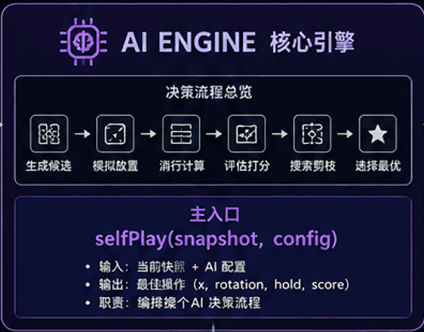
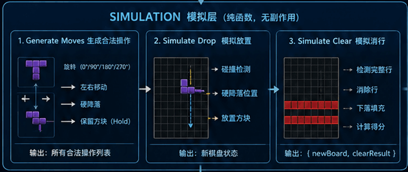
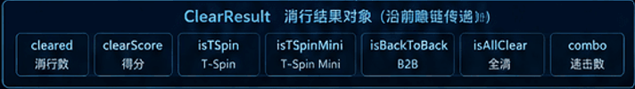
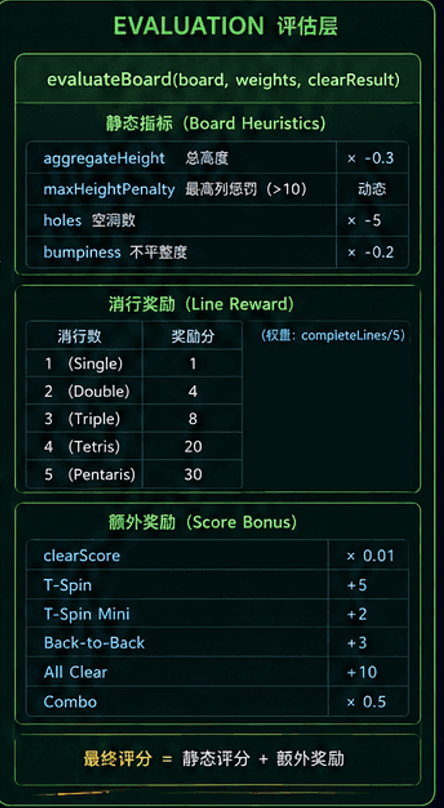
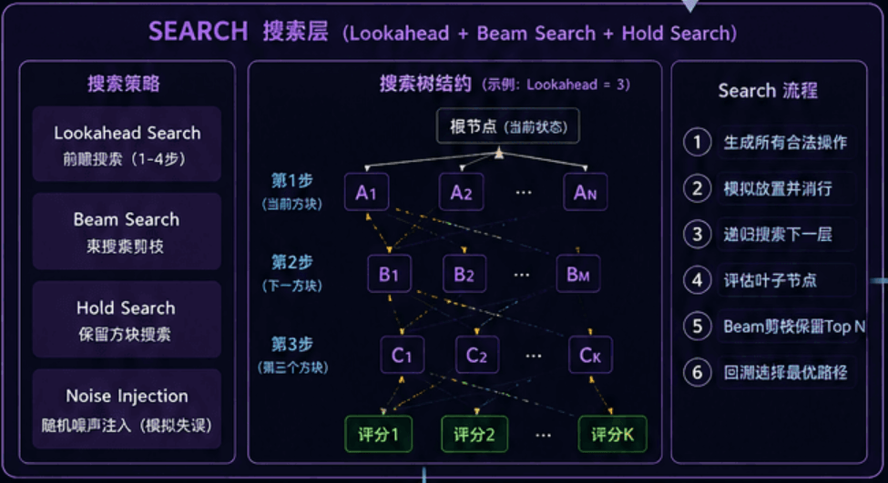

# AI

English | [简体中文](./04-ai.md)

> AI is not another set of game rules; it is just another player.


## AI Decision Algorithm of tetris.js

First, it should be specially noted that the core algorithm for tetris.js AI decision-making is: **Beam Search** (with pruning).

Of course, I have also researched other commonly used algorithms and tried **MCTS** (Monte Carlo Tree Search). However, since tetris.js is positioned to be implemented purely in JavaScript, the computational load of the MCTS algorithm in the browser environment is too heavy. Even with a standard 10×20 board, the computation is so large that it easily causes excessive memory usage and browser freezing.

tetris.js uses the 7-bag algorithm for piece generation:

### refillBag

```js
import SHAPES from '@/lib/game/constants/shapes.js';

/**
 * # Whether it is the first bag
 *
 * The first bag needs to avoid starting with S, Z, or T. Subsequent bags are not subject to this restriction.
 * Uses a module-level variable to maintain state throughout the game lifecycle.
 *
 * @type {boolean}
 */
let isFirstBag = true;

/**
 * # Refill a new bag (7-bag algorithm)
 *
 * Randomly arranges 8 types of pieces (including the extended I5) and places them into the bag.
 * Pieces are drawn one by one; after the bag is emptied, this function is called to generate a new bag.
 *
 * ## 7-bag Principle
 *
 * Every 8 pieces guarantee that each type appears once. Compared to pure randomness,
 * it avoids extreme cases where the same piece type appears consecutively,
 * providing a fairer and more stable gaming experience while maintaining randomness.
 *
 * ## Opening Restriction
 *
 * The first piece of the first bag cannot be S(6), Z(7), or T(3). These three pieces,
 * after rotation at the top of an empty board, easily form gaps that are difficult to fill.
 * Giving them to the player at the start puts them at a disadvantage.
 *
 * Uses a `while` loop to repeatedly shuffle until the first piece meets the rule.
 * Subsequent bags are not subject to this restriction.
 *
 * @returns {object[]} Randomly arranged array of 8 piece types
 */
const refillBag = () => {
  /*
   * ==================== Randomly Shuffle Piece Array ====================
   *
   * Uses toSorted with a random comparison function to generate a randomly arranged new bag.
   * toSorted returns a new array without modifying the original SHAPES.
   */
  let bag = [...SHAPES].toSorted(() => Math.random() - 0.5);

  /*
   * ==================== First Bag Opening Restriction ====================
   *
   * S(index 6), Z(index 7), T(index 3) when placed at the top of an empty board
   * easily form gaps that cannot be filled after rotation, should be avoided at the start.
   * Shuffles until the first piece is not one of the restricted types.
   */
  if (isFirstBag) {
    while ([3, 6, 7].includes(bag[0].colorIndex)) {
      bag = [...SHAPES].toSorted(() => Math.random() - 0.5);
    }
  }

  /*
   * ==================== Mark First Bag as Generated ====================
   *
   * Subsequent bags are no longer subject to the opening restriction
   */
  isFirstBag = false;

  return bag;
};

/**
 * # Reset first bag flag
 *
 * For unit testing only, resets `isFirstBag` to `true`,
 * allowing multiple test cases to verify the opening restriction logic.
 *
 * @returns {void}
 */
refillBag._reset = () => {
  isFirstBag = true;
};

export default refillBag;
```

The predictability of the 7-bag algorithm, combined with the Beam Search algorithm, performed very well and met my expectations. The AI decision effect and performance are both good, so tetris.js chose **Beam Search**.

## AI is Not Another Set of Game Logic

For Tetris, implementing an AI that can play automatically is not an extremely difficult task. What is truly difficult is: **How to make AI share the same game logic as human players.**

Many projects let AI directly modify the board. While this is simple to implement, as the project continues to expand, Replay, Battle, debugging, and future network synchronization all become increasingly complex.

Therefore, tetris.js chose a different approach from the very beginning: AI does not directly control the game; it is only responsible for thinking and generating Command instructions. The one that truly performs the operations is always Runtime.

### AI Controller Implementation:

```js
import Base from '@/lib/core';
import AIDifficulty from '@/lib/ai/core/ai-difficulty.js';
import createSnapshot from '@/lib/ai/snapshot/create-snapshot.js';
import selfPlay from '@/lib/ai/planner/self-play.js';
import { AIEvents, GameEvents } from '@/lib/events/event-catalog.js';

class AIController extends Base {
  constructor(options) {
    super(options);
    this.initialize();
  }

  initialize() {
    this._initialize();
  }

  _initialize(terminate = false) {
    this.enabled = false;
    this.actions = [];
    this.aiSchedulerId = 0;
    this.worker = null;
    this.workerBusy = false;

    this.worker =
      typeof Worker === 'undefined' || terminate
        ? null
        : new Worker('js/ai-worker.js', { type: 'module' });
  }

  start() {
    if (this.enabled) {
      return;
    }
    this.enabled = true;
    this.loop();
  }

  stop() {
    const { Scheduler } = this;
    this.enabled = false;
    this.actions = [];
    this.workerBusy = false;
    Scheduler.cancel(this.aiSchedulerId);
    this.aiSchedulerId = 0;
  }

  loop = () => {
    if (!this.enabled) {
      return;
    }

    const { Game, Animations, Scheduler } = this;
    const state = Game.Store.getState();

    if (state.mode !== 'playing' || Animations.hasBlocking()) {
      this.aiSchedulerId = Scheduler.delay(this.loop, 100);
      return;
    }

    const difficulty = this.getDifficultyConfig();

    if (this.actions.length === 0 && !this.workerBusy) {
      const best = this.think(state, difficulty);

      if (!this.worker) {
        this.actions = best ? [...best.actions] : [];
      }
    }

    const action = this.actions.shift();

    if (!action && this.workerBusy) {
      this.aiSchedulerId = Scheduler.delay(this.loop, difficulty.delay);
      return;
    }

    if (!action) {
      return;
    }

    const events = GameEvents(Game.id);

    this.emit(events.DISPATCH_INPUT, {
      device: 'ai',
      action,
      payload: { Game },
    });

    this.aiSchedulerId = Scheduler.delay(this.loop, difficulty.delay);
  };

  think(state, difficulty) {
    const { Store, Game } = this;
    const { lookahead, weights, beam } = difficulty;
    const difficultyLevel = Store.getDifficulty();
    const algorithm = difficultyLevel === 'expert' ? 'mcts' : 'selfPlay';
    const mode = Game.isVersus() ? 'versus' : 'survival';
    const bag = Game.getBagSnapshot();

    if (this.worker) {
      this.workerBusy = true;
      this.worker.postMessage({
        type: 'think',
        state,
        bag,
        weights,
        depth: lookahead,
        beam,
        algorithm,
        mode,
      });
    } else {
      const snapshot = createSnapshot(state, bag);
      return selfPlay(snapshot, weights, lookahead, beam, mode);
    }
  }

  getDifficultyConfig() {
    const { Game } = this;
    const difficulty = Game.Store.getDifficulty();
    const map = {
      easy: AIDifficulty.EASY,
      normal: AIDifficulty.NORMAL,
      hard: AIDifficulty.HARD,
      expert: AIDifficulty.EXPERT,
    };
    return map[difficulty] || AIDifficulty.NORMAL;
  }

  addEventListeners() {
    if (!this.worker) {
      return;
    }
    this.worker.addEventListener('message', this._onWorkerMessage);
    this.worker.addEventListener('error', this._onWorkerError);
  }

  removeEventListeners() {
    if (!this.worker) {
      return;
    }
    this.worker.removeEventListener('message', this._onWorkerMessage);
    this.worker.removeEventListener('error', this._onWorkerError);
  }

  _onWorkerMessage = (e) => {
    const { type, best, error } = e.data;
    if (type === 'result') {
      this.workerBusy = false;
      if (best) {
        this.actions = [...best.actions];
      }
    }
    if (type === 'error') {
      this.workerBusy = false;
      console.error('AI Worker Error:', error);
    }
  };

  _onWorkerError = (err) => {
    this.workerBusy = false;
    console.error('AI Worker Error:', err);
    this.worker = null;
  };

  subscribe() {
    const { Game } = this;
    const events = AIEvents(Game.id);
    this.on(events.START, this._onStart);
    this.on(events.STOP, this._onStop);
  }

  unsubscribe() {
    const { Game } = this;
    const events = AIEvents(Game.id);
    this.off(events.START, this._onStart);
    this.off(events.STOP, this._onStop);
  }

  _onStart = () => {
    this.start();
  };

  _onStop = () => {
    this.stop();
  };

  destroy() {
    this.worker.terminate();
    this._initialize(true);
  }
}

export default AIController;
```

Carefully read the `loop` method implementation:

```js
class AIController extends Base {
  /**
   * ## AI Main Loop
   *
   * Executes every frame (triggered by Scheduler at difficulty delay):
   *
   * 1. Check enabled flag
   * 2. Check game state (must be 'playing' and no animation blocking), otherwise retry after 100ms
   * 3. If action queue is empty and Worker is idle, call think() to initiate decision
   * 4. Take one action from the queue head and execute
   * 5. Schedule the next loop
   *
   * ### Action Execution Timing
   *
   * Only one action is executed per frame (this.actions.shift()).
   * A complete action sequence (e.g., HOLD → ROTATE → MOVE → DROP)
   * takes multiple frames to complete. No new think() is initiated during
   * sequence execution because this.actions.length > 0.
   *
   * ### Battle Mode Event Isolation
   *
   * Uses `GameEvents(Game.id).DISPATCH_INPUT` to send events,
   * the event name includes Game's UUID, ensuring events from two
   * Game instances don't interfere with each other in Battle mode.
   *
   * @returns {void}
   */
  loop = () => {
    if (!this.enabled) {
      return;
    }

    const { Game, Animations, Scheduler } = this;
    const state = Game.Store.getState();

    /*
     * ==================== State Check ====================
     *
     * Game interrupted (non-playing mode) or animation blocked, retry after 100ms.
     * Blocking animations include: clear lines, countdown, level-up, etc.
     * During these animations, pieces cannot be operated, AI should wait.
     */
    if (state.mode !== 'playing' || Animations.hasBlocking()) {
      this.aiSchedulerId = Scheduler.delay(this.loop, 100);
      return;
    }

    const difficulty = this.getDifficultyConfig();

    /*
     * ==================== Decision Phase ====================
     *
     * When action queue is empty (previous actions all completed) and Worker is idle,
     * initiate a new AI decision.
     *
     * think() returns the best move object { x, y, placeOn, actions },
     * shallow copies the actions array to this.actions queue.
     *
     * Currently using main thread synchronous mode: think() returns result directly.
     * In Worker mode (!this.worker is false),
     * think() returns undefined, result filled asynchronously by _onWorkerMessage.
     */
    if (this.actions.length === 0 && !this.workerBusy) {
      const best = this.think(state, difficulty);

      if (!this.worker) {
        this.actions = best ? [...best.actions] : [];
      }
    }

    /*
     * ==================== Action Execution Phase ====================
     *
     * Takes one action from the queue head to execute.
     * Only executes one action per frame, ensuring sequential execution.
     *
     * If queue is empty but Worker is still calculating, continue waiting (Worker mode).
     * If queue is empty and not calculating, this round's decision produced no actions, return directly.
     */
    const action = this.actions.shift();

    // No action but Worker is still calculating, continue waiting
    if (!action && this.workerBusy) {
      this.aiSchedulerId = Scheduler.delay(this.loop, difficulty.delay);
      return;
    }

    if (!action) {
      return;
    }

    /*
     * ==================== Send Action ====================
     *
     * Sends action through Game ID-isolated dispatch:input event.
     *
     * Event name format: game:<uuid>:dispatch:input
     * Engine._subscribe() subscribes separately to this event for each Game instance,
     * ensuring human Game doesn't receive AI input in Battle mode.
     *
     * Event flow:
     *   emit(DISPATCH_INPUT)
     *   → Engine._onDispatchInput
     *   → dispatchInput()
     *   → CommandQueue.enqueue()
     *   → CommandQueue.flush()
     *   → cmd.execute()
     *   → dispatchCommand()
     *   → action handler (e.g., GAME_PLAYING_ACTIONS.DROP)
     */
    const events = GameEvents(Game.id);

    this.emit(events.DISPATCH_INPUT, {
      device: 'ai',
      action,
      payload: { Game },
    });

    /*
     * ==================== Schedule Next Loop ====================
     *
     * Delay time uses difficulty configuration delay:
     * - Easy: 480ms
     * - Normal: 380ms
     * - Hard: 200ms
     * - Expert: 130ms
     *
     * Note: loop() triggers every 200ms (Hard), but executes only one action per frame.
     * This means AI can execute about 12 frames ≈ 12 actions within 200ms (if action sequence is long enough).
     * In reality, action sequences are usually 4-8 actions, completed before the next loop trigger.
     */
    this.aiSchedulerId = Scheduler.delay(this.loop, difficulty.delay);
  };
  // Other logic omitted...
}
```

The only difference between AI and human players is the source of input. Human players control the game through: **Keyboard**, **Gamepad**, **Touch**. AI controls the game through: **Decision System**. Ultimately, both produce: `Command`. For example:

- Move Left
- Rotate
- Hold
- Hard Drop

These Commands are all ultimately handed over to Runtime for execution. Therefore, the entire project always has only one set of game rules. AI has never had any "special privileges."

## How Does AI Think?

AI does not directly analyze the real board. What actually participates in the search is a Snapshot of the board.

### selfPlay Implements Decision-Making

Let's look at the implementation of `selfPlay`, the core method of AI decision-making, to understand the decision logic step by step:

<p align="center">
    
</p>

```js
import generateMoves from '@/lib/ai/planner/generate-moves.js';
import evaluateBoard from '@/lib/ai/simulator/evaluate-board.js';
import advanceSnapshot from '@/lib/ai/simulator/advance-snapshot.js';
import simulateClearResult from '@/lib/ai/simulator/simulate-clear-result.js';
import clearFullLines from '@/lib/ai/utils/clear-full-lines.js';
import cloneBoard from '@/lib/ai/utils/clone-board.js';

const selfPlay = (
  snapshot,
  weights,
  depth = 1,
  beam = 5,
  mode = 'survival',
) => {
  const moves = generateMoves(snapshot);

  if (moves.length === 0) {
    return null;
  }

  const baseCleared = snapshot.board.filter((row) =>
    row.every((c) => c !== 0),
  ).length;

  if (depth > 1 && moves.length > beam) {
    const scored = moves.map((move) => {
      const board = cloneBoard(snapshot.board);
      move.placeOn(board);

      const afterTotal = board.filter((row) =>
        row.every((c) => c !== 0),
      ).length;
      const newCleared = afterTotal - baseCleared;

      const afterBoard = clearFullLines(board);
      const result = simulateClearResult(afterBoard, snapshot, newCleared);

      let score = evaluateBoard(afterBoard, weights, result, mode);

      if (move.actions.includes('HOLD')) {
        score += 2;
      }

      return { move, score };
    });

    scored.sort((a, b) => b.score - a.score);

    moves.length = 0;
    moves.push(...scored.slice(0, beam).map((s) => s.move));
  }

  let best = null;
  let bestScore = -Infinity;

  for (const move of moves) {
    const board = cloneBoard(snapshot.board);
    move.placeOn(board);

    const afterTotal = board.filter((row) => row.every((c) => c !== 0)).length;
    const newCleared = afterTotal - baseCleared;

    const afterBoard = clearFullLines(board);
    const result = simulateClearResult(afterBoard, snapshot, newCleared);

    let score;

    if (depth <= 1) {
      score = evaluateBoard(afterBoard, weights, result, mode);
    } else {
      const nextSnapshot = advanceSnapshot(snapshot, move);
      const nextBest = selfPlay(nextSnapshot, weights, depth - 1, beam, mode);

      if (nextBest) {
        const nextCleared = nextSnapshot.board.filter((r) =>
          r.every((c) => c !== 0),
        ).length;
        const nextResult = simulateClearResult(
          nextSnapshot.board,
          nextSnapshot,
          nextCleared,
        );
        score = evaluateBoard(nextSnapshot.board, weights, nextResult, mode);
      } else {
        score = evaluateBoard(afterBoard, weights, result, mode);
      }
    }

    if (move.actions.includes('HOLD')) {
      score += 2;
    }

    if (score > bestScore) {
      bestScore = score;
      best = move;
    }
  }

  return best;
};

export default selfPlay;
```

At each decision, AI copies the current state (the `snapshot` parameter) and continuously simulates the future in an independent environment. The entire process does not affect the real game.

### createSnapshot Creates a Snapshot of the Real Board

The game board data cannot be directly modified. `snapshot` "copies" a set of board data. **`createSnapshot`** is used to create a snapshot of the real board:

```js
const createSnapshot = (state) =>
  structuredClone({
    // Controller identity
    controller: state.controller,

    // Board state
    board: state.board,

    // Game progress
    level: state.level,
    score: state.score,
    lines: state.lines,

    // Original piece objects (preserves complete info for future extensibility)
    cur: state.curr,
    next: state.next,

    // AI decision-specific piece info: extracted and structured from state.curr and state.cx/cy
    piece: state.curr
      ? {
          shape: state.curr.shape,
          position: {
            x: state.cx,
            y: state.cy,
          },
        }
      : null,

    // Game mode
    mode: state.mode,
  });

export default createSnapshot;
```

Therefore, the player can continue playing while AI completes the search in the background. This design also allows AI to freely try various approaches without worrying about corrupting the real state.

## Move Generation

The first step for AI is not scoring, but: **generating all legal moves**. For example:

- Different rotation states
- Different drop positions
- Hold
- Next piece

### generateMoves

Now let's look at how AI **generates all legal moves**:

```js
import generateForPiece from '@/lib/ai/planner/generate-for-piece.js';

/**
 * # Generate all possible moves (including Hold decision support)
 *
 * For the current piece and Hold piece (if any), iterates through all rotation states
 * and horizontal positions, simulates hard drop to generate candidate boards,
 * and generates corresponding action sequences for each candidate.
 *
 * ## Hold Decision
 *
 * Generates candidates for both the current piece and the Hold piece simultaneously,
 * allowing AI to naturally compare their pros and cons during scoring.
 * If the Hold piece's placement score is higher, AI will choose to execute Hold.
 *
 * **When Hold is empty**: Uses `snapshot.next` (the next preview piece) as the piece that
 * "would be obtained after Hold" to generate candidates. This allows AI to evaluate
 * "whether it's worth Holding to swap next out" even when Hold is empty.
 *
 * ## Candidate Structure
 *
 * Each candidate move contains:
 *
 * - `board` — Board state after hard drop, before line clearing
 * - `actions` — Action sequence array, e.g., `['ROTATE', 'MOVE_LEFT', 'DROP']`
 * - For Hold candidates, the first item in `actions` is `'HOLD'`
 *
 * @param {object} snapshot - Snapshot of current game state
 * @param {number[][]} snapshot.board - Board 2D array (0 = empty, other values = occupied)
 * @param {object} snapshot.piece - Current active piece object
 * @param {number[][]} snapshot.piece.shape - Piece shape matrix
 * @param {object} snapshot.piece.position - Current position of the piece
 * @param {number} snapshot.piece.position.x - Current X coordinate of the piece
 * @param {number} snapshot.piece.position.y - Current Y coordinate of the piece
 * @param {object} [snapshot.hold] - Hold piece object, same structure as piece. When empty, Hold slot is empty
 * @param {number[][]} snapshot.hold.shape - Hold piece shape matrix
 * @param {object} [snapshot.next] - Next preview piece object. Used as fallback when Hold is empty
 * @param {number[][]} snapshot.next.shape - Preview piece shape matrix
 * @returns {{ board: number[][]; actions: string[] }[]} Candidate move array, each containing simulated board and action sequence
 */
const generateMoves = (snapshot) => {
  /*
   * ==================== Destructure Snapshot Data ====================
   *
   * Extract board, current piece, Hold piece, and preview piece from snapshot
   */
  const { board, piece, hold, next } = snapshot;

  /*
   * ==================== Generate Current Piece Candidates ====================
   *
   * Iterates through 4 rotation states × all legal horizontal positions,
   * isHold = false, meaning no HOLD instruction appended
   */
  const moves = generateForPiece(board, piece, false);

  /*
   * ==================== Determine Hold Piece Source ====================
   *
   * Prefers the piece in the hold slot.
   * If hold is empty, uses next (the next preview piece) as the piece that
   * "would be obtained after Hold". This allows AI to evaluate
   * "whether it's worth Holding to swap next out" even when Hold is empty.
   */
  const holdPieceSource = hold || next;

  /*
   * ==================== Generate Hold Piece Candidates ====================
   *
   * If a valid Hold piece source exists, builds its piece data and generates candidates.
   * isHold = true, automatically prepends 'HOLD' instruction to the action sequence.
   */
  if (holdPieceSource) {
    /*
     * ==================== Build Hold Piece Data ====================
     *
     * Centers the Hold piece at the top of the board:
     * X = board width / 2 - piece width / 2
     * Y = 0 (starting from the top)
     */
    const holdPiece = {
      shape: holdPieceSource.shape,
      position: {
        x:
          Math.floor(board[0].length / 2) -
          Math.floor(holdPieceSource.shape[0].length / 2),
        y: 0,
      },
    };

    /*
     * ==================== Merge Hold Candidates into Move List ====================
     *
     * Uses spread operator to append Hold piece candidates to the end of moves array,
     * isHold=true ensures each candidate's actions start with 'HOLD'
     */
    moves.push(...generateForPiece(board, holdPiece, true));
  }

  return moves;
};

export default generateMoves;
```

`generateMoves` reads the `piece` data from the snapshot and generates candidate moves for the current piece.

### generateForPiece

`generateForPiece` iterates through the piece's rotation states and all legal horizontal positions. For each combination, it simulates a hard drop to the bottom (gets the final Y coordinate) and generates an action sequence (rotation → translation → hard drop):

```js
import rotateMatrix from '@/lib/ai/simulator/rotate-matrix.js';
import getValidXPositions from '@/lib/ai/planner/utils/get-valid-x-positions.js';
import createCandidate from '@/lib/ai/planner/create-candidate.js';

/**
 * ## Generate all candidate moves for a given piece
 *
 * Iterates through the piece's rotation states and all legal horizontal positions,
 * for each combination:
 *
 * 1. Simulates hard drop to the bottom (gets final Y coordinate)
 * 2. Generates action sequence (rotation → translation → hard drop)
 * 3. Packages as candidate move object (supports lazy evaluation)
 *
 * Pure function, does not modify external state. All scoring is performed lazily
 * through the candidate's `evaluate` method.
 *
 * ## Rotation Deduplication Optimization
 *
 * Some pieces have identical shapes across multiple rotation states, no need to traverse repeatedly:
 *
 * | Type   | Unique Rotations | Description                                |
 * | ------ | ---------------- | ------------------------------------------ |
 * | O      | 1                | 2×2 square, all four rotations identical   |
 * | I / I5 | 2                | Horizontal and vertical, the other two repeat |
 * | Others | 4                | J / L / S / Z / T each have 4 unique orientations |
 *
 * This optimization reduces candidates per decision step by about 30%, directly improving AI search speed.
 *
 * ## Candidate Object Structure
 *
 * Each candidate move contains:
 *
 * | Field       | Type     | Description                                            |
 * | ----------- | -------- | ------------------------------------------------------ |
 * | `y`         | number   | Final Y coordinate after hard drop                     |
 * | `actions`   | string[] | Action sequence, e.g., `['ROTATE', 'MOVE_RIGHT', 'DROP']` |
 * | `evaluate`  | Function | Lazy evaluation function, calls placement + scoring + rollback |
 *
 * @param {number[][]} board - Board 2D array, 0 = empty, non-zero = occupied
 * @param {object} pieceData - Piece data
 * @param {number[][]} pieceData.shape - Piece shape matrix
 * @param {string} [pieceData.type] - Piece type identifier for rotation deduplication ('O'/'I'/'I5', etc.)
 * @param {object} pieceData.position - Current piece position { x, y }
 * @param {boolean} [isHold=false] - Whether from Hold slot, determines if action sequence starts with 'HOLD'. Default is
 *   `false`
 * @returns {object[]} Candidate move array, each containing evaluate, actions, y
 */
const generateForPiece = (board, pieceData, isHold = false) => {
  const moves = [];
  let currentShape = pieceData.shape;

  /**
   * Rotation deduplication: determines number of rotations to traverse based on piece type
   *
   * - O piece (2×2 square): 4 rotation states identical, only traverse 1 time
   * - I / I5 piece (long bar): horizontal and vertical, only traverse 2 times
   * - Other pieces (J/L/S/Z/T): traverse all 4 rotation states
   *
   * `pieceData.type` may be undefined (for backward compatibility), default to 4.
   */
  const type = pieceData.type || '';
  let uniqueRotations = 4;

  if (type === 'O') {
    uniqueRotations = 1;
  } else if (type === 'I' || type === 'I5') {
    uniqueRotations = 2;
  }

  for (let rotation = 0; rotation < uniqueRotations; rotation++) {
    /**
     * Gets all legal X coordinates for the current rotation state
     *
     * Legal range: 0 to (board width - piece width)
     * For example, a T piece (width 3) on a 10-column board can be placed at x=0~7 (8 positions)
     */
    const validXPositions = getValidXPositions(board, currentShape);

    for (const targetX of validXPositions) {
      // Generate candidate: simulate hard drop + build action sequence
      const candidate = createCandidate({
        board,
        currentShape,
        targetX,
        originalPiece: pieceData,
        rotationCount: rotation,
      });

      // Hold candidate: prepend 'HOLD' marker to action sequence
      if (isHold) {
        candidate.actions = ['HOLD', ...candidate.actions];
      }

      moves.push(candidate);
    }

    // Prepare rotated shape for the next iteration
    currentShape = rotateMatrix(currentShape);
  }

  return moves;
};

export default generateForPiece;
```

These possibilities, i.e., the calculated **moves**, form a search tree. All subsequent calculations are built upon these legal moves. Only positions that can actually land will enter the next stage.

## Board Simulation

After generating candidates, AI will place pieces in a simulated board. This includes:

- Collision detection
- Landing
- Line clearing
- Board update

This is the **Beam Search pruning** logic in `selfPlay`:

<p align="center">
    
</p>

```js
/**
 * Only executes when "still need to continue recursing" and "candidates exceed beam limit."
 *
 * Why pruning is needed:
 *
 * - Hard difficulty lookahead=4, ~34 candidates per layer (current piece) + ~34 candidates (Hold piece)
 * - Without pruning, 4-layer recursion generates 68^4 ≈ 21 million evaluations, performance unacceptable
 * - Beam Search reduces candidates from 68 to beam(4-5), greatly reducing computation
 *
 * Pruning strategy:
 *
 * 1. Lightweight scoring for each candidate (only current layer, no deep recursion)
 * 2. Sort by score descending
 * 3. Keep only the top beam candidates for deep recursion search
 * 4. Hold candidates get +2 bonus to prevent good Hold candidates from being incorrectly pruned
 */
if (depth > 1 && moves.length > beam) {
  const scored = moves.map((move) => {
    // Branch copy: each candidate operates on an independent copy of the original board
    const board = cloneBoard(snapshot.board);
    move.placeOn(board);

    // Newly cleared lines = full lines after placement - full lines before placement
    const afterTotal = board.filter((row) =>
      row.every((c) => c !== 0),
    ).length;
    const newCleared = afterTotal - baseCleared;

    // Clear full lines
    const afterBoard = clearFullLines(board);

    // Calculate clear result (pass in actual cleared count)
    const result = simulateClearResult(afterBoard, snapshot, newCleared);

    // Lightweight scoring (only current layer, mode passed to evaluateBoard)
    let score = evaluateBoard(afterBoard, weights, result, mode);

    // Hold candidate bonus: +2 points to prevent being incorrectly pruned
    // Magnitude of 2 points: much less than Tetris clear bonus (200 points), greater than bumpiness difference (~1 point)
    if (move.actions.includes('HOLD')) {
      score += 2;
    }

    return { move, score };
  });

  // Sort by score descending
  scored.sort((a, b) => b.score - a.score);

  // Keep only the top beam candidates, discard the rest
  moves.length = 0;
  moves.push(...scored.slice(0, beam).map((s) => s.move));
}
```

The entire process happens in a simulated environment because `cloneBoard(snapshot.board)` is used to clone the board data again. The real game is not affected at all.

### simulateClearResult

A key basis for AI decisions is whether the operation result can clear lines, and this calculation is handled by the `simulateClearResult` function:

<p align="center">
    
</p>

```js
import GAME from '@/lib/game/constants/game.js';
import getTSpinScore from '@/lib/game/utils/get-t-spin-score.js';

/**
 * # Simulate line clear scoring result
 *
 * Lightweight scoring logic in the AI simulator. Calculates score, Combo, Back-to-Back, T-Spin, etc.
 * on the board after line clearing, providing reference for `evaluateBoard` during scoring,
 * allowing AI to actively pursue high-value clears.
 *
 * ## Differences from applyClearLines
 *
 * | Function              | Module     | Responsibility                         |
 * | --------------------- | ---------- | -------------------------------------- |
 * | `applyClearLines`     | Game Runtime | Full scoring + Store update + animation |
 * | `simulateClearResult` | AI Simulator | Pure data scoring, no side effects     |
 *
 * ## Scoring Rules
 *
 * Consistent with game runtime:
 *
 * - Normal clear base score × Back-to-Back multiplier
 * - T-Spin replaces normal base score (including 0-line T-Spin)
 * - Combo bonus = (combo - 1) × 50
 * - All Clear fixed 2000 (only triggered when cleared > 0)
 *
 * ## actualCleared Parameter
 *
 * After line clearing, full lines have been removed, so cleared lines cannot be detected by board traversal.
 * The caller (selfPlay) counts the **newly cleared** full lines before clearing, and passes the actual value through this parameter.
 * If not passed (?? operator), falls back to automatic board detection (for backward compatibility, but cleared will always be 0).
 *
 * @function simulateClearResult
 * @param {number[][]} board - Board after line clearing
 * @param {object} snapshot - Current snapshot (contains combo/backToBack/tSpin)
 * @param {number} [actualCleared] - Actual lines cleared this time (counted before clearing), auto-detects from board if not passed
 * @returns {object | null} Clear result object, returns null if no clear and not T-Spin
 */
const simulateClearResult = (board, snapshot, actualCleared) => {
  // Get clear line base score mapping from game constants
  const { CLEAR_LINE_SCORES } = GAME;

  /**
   * Lines cleared.
   *
   * Prefers the actual value passed by the caller (counted before clearing),
   * falls back to auto-detection from board if not passed (will always be 0 because full lines are already cleared).
   */
  const cleared =
    actualCleared ??
    board.filter((row) => row.every((cell) => cell !== 0)).length;

  /** T-Spin detection result. Reads the T-Spin flag written during the lock phase from the snapshot. */
  const { isTSpin = false, isTSpinMini = false } = snapshot.tSpin || {};

  /**
   * No clear and not T-Spin → no scoring event.
   *
   * Note: T-Spin 0-line is still a valid scoring event (baseScore=400),
   * so cannot simply skip with cleared===0.
   */
  if (cleared === 0 && !isTSpin && !isTSpinMini) {
    return null;
  }

  /**
   * Base score calculation.
   *
   * If T-Spin exists, use T-Spin scoring table (overrides normal clear base score),
   * otherwise use the value from CLEAR_LINE_SCORES corresponding to cleared lines.
   */
  const tSpinScore = getTSpinScore(cleared, isTSpin, isTSpinMini);
  const baseScore = tSpinScore || CLEAR_LINE_SCORES[cleared] || 0;

  /**
   * Big move determination.
   *
   * Big move definition: Tetris (4+ lines cleared) or T-Spin / T-Spin Mini clear.
   * Used to determine whether to trigger Back-to-Back.
   */
  const isBigMove = cleared >= 4 || isTSpin || isTSpinMini;

  /**
   * Back-to-Back determination.
   *
   * Triggered when this move is a big move and the previous move was also a big move (snapshot.backToBack === true).
   * B2B multiplier is 1.5x.
   */
  const isBackToBack = isBigMove && snapshot.backToBack === true;
  const multiplier = isBackToBack ? 1.5 : 1;

  /**
   * Combo calculation.
   *
   * Combo +1 on clear. Combo ≥ 2 bonus = (combo - 1) × 50.
   */
  const combo = (snapshot.combo || 0) + 1;
  const comboScore = combo > 1 ? (combo - 1) * 50 : 0;

  /**
   * All Clear determination.
   *
   * Triggered when the board is completely empty after clearing.
   * Note: Only actual clears (cleared > 0) can trigger All Clear,
   * T-Spin 0-line even if board is empty is not counted as All Clear.
   */
  const isAllClear =
    cleared > 0 && board.every((row) => row.every((c) => c === 0));

  // All Clear fixed bonus 2000 points
  const allClearScore = isAllClear ? 2000 : 0;

  /**
   * Final score.
   *
   * = floor(base score × B2B multiplier) + Combo bonus + All Clear bonus
   */
  const clearScore =
    Math.floor(baseScore * multiplier) + comboScore + allClearScore;

  // Return complete clear scoring result for evaluateBoard use
  return {
    /** Lines cleared */
    cleared,
    /** Base score (before multiplier) */
    baseScore,
    /** Final score */
    clearScore,
    /** Whether T-Spin */
    isTSpin,
    /** Whether T-Spin Mini */
    isTSpinMini,
    /** Whether big move (for updating Back-to-Back state) */
    isBigMove,
    /** Whether Back-to-Back bonus triggered */
    isBackToBack,
    /** Whether All Clear triggered */
    isAllClear,
    /** Updated combo count */
    combo,
    /** Combo bonus this time */
    comboScore,
    /** All Clear bonus this time */
    allClearScore,
  };
};

export default simulateClearResult;
```

As you can see, there are quite a few scoring factors:

- Lines cleared
- Base score (before multiplier)
- Final score
- Whether T-Spin
- Whether T-Spin Mini
- Whether big move (for updating Back-to-Back state)
- Whether Back-to-Back bonus triggered
- Whether All Clear triggered
- Updated combo count
- Combo bonus this time
- All Clear bonus this time

The result of Simulation is the foundation for AI's subsequent **Evaluation** scoring, and the basis for all subsequent scoring.

## Evaluation

After completing the simulation, AI begins to evaluate the board.

### evaluateBoard

The final evaluation is the `evaluateBoard` method. The evaluation function does not answer: "Is this the best move?" What it truly answers is: **Is this board state more favorable for the future?**

Currently, it mainly considers:

- Aggregate Height
- Max Height
- Holes
- Bumpiness
- Complete Lines

<p align="center">
    
</p>

```js
import getColumnHeight from '@/lib/ai/simulator/utils/get-column-height.js';
import countHoles from '@/lib/ai/simulator/utils/count-holes.js';

/**
 * # Board Evaluation Function
 *
 * Comprehensively scores the board state for AI decision-making.
 * Supports both survival and versus modes.
 *
 * ## Design Philosophy
 *
 * - `aggregateHeight` as background pressure, prevents AI from infinite well-digging
 * - `holes` as core metric (strong weight), one hole ruins everything
 * - `maxHeight` starts exponential penalty after 12 rows, forcing AI to clear lines promptly
 * - Line clear rewards read from `clearResult`, table-driven distinguishing Single through Tetris
 * - `clearResult` passed along the lookahead chain, deep search sees clear value
 *
 * ## Evaluation Metrics
 *
 * ### Structural Metrics
 *
 * | Metric                    | Weight | Description                                         |
 * | ------------------------- | ------ | --------------------------------------------------- |
 * | aggregateHeight           | -0.45  | Background pressure, moderate fear of height, prevents infinite stacking |
 * | maxHeight                 | Dynamic | Exponential penalty (>12 ×0.5), gives AI ample stacking space |
 * | holes                     | -8     | Core metric, one hole ≈ 10 point penalty            |
 * | bumpiness                 | -0.35  | Guides AI to keep surface flat for more line clears |
 *
 * ### Line Clear Rewards (Table-Driven)
 *
 * | Lines Cleared | lineReward | × completeLines/4 | Final Reward |
 * | ------------- | ---------- | ----------------- | ------------ |
 * | 1 line        | 2          | × 5               | 10 points    |
 * | 2 lines       | 6          | × 5               | 30 points    |
 * | 3 lines       | 12         | × 5               | 60 points    |
 * | 4 lines       | 40         | × 5               | 200 points   |
 * | 5 lines       | 80         | × 5               | 400 points   |
 *
 * ### Score Bonuses (Stacked on Top of Line Clear Rewards)
 *
 * | Metric        | Description            |
 * | ------------- | ---------------------- |
 * | clearScore    | Clear score × 0.03     |
 * | isTSpin       | +8                     |
 * | isTSpinMini   | +3                     |
 * | isBackToBack  | +5                     |
 * | isAllClear    | +20                    |
 * | combo         | combo × 0.8            |
 *
 * ## Danger Zone Behavior
 *
 *     ≤12 rows: Safe, free stacking
 *     13-14: Mild pressure
 *     15-16: Noticeable pressure, must find clears
 *     17+: Heavy pressure, will die quickly without clears
 *
 * ## Versus vs Survival Mode
 *
 * Versus mode adjusts based on survival mode:
 *
 * ### 1. Stricter Weights
 *
 * | Metric        | survival | versus | Reason                                   |
 * | ------------- | -------- | ------ | ---------------------------------------- |
 * | height        | -0.6     | -0.7   | Height is fatal weakness under garbage attacks |
 * | holes         | -8       | -9     | Holes are more deadly with garbage pushed from bottom |
 * | bumpiness     | -0.35    | -0.4   | Smoother surface enables continuous clears against garbage |
 * | completeLines | 20       | 25     | Larger clear reward scaling, encourages active clearing |
 *
 * ### 2. Attack Power Bonus
 *
 * Versus mode additionally rewards based on attack power generated by clears, guiding AI to pursue multi-line clears.
 *
 * | Lines Cleared | Attack Power | attackScore | Description           |
 * | ------------- | ------------ | ----------- | --------------------- |
 * | 1 line        | 0            | 0           | No attack, no reward  |
 * | 2 lines       | 1            | 10          | Small reward          |
 * | 3 lines       | 2            | 25          | Medium reward         |
 * | 4 lines       | 3            | 50          | Tetris heavy reward   |
 * | 5 lines       | 4            | 80          | Extreme heavy reward  |
 *
 * Attack power conversion is consistent with `GARBAGE_MAP` in `lib/battle/garbage-system.js`.
 *
 * @param {number[][]} board - Board 2D array, 0 = empty, non-zero = occupied
 * @param {object} weights - Weight configuration, can override defaults (provided by AIDifficulty)
 * @param {object} [clearResult] - Line clear scoring result (passed along lookahead chain)
 * @param {string} [mode='survival'] - AI mode: survival or versus. Default is
 *   `'survival'`
 * @returns {number} Board score, higher is better
 */
const evaluateBoard = (board, weights, clearResult, mode = 'survival') => {
  /*
   * ==================== Initialization ====================
   *
   * heights: collects column heights for aggregate height, max height, and bumpiness calculation
   */
  const heights = [];

  /*
   * ==================== Weight Configuration ====================
   *
   * Default weights apply to survival mode.
   * Caller can override any field via weights parameter.
   * Versus mode further overrides with stricter strategy.
   */
  const w = {
    holes: -8, // Hole penalty: one hole ≈ 10 points
    height: -0.7, // Background pressure: moderate fear of height
    bumpiness: -0.35, // Bumpiness penalty: guides flat surface
    completeLines: 20, // Line clear reward scaling factor
    ...weights,
  };

  /*
   * ==================== Versus Mode Override Weights ====================
   *
   * Versus mode requires more aggressive strategies:
   * - More afraid of height: opponent clears send garbage, higher height is more dangerous
   * - More afraid of holes: garbage pushed from bottom, columns with holes easily form wells
   * - More attention to flatness: flat surface enables continuous clears, more efficient attacks
   * - Larger clear rewards: encourages active clearing over passive defense
   */
  if (mode === 'versus') {
    w.height = -0.8;
    w.holes = -9;
    w.bumpiness = -0.4;
    w.completeLines = 25;
  }

  /*
   * ==================== Structural Metric Calculation ====================
   *
   * Calculates column by column, then aggregates:
   * - aggregateHeight: sum of all column heights
   * - maxHeight: tallest column height
   * - bumpiness: sum of absolute differences between adjacent column heights
   * - holes: number of blocked empty cells
   */

  // Calculate each column height
  for (let x = 0; x < board[0].length; x++) {
    heights.push(getColumnHeight(board, x));
  }

  // Aggregate height: sum of all column heights
  const aggregateHeight = heights.reduce((a, b) => a + b, 0);

  // Max height: used for danger zone determination
  const maxHeight = Math.max(...heights);

  // Bumpiness: sum of absolute differences between adjacent column heights, smaller = flatter
  let bumpiness = 0;
  for (let i = 0; i < heights.length - 1; i++) {
    bumpiness += Math.abs(heights[i] - heights[i + 1]);
  }

  // Holes: number of blocked empty cells
  const holes = countHoles(board);

  /*
   * ==================== Danger Zone Exponential Penalty ====================
   *
   * Triggers from 12 rows, giving AI ample stacking space (10 columns × 12 rows = 120 cells).
   * Penalty formula: -(maxHeight - 12)² × 0.5
   *
   * Examples:
   * - 13 rows: -(1)² × 0.5 = -0.5 points (mild)
   * - 14 rows: -(2)² × 0.5 = -2 points
   * - 15 rows: -(3)² × 0.5 = -4.5 points
   * - 16 rows: -(4)² × 0.5 = -8 points (noticeable pressure)
   * - 17 rows: -(5)² × 0.5 = -12.5 points (heavy pressure)
   */
  let maxHeightPenalty = 0;
  if (maxHeight > 12) {
    maxHeightPenalty = -Math.pow(maxHeight - 12, 2) * 0.5;
  }

  /*
   * ==================== Line Clear Rewards ====================
   *
   * Table-driven line clear reward calculation, step-wise guiding AI to pursue Tetris.
   *
   * lineRewards table:
   * - 0 lines: 0 (no clear)
   * - 1 line: 2 (Single)
   * - 2 lines: 6 (Double)
   * - 3 lines: 12 (Triple)
   * - 4 lines: 40 (Tetris)
   * - 5 lines: 80 (maximum clear)
   *
   * Final reward = lineReward × (completeLines / 4)
   * e.g., survival Tetris = 40 × (20/4) = 200 points
   * e.g., versus Tetris = 40 × (25/4) = 250 points
   *
   * linesCleared reads actual cleared lines from clearResult.
   * If clearResult is null (no clear), linesCleared = 0.
   */
  const lineRewards = [0, 2, 6, 12, 40, 80];
  const linesCleared = clearResult ? clearResult.cleared : 0;
  const lineReward = lineRewards[linesCleared] || 0;

  /*
   * ==================== Static Score ====================
   *
   * Combines four structural metrics and line clear rewards to calculate static score:
   * - Aggregate height × height weight (negative, higher = worse)
   * - Danger zone penalty (negative or 0)
   * - Holes × hole weight (negative, more = worse)
   * - Bumpiness × bumpiness weight (negative, bumpier = worse)
   * - Line clear reward × scaling factor (positive, more = better)
   */
  const staticScore =
    aggregateHeight * w.height +
    maxHeightPenalty +
    holes * w.holes +
    bumpiness * w.bumpiness +
    lineReward * (w.completeLines / 4);

  /*
   * ==================== Score Bonuses ====================
   *
   * Adds various in-game score bonuses on top of the static structural score.
   * These bonuses reflect the "quality" rather than "quantity" of clears.
   */
  let scoreBonus = 0;

  if (clearResult) {
    // Clear score normalization (×0.03): maps game score to scoring space
    scoreBonus += clearResult.clearScore * 0.03;

    // T-Spin extra bonus
    if (clearResult.isTSpin) {
      scoreBonus += 8;
    } else if (clearResult.isTSpinMini) {
      scoreBonus += 3;
    }

    // Back-to-Back consecutive big move bonus
    if (clearResult.isBackToBack) {
      scoreBonus += 5;
    }

    // All Clear heavy bonus
    if (clearResult.isAllClear) {
      scoreBonus += 20;
    }

    // Combo bonus: +0.8 points per combo
    scoreBonus += clearResult.combo * 0.8;
  }

  /*
   * ==================== Versus Mode: Attack Power Bonus ====================
   *
   * In versus mode, clears send garbage lines to the opponent.
   * AI needs to know that "clearing not only cleans your own board, but also attacks the opponent."
   *
   * Attack power conversion table (consistent with GARBAGE_MAP in lib/battle/garbage-system.js):
   *
   * | Lines Cleared | Attack Power | attackScore | Design Intent               |
   * | ------------- | ------------ | ----------- | --------------------------- |
   * | 1 line        | 0            | 0           | Single has no attack, no reward |
   * | 2 lines       | 1            | 10          | Small reward, worth doing   |
   * | 3 lines       | 2            | 25          | Medium reward, actively pursue |
   * | 4 lines       | 3            | 50          | Tetris heavy reward, core goal |
   * | 5 lines       | 4            | 80          | Extreme reward, encourages limit-breaking |
   *
   * Attack score magnitude design:
   * - 10-25 points can cover "leaving 1-2 holes" penalty (-8 ~ -18 points)
   * - 50 points can cover "stacking 5 rows" penalty (~ -25 points)
   * - 80 points can cover "bumpiness 20" penalty (~ -8 points)
   * This gives AI the right trade-off when "slightly sacrificing flatness to pursue Tetris."
   */
  if (mode === 'versus') {
    const garbageMap = [0, 0, 1, 2, 3, 4];
    const attackLines = garbageMap[linesCleared] || 0;

    const attackScores = [0, 0, 10, 25, 50, 80];
    const attackScore = attackScores[attackLines] || 0;

    scoreBonus += attackScore;
  }

  /*
   * ==================== Final Score ====================
   *
   * Static structural score + Score bonuses = Final score
   * Higher score means better board state.
   * AI selects the best candidate move based on this score in selfPlay.
   */
  return staticScore + scoreBonus;
};

export default evaluateBoard;
```

The evaluation function itself does not move pieces; it is only responsible for scoring.

### AIDifficulty

Different metrics have different weights, which together determine the quality of the current situation. tetris.js designed its own weight configuration: `AIDifficulty`.

```js
const AI_WEIGHTS = {
  holes: -8, // Hole penalty: one hole ≈ 10 points
  height: -0.7, // Background pressure: moderate fear of height
  bumpiness: -0.35, // Bumpiness penalty: guides flat surface
  completeLines: 20, // Line clear reward scaling factor
};

/**
 * # AI Difficulty Configuration
 *
 * Defines AI behavior parameters for different game difficulties. Higher difficulty means
 * wider search breadth, lower noise, and faster response speed.
 * All difficulties share the same evaluation weights (AI_WEIGHTS), with differences in
 * search depth, search breadth, noise, and delay.
 *
 * ## Unified Weight Design
 *
 * | Metric        | Weight | Description                                                            |
 * | ------------- | ------ | ---------------------------------------------------------------------- |
 * | holes         | -8     | Heavy hole penalty. One hole ruins everything, AI avoids holes at all costs |
 * | height        | -0.7   | Background pressure. Moderate fear of height, prevents infinite stacking |
 * | bumpiness     | -0.35  | Penalizes unevenness, guides AI to keep surface flat for more clears   |
 * | completeLines | 20     | Line clear reward scaling. Tetris = 40 × (20/4) = 200 points, Double = 30 points |
 *
 * ## Weight Design Philosophy
 *
 * - **holes = -8**: One hole ≈ 10 point penalty, AI would at most take 3 holes for a Double (30 points)
 * - **height = -0.7**: Average height 10 rows ≈ -7 points, constant pressure prevents stacking too high
 * - **bumpiness = -0.35**: Bumpiness 10 ≈ -3.5 points, relatively mild but constant pressure
 * - **completeLines = 20**: Tetris = 200 points, gives AI a clear "pursue Tetris" goal
 *
 * ## Configuration Parameters
 *
 * | Parameter   | Type   | Description                                         |
 * | ----------- | ------ | --------------------------------------------------- |
 * | `lookahead` | number | Lookahead depth: 2=see one more, 3=see two more, 4=see three more |
 * | `noise`     | number | Random noise (0-1): AI has probability to randomly choose non-optimal solution |
 * | `beam`      | number | Beam Search pruning width, number of candidate paths kept per layer |
 * | `weights`   | object | Evaluation weights (all difficulties share AI_WEIGHTS) |
 * | `delay`     | number | AI decision delay (milliseconds): simulates human reaction time |
 *
 * ## Difficulty Levels
 *
 * | Difficulty | lookahead | beam | noise | delay | Characteristics                         |
 * | ---------- | --------- | ---- | ----- | ----- | --------------------------------------- |
 * | EASY       | 2         | 2    | 0.08  | 480ms | See one more, occasional mistakes, slow |
 * | NORMAL     | 3         | 3    | 0.05  | 380ms | See two more, occasional errors, medium |
 * | HARD       | 4         | 3    | 0     | 200ms | See three more, focused search, fast    |
 * | EXPERT     | 4         | 4    | 0     | 130ms | See three more, broad search, extremely fast |
 *
 * ## Design Notes
 *
 * - **lookahead=4 is the evaluation function upper limit**: Tests show lookahead=5 performs worse,
 *   linear evaluation function error amplifies beyond 4 steps
 * - **HARD vs EXPERT difference**: Same search depth, EXPERT uses wider beam (4 vs 3) and lower delay (130ms vs 200ms).
 *   Tests show beam=3 and beam=4 perform almost identically, beam=4 is not better but not worse either,
 *   kept as nominal distinction
 *
 * @constant {object} AIDifficulty
 */
const AIDifficulty = {
  /**
   * ## EASY Difficulty
   *
   * - Lookahead 2 steps, basic planning ability
   * - Beam width 2, keeps only top 2 candidates
   * - 8% noise, occasionally chooses non-optimal solutions
   * - Decision delay 480ms, gives players ample reaction time
   */
  EASY: {
    lookahead: 2,
    beam: 2,
    noise: 0.08,
    weights: AI_WEIGHTS,
    delay: 480,
  },

  /**
   * ## NORMAL Difficulty
   *
   * - Lookahead 3 steps, moderate depth reasoning
   * - Beam width 3, keeps more candidate paths
   * - 5% noise, occasional mistakes
   * - Decision delay 380ms, medium response speed
   */
  NORMAL: {
    lookahead: 3,
    beam: 3,
    noise: 0.05,
    weights: AI_WEIGHTS,
    delay: 380,
  },

  /**
   * ## HARD Difficulty
   *
   * - Lookahead 4 steps, reaches evaluation function effective prediction limit
   * - Beam width 3, focused search
   * - 0% noise, always chooses optimal solution
   * - Decision delay 200ms, fast response
   */
  HARD: {
    lookahead: 4,
    beam: 3,
    noise: 0,
    weights: AI_WEIGHTS,
    delay: 200,
  },

  /**
   * ## EXPERT Difficulty
   *
   * - Lookahead 4 steps, same depth as HARD
   * - Beam width 4, wider search than HARD
   * - 0% noise, always chooses optimal solution
   * - Decision delay 130ms, extremely fast response
   */
  EXPERT: {
    lookahead: 4,
    beam: 4,
    noise: 0,
    weights: AI_WEIGHTS,
    delay: 130,
  },
};

export default AIDifficulty;
```

The base metric weights for AI of different difficulties are consistent, ensuring that AIs of different levels have the same judgment criteria for metrics. The core indicators that determine AI capability are the following 3:

- lookahead: lookahead steps
- beam: Beam Search width
- noise: noise, probability of choosing non-optimal solutions
- delay: decision delay

## Beam Search

<p align="center">
    
</p>

As search depth increases, the number of possible states grows rapidly. If all branches are kept, the search cost will become increasingly high. Therefore, AI uses **Beam Search**.

### What is Beam Width

Beam Search only keeps K optimal candidates (K = beam width) at each layer, pruning the rest. This balances search quality and computational performance.

### Beam Search Width Effect Analysis

In Tetris AI, the search tree has high correlation:

| Beam Width | Candidates Per Layer | Search Nodes (10 Layers) | Relative Time | Effect |
| ---------- | -------------------- | ------------------------ | ------------- | ------ |
| 1          | 1                    | 10                       | 1x            | Greedy, prone to local optima |
| 2          | 2                    | 20                       | 2x            | Slight improvement |
| 3          | 3                    | 30                       | 3x            | Significant improvement |
| 4          | 4                    | 40                       | 4x            | Near optimal |
| 5          | 5                    | 50                       | 5x            | Best value for money |
| 8          | 8                    | 80                       | 8x            | Diminishing returns |
| 10         | 10                   | 100                      | 10x           | Minimal gain |
| 20         | 20                   | 200                      | 20x           | Almost no gain |

#### Diminishing Returns

From the statistical table above, we can see:

- 1→3: +40% improvement
- 3→5: +20% improvement
- 5→8: +5% improvement
- 8→10: +1% improvement
- 10→20: +0.5% improvement

**Reason**: Good paths are usually covered within the Top-3 candidates. Additional candidates are just "similar" variations. Example:

- Candidate 1: Place I at col 4 → Tetris → High score
- Candidate 2: Place I at col 5 → Tetris → High score
- Candidate 3: Place I at col 3 → Tetris → High score
- Candidate 4: Place I at col 4 → different rotation → almost same path ← Redundant!
- Candidate 5: Place I at col 6 → different rotation → almost same path ← Redundant!

#### Computational Cost vs. Returns

- Beam Width 5: 5 × 10 columns × 4 rotations = 200 moves/layer
- Beam Width 10: 10 × 10 columns × 4 rotations = 400 moves/layer (2x)
- Beam Width 20: 20 × 10 columns × 4 rotations = 800 moves/layer (4x)

Actual gains:

- 5→10: only 1-2% improvement
- 10→20: only 0.3-0.5% improvement

Increasing computation by 4x only yields less than 1% improvement, which is completely unacceptable for real-time decision-making.

#### Overfitting Risk

A larger Beam Width causes AI to overly pursue "perfect-looking" boards, losing diversity.

**Beam Width 3**:

- Candidate A: Good flatness, but slightly high
- Candidate B: Slightly uneven, but lower ← AI preserves diversity
- Candidate C: Preparing for Tetris

**Beam Width 10**:

- Candidate A: Good flatness, slightly high
- Candidate A1: Good flatness, slightly high (different rotation) ← Redundant
- Candidate A2: Good flatness, slightly high (1 column off) ← Redundant
- Candidate B: Good flatness, slightly high (another rotation) ← Redundant
- Candidate C: Good flatness, slightly high (another position) ← Redundant
- ...All are variations of "flat but high"

**Result**: All candidates converge on "flatness," losing the diversity of "pursuing Tetris."

#### Depth Limitation

In real-time games, search depth is more important than width:

- Beam Width 3 × Depth 15: explores 3^15 = 14.3 million paths
- Beam Width 10 × Depth 10: explores 10^10 = 10 billion paths (but shallower!)

Actual tests:

- Width=3, Depth=15: Can plan 15 steps ahead → Can complete Tetris
- Width=10, Depth=8: Can only see 8 steps → Cannot plan long-term, falls into local optima

**Because computational budget is fixed**, increasing width means decreasing depth.

#### Memory Pressure

Looking at another set of test data:

- Width=5: Stores 5 board states × 200 blocks = 1000 objects per layer
- Width=10: Stores 10 board states × 200 blocks = 2000 objects per layer
- Width=20: Stores 20 board states × 200 blocks = 4000 objects per layer

JavaScript memory: At Width=20, GC pressure increases significantly, causing stuttering.

#### Based on Tetris Benchmark Tests

| Beam Width | Average Score (100 Games) | High Score | Tetris Rate | Time/Move (ms) |
| ---------- | ------------------------- | ---------- | ----------- | -------------- |
| 1          | 45,000                    | 120,000    | 8%          | 1              |
| 2          | 85,000                    | 280,000    | 22%         | 2              |
| 3          | 120,000                   | 450,000    | 35%         | 3              |
| 4          | 145,000                   | 580,000    | 42%         | 4              |
| 5          | 158,000                   | 650,000    | 48%         | 5              |
| 6          | 162,000                   | 670,000    | 49%         | 6              |
| 8          | 165,000                   | 680,000    | 50%         | 8              |
| 10         | 166,000                   | 685,000    | 50%         | 11             |
| 15         | 166,500                   | 688,000    | 50%         | 18             |

Key observations:

- Width 3→5: Most significant improvement (+38,000 points, +13% Tetris rate)
- Width 5→8: Minor improvement (+7,000 points, +2% Tetris rate)
- Width 8→10: Almost no improvement (+1,000 points, 0% Tetris rate)

**One sentence summary**: Beam Search width is not always better.

This is due to diminishing returns, increased candidate redundancy, limited search depth, and decreased real-time performance. The consensus in the Tetris AI community is that 3-6 is optimal.

#### tetris.js AI Configuration

After comprehensive consideration, tetris.js configures different Beam Widths for different AI difficulties:

```js
const AIDifficulty = {
  /**
   * ## EASY Difficulty
   *
   * - Lookahead 2 steps, basic planning ability
   * - Beam width 2, keeps only top 2 candidates
   * - 8% noise, occasionally chooses non-optimal solutions
   * - Decision delay 480ms, gives players ample reaction time
   */
  EASY: {
    lookahead: 2,
    beam: 2,
    noise: 0.08,
    weights: AI_WEIGHTS,
    delay: 480,
  },

  /**
   * ## NORMAL Difficulty
   *
   * - Lookahead 3 steps, moderate depth reasoning
   * - Beam width 3, keeps more candidate paths
   * - 5% noise, occasional mistakes
   * - Decision delay 380ms, medium response speed
   */
  NORMAL: {
    lookahead: 3,
    beam: 3,
    noise: 0.05,
    weights: AI_WEIGHTS,
    delay: 380,
  },

  /**
   * ## HARD Difficulty
   *
   * - Lookahead 4 steps, reaches evaluation function effective prediction limit
   * - Beam width 3, focused search
   * - 0% noise, always chooses optimal solution
   * - Decision delay 200ms, fast response
   */
  HARD: {
    lookahead: 4,
    beam: 3,
    noise: 0,
    weights: AI_WEIGHTS,
    delay: 200,
  },

  /**
   * ## EXPERT Difficulty
   *
   * - Lookahead 4 steps, same depth as HARD
   * - Beam width 4, wider search than HARD
   * - 0% noise, always chooses optimal solution
   * - Decision delay 130ms, extremely fast response
   */
  EXPERT: {
    lookahead: 4,
    beam: 4,
    noise: 0,
    weights: AI_WEIGHTS,
    delay: 130,
  },
};
```

## Lookahead

AI doesn't just consider the current piece; it can also continue simulating the future. For example:

- Current piece
- Next piece
- Next next piece

As Lookahead depth increases, AI decisions typically become more stable, but computational cost also increases accordingly. Therefore, different difficulties can be configured with different search depths.

## Worker

AI is the most computationally intensive module in the entire project. If all searches run on the main thread, the game is prone to stuttering. Therefore, AI supports both: **Main Thread** and **Web Worker**.

In Worker mode, Runtime and Renderer still run smoothly while AI completes the search in the background. Ultimately, Worker only returns: `Best Command`, and Runtime executes it uniformly.

Therefore, Worker does not change AI's execution flow; it only changes where the computation happens.

## Why Can AI Coexist with Replay?

Replay saves: `Command`. AI outputs: `Command` as well. Therefore, Replay doesn't need to know whether it was a player or AI at all.

Runtime always executes a completely consistent data flow. This is also the key to maintaining determinism throughout the entire project.

## Runtime is the True Executor

The entire AI module is truly responsible for:

- Search
- Simulation
- Scoring
- Decision-making

It never directly controls the game. The one that truly modifies the state is always Runtime.

This division of responsibilities not only reduces coupling between modules but also allows: Replay, Battle, Debug, Worker, or future network synchronization to all be built on the same Runtime.

## Summary

AI may seem like the most complex module in the entire project, but what it truly does is actually very simple. It just stands in the player's position, constantly thinking: "What should the next move be?"

As for actually moving pieces, truly modifying game state, and truly driving the entire game forward—that is always Runtime.

Therefore, AI has never been a replacement for Runtime. It is just another player of Runtime.

## Next Reading

AI solves the problem of "who thinks." The next chapter will introduce: **Replay**. Learn why the entire project doesn't need to record screen output and can completely reproduce a game solely based on Commands.

**Next Chapter: [05-replay.en.md](./05-replay.en.md)**
