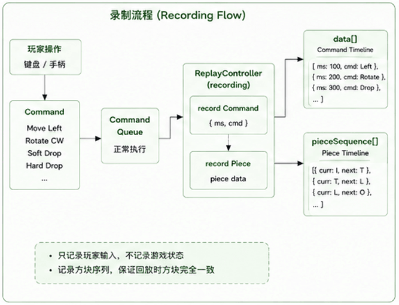
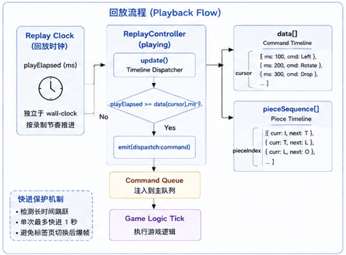
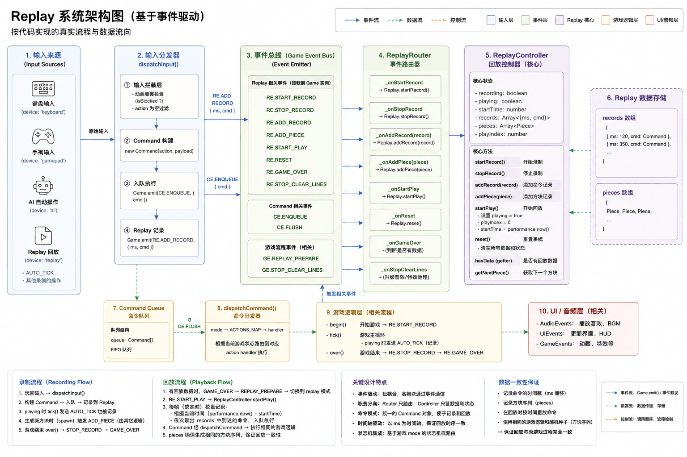

# Replay

简体中文 | [English](./05-replay.en.md)

> Replay 不是录像，它只是另一种输入方式。

## 为什么需要 Replay？

对于 tetris.js 的来说，实现 Replay 这个功能就是我个人想尝试一下，因为 FC 上的俄罗斯方块就支持回放，而开发 tetris.js 这个项目也是希望能用 JavaScript 尽可能的实现 FC 上俄罗斯方块的功能。

## Replay 不是录像

<p align="center">
    
</p>

为实现 Replay 功能我特地到 github 查看了一遍其他的俄罗斯方块的 Replay 的实现，也问了 AI（ChatGPT和DeepSeek），发现实现 Replay 并不需要录屏，只要记录用户的操作。例如：

```text
Move Left

Rotate

Soft Drop

Hard Drop

Hold
```

这些操作都需要转换成统一的 Command，在回放的时候逐个执行记录的操作命令就可以实现了。而 tetris.js 已经实现了 Command
Runtime 的架构了，天然就支持 Replay 功能的实现。

### dispatchInput 中记录用户行为

在介绍 Runtime 的文档（[03-runtime.md](./03-runtime.md)）中就介绍过 tetris.js 通过 dispatchInput 处理用户按键与指令的映射，所有在这里记录 Replay 的回放数据就是最好的位置：

```js
import Command from '@/lib/core/command/command.js';
import { CommandEvents, ReplayEvents } from '@/lib/events/event-catalog.js';

/**
 * # 输入分发器（Input Dispatcher）
 *
 * 将原始输入（键盘、手柄、AI）统一转换为 Command 并推入执行管线， 是整个输入系统的入口和核心枢纽。
 *
 * ## 核心职责
 *
 * 1. **输入拦截**：在动画阻塞期间（倒计时、升级动画等）禁止输入
 * 2. **Command 构建**：将原始输入信息包装为标准 Command 对象
 * 3. **入队执行**：将 Command 推入命令队列，等待后续 flush 执行
 * 4. **Replay 录制**：如果录制开启，将 Command 和时间戳写入回放数据
 *
 * ## 数据流向
 *
 *     键盘/手柄/AI 输入
 *       → Engine._subscribe → dispatch:input 事件
 *       → dispatchInput()
 *         → 拦截检查（动画阻塞？）
 *         → new Command(action, payload)
 *         → command:queue:<id>:enqueue（入队执行）
 *         → replay:<id>:add:record（回放录制）
 *
 * ## 输入来源
 *
 * | device   | 说明        |
 * | -------- | ----------- |
 * | keyboard | 键盘输入    |
 * | gamepad  | 手柄输入    |
 * | ai       | AI 自动操作 |
 *
 * @example
 *   // 键盘左箭头输入
 *   dispatchInput(
 *     { device: 'keyboard', action: 'MOVE_LEFT', payload: { Game } },
 *     { isBlocked: false, ms: 1200 },
 *   );
 *
 *   // AI 硬降输入
 *   dispatchInput(
 *     { device: 'ai', action: 'DROP', payload: { Game } },
 *     { isBlocked: false, ms: 3500 },
 *   );
 *
 * @function dispatchInput
 * @param {object} input - 输入信息
 * @param {object} context - 执行上下文对象
 * @returns {void}
 */
const dispatchInput = (input, context) => {
  const { action, payload } = input;
  const { isBlocked, ms } = context;

  /**
   * ======== 输入拦截层 ========
   *
   * 在以下关键动画期间禁止所有输入：
   *
   * - Countdown（倒计时动画）：防止玩家在倒计时结束前操作
   * - Level-up（升级动画）：防止升级特效期间误操作
   *
   * 同时过滤掉空的 action（未映射的按键等）
   */
  if (isBlocked || !action) {
    return;
  }

  /** ======== Command 构建 ======== */
  const { Game } = payload;
  // 将原始输入包装为标准 Command 对象
  const cmd = new Command(action, payload);
  const uuid = Game.id;
  const CE = CommandEvents(uuid);
  const RE = ReplayEvents(uuid);

  /** ======== 入队执行 ======== */
  // 将 Command 推入命令队列，等待后续的 flush 执行
  Game.emit(CE.ENQUEUE, { cmd });

  /**
   * ======== Replay 记录层 ========
   *
   * 如果回放录制已开启，将 Command 和时间戳写入回放数据。 ms 为扣除暂停时间后的纯游玩时长。
   *
   * 注意：这里属于 side-effect，但暂时保留在 dispatcher 中， 未来可考虑抽取为独立的 replay middleware。
   */
  Game.emit(RE.ADD_RECORD, {
    ms,
    cmd,
  });
};

export default dispatchInput;
```

### Game.tick() 中记录 Game Loop 驱动的自动下落

除了记录用户的按键行为，也必须将 Game Loop 驱动的自动下落的行为记录下来：

```js
import move from '@/lib/game/logic/move.js';
import lock from '@/lib/game/logic/lock.js';
import clearLines from '@/lib/game/logic/clear-lines.js';
import spawn from '@/lib/game/logic/spawn.js';
import { AudioEvents, GameEvents } from '@/lib/events/event-catalog.js';

/**
 * 锁定延迟（毫秒）：方块触底后可继续滑动的时间。
 *
 * 在高速阶段（getSpeed ≤ 100ms），延迟给予玩家额外的操作窗口， 触底后仍可移动或旋转方块，直到计时器累计超过此阈值。
 */
const LOCK_DELAY = 300;

/**
 * # 游戏逻辑帧（Tick）
 *
 * 游戏主循环中每一逻辑帧执行的核心逻辑： 自动下落、碰撞检测、锁定方块、消行、生成新方块。
 *
 * ## 执行流程
 *
 * | 步骤 | 条件                                | 操作                                |
 * | ---- | ----------------------------------- | ----------------------------------- |
 * | 1    | mode 不是 playing/replay 或动画阻塞 | 退出，不执行下落                    |
 * | 2    | mode 是 playing                     | 发送 AUTO_TICK 命令（用于回放录制） |
 * | 3    | 尝试下移一格                        | 调用 `move(game, 0, 1)`             |
 * | 4    | 下移成功                            | 重置锁定延迟，本次 tick 结束        |
 * | 5    | 下移失败（碰撞）                    | 累加锁定延迟 → 超时后锁定           |
 *
 * ## 锁定延迟（Lock Delay）
 *
 * 方块触底后不会立即锁定，而是累加计时器 `curr._lockTimer`。 每次 tick 累加当前等级的下落间隔（`getSpeed()`），
 * 当累计超过 `LOCK_DELAY`（300ms）时才真正锁定。
 *
 * 移动（`move`）或旋转（`rotate`）成功会重置计时器， 给予玩家更多操作时间。这是高速阶段保持可操作性的关键机制。
 *
 * ## 锁定后流程
 *
 * 1. `lock()` — 将方块固化到棋盘
 * 2. `START_LANDING_FLASH` — 触发落地高亮动画
 * 3. `FALL` 音效 — 播放落地音效
 * 4. `clearLines()` — 检测满行并启动消行动画
 * 5. `spawn()` — 生成下一个活动方块
 *
 * @function tick
 * @param {object} runtime - 游戏运行时对象
 * @param {boolean} isBlocked - 是否被动画阻塞
 * @returns {void}
 */
const tick = (runtime, isBlocked) => {
  const mode = runtime.Store.getMode();

  /**
   * ======== 步骤 1：模式检查 ========
   *
   * 非进行中/回放模式，或动画阻塞期间不执行下落。
   */
  if ((mode !== 'playing' && mode !== 'replay') || isBlocked) {
    return;
  }

  const AE = AudioEvents();
  const GE = GameEvents(runtime.id);

  /**
   * ======== 步骤 2：回放录制 ========
   *
   * Playing 模式下将自动下落也记录到回放系统。
   */
  if (mode === 'playing') {
    runtime.emit(GE.DISPATCH_INPUT, {
      device: 'replay',
      action: 'AUTO_TICK',
      payload: { Game: runtime },
    });
  }
  const { curr, cx, cy } = runtime.Store.getState();

  /** ======== 步骤 3：尝试下移 ======== */
  if (move(runtime, 0, 1)) {
    /**
     * 移动成功：重置锁定延迟计时器。
     *
     * 方块成功下移一格说明不在触底状态，清除累计的等待时间。
     */
    if (curr._lockTimer) {
      curr._lockTimer = 0;
    }
    return;
  }

  /**
   * ======== 步骤 4：累加锁定延迟 ========
   *
   * 无法下移（触底或碰撞）：累加锁定延迟计时器。 每次 tick 累加当前等级的下落间隔（getSpeed()）， 模拟"方块在底部停留的时间"。
   */
  if (!curr._lockTimer) {
    curr._lockTimer = 0;
  }
  curr._lockTimer += runtime.getSpeed();

  /**
   * ======== 步骤 5：超时锁定 ========
   *
   * 累计时间超过阈值（300ms），执行锁定和后续流程。
   */
  if (curr._lockTimer >= LOCK_DELAY) {
    curr._lockTimer = 0;

    // 5a. 锁定方块到棋盘
    lock(runtime);

    // 5b. 落地高亮动画
    runtime.emit(GE.START_LANDING_FLASH, {
      piece: { shape: curr.shape, cx, cy },
    });

    // 5c. 播放落地音效
    runtime.emit(AE.PLAY_SOUND, { sound: 'FALL' });

    // 5d. 检测满行并启动消行动画
    clearLines(runtime);

    // 5e. 生成下一个活动方块
    spawn(runtime);
  }
};

export default tick;
```

## 为什么只保存 Command？

因为 Runtime 保证了游戏运行的确定性（Deterministic），对于 Runtime 来说，只要：**初始状态相同**、**随机序列相同**、**Command**
相同，最终得到的游戏结果一定相同。

因此，Replay 不需要保存：Board、Score 、Animation、Canvas 这些游戏状态信息，仅需记录 Command 信息，这样 Replay 的数据量也非常小。Replay 回放的时候只需要重新向 Runtime 输入同样的 Command，Runtime 在运行时就会重新自动计算出来运行是的这些游戏状态，保证整个能完美的重现之前游戏操作。

## Replay 如何工作？

正常游戏：

```text
Player
↓
Command
↓
Runtime
↓
Game State
```

Replay：

```text
Replay Records
↓
Command
↓
Runtime
↓
Game State
```

Replay 的工作方式其实非常简单，与正常游戏相比唯一发生变化的只是 Command 的来源。

<p align="center">
    
</p>

Runtime 完全不知道当前 Command 来自玩家，还是来自 Replay。因此，Replay 与正常游戏拥有完全一致的执行流程。

## Replay 实现

现在该看看 tetris.js 的 Replay 的实现了，它由 ReplayController 和 ReplayRouter 两部分组成：

### Replay Controller

`Replay Controller` 主要管理 Replay 模块的逻辑控制：

```js
import Base from '@/lib/core';
import ReplayRouter from '@/lib/events/router/replay-router.js';
import { GameEvents } from '@/lib/events/event-catalog.js';

/**
 * # ReplayController（回放控制器）
 *
 * 回放 / 录制控制器。负责录制玩家的操作指令和方块序列， 并在游戏结束后按时间线回放整个游戏过程。
 *
 * ## 核心功能
 *
 * - **录制**：记录每帧的 Command 和时间戳、方块序列
 * - **回放**：按录制的时间线重放 Command，驱动游戏重现
 * - **快进**：标签页切后台后回来时限制跳跃上限，防止爆帧
 * - **方块序列**：录制时保存方块顺序，确保回放时方块一致
 *
 * ## 设计说明
 *
 * - **事件路由分离**：所有事件订阅/取消订阅委托给 `ReplayRouter`， `ReplayController` 只负责录制/回放的核心业务逻辑
 * - **多实例支持**：设计为 Class，未来 AI 对战可创建多个独立实例， 每个实例维护自己的录制/回放状态与事件绑定
 *
 * ## 核心字段
 *
 * | 字段          | 类型    | 说明                   |
 * | ------------- | ------- | ---------------------- |
 * | recording     | boolean | 是否正在录制           |
 * | playing       | boolean | 是否正在回放           |
 * | data          | Array   | 录制数据 [{ ms, cmd }] |
 * | cursor        | number  | 回放读取位置           |
 * | pieceSequence | Array   | 方块序列               |
 * | pieceIndex    | number  | 方块序列读取位置       |
 * | playElapsed   | number  | 回放逻辑时间           |
 * | startTime     | number  | 录制/回放起始时间戳    |
 * | timestamp     | number  | 当前帧时间戳           |
 *
 * @augments Base
 * @class ReplayController
 */
class ReplayController extends Base {
  /**
   * ## 是否有录制的回放数据
   *
   * @returns {boolean} 有回放数据返回 true，否则返回 false
   */
  get hasData() {
    return this.data.length > 0;
  }

  /**
   * ## 构造函数
   *
   * @param {object} options - 配置（依赖的执行上下文）对象
   * @param {object} options.Game - 游戏主实例
   * @param {object} options.Store - 游戏状态存储
   * @param {object} options.Scheduler - 任务调度器
   */
  constructor(options) {
    super(options);

    this.initialize();
  }

  /**
   * ## 初始化所有内部状态
   *
   * 重置录制/回放相关的所有标志和数据， 并创建 ReplayRouter 实例处理事件路由。
   *
   * @returns {void}
   */
  initialize() {
    /**
     * ## 是否正在录制
     *
     * @default false
     * @type {boolean}
     */
    this.recording = false;

    /**
     * ## 是否正在回放
     *
     * @default false
     * @type {boolean}
     */
    this.playing = false;

    /**
     * ## 录制数据
     *
     * 数组结构：`[{ ms: number, cmd: Command }]`
     *
     * - `ms`：从录制开始到该命令发生的时间偏移（毫秒）
     * - `cmd`：Command 实例
     *
     * @type {{ ms: number; cmd: object }[]}
     */
    this.data = [];

    /**
     * ## 回放时当前读取到的 data 索引
     *
     * @default 0
     * @type {number}
     */
    this.cursor = 0;

    /**
     * ## 录制的方块序列
     *
     * 用于保证回放时方块顺序与录制时完全一致。
     *
     * @type {object[]}
     */
    this.pieceSequence = [];

    /**
     * ## 回放时当前读取到的方块序列索引
     *
     * @default 0
     * @type {number}
     */
    this.pieceIndex = 0;

    /**
     * ## 回放逻辑时间（毫秒）
     *
     * 独立于 wall-clock 的"回放钟"， 用于按录制时的节奏推进 command。
     *
     * @default 0
     * @type {number}
     */
    this.playElapsed = 0;

    /**
     * ## 录制或回放的起始时间戳
     *
     * 录制时记录第一帧的时间戳， 回放时记录开始回放的时间戳。
     *
     * @default 0
     * @type {number}
     */
    this.startTime = 0;

    /**
     * ## 当前帧的时间戳
     *
     * 由 `update()` 方法每帧更新。
     *
     * @default 0
     * @type {number}
     */
    this.timestamp = 0;

    const { Game } = this;

    /**
     * ## 事件路由器
     *
     * 负责监听所有 `replay:*` 事件并分发到对应方法。
     *
     * @type {ReplayRouter}
     */
    this.Router = new ReplayRouter({
      Replay: this,
      Game,
    });
  }

  /**
   * ## 获取下一个方块
   *
   * 在回放模式下，从录制的方块序列中按顺序读取。 确保回放时的方块顺序与录制时完全一致。
   *
   * @returns {{ curr: object | null; next: object | null }} 当前方块和下一个预览方块
   */
  getNextPiece() {
    // 非回放模式不读取序列
    if (!this.playing) {
      return { curr: null, next: null };
    }

    // 按顺序取出一个方块
    const piece = this.pieceSequence[this.pieceIndex++];

    // 防止索引越界
    if (!piece) {
      return { curr: null, next: null };
    }

    // 预读下一个方块（可能为 null）
    const next = this.pieceSequence[this.pieceIndex] || null;

    return { curr: piece, next };
  }

  /**
   * ## 同步回放逻辑时钟
   *
   * 计算当前 wall-clock 时间与 startTime 的差值作为回放进度。 如果检测到时间跳跃过大（标签页切后台），限制单次跳跃上限为 1 秒，
   * 防止切回后瞬间执行大量 command 导致爆帧。
   *
   * @param {object} ctx - 执行上下文对象
   * @param {number} ctx.timestamp - 当前 requestAnimationFrame 时间戳
   * @param {boolean} ctx.isBlocked - 是否处于暂停/阻塞状态
   * @returns {void}
   */
  syncPlayElapsed({ timestamp, isBlocked }) {
    // 非播放状态或阻塞中跳过
    if (!this.playing || isBlocked) return;

    const prev = this.playElapsed;
    const now = timestamp - this.startTime;
    const delta = now - prev;

    // 时间跳跃超过 1 秒（标签页切后台），限制为最多快进 1 秒
    if (delta > 1000) {
      this.startTime += delta - 1000;
      this.playElapsed = prev + 1000;
    } else {
      this.playElapsed = now;
    }
  }

  /**
   * ## 每帧调用，驱动回放逻辑
   *
   * 执行流程：
   *
   * 1. 更新当前 timestamp
   * 2. 检查是否处于回放状态
   * 3. 检查回放是否完毕（所有 command 已执行）
   * 4. 如有需要，快进跳过长时间等待（标签页切回后）
   * 5. 将所有逻辑时间已到的 command 逐条注入 EventBus
   *
   * @param {object} ctx - 执行上下文对象
   * @param {number} ctx.speed - 当前下落间隔（毫秒），用于快进阈值计算
   * @param {number} ctx.timestamp - 当前 requestAnimationFrame 时间戳
   * @returns {void}
   */
  update({ speed, timestamp }) {
    const { Store, Game, data } = this;
    const mode = Store.getMode();

    // 更新当前帧时间戳
    this.timestamp = timestamp;

    // 非回放状态，直接退出
    if (!this.playing || mode !== 'replay') {
      return;
    }

    const events = GameEvents(Game.id);

    /**
     * ======== 回放完毕：所有 command 都已执行 ========
     *
     * 当 cursor 超出 data 数组长度时，说明所有录制的 command 都已重放完毕。此时停止回放并切换到 game-over 模式。
     */
    if (data.length > 0 && this.cursor >= data.length) {
      this.stopPlay();
      this.emit(events.UPDATE_MODE, { mode: 'game-over' });
      return;
    }

    /**
     * ======== 快进逻辑 ========
     *
     * 如果下一个 command 需要等超过 2 倍下落间隔， 说明中间有暂停/空白（玩家暂停或标签页切后台）。 直接快进到该 command
     * 附近，避免长时间"卡等"。
     */
    const next = data[this.cursor];

    if (next) {
      const interval = speed ?? 1000;
      const gap = next.ms - this.playElapsed;

      if (gap > interval * 2) {
        // 单次最多快进 1 秒，防止瞬间爆帧
        const skip = Math.min(gap - interval, 1000);
        this.playElapsed += skip;
        this.startTime = timestamp - this.playElapsed;
      }
    }

    /**
     * ======== 核心回放循环 ========
     *
     * 将所有逻辑时间 <= playElapsed 的 command 一次性注入 EventBus。 这些 command 会通过
     * dispatchCommand 分发到对应的 action handler 执行。
     */
    while (
      this.playing &&
      this.cursor < data.length &&
      data[this.cursor].ms <= this.playElapsed
    ) {
      const { cmd } = data[this.cursor];

      if (cmd.action === 'HOLD_SYNC') {
        // 不参与游戏逻辑，只用于调试/渲染
        return;
      }

      this.emit(events.DISPATCH_COMMAND, cmd);
      this.cursor++;
    }
  }

  /**
   * ## 开始录制
   *
   * 开启 recording 标志，清空旧数据和方块序列， 将 startTime 设置为当前 timestamp。
   *
   * @returns {void}
   */
  startRecord() {
    this.recording = true;
    this.data = [];
    this.pieceSequence = [];
    this.pieceIndex = 0;
    this.playElapsed = 0;
    this.startTime = this.timestamp;
  }

  /**
   * ## 停止录制
   *
   * @returns {void}
   */
  stopRecord() {
    this.recording = false;
  }

  /**
   * ## 开始回放
   *
   * 开启 playing 标志，重置 cursor 和 pieceIndex， 将 startTime 设置为当前 timestamp。
   *
   * @returns {void}
   */
  startPlay() {
    this.playing = true;
    this.cursor = 0;
    this.pieceIndex = 0;
    this.startTime = this.timestamp;
  }

  /**
   * ## 停止回放
   *
   * @returns {void}
   */
  stopPlay() {
    this.playing = false;
  }

  /**
   * ## 添加一条录制记录
   *
   * 只在 recording 状态下写入数据。
   *
   * @param {object} record - 录制数据 `{ ms, cmd }`
   * @returns {void}
   */
  addRecord(record) {
    if (!this.recording) {
      return;
    }

    this.data.push(record);
  }

  /**
   * ## 添加一个方块到序列
   *
   * 只在 recording 状态下写入，使用深拷贝避免引用污染。
   *
   * @param {object} piece - 方块数据
   * @returns {void}
   */
  addPiece(piece) {
    if (!this.recording) {
      return;
    }

    this.pieceSequence.push(structuredClone(piece));
  }

  /**
   * ## 清除所有数据，重置标志位
   *
   * 注意：不清除事件绑定，仅重置录制/回放相关状态。
   *
   * @returns {void}
   */
  clear() {
    this.recording = false;
    this.playing = false;
    this.cursor = 0;
    this.data = [];
    this.pieceSequence = [];
    this.pieceIndex = 0;
    this.startTime = 0;
  }

  /**
   * ## 停止录制/回放并清除所有数据
   *
   * 等同于 `stopRecord()` + `stopPlay()` + `clear()`。 通过 `replay:<id>:reset` 事件触发。
   *
   * @returns {void}
   */
  reset() {
    this.stopRecord();
    this.stopPlay();
    this.clear();
  }

  /**
   * ## 绑定所有事件监听
   *
   * 委托给 ReplayRouter 处理。
   *
   * @returns {void}
   */
  subscribe() {
    this.Router.subscribe();
  }

  /**
   * ## 取消绑定所有事件监听
   *
   * 委托给 ReplayRouter 处理。
   *
   * @returns {void}
   */
  unsubscribe() {
    this.Router.unsubscribe();
  }

  /**
   * ## 销毁实例
   *
   * 停止所有录制/回放、清除数据、解绑所有事件。 主要用于 AI 对战切换对手或完全卸载 replay 模块。
   *
   * @returns {void}
   */
  destroy() {
    // 先停止和清空状态
    this.reset();

    // 逐个解绑事件
    this.unsubscribe();
  }
}

export default ReplayController;
```

### ReplayRouter

`ReplayRouter` 主要负责 Replay 相关的事件订阅和事件发布：

```js
import Base from '@/lib/core';
import {
  AudioEvents,
  AIEvents,
  GameEvents,
  ReplayEvents,
  UIEvents,
} from '@/lib/events/event-catalog.js';

/**
 * # ReplayRouter（回放事件路由器）
 *
 * 负责处理所有与回放系统相关的事件路由。 作为 ReplayController 和游戏事件系统之间的桥梁，将外部事件转换为对
 * ReplayController 的方法调用。
 *
 * ## 核心职责
 *
 * - **事件监听**：监听所有 `replay:*` 命名空间的事件
 * - **事件分发**：根据事件类型调用 ReplayController 的相应方法
 * - **流程协调**：在游戏结束、消行等关键时刻协调回放系统的行为
 *
 * ## 设计说明
 *
 * - **职责分离**：将事件路由逻辑从 ReplayController 中分离出来，保持控制器专注于核心业务逻辑
 * - **事件集中管理**：所有回放相关的事件处理逻辑都集中在此类中，便于维护和理解
 * - **状态感知**：根据回放状态和游戏状态智能决定是否响应某些事件
 *
 * ## 处理的事件类型
 *
 * | 事件类别 | 事件名称         | 处理方法           | 说明               |
 * | -------- | ---------------- | ------------------ | ------------------ |
 * | 录制操作 | START_RECORD     | \_onStartRecord    | 开始录制游戏过程   |
 * | 录制操作 | STOP_RECORD      | \_onStopRecord     | 停止录制游戏过程   |
 * | 录制操作 | ADD_RECORD       | \_onAddRecord      | 添加一条操作记录   |
 * | 录制操作 | ADD_PIECE        | \_onAddPiece       | 添加一个方块到序列 |
 * | 回放操作 | START_PLAY       | \_onStartPlay      | 开始回放游戏过程   |
 * | 回放操作 | RESET            | \_onReset          | 重置回放系统       |
 * | 流程控制 | GAME_OVER        | \_onGameOver       | 游戏结束时的处理   |
 * | 流程控制 | STOP_CLEAR_LINES | \_onStopClearLines | 消行结束时的处理   |
 *
 * @augments Base
 * @class ReplayRouter
 */
class ReplayRouter extends Base {
  /**
   * ## 构造函数
   *
   * 创建 ReplayRouter 实例。 注意：构造函数不会自动订阅事件，需要手动调用 `subscribe()`。
   *
   * @param {object} options - 配置（依赖的执行上下文）对象
   * @param {object} options.Game - 游戏主实例
   * @param {object} options.Replay - ReplayController 实例
   */
  constructor(options) {
    super(options);
    // 事件绑定在外部手动调用，保持初始化的灵活性
  }

  /**
   * ## 绑定所有事件监听
   *
   * 在游戏初始化时调用一次。 注册所有回放系统需要监听的游戏事件。
   *
   * ### 监听的事件分类
   *
   * 1. **录制操作事件**：开始录制、停止录制、添加记录、添加方块
   * 2. **回放操作事件**：开始回放、重置回放
   * 3. **流程控制事件**：游戏结束、消行完成
   *
   * @returns {void}
   */
  subscribe() {
    const { Game } = this;
    // 获取回放系统的事件名称（带游戏 ID 命名空间）
    const events = ReplayEvents(Game.id);

    /* ---------- 记录操作 ---------- */
    // 开始录制游戏过程
    this.on(events.START_RECORD, this._onStartRecord);
    // 停止录制游戏过程
    this.on(events.STOP_RECORD, this._onStopRecord);
    // 添加一条操作命令记录
    this.on(events.ADD_RECORD, this._onAddRecord);
    // 添加一个方块到序列
    this.on(events.ADD_PIECE, this._onAddPiece);

    /* ---------- 回放操作 ---------- */
    // 开始回放游戏过程
    this.on(events.START_PLAY, this._onStartPlay);
    // 重置回放系统（清除所有数据）
    this.on(events.RESET, this._onReset);

    /* ---------- 流程控制 ---------- */
    // 游戏结束时的处理（准备回放或进入结束界面）
    this.on(events.GAME_OVER, this._onGameOver);
    // 消行结束时的处理（处理升级音效和特效）
    this.on(events.STOP_CLEAR_LINES, this._onStopClearLines);
  }

  /**
   * ## 取消绑定所有事件监听
   *
   * 移除所有已注册的事件监听器。 在组件销毁或不需要响应回放事件时调用，避免内存泄漏。
   *
   * @returns {void}
   */
  unsubscribe() {
    const { Game } = this;
    // 获取回放系统的事件名称（带游戏 ID 命名空间）
    const events = ReplayEvents(Game.id);

    /* ---------- 记录操作 ---------- */
    this.off(events.START_RECORD, this._onStartRecord);
    this.off(events.STOP_RECORD, this._onStopRecord);
    this.off(events.ADD_RECORD, this._onAddRecord);
    this.off(events.ADD_PIECE, this._onAddPiece);

    /* ---------- 回放操作 ---------- */
    this.off(events.START_PLAY, this._onStartPlay);
    this.off(events.RESET, this._onReset);

    /* ---------- 流程控制 ---------- */
    this.off(events.GAME_OVER, this._onGameOver);
    this.off(events.STOP_CLEAR_LINES, this._onStopClearLines);
  }

  /**
   * ## 开始录制
   *
   * 当接收到 `START_RECORD` 事件时触发。 调用 ReplayController 的 `startRecord()`
   * 方法开始录制游戏过程。
   *
   * @private
   * @returns {void}
   */
  _onStartRecord = () => {
    const { Replay } = this;
    Replay.startRecord();
  };

  /**
   * ## 停止录制
   *
   * 当接收到 `STOP_RECORD` 事件时触发。 调用 ReplayController 的 `stopRecord()` 方法停止录制游戏过程。
   *
   * @private
   * @returns {void}
   */
  _onStopRecord = () => {
    const { Replay } = this;
    Replay.stopRecord();
  };

  /**
   * ## 录制一条 command
   *
   * 当接收到 `ADD_RECORD` 事件时触发。 只在 recording 状态下写入，非录制状态自动忽略。
   *
   * @private
   * @param {object} record - 录制数据对象
   * @param {number} record.ms - 从录制开始到该命令的时间偏移（毫秒）
   * @param {object} record.cmd - Command 命令对象
   * @returns {void}
   */
  _onAddRecord = (record) => {
    const { Replay } = this;
    Replay.addRecord(record);
  };

  /**
   * ## 录制一个方块
   *
   * 当接收到 `ADD_PIECE` 事件时触发。 只在 recording 状态下写入，使用深拷贝避免引用污染。
   *
   * @private
   * @param {object} piece - 方块数据对象（包含形状、颜色、位置等信息）
   * @returns {void}
   */
  _onAddPiece = (piece) => {
    const { Replay } = this;
    Replay.addPiece(piece);
  };

  /**
   * ## 开始回放
   *
   * 当接收到 `START_PLAY` 事件时触发。 调用 ReplayController 的 `startPlay()` 方法开始回放游戏过程。
   *
   * @private
   * @returns {void}
   */
  _onStartPlay = () => {
    const { Replay } = this;
    Replay.startPlay();
  };

  /**
   * ## 重置回放系统
   *
   * 当接收到 `RESET` 事件时触发。 调用 ReplayController 的 `reset()` 方法停止录制/回放并清除所有数据。
   *
   * @private
   * @returns {void}
   */
  _onReset = () => {
    const { Replay } = this;
    Replay.reset();
  };

  /**
   * ## 游戏结束时的处理
   *
   * 当接收到 `GAME_OVER` 事件时触发。
   *
   * ### 处理逻辑
   *
   * - **有回放数据**：准备棋盘进入回放模式
   *
   *   - 停止 AI 控制
   *   - 触发 `REPLAY_PREPARE` 事件，传递下一个方块信息
   * - **无回放数据**：直接进入 game-over 状态
   *
   *   - 触发 UI 模式更新事件
   *   - 触发游戏模式更新事件
   *
   * 这种设计允许玩家在游戏结束后立即回放刚刚的游戏过程。
   *
   * @private
   * @returns {void}
   */
  _onGameOver = () => {
    const { Replay, Game } = this;
    const uuid = Game.id;
    const AE = AIEvents(uuid); // AI 事件
    const GE = GameEvents(uuid); // 游戏事件
    const UE = UIEvents(uuid); // UI 事件

    // 检查是否有录制的回放数据
    if (Replay.hasData) {
      // 有回放数据：停止 AI 控制
      this.emit(AE.STOP);
      // 准备回放棋盘，传递下一个方块信息
      this.emit(GE.REPLAY_PREPARE, {
        nextPiece: Replay.getNextPiece(),
      });
    } else {
      // 无回放数据：直接进入游戏结束界面
      this.emit(UE.UPDATE_MODE, { mode: 'game-over' });
      this.emit(GE.UPDATE_MODE, { mode: 'game-over' });
    }
  };

  /**
   * ## 消行时的处理
   *
   * 当接收到 `STOP_CLEAR_LINES` 事件时触发。
   *
   * ### 处理逻辑
   *
   * 回放中不触发升级提示音/动画；录制或正常游戏中升级时触发。 这种设计确保：
   *
   * - 回放时不会重复播放升级特效（这些特效已在录制时播放过）
   * - 正常游戏和录制过程中仍然有完整的视听反馈
   *
   * ### 触发效果
   *
   * 1. 暂停当前背景音乐（BGM）
   * 2. 播放升级音效
   * 3. 触发升级特效动画
   *
   * @private
   * @param {object} param - 参数对象
   * @param {boolean} param.isLevelUp - 是否升级（消除的行数达到升级条件）
   * @param {number} param.level - 当前等级（升级后的新等级）
   * @returns {void}
   */
  _onStopClearLines = ({ isLevelUp, level }) => {
    const { Game, Replay } = this;

    // 只在升级且非回放状态下触发升级效果，回放时跳过，避免重复播放特效
    if (!isLevelUp || Replay.playing) {
      return;
    }

    const AE = AudioEvents(); // 音频事件
    const GE = GameEvents(Game.id); // 游戏事件

    // 非对战模式才播放升级音效
    if (!Game.isVersus()) {
      // 暂停当前背景音乐，为升级音效让路
      this.emit(AE.STOP_BGM);
      // 播放升级音效

      this.emit(AE.PLAY_SOUND, { sound: 'LEVEL_UP' });
      // 触发升级特效动画
      this.emit(GE.START_LEVEL_UP, { level });
    }
  };
}

export default ReplayRouter;
```

## Replay 为什么能够保持同步？

Replay 成立的前提并不是 Command，真正重要的是：**Runtime 的确定性**。

如果同一个 Command 今天执行一次，明天执行一次，得到不同结果，那么 Replay 将立即失效。因此，整个项目始终遵循一个原则：**相同输入，产生相同输出**。

而具体负责 Replay 与 Game Loop 主循环保持同步的方法则是：`update`。

### update

```js
class Replay extends Base {
  /**
   * ## 每帧调用，驱动回放逻辑
   *
   * 执行流程：
   *
   * 1. 更新当前 timestamp
   * 2. 检查是否处于回放状态
   * 3. 检查回放是否完毕（所有 command 已执行）
   * 4. 如有需要，快进跳过长时间等待（标签页切回后）
   * 5. 将所有逻辑时间已到的 command 逐条注入 EventBus
   *
   * @param {object} ctx - 执行上下文对象
   * @param {number} ctx.speed - 当前下落间隔（毫秒），用于快进阈值计算
   * @param {number} ctx.timestamp - 当前 requestAnimationFrame 时间戳
   * @returns {void}
   */
  update({ speed, timestamp }) {
    const { Store, Game, data } = this;
    const mode = Store.getMode();

    // 更新当前帧时间戳
    this.timestamp = timestamp;

    // 非回放状态，直接退出
    if (!this.playing || mode !== 'replay') {
      return;
    }

    const events = GameEvents(Game.id);

    /**
     * ======== 回放完毕：所有 command 都已执行 ========
     *
     * 当 cursor 超出 data 数组长度时，说明所有录制的 command 都已重放完毕。此时停止回放并切换到 game-over 模式。
     */
    if (data.length > 0 && this.cursor >= data.length) {
      this.stopPlay();
      this.emit(events.UPDATE_MODE, { mode: 'game-over' });
      return;
    }

    /**
     * ======== 快进逻辑 ========
     *
     * 如果下一个 command 需要等超过 2 倍下落间隔， 说明中间有暂停/空白（玩家暂停或标签页切后台）。 直接快进到该 command
     * 附近，避免长时间"卡等"。
     */
    const next = data[this.cursor];

    if (next) {
      const interval = speed ?? 1000;
      const gap = next.ms - this.playElapsed;

      if (gap > interval * 2) {
        // 单次最多快进 1 秒，防止瞬间爆帧
        const skip = Math.min(gap - interval, 1000);
        this.playElapsed += skip;
        this.startTime = timestamp - this.playElapsed;
      }
    }

    /**
     * ======== 核心回放循环 ========
     *
     * 将所有逻辑时间 <= playElapsed 的 command 一次性注入 EventBus。 这些 command 会通过
     * dispatchCommand 分发到对应的 action handler 执行。
     */
    while (
      this.playing &&
      this.cursor < data.length &&
      data[this.cursor].ms <= this.playElapsed
    ) {
      const { cmd } = data[this.cursor];

      if (cmd.action === 'HOLD_SYNC') {
        // 不参与游戏逻辑，只用于调试/渲染
        return;
      }

      this.emit(events.DISPATCH_COMMAND, cmd);
      this.cursor++;
    }
  }
}
```

update 方法会接受两个参数：

- speed：当前下落间隔（毫秒），用于快进阈值计算
- timestamp： 当前游戏主循环 Game Loop 的 requestAnimationFrame 时间戳

`timestamp` 就是游戏 Game
Loop 主循环的时间戳，Replay 播放回放镜头的时候就是靠的它与主循环同步时间。

### requestAnimationFrame 在标签页失去焦点的问题

需要注意的一个问题是 requestAnimationFrame 目前主流浏览器的行为是在标签页失去焦点时：**浏览器会自动暂停或大幅降低其回调执行频率**。

这主要出于性能和省电的考虑，具体表现如下：

#### **完全暂停（最常见）**

当用户切换到其他标签页或最小化浏览器窗口时，大多数现代浏览器会将 rAF 的回调执行完全暂停。页面上基于 rAF 的动画、游戏逻辑、数据更新等都会随之停止，就像按下了暂停键。

这正是保证 JS 动画流畅的前提——如果页面不可见，就没有必要浪费资源去渲染用户看不到的帧。

#### **节流执行（特定场景）**

在某些场景下，比如页面被其他窗口半遮挡但仍部分可见，或使用了浏览器的后台标签页节流机制，rAF 可能不会被完全暂停，而是以极低的频率执行（比如每秒1次）。但这种行为并不统一，不应依赖。

对于 tetris.js 的回放动画这种依赖于时间步长（比如位置的累加），当标签页恢复时，动画可能会“跳帧”。因为恢复的瞬间，回调函数的参数 DOMHighResTimeStamp 会有一个巨大的差值。

### syncPlayElapsed 同步回放逻辑时钟

再讲具体些就是玩家切回游戏标签页面后会瞬间执行大量 command 导致爆帧，为了解决这个问题，Replay 专门提供了
`syncPlayElapsed` 方法来同步回放逻辑时钟：

```js
/**
 * ## 同步回放逻辑时钟
 *
 * 计算当前 wall-clock 时间与 startTime 的差值作为回放进度。 如果检测到时间跳跃过大（标签页切后台），限制单次跳跃上限为 1 秒，
 * 防止切回后瞬间执行大量 command 导致爆帧。
 *
 * @param {object} ctx - 执行上下文对象
 * @param {number} ctx.timestamp - 当前 requestAnimationFrame 时间戳
 * @param {boolean} ctx.isBlocked - 是否处于暂停/阻塞状态
 * @returns {void}
 */
syncPlayElapsed({ timestamp, isBlocked }) {
  // 非播放状态或阻塞中跳过
  if (!this.playing || isBlocked) return;

  const prev = this.playElapsed;
  const now = timestamp - this.startTime;
  const delta = now - prev;

  // 时间跳跃超过 1 秒（标签页切后台），限制为最多快进 1 秒
  if (delta > 1000) {
    this.startTime += delta - 1000;
    this.playElapsed = prev + 1000;
  } else {
    this.playElapsed = now;
  }
}
```

计算当前 wall-clock 时间与 startTime 的差值作为回放进度。

```js
/**
 * ======== 核心回放循环 ========
 *
 * 将所有逻辑时间 <= playElapsed 的 command 一次性注入 EventBus。 这些 command 会通过
 * dispatchCommand 分发到对应的 action handler 执行。
 */
while (
  this.playing &&
  this.cursor < data.length &&
  data[this.cursor].ms <= this.playElapsed
) {
  const { cmd } = data[this.cursor];

  if (cmd.action === 'HOLD_SYNC') {
    // 不参与游戏逻辑，只用于调试/渲染
    return;
  }

  this.emit(events.DISPATCH_COMMAND, cmd);
  this.cursor++;
}
```

如果检测到时间跳跃过大（标签页切后台），限制单次跳跃上限为 1 秒，**防止切回后瞬间执行大量 command 导致爆帧**。

## Replay 带来的价值

Replay 的意义远远不只是"回放一局游戏"。由于 Replay 本质上保存的是
`Command`，它还能用于：

- Bug 重现
- AI 调试
- 性能测试
- 自动化测试
- 数据分析

## Replay 架构图

前面说了很多 Replay 的具体实现细节，让我们通过 Replay 的架构中全面的了解一下它是如何工作的：

<p align="center">
    
</p>

## Runtime 才是真正的主角

Replay 看起来像一个独立模块，实际上它几乎没有自己的游戏逻辑。Replay 做的事情非常简单：读取 Command。然后依次提交给 Runtime。

真正推动整个游戏运行的，始终都是 Runtime。Replay 只是 Runtime 的另一种输入来源。这一设计也让 Replay 与：

- 玩家
- AI
- Battle

共享完全一致的执行流程。

## 小结

Replay 并不是录像，它也不是棋盘快照。Replay 保存的只是游戏过程中产生的 Command。

真正让 Replay 成立的不是 Replay 本身，而是 Runtime 的确定性。正因为整个游戏始终遵循：**相同输入，产生相同输出**。

Replay 才能够以极小的数据量完整重现整局游戏，这也是整个项目架构设计所带来的自然结果。

## 下一步阅读

Replay 记录了游戏如何发生，下一章将介绍：**Battle**。了解多人对战如何建立在同一套 Runtime 之上，而无需重新实现另一套游戏逻辑。

**下一章：[06-battle.md](./06-battle.md)**
