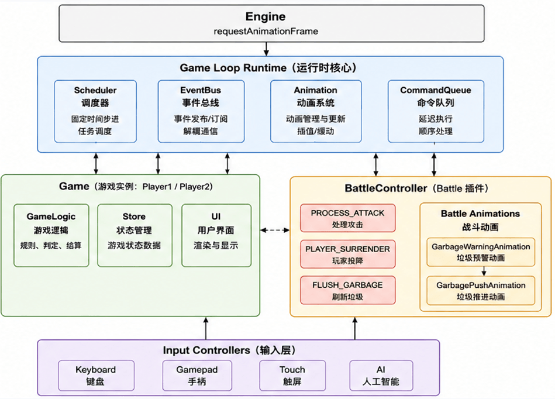
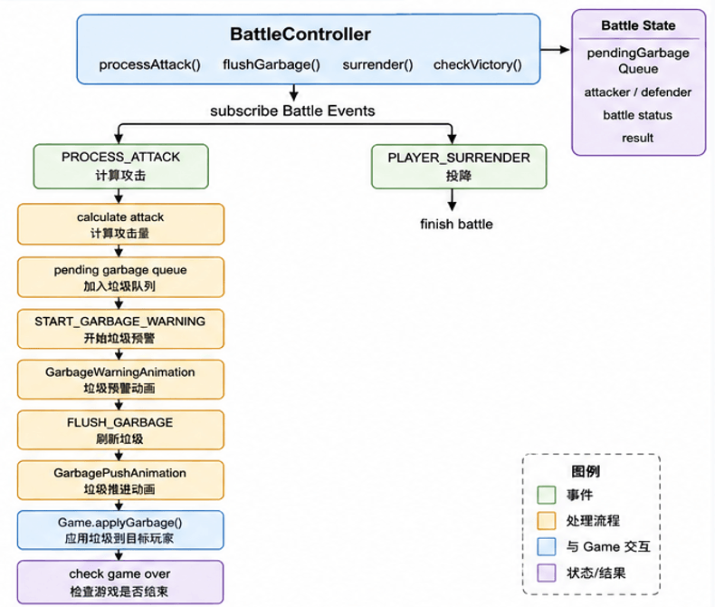
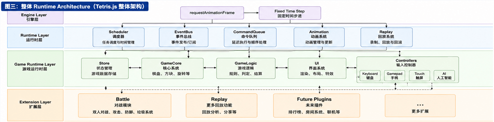

# Battle

English | [简体中文](./06-battle.md)

> Battle is not another game, but multiple Runtimes working together in the same
> match.

## Battle is Not Another Game

For Tetris, multiplayer battles are not just about: **displaying two boards
simultaneously**. What is truly complex is:

- Both sides need to run simultaneously
- Both sides have independent states
- Both sides need to exchange Garbage
- Both sides still need to remain deterministic

Many projects re-implement a new set of game logic for multiplayer mode. While
this can achieve the functionality, single-player and multiplayer gradually
evolve into two different systems. As the project continues to expand,
maintenance costs increase.

Therefore, tetris.js is not designed as two different systems. Battle does not
modify Gameplay, nor does it modify Runtime. What truly changes is the number of
Runtimes.

**Single-player mode:**

```text
Runtime
```

**Multiplayer mode:**

```text
Runtime A
↓
Battle Controller
↑
Runtime B
```

<p align="center">
    
</p>

Both sides still run their own complete games. The Battle Controller is only
responsible for coordinating the information that needs to be exchanged between
them. Therefore, Battle does not create new game rules; it only organizes
multiple Runtimes to run together.

## Battle Controller

<p align="center">
    
</p>

What the Battle Controller module is truly responsible for:

- Managing multiple Runtimes
- Forwarding Battle events
- Synchronizing Garbage
- Determining win/loss
- Controlling the match lifecycle

It does not:

- Control players
- Control AI
- Modify the board
- Render the screen

```js
import Base from '@/lib/core';
import BattleStore from '@/lib/battle/state/battle-store.js';
import BattleHUD from '@/lib/battle/ui/battle-hud.js';
import BattleUI from '@/lib/battle/ui/battle-ui.js';
import BattleRouter from '@/lib/events/router/battle-router.js';
import {
  calculateGarbage,
  applyGarbage,
} from '@/lib/battle/rules/garbage-system.js';
import {
  GameEvents,
  AudioEvents,
  BattleEvents,
} from '@/lib/events/event-catalog.js';

/**
 * # Battle Controller
 *
 * The core controller for battle mode, responsible for coordinating all battle
 * subsystems, including state management, HUD updates, UI display, event
 * routing, and garbage system.
 *
 * ## Core Responsibilities
 *
 * | Responsibility                   | Description                                                                  |
 * | -------------------------------- | ---------------------------------------------------------------------------- |
 * | **Subsystem Coordination**       | Creates and manages BattleStore, BattleHUD, BattleUI, BattleRouter instances |
 * | **Lifecycle Management**         | Controls battle start, stop, and reset                                       |
 * | **Round Win/Loss Determination** | Handles round end events, updates winners and scores                         |
 * | **Match Win/Loss Determination** | Checks if victoryScore is reached, triggers match end or next round          |
 * | **Attack Processing**            | Calculates clear attack power, offsets pending garbage, forwards attacks     |
 * | **Garbage Generation**           | Applies pending garbage to the opponent's board                              |
 * | **Surrender Handling**           | Handles player surrender, opponent wins directly                             |
 * | **Event Management**             | Subscribes/unsubscribes battle events through BattleRouter                   |
 *
 * ## Match System
 *
 * ### Round vs Match
 *
 * - **Round**: A single game ends (when a player's board fills up), winner gets
 *   +1 point
 * - **Match**: The player who reaches `victoryScore` first wins the entire match
 *
 * ### Battle Flow
 *
 *     ┌─────────────────────────────────────────────┐
 *     │              Match Starts                    │
 *     │  store.setRunning(true)                      │
 *     └─────────────────┬───────────────────────────┘
 *                       │
 *                       ▼
 *     ┌─────────────────────────────────────────────┐
 *     │              Round Loop                      │
 *     │  ┌─────────────────────────────────────┐    │
 *     │  │  1. Both games in progress           │    │
 *     │  │  2. Player board fills → update(loser)│    │
 *     │  │     - Winner +1 point                 │    │
 *     │  │     - Check score >= victoryScore？    │    │
 *     │  │       ├─ Yes → over(winner, loser)   │    │
 *     │  │       └─ No → restart(loser)         │    │
 *     │  └─────────────────────────────────────┘    │
 *     └─────────────────┬───────────────────────────┘
 *                       │
 *                       ▼
 *     ┌─────────────────────────────────────────────┐
 *     │     Someone reaches victoryScore → Match End │
 *     │  over(winner, loser)                         │
 *     │    → Both switch to battle-over mode         │
 *     │    → BattleUI.show(winnerName)               │
 *     │    → Display battle result overlay           │
 *     └─────────────────────────────────────────────┘
 *
 * ## Architecture Design
 *
 *     BattleController
 *       ├── BattleStore (State Management)
 *       │   ├── running / winner / scores / pendingGarbage
 *       │   └── Garbage accumulation, offset, query
 *       ├── BattleHUD (Real-time Score Updates)
 *       │   └── DOM score element updates
 *       ├── BattleUI (Battle Result Display & Fly Canvas Management)
 *       │   ├── Overlay shows winner
 *       │   └── Fly canvas show/hide
 *       ├── BattleRouter (Event Routing)
 *       │   └── 8 battle event subscriptions and dispatching
 *       └── Garbage System
 *           ├── calculateGarbage (Attack power calculation)
 *           └── applyGarbage (Garbage line generation)
 *
 * ## Attack Processing Flow (with Animation Timing)
 *
 *     Player A clears lines
 *       → Triggers PROCESS_ATTACK event
 *         → processAttack(from, lines)
 *           → calculateGarbage(lines) calculates attack power
 *           → offsetGarbage(from, attack) offsets own pending garbage
 *             ├─ Has remaining attack → addGarbage(to, remaining) send to opponent
 *             │   └─ Scheduler.sequence arranges animation timing:
 *             │       1. Show fly canvas
 *             │       2. Trigger START_GARBAGE_FLY → FlyAnimation 400ms
 *             │       3. 400ms later trigger START_GARBAGE_WARNING → WarningAnimation 600ms
 *             │       4. 600ms later hide fly canvas
 *             │       5. 120ms later play GARBAGE_WARNING sound effect
 *             └─ No remaining → end
 *       → Clear animation plays
 *       → Triggers FLUSH_GARBAGE event
 *         → flushGarbage(game)
 *           → getPendingGarbage(game) gets pending garbage
 *           → applyGarbage(board, amount, difficulty) generates garbage board
 *           → setState({ board: next }) updates opponent's board
 *           → clearGarbage(game) clears pending count
 *           → Triggers START_GARBAGE_PUSH → PushAnimation blink
 *           → 120ms later play GARBAGE_RECEIVED sound effect
 *
 * ## Surrender Flow
 *
 *     Player presses ESC to surrender
 *       → Game.surrender()
 *         → Sends PLAYER_SURRENDER event
 *           → BattleRouter routes to surrender(loser)
 *             → Opponent's score directly set to victoryScore
 *             → over(winner, loser) triggers BATTLE OVER
 *
 * @augments Base
 * @class BattleController
 */
class BattleController extends Base {
  /**
   * ## Constructor
   *
   * Initializes the battle controller and all its subsystems, automatically
   * starts battle after completion.
   *
   * @param {object} options - Configuration options
   * @param {object[]} options.games - Game instances array (length 2)
   * @param {number} [options.victoryScore=20] - Target score, first to reach
   *   wins the match. Default is `20`
   * @param {object} options.elements - DOM element ID configuration required by
   *   BattleUI
   * @param {string[]} options.players - Player name array
   */
  constructor(options) {
    super(options);
    this.initialize();
  }

  /**
   * ## Initialize battle system
   *
   * Creates the four core subsystems required for battle: BattleStore →
   * BattleHUD → BattleRouter → BattleUI. Automatically calls start() to begin
   * battle after completion.
   *
   * @returns {void}
   */
  initialize() {
    const { games, elements, players } = this;
    const store = new BattleStore({ games });

    this.store = store;
    this.hud = new BattleHUD({ games, store });
    this.router = new BattleRouter({ battle: this });
    this.ui = new BattleUI({ elements, players });

    this.start();
  }

  /**
   * ## Start battle
   *
   * Sets battle state to running. Idempotent.
   *
   * @returns {void}
   */
  start() {
    const { store } = this;
    if (store.isRunning()) return;
    store.setRunning(true);
  }

  /**
   * ## Stop battle
   *
   * Sets battle state to stopped. Idempotent.
   *
   * @returns {void}
   */
  stop() {
    const { store } = this;
    if (!store.isRunning()) return;
    store.setRunning(false);
  }

  /**
   * ## Update battle result (round end)
   *
   * Called when a player's game ends, executes the complete round end
   * processing flow.
   *
   * @param {object} loser - The losing player's Game instance
   * @returns {void}
   */
  update(loser) {
    const { store } = this;
    const winner = this.getOpponent(loser);
    const difficulty = winner.Store.getDifficulty();
    const victoryScore = store.getVictoryScore(difficulty);

    this.stop();
    store.setWinner(winner);
    store.updateScores({ winner, loser });
    this.hud.updateScores(winner, loser);

    const winnerId = store.getPlayerId(winner);
    const winnerScore = store.getScore(winnerId);

    if (winnerScore >= victoryScore) {
      this.over(winner, loser);
    } else {
      this.restart(loser);
    }
  }

  /**
   * ## Match over
   *
   * Notifies both sides to switch to battle-over mode, displays winner name.
   *
   * @param {object} winner - Winner Game instance
   * @param {object} loser - Loser Game instance
   * @returns {void}
   */
  over(winner, loser) {
    const WE = GameEvents(winner.id);
    const LE = GameEvents(loser.id);
    const AE = AudioEvents();
    const payload = { mode: 'battle-over' };
    const { Scheduler } = winner;

    winner.emit(WE.UPDATE_MODE, payload);
    loser.emit(LE.UPDATE_MODE, payload);

    const { Player } = winner;
    winner.emit(AE.STOP_BGM);

    Scheduler.delay(() => {
      winner.emit(AE.PLAY_SOUND, { sound: 'SWITCH_SCENE' });
    }, 120);

    this.ui.show({ winner: Player });
  }

  /**
   * ## Restart a round
   *
   * Called when a round ends but the match is not yet over.
   *
   * @param {object} loser - The losing player's Game instance for this round
   * @returns {void}
   */
  restart(loser) {
    const events = GameEvents(loser.id);
    const winner = this.getOpponent(loser);

    winner.Animations?.clear?.();
    loser.Animations?.clear?.();

    this.store.increaseRound();
    loser.emit(events.RESTART);
    this.start();
  }

  /**
   * ## Reset the entire match
   *
   * Clears all scores and states, starts a brand new match.
   *
   * @param {object} from - The player Game instance initiating the reset
   * @returns {void}
   */
  reset(from) {
    const opponent = this.getOpponent(from);

    this.store.reset();
    this.hud.updateScores(from, opponent);
    this.ui.hide({ over: true });

    const FE = GameEvents(from.id);
    const OE = GameEvents(opponent.id);

    from.emit(FE.RESET);
    opponent.emit(OE.RESET);
  }

  /**
   * ## Get opponent
   *
   * @param {object} yourself - Current player Game instance
   * @returns {object} Opponent's Game instance
   */
  getOpponent(yourself) {
    const { games } = this;
    return games.find((game) => game.id !== yourself.id);
  }

  /**
   * ## Get current round ID
   *
   * @returns {number} Unique identifier for the current round
   */
  getRoundId() {
    return this.store.getRoundId();
  }

  /**
   * ## Get specified player's fly canvas
   *
   * @param {string} index - Player identifier (e.g., "human-0")
   * @returns {HTMLCanvasElement} The fly canvas element for the specified
   *   player
   */
  getOverlayFly(index) {
    return this.ui.$flies[index];
  }

  /**
   * ## Process clear attack
   *
   * Calculates attack power, offsets pending garbage, forwards attack.
   *
   * @param {object} from - The player Game instance initiating the attack
   * @param {Array} lines - The cleared lines array
   * @returns {number} Actual garbage lines sent to the opponent
   */
  processAttack(from, lines) {
    const to = this.getOpponent(from);
    const attack = calculateGarbage(lines.length);

    if (attack <= 0) return 0;

    const { store } = this;
    const remaining = store.offsetGarbage(from, attack);

    if (remaining > 0) {
      store.addGarbage(to, remaining);

      const { Scheduler } = to;
      const roundId = this.getRoundId();
      const playerId = store.getPlayerId(to);

      Scheduler.sequence([
        {
          fn: () => {
            this.ui.show({ fly: playerId });
          },
        },
        {
          fn: () => {
            const events = BattleEvents();
            to.emit(events.START_GARBAGE_FLY, {
              from,
              to,
              roundId,
              amount: attack,
              fly: playerId,
              Battle: this,
            });
          },
        },
        {
          fn: () => {
            const events = GameEvents(to.id);
            to.emit(events.START_GARBAGE_WARNING, {
              roundId,
              amount: attack,
              Battle: this,
            });
          },
          delay: 400,
        },
        {
          fn: () => {
            this.ui.hide({ fly: playerId });
          },
          delay: 600,
        },
      ]);

      Scheduler.delay(() => {
        const events = AudioEvents();
        this.emit(events.PLAY_SOUND, { sound: 'GARBAGE_WARNING' });
      }, 120);
    }

    return remaining;
  }

  /**
   * ## Flush garbage to board
   *
   * Applies accumulated pending garbage to the specified player's board.
   *
   * @param {object} game - The player Game instance to apply garbage to
   * @returns {void}
   */
  flushGarbage(game) {
    const { Scheduler } = game;
    const amount = this.store.getPendingGarbage(game);

    if (amount <= 0) return;

    const { Store } = game;
    const { board, difficulty } = Store.getState();
    const next = applyGarbage(board, amount, difficulty);

    Store.setState({ board: next });
    this.store.clearGarbage(game);

    const garbageRows = next.slice(-amount);
    const events = GameEvents(game.id);
    const roundId = this.getRoundId();

    game.emit(events.START_GARBAGE_PUSH, {
      rows: garbageRows,
      roundId,
      Battle: this,
    });

    Scheduler.delay(() => {
      const events = AudioEvents();
      this.emit(events.PLAY_SOUND, { sound: 'GARBAGE_RECEIVED' });
    }, 120);
  }

  /**
   * ## Handle player surrender
   *
   * Sets opponent's score directly to VictoryScore, triggers BATTLE OVER.
   * Called by BattleRouter._onBattlePlayerSurrender.
   *
   * @param {object} loser - The surrendering player's Game instance
   * @returns {void}
   */
  surrender(loser) {
    const { store } = this;
    const winner = this.getOpponent(loser);
    const winnerId = store.getPlayerId(winner);
    const difficulty = winner.Store.getDifficulty();
    const victoryScore = store.getVictoryScore(difficulty);

    // Stop battle
    this.stop();

    // Directly set opponent's score to VictoryScore
    store.setScore(winnerId, victoryScore);
    store.setWinner(winner);

    // Update HUD
    this.hud.updateScores(winner, loser);

    // Trigger match end
    this.over(winner, loser);
  }

  /**
   * ## Subscribe to battle events
   *
   * @returns {void}
   */
  subscribe() {
    this.router.subscribe();
  }

  /**
   * ## Unsubscribe from battle events
   *
   * @returns {void}
   */
  unsubscribe() {
    this.router.unsubscribe();
  }
}

export default BattleController;
```

The Battle Controller is more like a match referee than another game engine.

## Each Player Has Their Own Independent Runtime

In Battle, each player has their own independent:

- Board
- Store
- Scheduler
- Renderer
- Audio
- Replay
- AI (optional)

```js
const Engine = {
  // Other logic omitted...
  /**
   * ## Initialize engine
   *
   * Creates core instances such as EngineStore, EngineRenderer, Scheduler,
   * Audio, Game, and injects mutual dependencies. This is the first step of
   * game startup — after all subsystems are created, Game instances
   * automatically complete game state initialization in their constructors.
   *
   * ### Initialization Order
   *
   * | Step | Operation                       | Description                                                            |
   * | ---- | ------------------------------- | ---------------------------------------------------------------------- |
   * | 1    | `new EngineStore(options)`      | Creates global state manager, merges default config and passed options |
   * | 2    | `new EngineRenderer({ Store })` | Creates DOM interface renderer                                         |
   * | 3    | `EngineRenderer.render()`       | Renders all game DOM interfaces                                        |
   * | 4    | `new Scheduler()`               | Creates global task scheduler                                          |
   * | 5    | `new Audio(normalizedOptions)`  | Creates audio system                                                   |
   * | 6    | Process Players list            | Single mode keeps only the first player                                |
   * | 7    | `new Game(...)` × N             | Creates Game instance for each player                                  |
   * | 8    | `new BattleController(...)`     | Creates battle controller in versus mode                               |
   *
   * ### Game Instance Auto-start
   *
   * Each Game instance automatically completes the entire startup flow in its
   * constructor: `constructor → initialize() → launch()`, no additional calls
   * from Engine are needed. This ensures Game instances are ready to use
   * immediately after creation.
   *
   * @param {object} [options={}] - Configuration parameters, used to override
   *   default EngineState. Default `{}`. Default is `{}`
   * @param {boolean} [options.isRelaunch] - Whether this is a restart after
   *   mode switching
   * @returns {void}
   */
  initialize: (options = {}) => {
    const { isRelaunch = false } = options;

    /*
     * ==================== Step 1: Create Engine Global State Manager ====================
     *
     * EngineStore merges default EngineState and incoming options,
     * using structuredClone for deep copy to ensure state independence.
     * All subsequent modules access global configuration through Engine.Store.
     */
    const Store = new EngineStore(options);

    // Mount Store to Engine static property
    Engine.Store = Store;

    /*
     * ==================== Step 2: Create Interface Renderer and Render DOM ====================
     *
     * EngineRenderer generates HTML templates of corresponding count and structure
     * based on Store's Mode and Players configuration, injecting into root container at once.
     *
     * Single mode: Renders 1 set of board + HUD + control buttons
     * Versus mode: Renders 2 sets of boards + HUD + Battle overlay
     */
    Engine.Renderer = new EngineRenderer({
      Store,
    });

    // Draw all game DOM interfaces (boards, HUD, buttons, etc.)
    Engine.Renderer.render();

    // Get complete state from Store
    const state = Store.getState();

    // Destructure core configuration for subsequent Game and BattleController creation
    const { Players, Mode, Elements } = state;

    /*
     * ==================== Step 3: Create Global Scheduler ====================
     *
     * Scheduler is the core of all time-driven logic, including:
     * - AI decision loop (AIController.loop)
     * - Audio sequences
     * - Animation timing (delay / sequence)
     *
     * Mounted on Engine, shared reference for all submodules.
     */
    Engine.Scheduler = new Scheduler();

    /*
     * ==================== Step 4: Normalize Configuration ====================
     *
     * Inject Scheduler into configuration, and mark default AI mode as enabled.
     * Spread operator ensures original state is not modified.
     *
     * isAIPlayer = true means AI controller is created by default in Single mode,
     * players can toggle human ↔ ai with S key.
     */
    const normalizedOptions = {
      ...state,
      isRelaunch,
      Scheduler: Engine.Scheduler,
      isAIPlayer: true,
    };

    /*
     * ==================== Step 5: Create Audio System ====================
     *
     * Audio manages background music and sound effects.
     * Injected with complete normalized configuration (including Scheduler reference).
     */
    Engine.Audio = new Audio(normalizedOptions);

    /*
     * ==================== Step 6: Process Player List ====================
     *
     * Creates a copy of the Players array (avoid modifying original state).
     * Single mode removes the last player, keeping only the first.
     * Versus mode keeps all two players.
     */
    const finalPlayers = [...Players];

    if (Mode === 'single') {
      // Single mode keeps only the first player (e.g., ['human', 'ai'] → ['human'])
      finalPlayers.pop();
    }

    /*
     * ==================== Step 7: Create Game Instances ====================
     *
     * Iterates through finalPlayers, creating independent Game instances for each player.
     *
     * Each Game instance automatically completes in constructor:
     * 1. Base.inject() — Injects all configuration into this
     * 2. Game.initialize() — Creates Store, UI, Keyboard, AI, and other subsystems
     * 3. Game.launch() — Initializes board, HUD, event bindings
     *
     * Each Game instance contains:
     * - Player information (name + index)
     * - Complete subsystems (Store, UI, Keyboard, AI, etc.)
     * - References to Scheduler and Audio
     * - Independent 7-bag (this.bag = [])
     */
    for (const [index, player] of finalPlayers.entries()) {
      Engine.Games.push(
        new Game({
          Player: {
            index,
            name: player,
          },
          ...normalizedOptions,
        }),
      );
    }

    /*
     * ==================== Step 8: Create Battle Controller ====================
     *
     * Creates BattleController only in versus mode.
     * Injects both Game instances, Battle UI element configuration, and player list.
     *
     * BattleController automatically completes in constructor:
     * 1. Creates BattleStore (battle state management)
     * 2. Creates BattleHUD (scoreboard)
     * 3. Creates BattleRouter (event routing)
     * 4. Creates BattleUI (result panel + fly canvas)
     * 5. Calls start() to begin battle
     */
    if (Engine.Store.isVersus()) {
      Engine.Battle = new BattleController({
        games: Engine.Games,
        elements: Elements.Battle,
        players: finalPlayers,
      });
    }
  },
};
```

That is to say, Battle does not have a "shared board." Both sides always have
completely independent game states. This design allows:

- Player vs Player
- Player vs AI
- AI vs AI

All to be built on the same architecture.

## How Does Garbage Synchronize?

What Battle truly needs to coordinate is only the data exchanged between both
sides. For example:

- Number of lines cleared
- Combo
- Back-to-Back
- Garbage

When one side completes an attack, the Battle Controller calculates the
corresponding Garbage according to the game rules. It then sends this event to
the other side's Runtime.

### Processing Clear Attack

When the Battle Controller receives an attack message from one side in a battle,
it processes the attack:

```js
/**
 * ## Process attack event
 *
 * Called **before the clear animation starts**, responsible for calculating
 * attack power and offsetting the opponent's pending garbage.
 *
 * @private
 * @param {object} payload - Event payload
 * @param {object} payload.from - The player Game instance initiating the attack
 * @param {Array} payload.lines - Cleared lines data, used to calculate attack
 *   power
 */
_onBattleProcessAttack = (payload) => {
  const { battle } = this;
  const { from, lines } = payload;
  battle.processAttack(from, lines);
};
```

### processAttack

```js
class BattleController extends Base {
  // Other logic omitted...
  /**
   * ## Process clear attack
   *
   * Calculates attack power, offsets pending garbage, forwards attack.
   *
   * @param {object} from - The player Game instance initiating the attack
   * @param {Array} lines - The cleared lines array
   * @returns {number} Actual garbage lines sent to the opponent
   */
  processAttack(from, lines) {
    const to = this.getOpponent(from);
    const attack = calculateGarbage(lines.length);

    if (attack <= 0) return 0;

    const { store } = this;
    const remaining = store.offsetGarbage(from, attack);

    if (remaining > 0) {
      store.addGarbage(to, remaining);

      const { Scheduler } = to;
      const roundId = this.getRoundId();
      const playerId = store.getPlayerId(to);

      Scheduler.sequence([
        {
          fn: () => {
            this.ui.show({ fly: playerId });
          },
        },
        {
          fn: () => {
            const events = BattleEvents();
            to.emit(events.START_GARBAGE_FLY, {
              from,
              to,
              roundId,
              amount: attack,
              fly: playerId,
              Battle: this,
            });
          },
        },
        {
          fn: () => {
            const events = GameEvents(to.id);
            to.emit(events.START_GARBAGE_WARNING, {
              roundId,
              amount: attack,
              Battle: this,
            });
          },
          delay: 400,
        },
        {
          fn: () => {
            this.ui.hide({ fly: playerId });
          },
          delay: 600,
        },
      ]);

      Scheduler.delay(() => {
        const events = AudioEvents();
        this.emit(events.PLAY_SOUND, { sound: 'GARBAGE_WARNING' });
      }, 120);
    }

    return remaining;
  }
}
```

What truly modifies the board is still the receiving side's own Runtime. The
Battle Controller never directly modifies any player's game state.

### Flushing Garbage to Board

The attacked side applies new garbage lines to the board when a piece locks:

```js
import detectTSpin from '@/lib/game/logic/rotate/t-spin.js';
import { BattleEvents } from '@/lib/events/event-catalog.js';

/**
 * # Lock piece to board
 *
 * Solidifies the current active piece onto the game board, making it part of
 * the board. After locking, the piece can no longer move or rotate.
 *
 * ## Processing Flow
 *
 * 1. Deep copy the current board (avoid directly modifying the original state)
 * 2. Iterate through the active piece's shape matrix
 * 3. Write each solid cell's **color value** to the corresponding board position
 * 4. Detect T-Spin (T-piece locked after rotation)
 * 5. Update Store with board state and T-Spin result
 *
 * ## Why Use Color Values Instead of Numbers?
 *
 * The board stores color strings (e.g., `"#00c8ff"`), not simple 0/1 values.
 * This allows direct reading of color values for rendering differently colored
 * pieces.
 *
 * ## T-Spin Detection
 *
 * After writing to the board, calls `detectTSpin` to detect whether the
 * T-piece's last operation was a rotation and whether the 4 diagonal conditions
 * are met. The detection result is written to `state.tSpin` for use in
 * subsequent clear scoring.
 *
 * ## Call Timing
 *
 * - **Hard Drop (drop)**: After the piece reaches the bottom
 * - **Auto Drop (tick)**: When the piece cannot continue dropping
 * - **Before Line Clear**: Full lines are detected after locking
 *
 * ## Subsequent Flow
 *
 * After locking, the following are typically executed:
 *
 * 1. T-Spin detection (completed within this function)
 * 2. Landing highlight animation (LandingFlashAnimation)
 * 3. Play landing sound effect (FALL)
 * 4. Detect and clear full lines (clearLines)
 * 5. Spawn new piece (spawn)
 *
 * @function lock
 * @param {object} runtime - Game runtime object
 * @returns {void}
 */
const lock = (runtime) => {
  const { Store } = runtime;
  const state = Store.getState();
  const { curr } = state;

  if (!curr) {
    return;
  }

  // Get the current piece's shape matrix
  const s = curr.shape;

  /**
   * ======== Deep Copy Board ========
   *
   * Uses structuredClone to deep copy the current board, avoiding direct
   * modification of the original state in Store.
   */
  const board = structuredClone(state.board);

  /**
   * ======== Write Piece Colors ========
   *
   * Iterates through each cell of the piece, writing solid cell color values to
   * the corresponding board positions.
   *
   * Board coordinates = piece top-left coordinates (cx, cy) + offset within
   * shape (x, y)
   */
  for (let y = 0; y < s.length; y++) {
    for (let x = 0; x < s[y].length; x++) {
      // Only process solid cells (cells with non-zero values)
      if (s[y][x]) {
        const boardY = state.cy + y;
        const boardX = state.cx + x;

        // Boundary protection: skip cells outside the board
        if (
          boardY < 0 ||
          boardY >= board.length ||
          boardX < 0 ||
          boardX >= board[0].length
        ) {
          continue;
        }

        board[boardY][boardX] = curr.color;
      }
    }
  }

  /**
   * ======== T-Spin Detection ========
   *
   * Detects T-Spin before board update (requires reading board state before
   * locking). Detects whether the T-piece's last operation was a rotation and
   * whether the 4 diagonal conditions are met.
   */
  const tSpinResult = detectTSpin(runtime);

  /**
   * ======== Update Store ========
   *
   * Writes the new board and T-Spin detection result to state. Clears
   * _lastAction to prepare for the next piece.
   */
  Store.setState({
    board,
    tSpin: tSpinResult,
  });

  // Clear operation marker (piece is locked, marker no longer needed)
  curr._lastAction = null;

  // Battle mode: flush garbage to board after piece locks
  if (runtime.isVersus()) {
    const events = BattleEvents();
    // Refresh HUD display (score, level, etc.)
    runtime.emit(events.FLUSH_GARBAGE, { from: runtime });
  }
};

export default lock;
```

The receiving side's own Runtime triggers the `FLUSH_GARBAGE` event to the
BattleController, which eventually executes flushing garbage to the board:

```js
class BattleController extends Base {
  // Other logic omitted...
  /**
   * ## Flush garbage to board
   *
   * Applies accumulated pending garbage to the specified player's board.
   *
   * @param {object} game - The player Game instance to apply garbage to
   * @returns {void}
   */
  flushGarbage(game) {
    const { Scheduler } = game;
    const amount = this.store.getPendingGarbage(game);

    if (amount <= 0) return;

    const { Store } = game;
    const { board, difficulty } = Store.getState();
    const next = applyGarbage(board, amount, difficulty);

    Store.setState({ board: next });
    this.store.clearGarbage(game);

    const garbageRows = next.slice(-amount);
    const events = GameEvents(game.id);
    const roundId = this.getRoundId();

    game.emit(events.START_GARBAGE_PUSH, {
      rows: garbageRows,
      roundId,
      Battle: this,
    });

    Scheduler.delay(() => {
      const events = AudioEvents();
      this.emit(events.PLAY_SOUND, { sound: 'GARBAGE_RECEIVED' });
    }, 120);
  }
}
```

At this point, the `START_GARBAGE_WARNING` event is triggered, rendering a
warning effect for the incoming attack.

## GarbageSystem

In addition to the BattleController, another important component to highlight in
the Battle module is `GarbageSystem`. It actually has only two responsibilities:

- calculateGarbage(): Calculates attack power based on lines cleared
- applyGarbage(): Applies garbage lines to the target board

### calculateGarbage

```js
/**
 * # Difficulty level corresponding garbage row hole count
 *
 * Controls the number of random holes in garbage rows. More holes make it
 * harder to handle.
 *
 * ## Hole Description
 *
 * Garbage rows are filled with colored blocks, but randomly leave several
 * **holes** (cells with value 0). Players need to use the current piece to fill
 * these holes in order to clear that row.
 *
 * ## Difficulty Correspondence
 *
 * | Difficulty | Holes | Description                          |
 * | ---------- | ----- | ------------------------------------ |
 * | easy       | 1     | 1 hole per row, easy to fill         |
 * | normal     | 2     | 2 holes per row, requires planning   |
 * | hard       | 3     | 3 holes per row, difficult to handle |
 * | expert     | 4     | 4 holes per row, extremely hard      |
 *
 * @constant {Object<string, number>}
 */
const DIFFICULTY_HOLES = {
  easy: 1,
  normal: 2,
  hard: 3,
  expert: 4,
};

/**
 * # Calculate attack power based on lines cleared
 *
 * Converts the player's cleared line count into garbage line attack count
 * against the opponent. This is the core function for **attack calculation** in
 * the battle system.
 *
 * ## Calculation Rules
 *
 * - Queries the `GARBAGE_MAP` mapping table
 * - If the line count is not in the mapping table (e.g., 0 lines or 6+ lines),
 *   returns 0
 *
 * @param {number} lines - Number of lines cleared by the player
 * @returns {number} Returns the number of garbage lines sent to the opponent, 0
 *   means no attack
 */
export const calculateGarbage = (lines) => GARBAGE_MAP[lines] || 0;
```

`calculateGarbage` converts the player's cleared line count into garbage line
attack count against the opponent. This is the core function for **attack
calculation** in the battle system.

#### Difficulty Correspondence

The `calculateGarbage` method generates garbage rows with corresponding holes
based on difficulty:

| Difficulty | Holes | Description                          |
| ---------- | ----- | ------------------------------------ |
| easy       | 1     | 1 hole per row, easy to fill         |
| normal     | 2     | 2 holes per row, requires planning   |
| hard       | 3     | 3 holes per row, difficult to handle |
| expert     | 4     | 4 holes per row, extremely hard      |

### applyGarbage

```js
/**
 * # Apply garbage rows to the target board
 *
 * Adds the specified number of garbage rows to the bottom of the opponent's
 * board, simulating the effect of being attacked. This is the core function for
 * **garbage generation** in the battle system.
 *
 * ## Processing Flow
 *
 *     Input: board, amount, difficulty
 *       ↓
 *     1. Check if amount is valid (> 0)
 *       ↓
 *     2. Remove amount rows from the top of the board (simulating board rising)
 *       ↓
 *     3. Add amount new garbage rows to the bottom of the board
 *       ↓
 *     4. Randomly generate holeCount holes in each row
 *       ↓
 *     Output: New board array
 *
 * ## Garbage Row Structure
 *
 * Each garbage row is an array of length `board[0].length` (board width):
 *
 * - **Solid cells**: Filled with color value (`lighten(COLORS.BLACK, 0.6)`) -
 *   gray blocks
 * - **Hole cells**: Value `0` - empty, can be filled by pieces
 *
 * For example (width 10, holes 2):
 *
 *     [1, 1, 0, 1, 1, 1, 0, 1, 1, 1]
 *           ↑           ↑
 *        Hole 1       Hole 2
 *
 * ## Design Considerations
 *
 * ### Why remove rows from the top?
 *
 * When garbage rows are inserted from the bottom, the board moves **upward**
 * overall. If rows aren't removed from the top, the board would exceed its
 * boundaries. This simulates the effect of pieces being pushed up when attacked
 * in real Tetris.
 *
 * ### Why use `lighten(COLORS.BLACK, 0.6)`?
 *
 * - Uses gray instead of pure black for better visual layering
 * - The `lighten()` function slightly brightens the color to distinguish from the
 *   background
 * - Indicates this is "garbage" rather than pieces placed by the player
 *
 * ### Randomness of Holes
 *
 * - Hole positions are completely random and unpredictable
 * - Uses `Set` to ensure hole positions in each row don't repeat
 * - Different difficulties correspond to different hole counts
 *
 * @example
 *   // Create an empty 10x20 board
 *   const board = Array.from({ length: 20 }, () => Array(10).fill(0));
 *
 *   // Apply 3 rows of garbage, difficulty normal (2 holes per row)
 *   const newBoard = applyGarbage(board, 3, 'normal');
 *   // newBoard is still 20 rows, with the bottom 3 rows being garbage rows with holes
 *
 * @param {number[][]} board - Target board, 2D array
 *
 *   - Outer array: Board rows (top to bottom)
 *   - Inner array: Each row's cells (left to right)
 *   - Values are color codes, `0` represents empty cells
 *
 * @param {number} amount - Number of garbage rows to add
 *
 *   - Must be a positive integer
 *   - If ≤ 0, returns the original board (no operation)
 *
 * @param {string} difficulty - Difficulty level
 *
 *   - Options: `'easy'` | `'normal'` | `'hard'` | `'expert'`
 *   - Affects the number of holes in each garbage row
 *   - Unmatched values default to 1 hole
 *
 * @returns {number[][]} New board after applying garbage rows (does not modify
 *   original board)
 */
export const applyGarbage = (board, amount, difficulty) => {
  /**
   * Boundary condition check: If the number of garbage rows is invalid (≤ 0),
   * no operation is performed, and the original board is returned directly.
   * This avoids unnecessary array operations and performance waste.
   */
  if (amount <= 0) {
    return board;
  }

  // Get board width (number of cells per row)
  const width = board[0].length;

  /**
   * Get hole count based on difficulty:
   *
   * - Queries from the DIFFICULTY_HOLES mapping table
   * - If difficulty is undefined, defaults to 1 hole (the most lenient
   *   difficulty)
   */
  const holeCount = DIFFICULTY_HOLES[difficulty] || 1;

  /**
   * Create board copy: Uses spread operator to create a shallow copy,
   * avoiding modification of the original board array. Note: Inner arrays
   * (rows) will be replaced in subsequent operations.
   */
  const next = [...board];

  /**
   * ======== Step 1: Remove rows from the top ========
   *
   * Simulates the effect of the board moving upward as garbage rows are
   * pushed in from the bottom. splice(0, amount) deletes amount elements from
   * the beginning of the array.
   *
   * For example:
   *
   * - Original board 20 rows, amount = 3
   * - After deleting top 3 rows, 17 rows remain
   * - Then add 3 garbage rows, restoring to 20 rows
   */
  next.splice(0, amount);

  /**
   * ======== Step 2: Add garbage rows to the bottom ========
   *
   * Loops amount times, pushing one new garbage row to the board bottom each
   * time.
   */
  for (let i = 0; i < amount; i += 1) {
    /**
     * Create garbage row:
     *
     * - Uses Array.from to generate an array of length width
     * - Initial fill color: uses the lighten function on COLORS.BLACK
     *
     *   - COLORS.BLACK: Base black
     *   - Lighten(..., 0.6): Brightens the color by 60%, resulting in dark gray
     *   - Visual effect: Garbage blocks are gray-black, distinguishing them from
     *       player pieces
     */
    const row = Array.from({ length: width }).fill(lighten(COLORS.BLACK, 0.6));

    /**
     * Randomly generate hole positions:
     *
     * Uses Set data structure to ensure hole positions don't repeat.
     *
     * Generation process:
     *
     * 1. Create empty Set
     * 2. Loop while Set size is less than holeCount
     * 3. Each iteration generates a random integer from 0 to width-1
     * 4. Set automatically deduplicates, so no two holes will be at the same
     *    position
     *
     * For example holeCount = 2, width = 10: May generate Set { 3, 7 } →
     * column 3 and column 7 are holes
     */
    const holes = new Set();

    while (holes.size < holeCount) {
      /*
       * Math.random() * width → floating point from 0 to width
       * Math.floor() → rounds down, giving integer from 0 to width-1
       */
      holes.add(Math.floor(Math.random() * width));
    }

    /**
     * Set hole positions to 0 (empty):
     *
     * Iterates through all hole positions in the Set, setting corresponding
     * cells to 0.
     *
     * - 0 in game logic represents "empty cell"
     * - Pieces can fall into holes to fill them
     * - Only after all holes are filled can the row be cleared
     */
    for (const h of holes) {
      row[h] = 0;
    }

    // Add the constructed garbage row to the board bottom
    next.push(row);
  }

  // Return the processed new board
  return next;
};
```

`applyGarbage` adds the specified number of garbage rows to the bottom of the
opponent's board, simulating the effect of being attacked. This is the core
function for **garbage generation** in the battle system.

Processing Flow:

1. Check if amount is valid (> 0)
2. Remove amount rows from the top of the board (simulating board rising)
3. Add amount new garbage rows to the bottom of the board
4. Randomly generate holeCount holes in each row
5. Output: New board array

## Battle and AI

AI does not know it is in a Battle. It still only thinks and outputs Commands.
What truly participates in Battle is still Runtime.

Therefore:

- Player vs Player
- Player vs AI
- AI vs AI

The entire execution flow is completely consistent. Battle does not generate new
game logic just because AI joins.

## Why Can Battle Naturally Join?

Battle may look like a new feature added to the project. In reality, it is just
a natural result of the Runtime architecture's evolution.

<p align="center">
    
</p>

Because:

- Runtime is already responsible for organizing the game
- Commands already unify input
- Store already centrally manages state
- Replay already ensures determinism

Battle almost doesn't need to redesign these systems. It simply makes multiple
Runtimes run simultaneously. This is also a demonstration of the entire
architecture's extensibility.

## Scoped Event

When discussing the Battle module, there's one related topic that needs to be
addressed: **Scoped Event**.

**Scoped Event** is an event namespace isolation mechanism in tetris.js's
EventBus. Its core purpose is to ensure that the same event name does not
interfere between different Game instances.

Let's take `GameEvents` as an example:

```js
export const GameEvents = (uuid) => ({
  /* ---------- State Updates ---------- */
  UPDATE_STATE: `game:${uuid}:update:state`,
  UPDATE_MODE_INDEX: `game:${uuid}:update:mode:index`,
  UPDATE_BATTLE_INDEX: `game:${uuid}:update:battle:index`,
  UPDATE_MODE: `game:${uuid}:update:mode`,
  UPDATE_LEVEL: `game:${uuid}:update:level`,
  UPDATE_GAMEPAD_CONNECTED: `game:${uuid}:update:gamepad:connected`,

  /* ---------- HUD Updates ---------- */
  SWITCH_CONTROLLER: `game:${uuid}:swtich:controller`,
  UPDATE_HUD: `game:${uuid}:update:hud`,
  SAVE_HIGH_SCORE: `game:${uuid}:save:high:score`,

  /* ---------- Scene Updates ---------- */
  SWITCH_TO_GAME_MODE: `game:${uuid}:switch:to:game:mode`,
  SWITCH_TO_BATTLE_MODE: `game:${uuid}:switch:to:battle:mode`,
  SWITCH_TO_MAIN_MENU: `game:${uuid}:switch:to:main:menu`,
  SELECT_LEVEL: `game:${uuid}:select:level`,
  SWITCH_TO_DIFFICULTY: `game:${uuid}:switch:difficulty`,
  SELECT_DIFFICULTY: `game:${uuid}:select:difficulty`,

  /* ---------- Core Flow ---------- */
  BEGIN: `game:${uuid}:begin`,
  START: `game:${uuid}:start`,
  TOGGLE_PAUSED: `game:${uuid}:toggle:paused`,
  RESET: `game:${uuid}:reset`,
  RESTART: `game:${uuid}:restart`,
  OVER: `game:${uuid}:over`,

  /* ---------- Ghost Position ---------- */
  GET_GHOST_POSITION: `game:${uuid}:get:ghost:position`,

  /* ---------- Piece Operations ---------- */
  BLOCK_MOVE: `game:${uuid}:block:move`,
  BLOCK_ROTATE: `game:${uuid}:block:rotate`,
  BLOCK_DROP: `game:${uuid}:block:drop`,
  BLOCK_TICK: `game:${uuid}:block:tick`,
  BLOCK_SPAWN: `game:${uuid}:block:spawn`,
  BLOCK_HOLD: `game:${uuid}:block:hold`,

  /* ---------- Animation Effects ---------- */
  START_COUNTDOWN: `game:${uuid}:start:countdown`,
  START_PAUSED: `game:${uuid}:start:paused`,
  STOP_PAUSED: `game:${uuid}:stop:paused`,
  START_CLEAR_LINES: `game:${uuid}:start:clear:lines`,
  START_CLEAR_SCORE: `game:${uuid}:start:clear:score`,
  START_LEVEL_UP: `game:${uuid}:start:level:up`,
  START_LANDING_FLASH: `game:${uuid}:start:landing:flash`,
  START_GARBAGE_WARNING: `game:${uuid}:start:garbage:warning`,
  START_GARBAGE_PUSH: `game:${uuid}:start:garbage:push`,

  /* ---------- Background Music ---------- */
  TOGGLE_BGM: `game:${uuid}:toggle:bgm`,

  /* ---------- Replay Preparation ---------- */
  REPLAY_PREPARE: `game:${uuid}:replay:prepare`,

  /* ---------- Battle Surrender ---------- */
  SURRENDER: `game:${uuid}:surrender`,

  /* ---------- Exit Game ---------- */
  EXIT: `game:${uuid}:exit`,
  UPDATE_EXIT_INDEX: `game:${uuid}:update:exit:index`,
  GIVE_UP: `game:${uuid}:give:up`,
  RESUME: `game:${uuid}:resume`,

  /* ---------- Input & Command Mapping ---------- */
  DISPATCH_INPUT: `game:${uuid}:dispatch:input`,
  DISPATCH_COMMAND: `game:${uuid}:dispatch:command`,
});
```

The uuid here is generated during the initialization of each Game instance. All
GameEvents event names use the **uuid** as the scope of the Scoped Event.

### Why Do We Need Scoped Events?

In Battle mode, two Game instances (P1 and P2) are running simultaneously.
Without event isolation, the following problems would occur:

```js
// Without isolation: P1 and P2 share the same event
EventBus.emit('game:start', { Game: game1 });
EventBus.emit('game:start', { Game: game2 });

// Both listeners would be triggered, causing chaos
EventBus.on('game:start', () => {
  /* P1's start logic */
});
EventBus.on('game:start', () => {
  /* P2's start logic */
});
```

Without isolation, P1 and P2 share the same event, and both listeners would be
triggered, causing confusion. With Scoped Events, this problem is eliminated:

```js
// With isolation: each Game instance has its own event namespace
const G1 = GameEvents('uuid-p1');
const G2 = GameEvents('uuid-p2');

// P1's event
EventBus.emit(G1.START, { Game: game1 }); // → 'game:uuid-p1:start'
// P2's event
EventBus.emit(G2.START, { Game: game2 }); // → 'game:uuid-p2:start'

// P1 only listens to P1's events
EventBus.on(G1.START, () => {
  /* Only handles P1's start */
});
EventBus.on(G2.START, () => {
  /* Only handles P2's start */
});
```

Scoped Events give each Game instance its own "event channel", just like each
player has their own controller — operations only affect themselves and never
leak to the other side.

## Summary

Battle did not re-implement Tetris. It simply makes multiple Runtimes work
together in the same match. Each player, whether human or AI, has their own
Runtime. The Battle Controller coordinates the interaction between them.

Therefore, Battle is not a feature outside the architecture. It is just an
application naturally extended from Runtime capabilities.

## Next Reading

Up to this point, Runtime, AI, Replay, and Battle have all been covered. Next,
we will enter the development guide. Learn about the entire project's directory
structure, module division, and how to participate in development.

**Next Chapter: [07-development.en.md](./07-development.en.md)**
