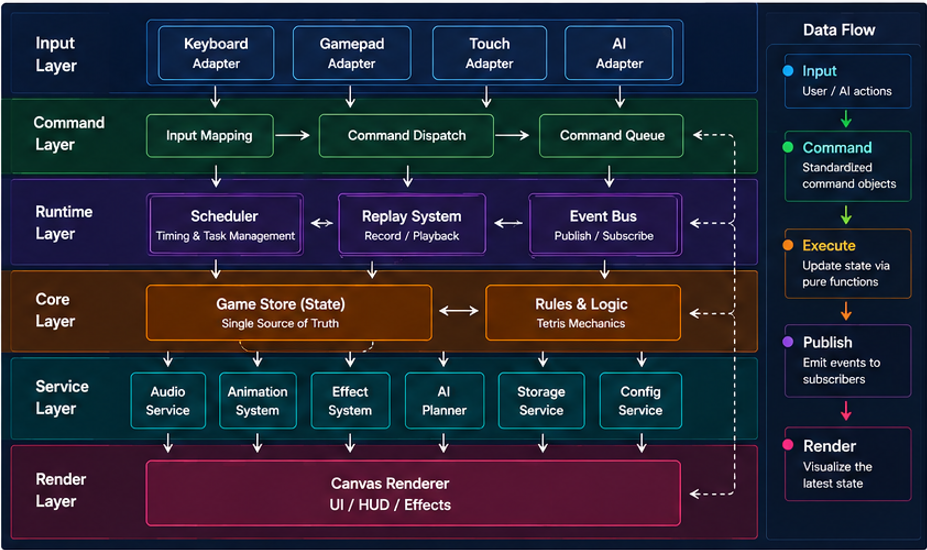

# Development

简体中文 | [English](./07-development.en.md)

> 本章介绍 tetris.js 的工程结构、模块划分以及开发理念，帮助开发者快速理解整个项目。

## 开发理念

tetris.js 并不是围绕某一个页面组织代码，也不是按照"功能堆叠"的方式不断增加模块，整个项目始终围绕 Runtime 展开。

新增功能通常意味着新增模块，而不是修改已有模块。因此，随着项目不断演进，整体架构依然保持较低的耦合度。

## 项目结构

项目主要采用模块化目录组织，一个典型的目录结构如下：

```text
lib/
│
├── ai/
│
├── battle/
│
├── core/
│
├── engine/
│
├── game/
│
├── runtime/
│
├── services/
│
├── state/
│
└── utils/
```

不同模块负责不同职责，彼此之间尽量保持独立。

## 模块职责

tetris.js 核心模块包括：Engine、Core、Game、State、Services、Runtime、AI、Battle 和 Utils。

### Engine

整个项目的核心，它是实体的 Runtime 负责组织整个游戏生命周期。包括：

- Game Loop
- Command Dispatch
- Input Dispatch
- State Update
- Scheduler
- Renderer

Engine 不负责具体玩法，而是负责驱动所有模块协同运行。

### Engine

整个项目的核心，它是实体的 Runtime 负责组织整个游戏生命周期。包括：

- Game Loop
- Command Dispatch
- Input Dispatch
- State Update
- Scheduler
- Renderer

Engine 不负责具体玩法，而是负责驱动所有模块协同运行。

### Core

项目的基础模块，包括：

- Base 基类
- Command System - 包括 Command 和 Command Queue
- Event Bus

负责模块基类（依赖注入），命令管理和事件总线发布订阅消息。

### Game

Game 模块负责俄罗斯方块本身的规则。例如：

- 方块生成
- 碰撞检测
- 消行
- Hold
- Score
- Level

这些规则既服务玩家，也服务 AI。

### State

Store 保存 Game 游戏实例的状态。例如：

- Board
- Current Piece
- Hold
- Next Queue
- Score
- Level

所有 Game 所有子模块共享同一份状态，避免多个模块维护不同的数据副本。

### Services

Services 提供各种通用能力。例如：

- 输入系统
- 音频系统
- UI
- 动画

它们通常不依赖具体游戏规则，因此可以在不同模块之间复用。

### Runtime

Runtime 提供运行时额外的辅助能力。例如：

- Replay Controller
- Animation System

他们负责处理游戏回放和控制游戏动画的注册和播放。

### AI

AI 负责：

- 搜索
- 模拟
- 评分
- 决策

最终输出 Command，Runtime 再统一执行。因此，AI 从不会直接修改游戏状态。

### Battle

Battle 负责管理多个 Runtime。

例如：

- 玩家 vs 玩家
- 玩家 vs AI

Battle 自身不会修改任何 Runtime，它只负责协调双方之间的数据交换。

### Utils

统一提供全局公用的功能函数。

## 模块之间如何协作？

整个项目的数据流始终保持一致。



AI、Replay、Battle 也都会遵循同一套流程，这一设计保证了整个项目始终只有一套游戏逻辑。

## 添加一个新功能

随着项目不断扩展，新增功能通常遵循以下原则：

- 优先增加模块，而不是修改已有模块。
- 不直接修改 Runtime 的核心流程。
- 不绕过 Command 修改状态。
- 不直接操作 Store。
- 保持 Renderer 与 Gameplay 解耦。

例如新增一种输入方式，通常只需要：

```text
New Input Controller
↓
Command
↓
Runtime
```

无需修改 Gameplay。

同样，新增一种 AI 也只需要输出新的 Command，Runtime 无需任何调整。

## 开发建议

阅读源码时建议按照以下顺序理解整个项目：

1. Runtime
2. Game
3. Store
4. Renderer
5. Scheduler
6. AI
7. Replay
8. Battle

理解 Runtime 后，整个项目的数据流将变得非常清晰，后续模块也更容易理解。

### 二次开发指引

- 游戏基础配置：`lib/engine/state/engine-state.js`；
- 修改方块样式/配色：
  - 配色配置：`lib/game/contants/color-paletters.js`；
  - 方块样式：`lib/game/contants/shapes.js`；
- 新增背景音乐/音效：在音频模块追加资源与关卡映射:
  - 背景音乐：
    - 添加背景音乐；`lib/services/audio/constants/bgm`；
    - 注册背景音乐：`lib/services/audio/constants/musics.js`；
  - 游戏音效：`lib/services/audio/sounds.js`；
- 游戏动画配置：
  - 动画管理系统：`lib/runtime/animation-system.js`；
  - 新增动画：`lib/services/animations`，动画实现参考现有动画设代码注释；
  - 注册动画：
    - 订阅动画消息：`lib/game/elapsed-timer.js` 中监听动画触发消息；
    - 执行动画：`this.Animations.register(new CountdownAnimation({ Scheduler, Game: this }))`;
    - 依赖注入：`{ Scheduler, Game: this }`
      配置信息既是需要注入的依赖，根据需要注入依赖；
- EventBus 事件管理：
  - 消息注册：`lib/events/event-catalog.js`；
  - 事件路由：`lib/events/router` （模块订阅消息超过6条即可）添加路由模块；
- 自定义游戏规则（速度、计分、升级）：修改规则计算函数：
  - 速度配置：`lib/game/rules/get-speed.js`；
  - 消除行数得分：`lib/game/constants/game.js`；
  - 记分/升级：`lib/game/actions/apply-clear-lines.js`；
- 扩展新输入设备：
  - 新增：`lib/services/input`
    层新增适配器即可（继承 Base 基类，实现依赖注入和消息订阅发布；
  - 注册：`lib/game/elapsed-timer.js` 在游戏核心模块注册（参考现有的 Keyboard,
    Gamepad 和 Touch）；
- 输入/命令映射：
  - 输入映射：`lib/engine/dispatch-input.js`;
  - 命令映射：`lib/engine/dispatch-command.js`;
  - 添加指令集：`lib/game/actions`；
- AI 配置：
  - 难易度配置：`lib/ai/core/ai-difficulty.js`；
  - 决策规划配置：`lib/ai/planner/self-play.js`;

## 小结

tetris.js 的工程结构并不是围绕页面组织，而是围绕 Runtime 组织。每个模块都拥有明确的职责，新增功能通常意味着新增模块，而不是不断修改已有代码。

这种模块化设计使项目能够随着功能不断增加，依然保持统一的数据流与较低的维护成本。

## 下一步阅读

了解如何二次开发，最后我们需要了解 tetris.js 的游戏规则和游戏按键的控制。

**下一章：[08-controls-and-rules.md](08-controls-and-rules.md)**
